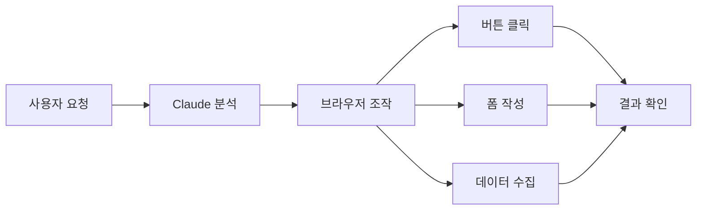

이 장에서는 Claude의 크롬 익스텐션을 소개합니다. 브라우저에서 직접 Claude를 활용하여 웹 페이지 탐색, 버튼 클릭, 폼 작성 등 다양한 작업을 자동화할 수 있습니다.

# 1. Claude 크롬 익스텐션이란?

<highlight>Claude 크롬 익스텐션은 브라우저 내에서 Claude가 직접 웹 페이지를 조작할 수 있게 해주는 도구입니다.</highlight> 기존에는 Claude에게 무언가를 요청하면 텍스트로 답변을 받거나 코드를 생성받는 방식이었습니다. 하지만 크롬 익스텐션을 사용하면 Claude가 실제로 웹 브라우저를 조작하여 작업을 수행할 수 있습니다.



| 기능 | 설명 |
| --- | --- |
| **웹 탐색** | 웹사이트를 자동으로 탐색 |
| **버튼 클릭** | 페이지 내 버튼 자동 클릭 |
| **폼 작성** | 입력 필드에 자동으로 텍스트 입력 |
| **데이터 수집** | 웹 페이지에서 정보 추출 및 정리 |

:::div{.callout}
현재 Claude 크롬 익스텐션은 **베타 버전**으로 유료 구독자에게만 제공됩니다. 추후 정식 출시 시 기능이 변경되거나 확장될 수 있습니다.
:::

# 2. 설치 방법

크롬 익스텐션 설치는 매우 간단합니다. 아래 링크에서 `Add to Chrome` 버튼을 클릭하면 Chrome 웹 스토어에서 바로 설치할 수 있습니다.

* 링크: https://claude.com/chrome

설치가 완료되면 크롬 브라우저 우측 상단에 Claude 아이콘이 나타납니다. 이 아이콘을 클릭하여 익스텐션을 활성화할 수 있습니다.

# 3. 활용 예시

<highlight>크롬 익스텐션을 활용하면 반복적인 웹 작업을 자동화할 수 있습니다.</highlight> 다음은 실제로 활용할 수 있는 몇 가지 예시입니다.

## 3.1 데이터 수집 및 정리

웹사이트에서 필요한 정보를 수집하고 정리하는 작업을 자동화할 수 있습니다.

- 분석 대시보드에서 지표 추출
- 여러 쇼핑몰의 상품 가격 비교
- 뉴스 사이트에서 특정 키워드 관련 기사 수집

## 3.2 파일 관리

클라우드 스토리지의 파일을 자동으로 정리할 수 있습니다.

- Google Drive 파일 정렬 및 폴더 구조 생성
- 오래된 파일 식별 및 정리
- 파일명 일괄 변경

## 3.3 일정 및 업무 관리

캘린더와 이메일을 활용한 업무 자동화가 가능합니다.

- 캘린더 일정 확인 및 정리
- 이메일 컨텍스트를 활용한 회의 준비
- CRM에 영업 통화 기록 작성

## 3.4 반복 작업 자동화

일일 또는 주간 단위로 반복되는 작업을 설정할 수 있습니다.

```
예시 요청:
"매일 아침 9시에 주요 뉴스 사이트에서 AI 관련 기사를 수집해서 정리해줘"
"매주 월요일에 지난 주 판매 데이터를 대시보드에서 추출해줘"
```

# 4. Claude Code와의 연동

<highlight>Claude 크롬 익스텐션은 Claude Code와 함께 사용하면 더욱 강력한 개발 워크플로우를 구축할 수 있습니다.</highlight> 예를 들어, 웹에서 데이터를 수집하고 이를 바탕으로 코드를 작성하거나, 웹 애플리케이션을 테스트하는 작업을 연계할 수 있습니다.

| 활용 방식 | 설명 |
| --- | --- |
| **데이터 수집 → 코드 작성** | 웹에서 수집한 데이터를 기반으로 코드 생성 |
| **웹 테스팅** | 개발한 웹 애플리케이션 자동 테스트 |
| **문서 수집** | API 문서나 라이브러리 정보 수집 후 개발에 활용 |

# 5. 보안 고려사항

크롬 익스텐션을 사용할 때는 몇 가지 보안 사항을 유의해야 합니다.

:::div{.callout}
**보안 권장사항**<br/>
- 처음에는 신뢰할 수 있는 사이트부터 사용해보세요<br/>
- 금융 거래나 민감한 개인정보를 다루는 작업 전에는 반드시 확인하세요<br/>
- 익스텐션이 비정상적인 동작을 하는지 주기적으로 확인하세요<br/>
- 중요한 작업은 항상 결과를 직접 검토하세요
:::

<highlight>특히 금융 거래, 비밀번호 입력, 개인정보 처리와 관련된 작업에서는 Claude의 작업 결과를 반드시 직접 확인하는 습관을 들이세요.</highlight> AI가 실수할 가능성은 항상 존재하며, 중요한 작업일수록 사람의 최종 확인이 필요합니다.

# 6. 마무리

Claude 크롬 익스텐션은 브라우저 내 반복 작업을 자동화하고, 데이터 수집 및 정리 작업을 효율적으로 처리할 수 있게 해주는 강력한 도구입니다. 아직 베타 버전이지만, 앞으로 더 많은 기능이 추가될 것으로 기대됩니다.

바이브 코딩과 함께 크롬 익스텐션을 활용하면, 코드 작성뿐만 아니라 웹에서의 다양한 작업까지 AI의 도움을 받을 수 있습니다. 단, 보안에 유의하면서 신뢰할 수 있는 작업부터 시작해보시길 권장드립니다.
