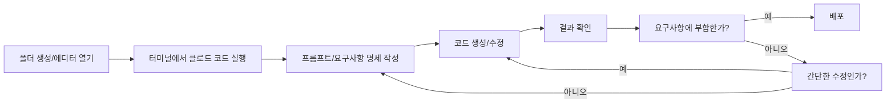

이 장에서는 바이브 코딩의 전체적인 작업 흐름을 소개합니다. 폴더 생성부터 배포까지의 과정을 이해하고, 왜 이런 프로세스가 권장되는지 그 이유를 알아봅니다.

# 1. 바이브 코딩 프로세스

위 다이어그램은 바이브 코딩의 기본적인 흐름입니다. 꼭 이 단계를 따라야 하는 것은 아닙니다. 예를 들어, 저희 회사 비개발자 직군인 분들은 에디터가 익숙치 않아 터미널을 열어 바로 작업에 들어갑니다. 디자이너의 경우 피그마 메이크로 먼저 작업을 하고 다운로드를 받아 클로드 코드로 마무리 하는 경우도 있습니다. <highlight>각자의 상황과 선호에 맞게 유연하게 적용하는 것이 중요합니다.</highlight>

# 2. 이 프로세스를 권장하는 이유

그럼에도 불구하고 개발자로서 이런 프로세스를 제안하는 데는 분명한 이유가 있습니다.

## 2.1 토큰과 시간의 효율성

<highlight>토큰과 시간은 무한하지 않습니다.</highlight> AI 서비스는 대부분 사용량에 제한이 있고, 여러분의 시간 역시 소중합니다. 모든 작업을 AI에게 맡기는 것이 능사는 아닙니다. 예를 들어 웹페이지의 제목을 바꾸는 단순한 작업을 생각해보세요. 직접 수정하면 10초면 끝날 일을, AI에게 요청하면 프롬프트 작성부터 시작해서 전체 프로젝트를 스캔하고 수정하는 데 몇 분이 걸릴 수 있습니다. 토큰도 불필요하게 소모되고요. 작은 텍스트 수정, 색상 변경, 간단한 스타일 조정 같은 작업은 직접 하는 것이 현명합니다.

만약 폴더를 지정하지 않고 터미널을 열어 '바이브 코딩 프로세스 이미지를 열어 텍스트로 변환해 홈페이지에 넣어줘.'라는 명령을 했다고 생각해볼게요. 폴더가 지정되지 않았기 때문에 폴더 검색을 해야하고, 파일을 찾아야 합니다. jpg인지, png인지, bmp인지도 알려주지 않았기 때문에 확장자도 여러개를 검색해봐야 합니다. 파일명이 '바이브 코딩 프로세스'인지도 확인을 하고, 못 찾으면 비슷한 파일명으로 다시 시도를 할 것입니다. 파일을 찾았다 하더라도 안에 텍스트를 정확하게 변환해줄지도 확신할 수 없습니다. 우리가 사용하는 것은 '언어 모델'이지 'OCR 모델'이 아니니까요. 결국 간단한 작업 하나에 AI가 처리해야 할 일이 너무 많아집니다.

때로는 직접 생성을 하거나 요구사항을 명확히 하는 것만으로도 훨씬 더 빠르고 정확한 결과를 얻을 수 있습니다. 아래 표는 직접 수정과 AI 요청에 걸리는 예상 시간을 간단히 비교한 것입니다. 누가 더 빠르게 어떠한 작업을 할 수 있는지 생각해보시고 작업을 하시는 것이 좋습니다.

| 작업 유형 | 직접 수정 | AI 요청 |
| --- | --- | --- |
| 간단한 텍스트 수정 | 10초 | 1~2분 |
| 간단한 스타일 수정 | 20초 | 1~2분 |
| 복잡한 스타일 수정 | 30분+ | 5~10분 |
| 복잡한 기능 추가 | 30분+ | 5~10분 |

## 2.2 AI의 한계 대응

**AI도 완벽하지 않습니다.** 때로는 몇 번을 수정 요청해도 원하는 결과가 나오지 않을 수 있습니다. 이럴 때 기본적인 언어 지식만 있어도 문제의 원인을 빠르게 파악하고 직접 해결할 수 있습니다. <highlight>AI와 씨름하느라 30분을 보내는 것보다, 5분 만에 직접 고치는 것이 효율적일 때도 있습니다.</highlight> 만약 여러 번 지시해도 수정이 안 된다면 단계별로 콘솔이나 터미널에 로그를 찍어보라고 지시하고, 로그를 직접 따라가며 문제를 해결할 수도 있습니다.

## 2.3 코드 에디터의 강력한 기능

**코드 에디터의 강력한 기능을 활용할 수 있습니다.** VSCode, Cursor, Antigravity 같은 현대적인 에디터는 단순한 텍스트 편집기가 아닙니다. 예를 들어, 라이브 서버(Live Server) 확장 프로그램을 설치하면 코드를 수정할 때마다 브라우저가 자동으로 새로고침되어 결과를 실시간으로 확인할 수 있습니다. 자동 완성, 문법 검사 등 개발 생산성을 높여주는 수많은 기능이 있습니다.

특히 가장 최근에 나온 Google의 Antigravity 같은 에디터는 AI와 브라우저 통합이 잘 되어 있어 테스트까지 한 번에 할 수 있습니다. 이러한 기능들은 AI가 제공하지 못하는 부분을 보완해주어 개발 과정을 훨씬 더 원활하게 만들어줍니다.

## 2.4 직관적인 작업 환경

**초급자에게 직관적인 작업 환경을 제공합니다.** 개발 경험이 없는 분들이 가장 많이 겪는 문제 중 하나가 "내가 만든 파일이 어디 있지?"입니다. 폴더를 기준으로 에디터와 터미널을 열면, 모든 작업이 해당 폴더 안에서 이루어지기 때문에 파일의 경로를 찾지 못하는 일은 발생하지 않습니다.