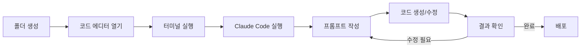
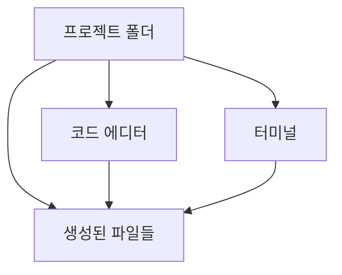

# 1. 바이브 코딩 프로세스

이 장에서는 바이브 코딩의 전체적인 작업 흐름을 소개합니다. 폴더 생성부터 배포까지의 과정을 이해하고, 왜 이런 프로세스가 권장되는지 그 이유를 알아봅니다.

<highlight>바이브 코딩에 정답은 없습니다.</highlight> 저희 회사 디자이너는 코드 에디터가 친숙하지 않아 위 프로세스와 달리 터미널부터 열어 작업합니다. 폴더를 기준으로 여는 것도 아니고, Windows의 PowerShell을 바로 실행해서 시작하죠. 이처럼 각자에게 편한 방식이 있고, 그것이 바로 여러분의 정답입니다.

---

# 2. 이 프로세스를 권장하는 이유

그럼에도 불구하고 개발자로서 이런 프로세스를 제안하는 데는 분명한 이유가 있습니다.

## 2.1 토큰과 시간의 효율성

<highlight>토큰과 시간은 무한하지 않습니다.</highlight> AI 서비스는 대부분 사용량에 제한이 있고, 여러분의 시간 역시 소중합니다. 모든 작업을 AI에게 맡기는 것이 능사는 아닙니다. 예를 들어 웹페이지의 제목을 바꾸는 단순한 작업을 생각해보세요. 직접 수정하면 10초면 끝날 일을, AI에게 요청하면 프롬프트 작성부터 시작해서 전체 프로젝트를 스캔하고 수정하는 데 몇 분이 걸릴 수 있습니다. 토큰도 불필요하게 소모되고요. 작은 텍스트 수정, 색상 변경, 간단한 스타일 조정 같은 작업은 직접 하는 것이 현명합니다.

| 작업 유형 | 직접 수정 | AI 요청 |
| --- | --- | --- |
| 텍스트 수정 | 10초 | 1~2분 |
| 색상 변경 | 20초 | 1~2분 |
| 스타일 조정 | 30초 | 2~3분 |
| 복잡한 기능 추가 | 30분+ | 5~10분 |

## 2.2 AI의 한계 대응

**AI도 완벽하지 않습니다.** 때로는 몇 번을 수정 요청해도 원하는 결과가 나오지 않을 수 있습니다. 이럴 때 기본적인 HTML과 CSS 지식만 있어도 문제의 원인을 빠르게 파악하고 직접 해결할 수 있습니다. <highlight>AI와 씨름하느라 30분을 보내는 것보다, 5분 만에 직접 고치는 것이 효율적일 때가 많습니다.</highlight>

## 2.3 코드 에디터의 강력한 기능

**코드 에디터의 강력한 기능을 활용할 수 있습니다.** VSCode, Cursor 같은 현대적인 에디터는 단순한 텍스트 편집기가 아닙니다. 예를 들어, 라이브 서버(Live Server) 확장 프로그램을 설치하면 코드를 수정할 때마다 브라우저가 자동으로 새로고침되어 결과를 실시간으로 확인할 수 있습니다. 자동 완성, 문법 검사 등 개발 생산성을 높여주는 수많은 기능이 있습니다.

| 기능 | 설명 |
| --- | --- |
| **Live Server** | 코드 수정 시 브라우저 자동 새로고침 |
| **자동 완성** | 코드 입력 시 제안 표시 |
| **문법 검사** | 오류 실시간 감지 |
| **확장 프로그램** | 다양한 기능 추가 가능 |

## 2.4 직관적인 작업 환경

**초급자에게 직관적인 작업 환경을 제공합니다.** 개발 경험이 없는 분들이 가장 많이 겪는 문제 중 하나가 "내가 만든 파일이 어디 있지?"입니다. 폴더를 기준으로 에디터와 터미널을 열면, 모든 작업이 해당 폴더 안에서 이루어지기 때문에 파일의 경로를 찾지 못하는 일은 발생하지 않습니다.

---

# 3. 정리

이 챕터에서 모든 단계를 상세히 설명하지는 않을 것입니다. 각 단계의 구체적인 방법은 이어지는 챕터들에서 차근차근 다룰 예정입니다. 지금은 전체적인 흐름을 머릿속에 그려두시면 충분합니다. <highlight>왜 이런 순서로 진행되는지, 각 단계가 어떤 의미를 갖는지 이해하셨다면, 이미 절반은 성공한 것입니다.</highlight>

복잡해 보이는 과정도 한 번 따라해보면 생각보다 단순하다는 것을 알게 될 것입니다. 본격적인 설치와 환경 설정은 다음 장에서 시작하겠습니다.

:::div{.callout}
**이 프로세스를 권장하는 4가지 이유 요약** 
1. 토큰과 시간의 효율적 사용 
2. AI의 한계에 대응하는 능력 확보 
3. 코드 에디터의 강력한 기능 활용 
4. 초급자도 쉽게 따라할 수 있는 직관적 환경
:::
