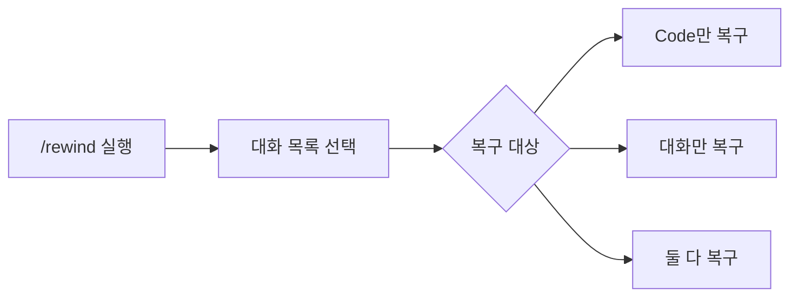

<highlight>이제 Claude와 대화하는 기본적인 방법을 익히셨으니, 더 효율적으로 작업할 수 있는 명령어들을 알아보겠습니다.</highlight> Claude Code에는 슬래시(`/`)로 시작하는 특별한 명령어들이 있습니다. 이 명령어들을 알면 작업을 더 효율적으로 편하게 진행할 수 있습니다. 모든 명령어를 다 다루진 않습니다. 실제 사용해보며 유용했던 명령어, 꼭 알아야 하는 필수 명령어를 정리해보았습니다. 모든 명령어는 아래 공식 문서를 참고해주세요.

링크: [https://docs.anthropic.com/ko/docs/claude-code/slash-commands](https://docs.anthropic.com/ko/docs/claude-code/slash-commands#bash-%EB%AA%85%EB%A0%B9%EC%96%B4-%EC%8B%A4%ED%96%89)

또한 슬래시 명령어 말고도 실무에서 사용하게 되는 여러 명령어를 함께 다룹니다. 대화 내용 이어 작성하기, 댄저러스 모드, 커스텀 명령어, Agent 연결 등을 함께 다룹니다.

# 1. 꼭 알아야 할 필수 명령어

| 명령어 | 기능 | 사용 시점 |
| --- | --- | --- |
| **/help** | 명령어 목록 | 모를 때 |
| **/clear** | 대화 초기화 | 새 주제 시작 시 |
| **/model** | 모델 선택 | 성능/속도 조절 |
| **/context, /usage, /extra-usage** | 사용량 | 토큰 관리 |

슬래시 명령어는 claude를 실행한 후 `/`를 통해 실행할 수 있는 명령어입니다. 예를 들어, `/help`와 같은 경우 아래처럼 사용할 수 있습니다.


## 1.1 /help - 명령어 목록

<highlight>가장 먼저 기억해야 할 명령어입니다.</highlight> 무엇을 해야 할지 모르겠을 때, 어떤 명령어가 있는지 궁금할 때 `/help`를 입력해보세요. 사용 가능한 모든 명령어와 간단한 설명이 나타납니다. 이 명령어 하나만 기억해도 나머지는 찾아가며 사용할 수 있으니, 명령어를 모두 기억하려 부담갖지 않으셔도 됩니다.

tab을 누르면 다른 커맨드들을 볼 수 있습니다. ESC를 누르면 명령창으로 이동합니다.


## 1.2 /clear - 대화 내용 정리

Claude와 대화하다 보면 내용이 너무 길어져서 정리하고 싶을 때가 있습니다. 또는 답변의 퀄리티가 마음에 안 들 때가 있습니다. 예를 들어, 웹에서도 클로드와 답변이 길어지면 새 대화를 시작하라는 안내가 나오는 것을 확인해보신 적이 있으실 겁니다. 주고받는 대화가 많아질수록 답변의 정확도가 떨어집니다. 또는 새로운 주제로 넘어가서 이전에 있던 대화를 유지하지 않아야 할 때 `/clear`를 사용하세요.

:::div{.callout}
아래 논문은 대화를 할 때마다 얼마나 토큰을 썼는지에 따라 성능 저하를 확인할 수 있습니다. 너무 많은 토큰을 사용하면 모델이 느려지거나 응답이 부정확해질 수 있습니다. 이럴 때 `/clear` 명령어를 사용하여 대화 기록을 초기화하면 성능을 회복할 수 있습니다.


* 논문 링크: https://arxiv.org/abs/2502.05167
* 깃헙 링크: https://github.com/adobe-research/NoLiMa
:::

걱정하지 마세요. 파일들은 그대로 유지되고 단지 대화 기록만 지워집니다.

## 1.3 /model - 모델 선택

Claude에는 여러 버전의 AI 모델이 있습니다. 더 빠른 응답을 원할 때 모델을 변경할 수 있습니다. 이전에는 할당량을 다 쓰면 자연스럽게 모델이 변경이 되었지만 지금은 할당량을 모두 썼다고 표시가 되며, 제한된 시간까지 기다려야 합니다. 따라서 여러 창을 열어놓고 다중 터미널 작업을 할 때 터미널마다 모델을 적절히 조절해가며 쓰시는 것을 권합니다.

모델이 한 번 업데이트되는 경우 모델 선택 또는 재설치를 해줘야 업데이트가 되는 경우가 있습니다. 시간이 흐르면서 자연스럽게 업데이트되는 경우도 있는데 `/model` 명령을 통해서 지금 쓰고 있는 모델이 최신 모델인지 반드시 확인하세요.

아래 사진은 25년 10월 1일에 찍은 사진입니다. 9월 30일에 4.5 업데이트가 되었는데 아직 4.1을 쓰고 있는 것이죠. 그러면서도 알림이나 경고창 등을 띄어주지 않습니다.


만약 모델을 확인했는데 최신 모델을 사용하고 있지 않다면 `npm install -g @anthropic-ai/claude-code` 명령어를 사용해서 재설치해주세요.

## 1.4 /context, /usage, /extra-usage - 사용량

얼마나 사용했는지 보는 명령어는 3가지가 있습니다. 최신 버전에서는 `/cost`명령어가 사라졌습니다.

- `/context`: 전체적인 토큰 분포를 시각적으로 볼 수 있습니다.
- `/usage`: 구독 플랜에서 얼마나 사용했는지 볼 수 있습니다.
- `/extra-usage`: 한도 초과 시 API 크레딧 사용 활성화

context 명령어를 사용하면 아래와 같이 토큰 사용량을 시각적으로 확인할 수 있습니다. 프롬프트는 사람만이 작성하는 것이 아닙니다. System, MCP 등도 사용할 수 있죠. 사람이 사용한 프롬프트 사용량은 Messages로 표시됩니다.


usage는 구독 플랜의 사용량 한도와 비교하여 얼마나 사용했는지 확인할 수 있습니다. 25년 12월 기준으로 한도는 5시간씩 리셋이 됩니다. 리셋되는 시간은 버전마다 다를 수 있습니다. 몇 시간마다 리셋되는지 확인하고 싶다면 아래 `extra-usage` 명령어를 사용하세요. 한글로 표기되어 있습니다.


extra-usage 명령어는 추가 사용량 기능을 활성화 하는 명령어입니다. 구독 플랜 한도를 초과하면 API 크래딧으로 계속 사용할 수 있게 활성화 할 수 있습니다. 다른 명령어와 다르게 실행하면 웹으로 이동합니다. 하단에 있는 `추가 사용량`을 클릭해야만 활성화가 됩니다.


# 2. 프로젝트 관리 명령어

| 명령어 | 기능 | 사용 시점 |
| --- | --- | --- |
| **/init** | CLAUDE.md 생성 | 프로젝트 초기 |
| **/memory** | CLAUDE.md 수정 | 설정 변경 시 |
| **/review** | 코드 리뷰 | 검토 필요 시 |
| **/compact** | 대화 압축 | 토큰 절약 |
| **/rewind** | 코드 복원 | 이전 상태로 |

## 2.1 /init - 프로젝트 시작

새 프로젝트를 시작할 때 어느 정도 코드를 작성하고 사용하기 유용한 명령어입니다. <highlight>프로젝트에 대한 기본 정보를 Claude가 기억할 수 있도록 CLAUDE.md 파일을 생성합니다.</highlight>

:::div{.callout}
폴더를 만들자마자 사용하면 폴더에 파일이 전혀 없기 때문에 이 파일을 생성하지 못합니다. 또한 이 파일을 의도적으로 만들지 않는 경우도 있습니다. AI가 발전하면서 워낙 빠르게 프로젝트가 변경이 되기 때문에 선입견을 가지지 않도록 하기 위함입니다. 프로젝트가 안정화 되었을 때 생성하시는 것을 권합니다.
:::

이 파일에는 프로젝트의 목적, 기술 스택, 코딩 스타일 등을 적어둘 수 있습니다. Claude는 이 정보를 참고해서 더 적절한 코드를 생성합니다. 다만 실제로는 Claude가 이 파일의 지침을 무시하거나 어기는 경우도 있습니다. 여기에 반드시 지켜야 될 사항을 명시했다고 하더라도 이에 반하는 작업을 하기도 합니다.

아래 파일은 이전에 작업했던 바이브 코딩 프로젝트에서 `/init`을 하고 나서 생성된 파일입니다. 이제 클로드가 작업할 때 이 파일을 참고하여 작업을 하게 됩니다.

```markdown
# CLAUDE.md

이 파일은 이 저장소에서 작업할 때 Claude Code (claude.ai/code)에 대한 가이드를 제공합니다.

## 프로젝트 개요

"바이브 코딩" - 프로그래밍 교육 플랫폼을 위한 한국어 교육 웹사이트입니다. 바닐라 HTML, CSS, JavaScript로 구축된 단일 페이지 애플리케이션입니다.

## 프로젝트 구조

- `index.html` - 홈, 소개, 커리큘럼, 강사, 수강신청 섹션을 포함하는 메인 HTML 파일
- `styles.css` - 반응형 디자인, 애니메이션, 그라데이션 테마를 포함한 전체 스타일링
- `script.js` - 부드러운 스크롤, 모바일 네비게이션, 패럴렉스 효과, Intersection Observer 애니메이션 등의 상호작용을 위한 JavaScript

## 주요 기능

- **모바일 반응형 네비게이션** - 햄버거 메뉴 포함
- **부드러운 스크롤 네비게이션** - 섹션 간 이동 및 활성 상태 표시
- **Intersection Observer 애니메이션** - 기능 카드, 타임라인 항목, 강사 카드의 스크롤 트리거 애니메이션
- **패럴렉스 효과** - 히어로 섹션의 마우스 움직임 효과
- **카운터 애니메이션** - 통계 표시용
- **폼 추적** - Google Forms 수강신청 링크 추적

## 개발 명령어

정적 웹사이트로 빌드 프로세스가 없음:
- 브라우저에서 `index.html`을 직접 열어 사이트 확인
- 개발 시 로컬 서버 사용 (VS Code의 Live Server 확장 등): `python -m http.server` 또는 `npx serve`
- 빌드, 테스트, 린팅 명령어 불필요

## 외부 의존성

- 수강신청용 Google Forms 연동 (https://forms.gle/Ddj742DqPZ5Eb8j79)
- 외부 JavaScript 라이브러리나 프레임워크 사용 안 함
- 표준 웹 폰트로 폴백되는 시스템 폰트 사용

## 스타일링 접근 방식

- 일관된 테마를 위한 CSS 커스텀 속성 (CSS 변수) 사용
- 보라색/바이올렛 계열의 그라데이션 기반 색상 구성
- BEM 유사 클래스 네이밍 규칙
- 768px 브레이크포인트의 모바일 우선 반응형 디자인
```

## 2.2 /memory - CLAUDE.md 파일 수정

프로젝트가 진행되면서 Claude가 기억해야 할 내용이 바뀔 수 있습니다. `/memory` 명령어로 CLAUDE.md 파일을 수정할 수 있습니다. 첫 번째 것을 선택하시면 됩니다. 이 명령어는 특히 터미널만 사용하는 사람에게 CLAUDE.md 파일을 쉽게 수정할 수 있는 편의성을 제공합니다.


## 2.3 /review 코드 리뷰

작성한 코드가 제대로 되었는지 확인받고 싶을 때 사용합니다. Claude가 코드를 검토하고 개선점을 제안해줍니다. 버그를 찾거나, 성능을 개선하거나, 코드 스타일을 정리하는 데 도움을 받을 수 있습니다. 프로젝트가 커지면 코드 리뷰가 더욱 중요해집니다.

코드 리뷰는 `.git` 폴더를 함께 들여다봅니다. 프로그래밍을 하실 수 있는 분은 필히 git을 사용해서 버전 관리를 하시는 것을 권합니다.

## 2.4 /compact - 대화 내용 압축

아래 명령어를 통해 대화 내용을 압축할 수 있습니다. 압축이 되면 `Ctrl + O` 키로 볼 수 있습니다. 추가 명령어를 통해 이를 다른 곳에 저장할 수도 있습니다. 특히 다음 날 대화로 넘어가기 전에 한 번씩 요약하면 좋습니다. 요약된 내용을 다시 다음 대화에 텍스트로 입력해 주고 대화를 이어갈 수도 있기 때문입니다. 이렇게 하면 답변의 정확도를 올리고 전체 토큰을 절약할 수 있습니다.

## 2.5 /rewind - 작성한 문서 되돌리기

<highlight>25년 9월 30일 sonnet 4.5 업데이트와 함께 /rewind 명령어가 새로 나왔습니다.</highlight> 이 명령어는 체크포인트를 통해 코드나 대화를 이전 상태로 복원할 수 있습니다. 이 기능이 되지 않아 많은 SW가 개발되었는데요. 이 기능이 공식 기능이 되면서 이제 부가적인 SW를 설치할 필요가 없어졌습니다.



```markdown
/rewind
```

명령어를 실행하면 아래와 같이 대화 목록이 뜹니다. 복구하고 싶은 대화를 선택해주세요.


선택을 했으면 Code를 복구할 것인지, 대화를 복구할 것인지, 둘 다 복구할 것인지 선택하는 창이 뜹니다. 원하는 목록을 선택하면 됩니다.


