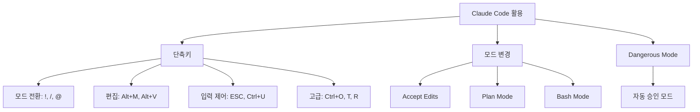

# 1. 단축키

이 장에서는 Claude Code를 더 빠르게 조작할 수 있는 단축키와 작업 목적에 따라 전환할 수 있는 모드들을 소개합니다.

<highlight>다음 단축키를 사용하여 좀 더 효율적으로 클로드 코드를 사용할 수 있습니다.</highlight>



## 1.1 모드 전환 단축키

| 단축키 | 기능 | 설명 |
| --- | --- | --- |
| **`!`** | Bash 모드 | 터미널 명령어 직접 실행 |
| **`/`** | 명령어 모드 | Claude Code 전용 명령어 |
| **`@`** | 파일 탐색 | 파일 경로 자동완성 |

## 1.2 편집 관련 단축키

| 단축키 | 기능 | 설명 |
| --- | --- | --- |
| **`Alt + M`** | 모드 토글 | 자동 수정 승인/플랜 모드 |
| **`Alt + V`** | 이미지 붙여넣기 | 스크린샷, 다이어그램 공유 |
| **`Ctrl + _`** | 실행 취소 | 마지막 작업 되돌리기 |
| **`Shift + Enter`** | 줄바꿈 | 여러 줄 입력 시 사용 |

## 1.3 입력 제어 단축키

| 단축키 | 기능 | 설명 |
| --- | --- | --- |
| **`ESC` 두 번** | 입력 초기화 | 입력 내용 모두 삭제 |
| **`Ctrl + U`** | 전체 지우기 | 입력란 한 줄 지우기 |

## 1.4 고급 기능 단축키

| 단축키 | 기능 | 설명 |
| --- | --- | --- |
| **`Ctrl + O`** | 상세 출력 | 디버깅용 자세한 정보 |
| **`Ctrl + T`** | TODO 목록 | 현재 작업 태스크 확인 |
| **`Ctrl + R`** | 검색 모드 | 프롬프트에서 키워드 검색 |

:::div{.callout}
`Ctrl + R`은 25년 9월 30일 업데이트된 단축키입니다.
:::


# 2. 모드 변경


| 모드 | 용도 | 권장 상황 |
| --- | --- | --- |
| **Accept Edits** | 자동 승인 | 간단한 버그, 반복 작업 |
| **Plan** | 계획 수립 | 아키텍처 설계, 문서 작성 |
| **Bash** | 터미널 명령 | 폴더/파일 관리, 패키지 설치 |

## 2.1 accept edits mode

`Alt + M`으로 진입할 수 있습니다. <highlight>이 모드는 Claude가 제안하는 코드 수정사항을 자동으로 승인하여 작업을 할 수 있습니다.</highlight> 간단한 버그나 반복적인 작업에는 사용할 수 있지만 중요한 로직 변경 시에는 이 모드를 비활성화하는 것이 좋습니다. 만약 목적이 항상 자동 승인이라면 아래 댄저러스 모드를 활성화하시는 것이 편합니다.

```
claude --dangerously-skip-permissions
```

## 2.2 plan mode

`Alt + M`을 한 번 더 눌러 진입할 수 있습니다. plan 모드는 프로젝트 시작 전 아키텍처를 구상할 때, 완성도 높은 문서를 작성할 때 사용할 수 있습니다. 플랜 모드로 계획을 짜면 아래와 같이 3개의 옵션이 나옵니다.

1. **Yes, and auto-accept edits**: 계획을 진행하되, Claude가 제안하는 모든 코드 수정사항을 자동으로 승인합니다. 가장 빠른 작업 방식으로, Claude가 파일을 수정할 때마다 별도의 확인 없이 자동으로 변경사항이 적용됩니다.
2. **Yes, and manually approve edits**: 계획을 진행하지만, Claude가 제안하는 각 코드 수정사항을 사용자가 직접 검토하고 승인해야 합니다. 각 변경사항마다 diff를 보여주고 승인 여부를 물어보므로, 더 신중하게 코드 변경을 관리할 수 있습니다.
3. **No, keep planning**: 현재 계획을 실행하지 않고 계속 계획 단계에 머무릅니다. 계획을 더 다듬거나 수정하고 싶을 때 선택하는 옵션입니다.

일반적으로 간단한 작업이나 Claude의 제안을 신뢰할 수 있는 경우 옵션 1을, 중요한 코드 변경이나 각 단계를 신중히 검토하고 싶을 때는 옵션 2를 선택하는 것이 좋습니다.

여러 번 개선을 해서 `plans.md` 문서로 만들어 두는 것을 권합니다. 3번 선택했을 때 `plans.md` 문서로 작성해달라고 요청하면 됩니다. 그리고 이미 plan 모드로 문서를 작성했다면 더 이상 그 context를 유지하지 말고 빠져나와서 새로운 세션에서 문서를 작성하는 것을 권합니다.

## 2.3 bash mode

`!`로 진입할 수 있습니다. 터미널 명령어를 직접 실행할 수 있는 모드입니다. 간단한 폴더나 파일 관리, 패키지 설치 및 환경 설정 등을 할 수 있습니다. <highlight>이렇게 중간에 터미널에 들어가는 것만으로도 토큰을 절약할 수 있습니다.</highlight>

:::div{.callout}
**모드 선택 가이드**<br/>
- 간단한 수정, 반복 작업 → Accept Edits Mode<br/>
- 아키텍처 설계, 문서 작성 → Plan Mode<br/>
- 폴더/파일 관리, 패키지 설치 → Bash Mode
:::

# 3. dangerous mode

이 모드는 단축키가 아니라 명령어로 진입할 수 있는 모드입니다. Claude가 제안하는 모든 코드 수정사항을 자동으로 승인하는 모드입니다. `--dangerously-skip-permissions` 플래그를 사용하여 활성화할 수 있습니다. 이 모드는 매우 빠른 작업이 가능하지만, 중요한 로직 변경 시에는 신중히 사용해야 합니다. 실수로 원하지 않는 변경이 적용될 수 있기 때문입니다.

위니브에서는 자기전에 할일 목록과 그 할일에 대한 시간을 지정해두고 이 작업을 시킨 다음 아침에 일어나서 결과물을 확인하는 작업을 진행합니다. 시간을 지정하는 이유는 크게 2가지입니다.

1. 작업 중간에 토큰을 다 소모해버리는 경우를 방지
2. 일찍 끝났을 경우 해당 작업을 더 면밀히 검토

댄저러스 모드를 활용하는 방법은 여러 가지가 있지만 할일 목록과 시간을 아래와 같이 명시해주면 좋습니다. 간단한 예시를 첨부합니다. 위니북스의 챕터를 검토할 때 아래와 같은 프롬프트를 확장하여 200줄 가량으로 작성해서 돌립니다.

```
이 문서들을 검토하고 챕터마다 다음 작업을 수행해줘.

1. 맞춤법 개선
2. 시각화 자료 추가
3. 연습 문제 출제

챕터마다 30분씩 시간을 할당해서 작업을 하고, 만약 30분이 지나지 않았다면 추가로 검토를 해줘. 챕터마다 30분 이상 검토하는 것은 괜찮아.
```