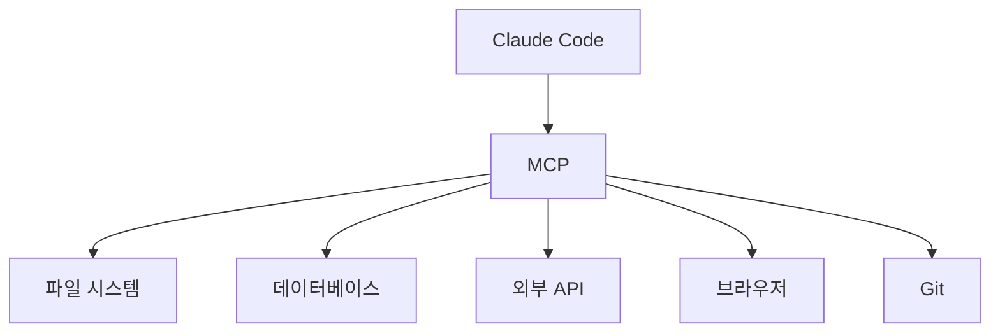

# 1. MCP(Model Context Protocol)란?

이 장에서는 Claude Code의 확장 기능인 MCP를 소개합니다. 이 기능을 통해 Claude Code가 외부 서비스와 연결될 수 있습니다.



<highlight>MCP(Model Context Protocol)는 Claude Code가 외부 도구 및 서비스와 연결될 수 있게 해주는 프로토콜입니다.</highlight> 쉽게 말해, Claude Code에 **손과 발**을 달아주는 기능이라고 생각하시면 됩니다.

예를 들어, MCP를 통해 Claude Code는 다음과 같은 작업을 수행할 수 있습니다.

- 파일 시스템 접근 및 조작
- 데이터베이스 쿼리 실행
- 외부 API 호출
- 브라우저 자동화
- Git 저장소 관리

## 1.1 MCP 서버 연결하기

MCP 서버를 연결하려면 `/mcp` 명령어를 사용합니다.

```
/mcp
```

이 명령어를 실행하면 사용 가능한 MCP 서버 목록이 표시됩니다. 원하는 서버를 선택하여 연결할 수 있습니다.

## 1.2 주요 MCP 서버

자주 사용되는 MCP 서버들은 다음과 같습니다.

| MCP 서버 | 설명 |
| --- | --- |
| filesystem | 파일 시스템 접근 및 조작 |
| github | GitHub 저장소 관리 |
| postgres | PostgreSQL 데이터베이스 연동 |
| puppeteer | 브라우저 자동화 |
| slack | Slack 메시지 전송 |

:::div{.callout}
MCP 서버는 계속해서 추가되고 있습니다. 최신 목록은 공식 문서를 확인해주세요.

[MCP 공식 문서](https://docs.anthropic.com/ko/docs/claude-code/mcp)
:::

만약 직접 만든 MCP 서버를 연결하고 싶다면, 아래와 같은 형식으로 명령어를 입력합니다. 추가와 삭제는 직접 `C:\Users\username\.claude.json` 에서도 수정이 가능합니다.

```
# claude code에 mcp 추가(hojun이라는 이름)
claude mcp add hojun python C:\test\tutorial_1.py

# claude code에 mcp 목록 확인
claude mcp list

# claude code에 mcp 목록 제거
claude mcp remove hojun
```

tutorial_1.py 파일은 아래와 같은 형식으로 작성되어야 합니다.

```python
from mcp.server.fastmcp import FastMCP
 
# MCP 서버 생성
mcp = FastMCP(name="tutorial_1")
 
 
# 간단한 에코 도구
@mcp.tool()
def echo(message: str) -> str:
    return message + " 라는 메시지가 입력되었습니다. 안찍어 볼 수 없죠! hello world!"
 
 
# 서버 실행
if __name__ == "__main__":
    mcp.run()
```

:::div{.callout}
MCP는 계속해서 업데이트되고 있는 기능입니다. 최신 정보는 공식 문서를 참고해주세요.

[MCP 공식 문서](https://docs.anthropic.com/ko/docs/claude-code/mcp)

자세한 내용은 위니북스에도 게시가 되어 있으니 참고해주세요.

[MCP 베이스캠프](https://www.books.weniv.co.kr/basecamp-mcp/)
:::