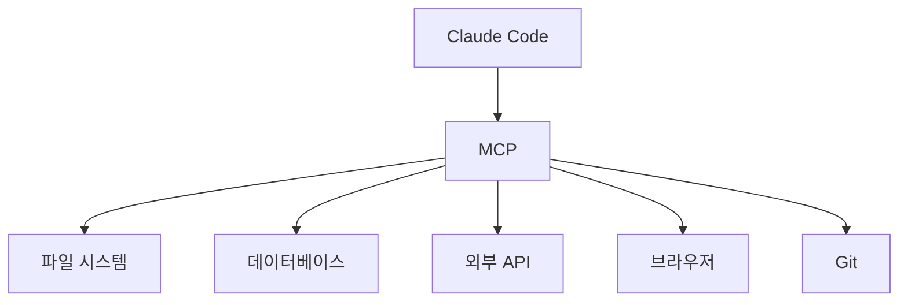
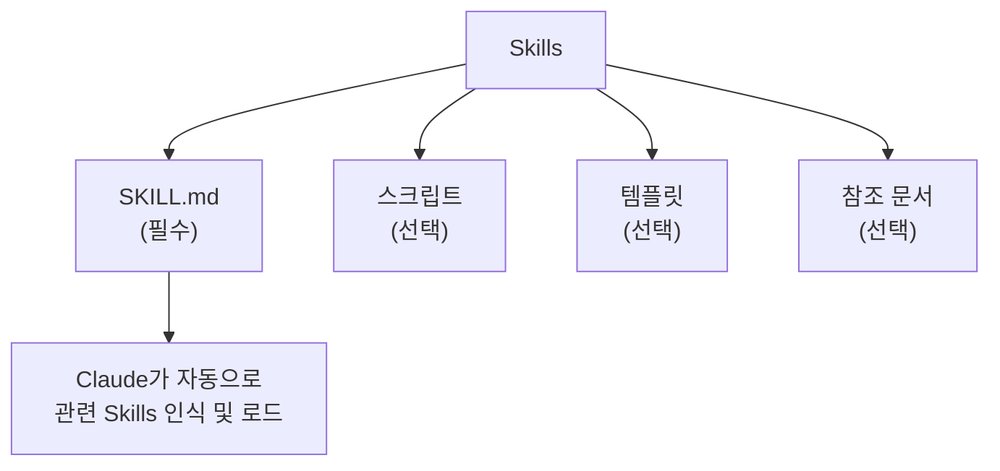
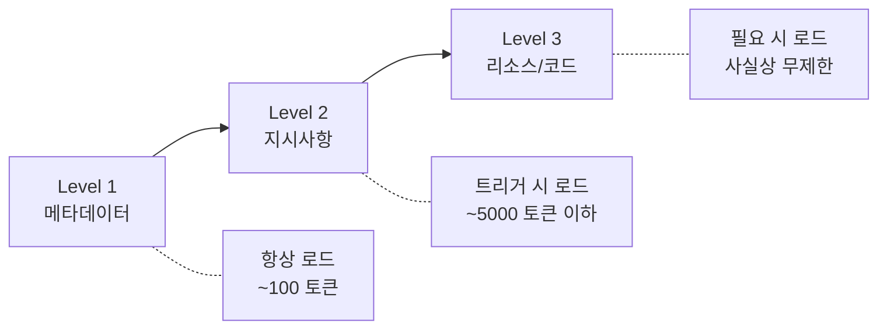
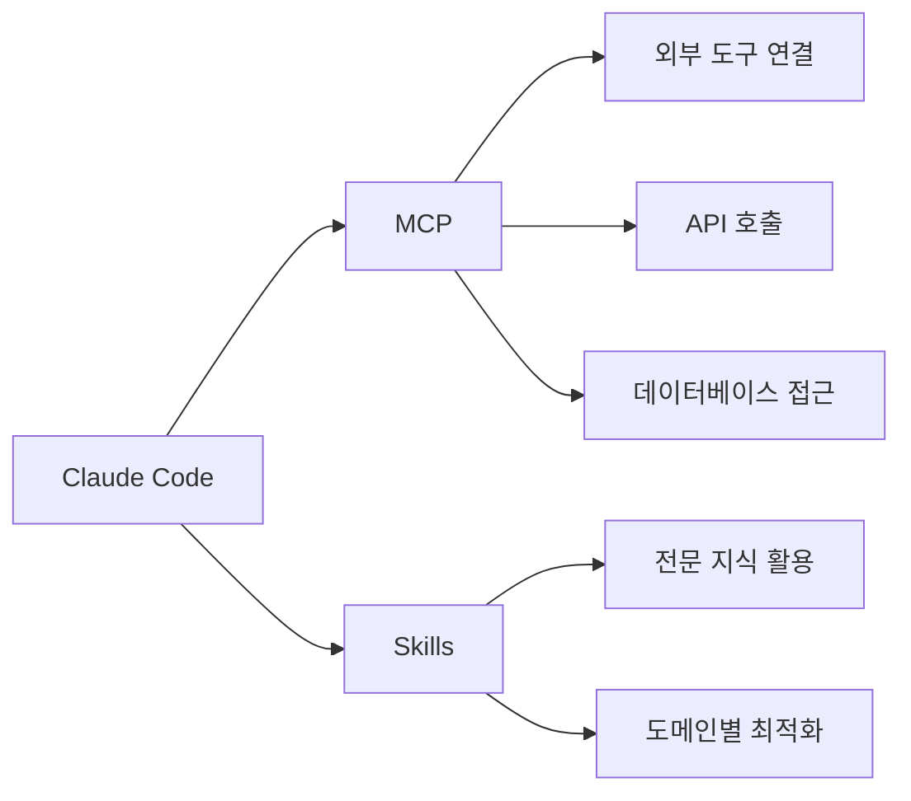

# 1. MCP(Model Context Protocol)란?

이 장에서는 Claude Code의 확장 기능인 MCP와 Skills를 소개합니다. 이 기능들을 통해 Claude Code가 외부 서비스와 연결되고, 특정 도메인에 대한 전문성을 가질 수 있습니다.



<highlight>MCP(Model Context Protocol)는 Claude Code가 외부 도구 및 서비스와 연결될 수 있게 해주는 프로토콜입니다.</highlight> 쉽게 말해, Claude Code에 **손과 발**을 달아주는 기능이라고 생각하시면 됩니다.

예를 들어, MCP를 통해 Claude Code는 다음과 같은 작업을 수행할 수 있습니다.

- 파일 시스템 접근 및 조작
- 데이터베이스 쿼리 실행
- 외부 API 호출
- 브라우저 자동화
- Git 저장소 관리

## 1.1 MCP 서버 연결하기

MCP 서버를 연결하려면 `/mcp` 명령어를 사용합니다.

```
/mcp
```

이 명령어를 실행하면 사용 가능한 MCP 서버 목록이 표시됩니다. 원하는 서버를 선택하여 연결할 수 있습니다.

## 1.2 주요 MCP 서버

자주 사용되는 MCP 서버들은 다음과 같습니다.

| MCP 서버 | 설명 |
| --- | --- |
| filesystem | 파일 시스템 접근 및 조작 |
| github | GitHub 저장소 관리 |
| postgres | PostgreSQL 데이터베이스 연동 |
| puppeteer | 브라우저 자동화 |
| slack | Slack 메시지 전송 |

:::div{.callout}
MCP 서버는 계속해서 추가되고 있습니다. 최신 목록은 공식 문서를 확인해주세요.

[MCP 공식 문서](https://docs.anthropic.com/ko/docs/claude-code/mcp)
:::

# 2. Skills란?

<highlight>Skills는 Claude가 특정 작업을 더 잘 수행할 수 있도록 도와주는 모듈형 기능입니다.</highlight> 2025년 10월 16일에 출시된 기능으로, Claude에게 도메인별 전문 지식, 워크플로우, 베스트 프랙티스를 제공하여 범용 에이전트를 전문가로 변환시킵니다.



Skills의 핵심 특징은 다음과 같습니다.

| 특징 | 설명 |
| --- | --- |
| **구성 가능(Composable)** | 여러 Skills가 함께 작동하며 Claude가 자동으로 필요한 것을 식별 |
| **이식 가능(Portable)** | Claude.ai, Claude Code, API 전체에서 동일한 형식으로 사용 가능 |
| **효율적(Efficient)** | "필요할 때만 필요한 것만 로드"하는 점진적 공개(Progressive Disclosure) 방식 |
| **강력함(Powerful)** | 실행 가능한 코드를 포함하여 토큰 생성보다 신뢰성 높음 |

## 2.1 Skills vs Slash Commands

Skills와 슬래시 명령어의 가장 큰 차이점은 **호출 방식**입니다.

| 구분 | Skills | Slash Commands |
| --- | --- | --- |
| **호출 방식** | 모델이 자동으로 호출 (Model-invoked) | 사용자가 직접 호출 (User-invoked) |
| **트리거** | Claude가 요청과 설명을 분석하여 자동 결정 | `/command` 형식으로 명시적 입력 |
| **사용 예** | "PDF에서 텍스트 추출해줘" → PDF Skill 자동 로드 | `/review-pr 123` → 직접 명령 실행 |

## 2.2 Skills의 작동 원리: 점진적 공개(Progressive Disclosure)

Skills는 **점진적 공개(Progressive Disclosure)** 원칙으로 설계되어, 필요한 정보만 필요할 때 로드합니다. 이를 통해 컨텍스트 윈도우를 효율적으로 사용합니다.



| 레벨 | 로드 시점 | 토큰 비용 | 내용 |
| --- | --- | --- | --- |
| **Level 1: 메타데이터** | 항상 (시작 시) | ~100 토큰/Skill | YAML frontmatter의 `name`, `description` |
| **Level 2: 지시사항** | Skill 트리거 시 | 5000 토큰 이하 | SKILL.md 본문의 지시사항과 가이드 |
| **Level 3: 리소스** | 필요 시 | 사실상 무제한 | 스크립트, 템플릿, 참조 문서 등 |

## 2.3 Skill 생성하기

### 2.3.1 저장 위치

Skills는 두 가지 위치에 저장할 수 있습니다.

```bash
# 개인 Skills (모든 프로젝트에서 사용 가능)
~/.claude/skills/my-skill-name/SKILL.md

# 프로젝트 Skills (git으로 팀과 공유)
.claude/skills/my-skill-name/SKILL.md
```

### 2.3.2 SKILL.md 기본 구조

```yaml
---
name: your-skill-name
description: 이 Skill이 무엇을 하고 언제 사용하는지 설명
---

# Your Skill Name

## Instructions
Claude가 따를 명확한 단계별 지침을 작성합니다.

## Examples
이 Skill 사용의 구체적인 예시를 보여줍니다.
```

**필수 필드 요구사항:**

| 필드 | 요구사항 |
| --- | --- |
| `name` | 소문자, 숫자, 하이픈만 사용 (최대 64자). "anthropic", "claude" 예약어 사용 불가 |
| `description` | 비어있으면 안 됨 (최대 1024자). XML 태그 포함 불가 |

:::div{.callout}
**좋은 description 작성 팁**: "무엇을 하는지"와 "언제 사용하는지"를 모두 포함하세요.

❌ 나쁜 예: `description: 문서 작업을 도와줍니다`

✅ 좋은 예: `description: PDF 파일에서 텍스트와 테이블을 추출하고, 양식을 작성하고, 문서를 병합합니다. PDF 파일 작업이나 양식, 문서 추출 언급 시 사용하세요.`
:::

### 2.3.3 다중 파일 Skill 구조

복잡한 Skill은 여러 파일로 구성할 수 있습니다.

```
my-skill/
├── SKILL.md          (필수 - 메인 지시사항)
├── FORMS.md          (선택 - 추가 가이드)
├── REFERENCE.md      (선택 - API 레퍼런스)
├── scripts/
│   └── helper.py     (선택 - 유틸리티 스크립트)
└── templates/
    └── template.txt  (선택 - 템플릿 파일)
```

SKILL.md에서 다른 파일 참조하기:

```markdown
자세한 양식 작성 방법은 [FORMS.md](FORMS.md)를 참조하세요.

헬퍼 스크립트 실행:
\`\`\`bash
python scripts/helper.py input.txt
\`\`\`
```

### 2.3.4 도구 제한 설정 (allowed-tools)

Skill이 활성화될 때 Claude가 사용할 수 있는 도구를 제한할 수 있습니다.

```yaml
---
name: safe-file-reader
description: 파일을 읽기 전용으로 접근합니다. 파일 내용만 확인하고 수정하지 않을 때 사용합니다.
allowed-tools: Read, Grep, Glob
---

# Safe File Reader

읽기 전용 도구만 사용하여 파일 내용을 분석합니다.
```

## 2.4 Skill 예시

### 2.4.1 커밋 메시지 생성 Skill

```yaml
---
name: generating-commit-messages
description: git diff에서 명확한 커밋 메시지를 생성합니다. 커밋 메시지 작성이나 스테이징된 변경사항 검토 시 사용하세요.
---

# Generating Commit Messages

## Instructions
1. `git diff --staged`를 실행하여 변경사항 확인
2. 다음 형식으로 커밋 메시지 제안:
   - 50자 이하의 요약
   - 상세 설명
   - 영향받는 컴포넌트

## Best Practices
- 현재 시제 사용
- 무엇을, 왜 변경했는지 설명 (어떻게가 아님)
```

### 2.4.2 코드 리뷰 Skill (도구 제한 포함)

```yaml
---
name: code-reviewer
description: 베스트 프랙티스와 잠재적 이슈에 대해 코드를 검토합니다. 코드 리뷰, PR 확인, 코드 품질 분석 시 사용하세요.
allowed-tools: Read, Grep, Glob
---

# Code Reviewer

## Review Checklist
1. 코드 구조와 조직
2. 에러 처리
3. 성능 고려사항
4. 보안 관련 이슈
5. 테스트 커버리지
```

### 2.4.3 PDF 처리 Skill (다중 파일)

```yaml
---
name: pdf-processing
description: 텍스트 추출, 양식 작성, PDF 병합을 수행합니다. PDF 파일, 양식, 문서 추출 작업 시 사용하세요. pypdf와 pdfplumber 패키지가 필요합니다.
---

# PDF Processing

## Quick Start
텍스트 추출:
\`\`\`python
import pdfplumber
with pdfplumber.open("doc.pdf") as pdf:
    text = pdf.pages[0].extract_text()
\`\`\`

양식 작성은 [FORMS.md](FORMS.md)를 참조하세요.
상세 API 레퍼런스는 [REFERENCE.md](REFERENCE.md)를 참조하세요.

## Requirements
\`\`\`bash
pip install pypdf pdfplumber
\`\`\`
```

## 2.5 제공되는 기본 Skills

Anthropic에서 제공하는 사전 빌드된 Agent Skills입니다.

| Skill | 설명 |
| --- | --- |
| **PowerPoint (pptx)** | 프레젠테이션 생성, 슬라이드 편집, 프레젠테이션 내용 분석 |
| **Excel (xlsx)** | 스프레드시트 생성, 데이터 분석, 차트가 포함된 보고서 생성 |
| **Word (docx)** | 문서 생성, 내용 편집, 텍스트 서식 지정 |
| **PDF (pdf)** | 포맷된 PDF 문서 및 보고서 생성 |

## 2.6 Skills 설치 및 관리

### 2.6.1 마켓플레이스에서 설치

```bash
# 마켓플레이스 등록
/plugin marketplace add anthropics/skills

# 플러그인 설치
/plugin install document-skills@anthropic-agent-skills
/plugin install example-skills@anthropic-agent-skills
```

### 2.6.2 설치된 Skills 확인

```bash
# Claude에게 직접 물어보기
> 어떤 Skills가 사용 가능한가요?

# 파일 시스템에서 확인
ls ~/.claude/skills/          # 개인 Skills
ls .claude/skills/            # 프로젝트 Skills
cat ~/.claude/skills/my-skill/SKILL.md  # 특정 Skill 내용 확인
```

### 2.6.3 Skills 업데이트 및 삭제

```bash
# 업데이트: SKILL.md 파일 수정 후 Claude Code 재시작
code ~/.claude/skills/my-skill/SKILL.md

# 삭제
rm -rf ~/.claude/skills/my-skill
```

## 2.7 팀과 Skills 공유하기

### 방법 1: Git 저장소 활용

```bash
# 프로젝트 Skills 폴더에 추가
mkdir -p .claude/skills/team-skill
# SKILL.md 생성 후 커밋
git add .claude/skills/
git commit -m "Add team Skill for PDF processing"
git push
```

팀원들이 저장소를 pull하면 자동으로 Skills를 사용할 수 있습니다.

### 방법 2: 플러그인으로 배포 (권장)

1. Skills가 포함된 플러그인 생성
2. 마켓플레이스에 플러그인 추가
3. 팀원들이 플러그인 설치

## 2.8 보안 고려사항

:::div{.callout}
⚠️ **중요**: Skills는 반드시 신뢰할 수 있는 출처에서만 사용하세요. 직접 만들었거나 Anthropic에서 제공한 Skills만 권장됩니다.
:::

Skills는 Claude에게 지시사항과 코드를 통해 새로운 기능을 제공합니다. 이것이 Skills를 강력하게 만들지만, 악의적인 Skill은 Claude가 명시된 목적과 다르게 도구를 호출하거나 코드를 실행하도록 유도할 수 있습니다.

**주요 보안 고려사항:**

| 위험 요소 | 설명 |
| --- | --- |
| **도구 오용** | 악성 Skills가 파일 작업, bash 명령어, 코드 실행을 유해한 방식으로 호출 |
| **데이터 노출** | 민감한 데이터에 접근 가능한 Skills가 외부 시스템으로 정보 유출 |
| **외부 소스 위험** | 외부 URL에서 데이터를 가져오는 Skills는 악성 지시사항 포함 위험 |

신뢰할 수 없거나 알 수 없는 출처의 Skill을 사용해야 하는 경우, 사용 전에 모든 파일(SKILL.md, 스크립트, 이미지 등)을 철저히 검토하세요.

:::div{.callout}
MCP와 Skills는 계속해서 업데이트되고 있는 기능입니다. 최신 정보는 공식 문서를 참고해주세요.

- [Claude Skills 공식 문서](https://code.claude.com/docs/en/skills)
- [Agent Skills 개요](https://platform.claude.com/docs/en/agents-and-tools/agent-skills/overview)
- [Anthropic Skills GitHub 저장소](https://github.com/anthropics/skills)
:::

