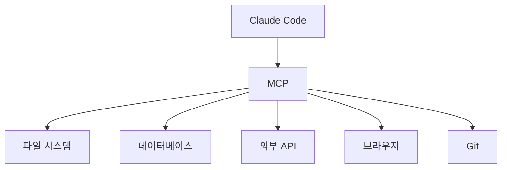
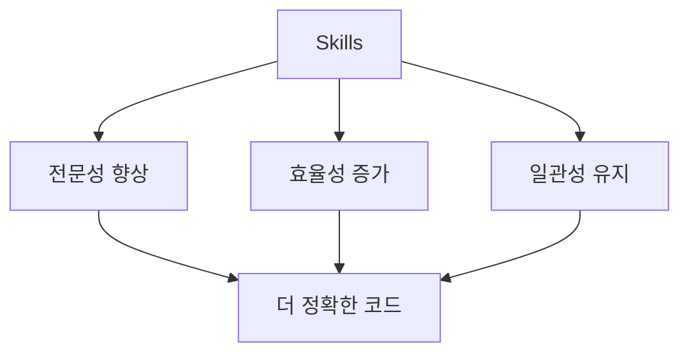
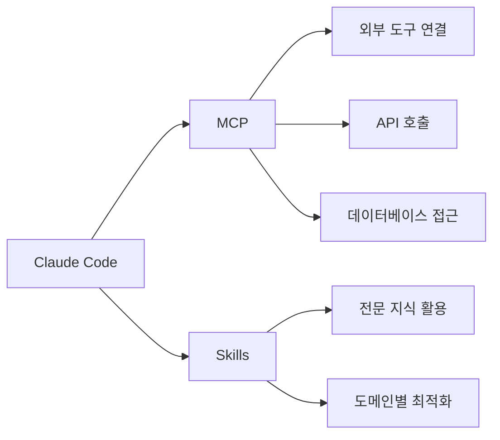

# 1. MCP(Model Context Protocol)란?

이 장에서는 Claude Code의 확장 기능인 MCP와 Skills를 소개합니다. 이 기능들을 통해 Claude Code가 외부 서비스와 연결되고, 특정 도메인에 대한 전문성을 가질 수 있습니다.



<highlight>MCP(Model Context Protocol)는 Claude Code가 외부 도구 및 서비스와 연결될 수 있게 해주는 프로토콜입니다.</highlight> 쉽게 말해, Claude Code에 **손과 발**을 달아주는 기능이라고 생각하시면 됩니다.

예를 들어, MCP를 통해 Claude Code는 다음과 같은 작업을 수행할 수 있습니다.

- 파일 시스템 접근 및 조작
- 데이터베이스 쿼리 실행
- 외부 API 호출
- 브라우저 자동화
- Git 저장소 관리

## 1.1 MCP 서버 연결하기

MCP 서버를 연결하려면 `/mcp` 명령어를 사용합니다.

```
/mcp
```

이 명령어를 실행하면 사용 가능한 MCP 서버 목록이 표시됩니다. 원하는 서버를 선택하여 연결할 수 있습니다.

## 1.2 주요 MCP 서버

자주 사용되는 MCP 서버들은 다음과 같습니다.

| MCP 서버 | 설명 |
| --- | --- |
| filesystem | 파일 시스템 접근 및 조작 |
| github | GitHub 저장소 관리 |
| postgres | PostgreSQL 데이터베이스 연동 |
| puppeteer | 브라우저 자동화 |
| slack | Slack 메시지 전송 |

:::div{.callout}
MCP 서버는 계속해서 추가되고 있습니다. 최신 목록은 공식 문서를 확인해주세요.

[MCP 공식 문서](https://docs.anthropic.com/ko/docs/claude-code/mcp)
:::

# 2. Skills란?

<highlight>Skills는 Claude Code가 특정 작업을 더 잘 수행할 수 있도록 도와주는 기능입니다.</highlight> 25년 하반기에 도입된 기능으로, Claude Code에 특정 도메인의 전문 지식을 부여할 수 있습니다.



## 2.1 Skills 사용하기

Skills를 사용하려면 `/skills` 명령어를 입력합니다.

```
/skills
```

이 명령어를 실행하면 사용 가능한 Skills 목록이 표시됩니다.

## 2.2 Skills의 장점

Skills를 사용하면 다음과 같은 장점이 있습니다.

| 장점 | 설명 |
| --- | --- |
| **전문성 향상** | 특정 분야에 대한 더 정확한 코드 생성 |
| **효율성 증가** | 반복적인 설명 없이도 도메인 지식 활용 |
| **일관성 유지** | 프로젝트 전체에서 일관된 코딩 스타일 적용 |

:::div{.callout}
MCP와 Skills는 계속해서 업데이트되고 있는 기능입니다. 최신 정보는 공식 문서를 참고해주세요.
:::

