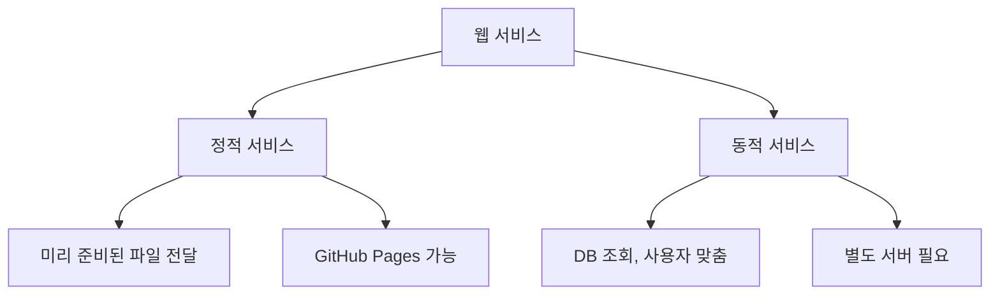

이 장에서는 정적 서비스와 동적 서비스의 차이를 설명합니다. GitHub Pages로 배포할 수 있는 서비스의 범위를 이해하고, 자신의 프로젝트에 맞는 배포 방법을 선택하는 데 도움을 드립니다.

<highlight>GitHub Pages로 모든 서비스를 배포할 수 있는 것은 아닙니다.</highlight> '정적 서비스'만 가능합니다. 이번 챕터에서는 '정적 서비스'에 대해 알아보도록 하겠습니다.

# 1. 정적 서비스란 무엇인가?

웹 서비스를 처음 접하는 이들에게 '정적'이라는 단어는 다소 낯설게 들릴 수 있습니다. 왜냐하면 지금 우리가 업로드한 서비스만 하더라도 홈, 소개, 커리큘럼, 강사를 누르면 ‘동적’으로 서비스가 움직이기 때문입니다. 웹 페이지에서 ‘커리큘럼’을 누르면 아래 페이지로 이동합니다.

이렇게 웹 서비스가 ‘동작’하는데 ‘정적’, ‘동적’이라는 단어를 사용하지 않습니다. 

<highlight>정적 서비스란 서버에 미리 준비된 파일을 그대로 전달하는 웹 서비스를 말합니다.</highlight> 마치 인쇄된 책처럼, 누가 언제 보더라도 같은 내용을 보여주는 것이죠.

여러분이 HTML, CSS, JavaScript로 만든 웹페이지를 떠올려보세요. 이 파일들은 이미 완성된 형태로 존재합니다. 사용자가 웹사이트에 접속하면, 서버는 이 파일들을 있는 그대로 전달할 뿐입니다. 별도의 계산이나 데이터베이스 조회 없이 말이죠.

카페의 메뉴판을 생각해보면 이해가 쉬울 것입니다. 메뉴판은 이미 인쇄되어 있고, 손님이 보고 싶어할 때마다 같은 내용을 보여줍니다. 정적 서비스도 마찬가지입니다. 미리 만들어둔 HTML 파일을 방문자에게 그대로 보여주는 것입니다.

| 구분 | 정적 서비스 | 동적 서비스 |
| --- | --- | --- |
| **비유** | 인쇄된 메뉴판 | 주문에 맞는 음료 제조 |
| **서버 역할** | 파일 전달 | 데이터 처리 + 맞춤 응답 |
| **DB 필요** | 불필요 | 필요 |
| **예시** | 포트폴리오, 소개 페이지 | 로그인, 쇼핑몰 |

반면 동적 서비스는 다릅니다. 로그인을 하면 로그인한 사용자에게 별도의 화면을 보여주어야 하죠. 때로는 사용자 맞춤형 페이지를 보여주어야 할 수 있습니다. 예를 들어, 다시 카페에 예시를 가져온다면 메뉴판을 보고 여러분이 어떤 메뉴를 시켰을 때 항상 동일한 아메리카노가 나오는 것이 아니라 여러분이 시킨 메뉴가 나오는 것이죠. 저는 항상 아메리카노에 시럽을 3번 넣어 먹는데요. 제가 말하지 않아도 시럽도 넣어주시고요.

<highlight>이렇게 단지 어떤 인쇄된 인쇄물이 아니라, '행위'를 해야 하는 경우 '동적' 서비스라고 얘기를 합니다.</highlight> 서비스를 예로 들면 데이터베이스도 조회를 해야 하고, 조회된 결과에 따라 맞춤형으로 커스터마이징도 해야 하는 거죠. 이건 단지 파일만 전송해서 해결되는 문제가 아닙니다.

# 2. 모든 사람이 동적 서비스가 필요한 것은 아닙니다

<highlight>모두가 로그인, 로그아웃, 게시물 올리기 등의 동적 서비스가 필요한 것이 아닙니다.</highlight> 실제로 부트캠프에서 절반은 동적인 서비스가 아닌 정적 서비스를 최종 결과물에 목표로 잡습니다. 동적 서비스를 만들 수 있음에도 말이죠.

부트캠프에서 실제 나온 결과물의 대표 사례를 언급하자면 아래와 같습니다.

| 서비스 유형 | 설명 |
| --- | --- |
| **지역 특산물 판매** | 정적 웹 + Google Form으로 주문 |
| **요가 타이머** | 크롬 익스텐션으로 확장 |
| **크롬 시작화면** | 회사 직원용 안내 페이지 |
| **개인 포트폴리오** | 이메일, 연락처 명시 |

물론 사내 HR 시스템 같은 서비스를 만드신 대표님도 있었지만, 간단한 댓글, 간단한 북마크, 텍스트 저장 기능, 나만 쓰는 블로그 등은 얼마든지 백엔드 없이 만들 수 있습니다. 따라서 자신이 만들려는 서비스가 정적인 서비스만으로 가능한 것인지, 동적인 서비스로 만들어야만 하는지 등을 면밀하게 검토해볼 필요가 있습니다.

예를 들어, 만약 댓글을 사용하는 서비스를 만들고 싶으면 백엔드 없이 disqus라는 서비스를 붙이기만 해도 정적 서비스에 댓글을 달 수 있습니다.

[#1 in audience engagement and community growth | Disqus](https://disqus.com/)

GitHub으로 블로그를 작성하고 싶으면 3분만에 블로그를 만드실 수 있습니다. 이 서비스 또한 바이브 코딩으로 제가 만든 서비스입니다.

[[Free now]Create a GitHub blog in 3 minutes| jejucoding - Course on Inflearn](https://inf.run/werSo)

아래 서비스는 저희 회사에서 바이브 코딩을 위해 만든 서비스 중 하나입니다. 접속자가 몇 명인지 알고 싶을 때에는 어쩔 수 없이 동적인 서비스를 만들어야 하는데 접속자를 카운팅해 주는 서비스입니다.

[대시보드 - Weniv Hit Counter](https://dev.wenivops.co.kr/services/weniv-hit-counter/)

# 3. 정리

여러분이 만들고자 하는 서비스가 정적인지 동적인지 판단하는 것은 중요합니다. 아래 표를 참고하여 결정해 보세요.

| 필요한 기능 | 서비스 유형 | 권장 배포 방법 |
| --- | --- | --- |
| 정보 제공만 | 정적 | GitHub Pages |
| 댓글, 좋아요 | 정적 + 외부 서비스 | GitHub Pages + Disqus 등 |
| 로그인/회원가입 | 동적 | 별도 서버 필요 |
| 데이터 저장/조회 | 동적 | 별도 서버 필요 |

:::div{.callout}
정적 서비스로 충분한 경우가 생각보다 많습니다. 처음부터 동적 서비스를 목표로 하기보다, 정적 서비스로 시작해서 필요할 때 확장하는 전략을 권장합니다.
:::