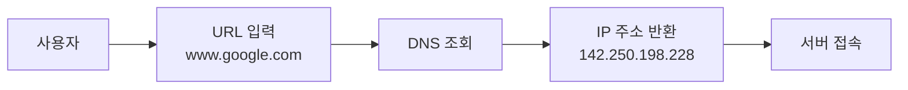
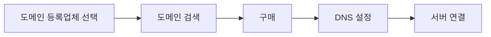

# 1. 웹의 주소 체계

이 장에서는 배포를 이해하기 위한 기초 지식을 다룹니다. IP 주소, URL, DNS, 서버의 개념을 이해하고, 도메인 구매 방법까지 알아봅니다.

<highlight>인터넷은 거대한 도시와 같습니다.</highlight> 수십억 개의 컴퓨터가 서로 연결되어 있죠. 이 도시에서 특정 집(서버)을 찾아가려면 주소가 필요합니다. 그것이 바로 IP 주소입니다.

IP 주소는 숫자로 이루어진 인터넷상의 주소입니다. 예를 들어 `192.168.1.1`이나 `142.250.198.228`와 같은 형태죠. 모든 인터넷에 연결된 기기는 고유한 IP 주소를 가지고 있습니다. 하지만 이런 숫자를 외우기는 쉽지 않습니다. 그래서 우리는 URL을 사용합니다.

<highlight>URL(Uniform Resource Locator)은 인간이 읽을 수 있는 웹 주소입니다.</highlight> 도메인 또는 도메인 이름이라고도 부릅니다. `www.google.com`이 `142.250.198.228`보다 기억하기 쉽지 않나요? DNS(Domain Name System)라는 시스템이 URL을 IP 주소로 변환해주는 전화번호부 역할을 합니다. 우리가 브라우저에 URL을 입력하면, DNS가 해당하는 IP 주소를 찾아 연결해주는 것입니다.

이를 도식화하면 위와 같습니다. Client는 우리를 나타냅니다. 우리는 DNS라는 곳으로 찾아가 `www.google.com`이 실제 주소가 어디인지 받아옵니다. 터미널로도 알아낼 수 있는데요. 아래와 같이 실행해서 알아낼 수 있습니다. 142.250.198.228이라고 하네요. 이 주소는 저와 여러분이 다를 수 있습니다.

그리고 주소창에 www.google.com아 아니라 아래와 같이 입력해도 똑같이 google 페이지가 뜹니다. 이 2개가 가리키는 곳이 같다는 거죠.

# 2. 서버

<highlight>서버는 특별한 컴퓨터가 아닙니다.</highlight> 여러분의 노트북도 서버가 될 수 있습니다. 저희 회사도 제가 데스크톱으로 사용하던 PC를 사내 서버로 사용하고 있습니다. 다만 서버는 24시간 켜져 있으면서 사용자에게 오는 요청을 응답해줄 프로그램이 실행되고 있을 뿐입니다.

서버의 종류는 다양합니다.

| 서버 종류 | 역할 | 서비스 유형 |
| --- | --- | --- |
| **웹 서버** | HTML, CSS, JS 파일 전송 | 정적 서비스 |
| **애플리케이션 서버** | 비즈니스 로직 처리 | 동적 서비스 |
| **데이터베이스 서버** | 데이터 저장 및 관리 | 동적 서비스 |

현대의 웹 서비스는 이런 여러 서버들이 협력해서 작동합니다.

여러분이 사용하셨던 GitHub Pages와 같은 정적 서비스는 웹 서버를 활용합니다. 뒤에서 배울 동적 서비스는 웹 서버에 더하여 애플리케이션 서버와 데이터베이스 서버가 필요합니다.

물리적 서버를 직접 관리하는 것은 쉽지 않습니다. 전기요금, 냉각 시스템, 네트워크 관리, 보안 등 신경 써야 할 것이 많습니다. 특히 저희 회사가 있는 제주와 같은 경우 가끔 정전이 되는데 이러한 정전은 서버에 치명적입니다. 그렇기 때문에 클라우드 서비스를 사용합니다. 클라우드는 빌려쓰는 것이라 생각하면 이해하기 쉽습니다. AWS, Google Cloud, Azure 같은 회사들이 서버를 대신 관리해주고, 우리는 필요한 만큼만 빌려 쓰는 것이죠.

그러면 왜 위니브는 직접 서버를 운영하는 것일까요? 저희도 위니북스와 같은 수십만명이 이용하는 서비스는 AWS에서 서비스 하고 있습니다. 다만 다른 서비스는 이렇게 접속자가 많지 않아요. 그런데 저희 회사처럼 이렇게 서비스가 많으면 비용이 상당합니다. 아래는 저희 AWS 비용입니다. 월 100만원 정도 내던 것을 매월 사내서버로 이전해서 20만원 정도로 줄인 상태입니다.

이렇게 적절하게 분배할 필요가 있습니다. 만약 동적 서비스를 5 ~ 6개 만드시고 운영하실 것이라면 집에서 안쓰는 미니 PC 등으로 서버 구성을 권해드립니다. 설정하면서 배우는 것도 많으실 겁니다. 안 쓰는 휴대폰이나 갤럭시 패드도 가능합니다.

# 3. URL 구매

<highlight>URL을 구매하는 것은 이러한 서버와 IP를 구매하는 것과는 별도입니다.</highlight> URL은 이름만 구매하는 것입니다. 구매하는 방법과 연결하는 방법은 생각보다 간단합니다.

먼저 도메인 등록업체(Registrar)를 선택합니다. Google Domains, 가비아, AWS, Cafe24 등이 유명합니다. 원하는 도메인이 사용 가능한지 검색하고, 가능하다면 구매합니다. 가격은 보통 연간 1만원에서 5만원 정도이지만, `.com`이나 `.org` 같은 인기 있는 최상위 도메인(TLD)은 더 비쌀 수 있습니다.

아래 웹페이지에서 검색해보세요. Cafe24를 선택한 이유는 한국에서 많이 사용하기 때문입니다. 한국어로 되어있기도 하고요.

[카페24 호스팅 | 온라인 비즈니스의 시작](https://hosting.cafe24.com/?controller=new_domain_search)

이렇게 검색해서 바로 구매할 수 있습니다. 도메인을 구매한 후에는 DNS 설정을 해야 합니다. 도메인이 여러분의 서버를 가리키도록 설정하는 것이죠. A 레코드는 도메인을 IP 주소와 연결하고, CNAME 레코드는 도메인을 다른 도메인과 연결합니다. 처음에는 복잡해 보이지만, 대부분의 호스팅 서비스가 자세한 가이드를 제공합니다. 

뒤에 챕터인 GitHub 연동하기를 통해 단 한 번만 실습을 해보면 어려움 없이 연결하실 수 있을 겁니다.