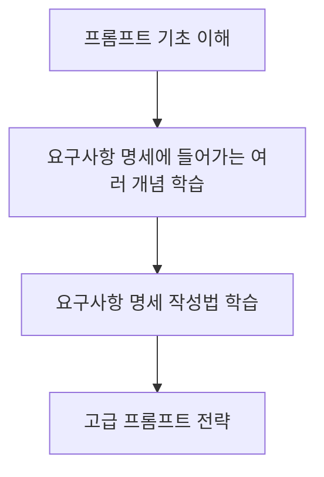

# 1. 바이브 코딩을 위한 프롬프트

바이브 코딩을 잘하기 위해서는 결국 프롬프트를 잘 작성하는 능력이 중요합니다. 프롬프트란 AI에게 작업을 지시하는 명령어이자 질문입니다. 좋은 프롬프트는 AI가 여러분의 의도를 정확히 이해하고, 원하는 결과물을 만들어내도록 돕습니다. 앞으로도 이 창구가 좋은 결과물을 만들어내는 핵심이라는 사실은 변하지 않을 것입니다. 그렇기에 **위니북스의 ChatGPT에 프롬프트 챕터**를 가지고 왔습니다. 만약 아는 내용이 많다면 해당 챕터를 건너 뛰셔도 좋습니다.

# 2. 바이브 코딩을 위한 프롬프트 학습 절차

해당 책은 아래와 같은 절차로 프롬프트 작성법을 학습합니다.

이 챕터에서 다루는 것은 '프롬프트 기초 이해'입니다. 이후로는 관련이 없어보이는 '디자인', 'UI/UX', '웹 개발' 등의 개념을 학습합니다. **이러한 개념들은 뒤에서 배울 요구사항 명세 작성법 학습에 필요한 배경지식**이 됩니다. 만약 이러한 배경지식을 이미 모두 알고 있는 상태라면 이러한 챕터를 건너 뛰셔도 좋습니다. 이후 챕터에서 요구사항 명세를 작성하는 법을 배우고, 마지막으로 고급 프롬프트 전략을 다룹니다.