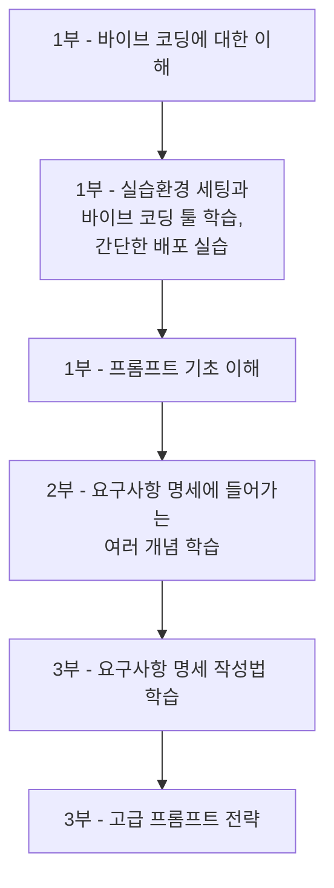

이 장에서는 바이브 코딩의 핵심인 프롬프트 작성의 중요성과 학습 절차를 다룹니다. 좋은 프롬프트가 좋은 결과물을 만드는 열쇠임을 이해하고, 앞으로의 학습 방향을 파악할 수 있습니다.

# 1. 바이브 코딩을 위한 프롬프트

<highlight>바이브 코딩을 잘하기 위해서는 결국 프롬프트를 잘 작성하는 능력이 중요합니다.</highlight> 프롬프트란 AI에게 작업을 지시하는 명령어이자 질문입니다. 좋은 프롬프트는 AI가 여러분의 의도를 정확히 이해하고, 원하는 결과물을 만들어내도록 돕습니다. 앞으로도 이 창구가 좋은 결과물을 만들어내는 핵심이라는 사실은 변하지 않을 것입니다. 그렇기에 **위니북스의 ChatGPT에 프롬프트 챕터**를 가지고 왔습니다. 만약 아는 내용이 많다면 해당 챕터를 건너뛰셔도 좋습니다.

# 2. 바이브 코딩을 위한 프롬프트 학습 절차

<highlight>`01-1` 챕터에서 언급한 것처럼 해당 책은 아래와 같은 절차로 학습을 수행합니다.</highlight> 이 프롬프트까지가 1부입니다.

이렇게 기본적인 프롬프트를 이해한 후, 2부에서 요구사항 명세에 들어가는 여러 개념을 학습합니다. 이후 3부에서 요구사항 명세 작성법을 배우고, 마지막으로 고급 프롬프트 전략을 다룹니다. 만약 여러분이 이미 프롬프트 작성법이나 기반지식에 대해 잘 알고 있다면, 2부나 3부로 바로 넘어가셔도 좋습니다.

:::div{.callout}
**핵심 포인트** 
우리의 목표를 기억해주세요. 결국 우리는 프롬프트로 명령을 내립니다. 지금까지 배우는 모든 개념과 지식은 '좋은 프롬프트를 작성하기 위한 배경지식'입니다. 이 점을 잊지 마세요.
:::