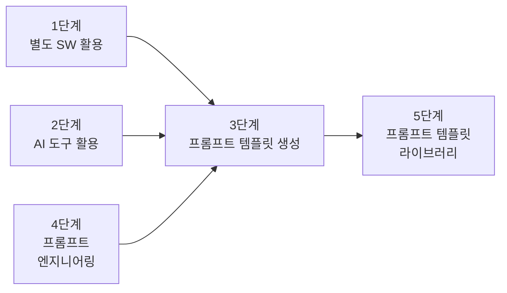
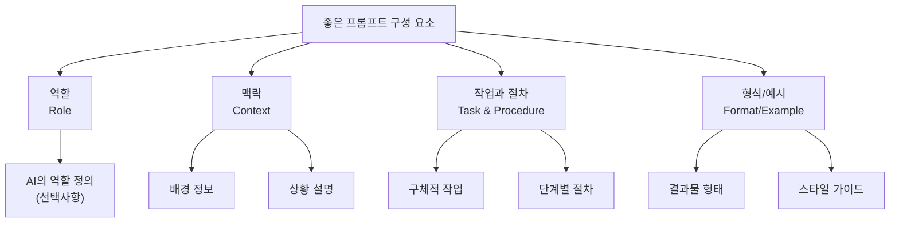
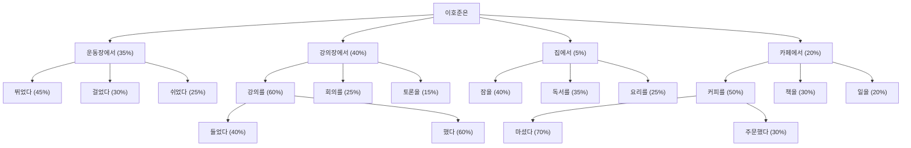
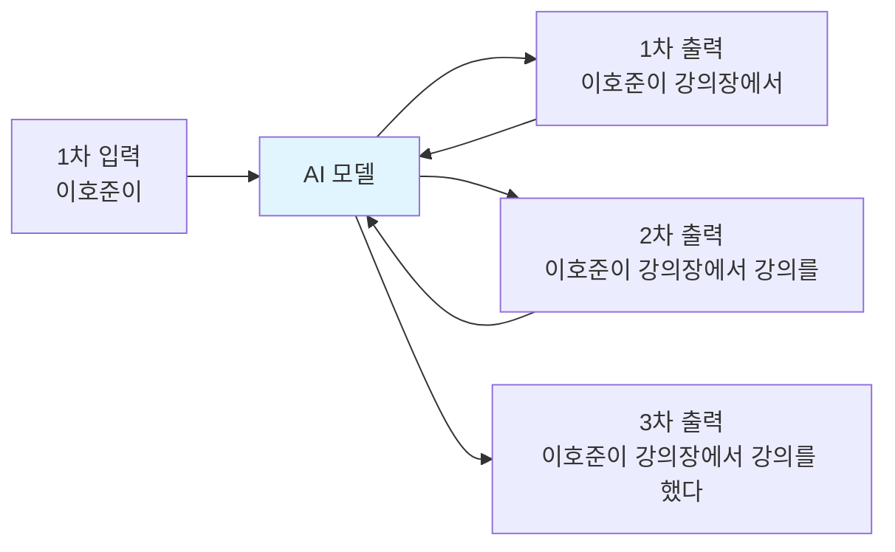

# 1. 프롬프트의 기본 개념

프롬프트는 컴퓨터 시스템에서 사용자의 입력을 기다리는 상태를 의미하는 오래된 개념입니다. 이는 단순히 최신 AI 모델인 ChatGPT와 같은 도구에만 국한되지 않고, 컴퓨터 역사 전반에 걸쳐 사용된 오래된 개념이죠. 아래와 같이 터미널에서 커서가 깜빡이며 사용자의 명령어 입력을 기다리는 상태도 하나의 프롬프트입니다.


최근 **AI 및 대화형 인터페이스의 발전으로 프롬프트의 개념은 더욱 확장**되었습니다. 대규모 언어 모델(LLM)과 함께 프롬프트는 단순한 입력 요청을 넘어, AI 시스템과의 상호작용을 하는 공간으로 변하였습니다.

아래 이미지에서 저는 Claude에게 인스타그램을 똑같이 만들라는 프롬프트를 입력했고, Claude는 이를 위한 코드와 실행 결과를 보여주고 있습니다.


ChatGPT에서도 별도 설정 없이 프롬프트를 통해 그래프와 같은 다양한 결과물을 받을 수 있습니다.


## 1.1 프롬프트 엔지니어링의 중요성

우리는 **프롬프트로 다양한 형태의 결과물을 받아볼 수 있게 되었습니다. 인간이 사용하는 '자연어'를 사용**해서 말이죠.

프롬프트로 더 많은 작업을 수행할 수 있게 되면서 AI 모델이 정확하고 유용한 결과를 만들어내도록 프롬프트를 설계하고 최적화하는 기술은 더욱 중요해졌습니다. 특히 GPT-3, GPT-4와 같은 고급 언어 모델이 등장하면서, 프롬프트 엔지니어링의 중요성은 더 커졌습니다.

단순히 즉흥적으로 생각나는 질문을 작성하는 것이 아니라 원하는 것을 얻기 위한 **전략적 접근**이 필요해진 거죠. 예를 들어, 수학 풀이는 LLM이 잘 못하는 부분 중 하나입니다. 이는 LLM이 발전해도 마찬가지일 것입니다. LLM은 확률에 근거해서 텍스트를 생성하기 때문이죠. 이를 해결하기 위해 CoT 기법 등이 있습니다. 이러한 기법을 잘 활용하면 **결과의 품질과 정확도**를 크게 올릴 수 있습니다. 이는 AI 모델의 잠재력을 최대한 끌어내는 데 프롬프트 엔지니어링이 핵심적인 역할을 한다는 것을 의미합니다.

**또한 잘 구조화된 프롬프트는 반복적으로 사용**할 수 있어 **자산화** 할 수 있고, 이를 통해 일정한 퀄리티의 결과를 낼 수 있습니다. 이는 업무 프로세스의 표준화와 자동화로 이어져 개인과 기업의 생산성을 크게 올릴 수 있죠. 예를 들어, 위니브에서 사용 중인 '디자인 프롬프트 시스템'은 반복적인 페이지 작업을 효율적으로 처리하여, 업무의 신속성과 정확성을 크게 높여줍니다.

마지막으로 **프롬프트 엔지니어링은 AI가 잘못된 정보를 생성하는 할루시네이션 문제를 줄이는 데에도 중요한 역할**을 합니다. 특히 최신 데이터가 반영되지 않거나, 오류를 일으킬 수 있는 상황에서, 적절하게 설계된 프롬프트는 AI가 더 정확한 응답을 제공할 수 있도록 만듭니다.

프롬프트 엔지니어링은 AI의 잠재력을 최대한 발휘하고, 인간과 AI의 상호작용을 최적화하는 데 필수적인 기술입니다. 앞으로 AI 기술이 더욱 발전할수록, 프롬프트 엔지니어링의 중요성은 지속적으로 증가할 것으로 예상됩니다.

:::div{.callout}
모든 프롬프트 엔지니어링이 프롬프트 안으로 들어와서 결국 아무것도 소용없을 것이라는 무용론도 있습니다. 다만 프롬프트 엔지니어링이 AI 모델의 한계를 극복하고, 더 나은 결과를 얻기 위한 중요한 도구라는 점은 분명합니다.
:::

## 1.2 프롬프트 활용방법 5단계



1. **유저 - 프롬프트 - 생성형AI - 답변 - 별도 SW**
    - 예를 들어, 머메이드, PlantUML, Graphviz, D2(Declarative Diagramming), Kroki와 같은 도구를 활용하는 것을 의미합니다.

2. **유저 - 프롬프트 - 생성형AI - 생성형AI 도구 - 답변**
    - 예를 들어, 압축을 풀게 한다던지, PDF를 읽게 한다던지, 웹 페이지에서 정보를 가져오는 것이나 이미지에서 텍스트를 추출하는 것 등을 의미합니다. 

:::div{.callout}
생성형 AI는 압축을 풀거나 PDF를 읽어오는 기능이 없습니다. 생성형 AI는 가상환경이라는 것을 내부에 구축하여 여러분이 준 파일이나 요청이 생성형 AI로 수행할 수 없는 것이라면 별도의 도구를 활용하여 그 작업을 수행한 후, 그 결과물을 다시 생성형 AI에게 주어 답변을 생성합니다. 이러한 특성을 알고 있으면 GPT의 한글 깨짐 현상 등을 해결할 수 있습니다.

* 링크: https://pypi.org/project/koreanize-matplotlib/#files
:::

3. **프롬프트 엔지니어링**
    - 프롬프트에게 더 좋은 답변을 얻기 위해 프롬프트를 설계하고 최적화하는 것을 의미합니다.

4. **유저 - 프롬프트 템플릿 요구 - 생성형AI - 프롬프트 템플릿 생성 - 프롬프트 재구성 - 생성형AI - 답변**
    - 예를 들어, 프롬프트 템플릿을 요구하는 것을 의미합니다. 아래와 같이 프롬프트 템플릿을 요구하여 내용을 채우는 것이 핵심입니다. '리라이팅'이라고도 부릅니다.

```
나는 바이브 코딩 부트캠프를 운영하는 개발자야. 바이브 코딩 랜딩페이지를 만들고 싶은데 그냥 만들지는 않고, 너에게 프롬프트 템플릿을 받아서 그걸 채운다음 완성도 높게 만들고 싶어. 프롬프트 템플릿을 만들어줘.
```

5. **프롬프트 템플릿 라이브러리**
    - 이미 만들어진 프롬프트 라이브러리를 활용하는 것을 의미합니다. 회사에서 직접 구축할 수도 있으며, 구축된 것을 가져와서 사용할 수 있습니다. 예를 들어, [PromptHero](https://prompthero.com/), [포켓 프롬프트](https://pocket-prompt.com/prompt/text)와 같은 사이트에서 프롬프트를 가져오는 것을 의미합니다. 아래와 같이 직접 지시할 수도 있습니다.

```
나는 프로젝트를 만들 때 '요구사항.md(4번에서 작성한 템플릿)' 파일처럼 작성을 해야 프로덕트의 퀄리티가 향상된다는 것을 알게 되었어. 그래서 모든 단계에서 이러한 프롬프트 템플릿을 만들어 놓고 반복해서 사용하고 싶어. 조금 규모가 있는 프로젝트라고 생각하고 이러한 프롬프트 템플릿 라이브러리를 만들어줘.

각각의 단계는 폴더로 구분하고, 각 폴더 안에는 해당 단계에서 사용할 수 있는 프롬프트 템플릿 파일들을 포함시켜줘. 예를 들어, '아이디어 구상', '요구사항 정의', '설계', '개발', '테스트', '배포' 같은 단계들이 있을 수 있어. 각 단계별로 최소 3개의 프롬프트 템플릿 파일을 만들어줘.
```

# 2. 좋은 프롬프트 만들기

효과적인 프롬프트 작성은 AI와의 상호작용을 최적화하는 데 핵심적인 역할을 합니다. AI의 성능을 극대화하기 위해 다양한 전략과 기법이 개발되어 왔습니다.

지금은 ChatGPT, Claude와 같은 곳에서 프롬프트 엔지니어링을 소개하고, 이를 통해 AI와의 상호작용을 개선하기 위한 다양한 기법을 제시하고 있습니다.

링크: https://docs.claude.com/en/docs/build-with-claude/prompt-engineering/overview

좋은 프롬프트에는 다음과 같은 요소들이 포함됩니다.

```
1. 역할 (Role): AI가 어떤 역할을 해야 하는지 - 선택
2. 맥락 (Context): 배경 정보와 상황 설명
3. 작업과 절차 (Task and Procedure): 구체적으로 무엇을 해야 하는지
4. 형식 또는 예시 (Format or Example): 결과물의 형태와 스타일
```



좋지 못한 프롬프트는 아래와 같습니다. 단순히 한 줄로 요구사항만 짧게 적은 경우죠. 이렇게 되었을 때 통계적으로도 좋은 결과가 나오기 어렵지만, 이 결과물의 답변을 기다리고 읽어보는데 시간을 더 쓴다는 사실을 기억해야 합니다.

```md
마케팅 글 써줘
```

구성 요소를 모두 작성한 프롬프트는 아래와 같습니다.

```md
역할: 너는 B2B 마케팅 전문가야.
맥락: 우리는 중소기업 대상 프로젝트 관리 툴을 출시했어. 이 툴은 다른 툴과 OOOO이 비교되고, OOOO한 문제를 해결할 수 있어. 대표적으로는 OOOO 장점이 있어.
작업: 제품 출시 이메일을 작성해줘.
형식: 제목(10자 이내) + 본문(200자) + CTA 버튼 문구
```

아래는 이러한 프롬프트를 작성하기 위한 템플릿입니다. 먼저 여러분의 목적을 ChatGPT, Claude와 같은 AI 모델에게 말하고, 아래와 같은 템플릿을 요구하셔도 좋습니다. 중요한 것은 AI에게 명확한 답변을 얻기 위해서는 '노력'을 해야 한다는 점입니다.

```md
[역할]
너는 [산업/분야]의 전문 콘텐츠 마케터야.

[맥락]
- 타겟 독자: [구체적인 독자층]
- 목적: [인지도 향상/리드 생성/교육 등]
- 톤앤매너: [전문적/친근한/유머러스 등]

[작업]
다음 주제로 블로그 글을 써줘: [주제]

[형식]
- 제목: [클릭을 유도하는 제목]
- 도입부: [독자의 관심을 끄는 질문이나 통계]
- 본문: [3-5개 소제목으로 구조화]
- 결론: [명확한 CTA (Call To Action)]
- 길이: 약 [글자 수]
```

## 2.1 상세한 정보 제공하기

**상세한 정보 제공하는 것은 텍스트 생성의 길을 제시하는 것과 같습니다.** AI에게 명확한 역할, 대상, 목표, 답변 형식, 예시 등을 구체적으로 제시하면 생성형AI가 다음 텍스트를 더 명확하게 예측할 수 있습니다.

앞서 살펴보았던 내용입니다.



예를 들어, '이호준이'를 입력하면 다음 문장은 '이호준이 강의장에서'가 나오게 됩니다. 이렇게 나온 문장은 다시 모델로 들어가 '이호준이 강의장에서 강의를'이 나오게 하죠. 이를 도식화 하면 아래와 같습니다.



결국 좋은 프롬프트란 좋은 답변이 나오게 하기 위한 확률을 높여줄 수 있는 모든 행위, 정보를 제공하는 것입니다.

## 2.2 여러번 질문해보기

AI와 대화할 때, 여러 창을 띄어놓고 똑같은 질문을 던져보는 것도 좋은 방법입니다. AI는 확률에 기반한 모델이기 때문에, 같은 질문이라도 매번 다른 답변이 나오게 됩니다. 여러 번 질문을 던져보고, 그 중에서 가장 적합한 답변을 선택하거나, 다양한 답변을 조합하여 최종 결과물을 만드는 것도 효과적인 전략입니다.
