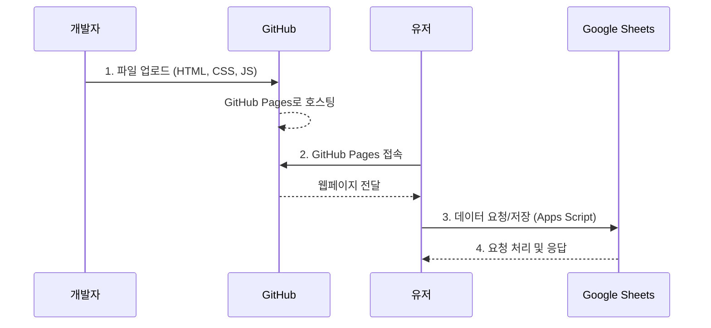
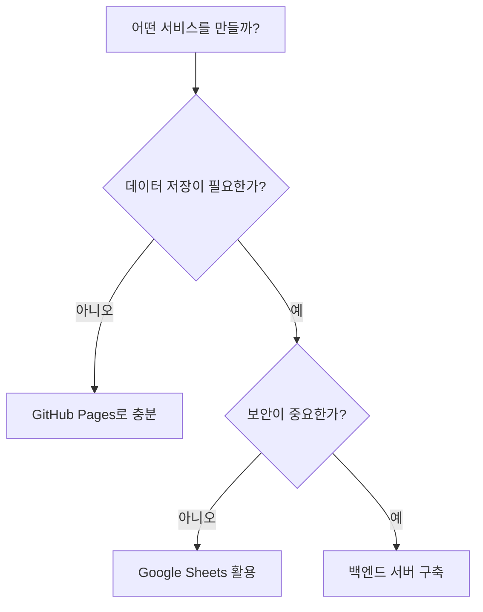

이 장에서는 GitHub Pages를 이용하여 간단한 동적 서비스를 구현해봅니다. 이를 통해 동적 서비스의 작동 원리를 이해하고, 정적 서비스와의 차이점을 명확히 할 수 있습니다.

# 1. 간단한 동적 서비스



앞 챕터에서 GitHub Pages는 정적 서비스만 배포할 수 있다고 설명했습니다. 하지만 간단한 동적 기능이 필요하다면 어떻게 해야 할까요? 완전한 백엔드 서버를 구축하지 않고도 **Google Sheets를 데이터베이스처럼 활용**하는 방법이 있습니다.

이 방식은 홈페이지에서 사용자가 입력한 데이터를 Google Sheets에 저장하고, 저장된 데이터를 다시 홈페이지에서 불러와 보여주는 구조입니다. 예약 시스템, 간단한 설문조사, 방명록 등을 구현할 때 유용합니다.

:::div{.callout}
**언제 이 방법을 사용할까요?**

- 간단한 데이터 저장이 필요할 때 (예약, 신청, 문의 등)
- 보안이 크게 중요하지 않은 사내용 서비스
- 빠르게 프로토타입을 만들고 싶을 때
- 데이터를 스프레드시트로 관리하고 싶을 때
:::

이 단계는 앞서 언급한 '1.1 대상 독자와 읽는 방법'에 2단계, 3단계로 기록되어 있습니다. 적어도 2~3개의 서비스를 만들어보며 어떤 식으로 서비스가 동작하는지 이해해보셨으면 좋겠습니다.

Google Sheets를 활용한 동적 서비스는 실무에서 자주 쓰이진 않지만, 간단한 사내 도구나 프로토타입을 만들 때 유용합니다. 이 챕터에서는 프롬프트와 구현 설명서를 제공합니다.

* 링크: https://github.com/paullabkorea/cafe

프롬프트의 전문입니다.

```md
[목적]
나는 카페를 소개하고 예약할 수 있는 서비스를 만들고 싶어. 카페는 사내용 카페여서 보안이 필요하진 않아. 우리 직원들이 예약할 수 있는 랜딩페이지를 만들어줘.

[구현스택]
- HTML, CSS, JavaScript
- 데이터베이스는 google Sheets를 Apps Script로 연결해서 사용

[요구사항]
1. 구현 설명서: 비개발자가 개발해야하는 상황을 고려하여, 상세한 구현 설명서를 작성해줘.
2. 랜딩페이지 구성:
   - 카페 소개 섹션: 카페의 사진, 위치, 운영 시간, 제공하는 서비스(음료, 간식 등)를 포함.
   - 예약 섹션: 사용자가 날짜와 시간을 선택하고 예약할 수 있는 폼을 제공.
```

그렇게 만들어진 구현 설명서는 아래와 같습니다. Google Sheets와 Google Apps Script를 활용하여 간단한 동적 서비스를 만드는 방법이 상세히 나와 있습니다.

```md
# 사내 카페 예약 시스템 - 구현 설명서

이 문서는 비개발자도 쉽게 따라할 수 있도록 상세하게 작성되었습니다.

---

## 목차
1. [전체 구조 이해하기](#1-전체-구조-이해하기)
2. [파일 설명](#2-파일-설명)
3. [Google Sheets 설정하기](#3-google-sheets-설정하기)
4. [Google Apps Script 설정하기](#4-google-apps-script-설정하기)
5. [웹페이지와 연결하기](#5-웹페이지와-연결하기)
6. [웹페이지 호스팅하기](#6-웹페이지-호스팅하기)
7. [카페 정보 수정하기](#7-카페-정보-수정하기)
8. [문제 해결](#8-문제-해결)

---

## 1. 전체 구조 이해하기

이 시스템은 다음과 같이 작동합니다:

[사용자] → [웹페이지에서 예약 폼 작성] → [Google Apps Script] → [Google Sheets에 저장]

- **웹페이지**: 직원들이 카페 정보를 보고 예약하는 화면
- **Google Sheets**: 예약 정보가 저장되는 데이터베이스 역할
- **Google Apps Script**: 웹페이지와 Google Sheets를 연결해주는 중간 역할

---

## 2. 파일 설명

| 파일명 | 역할 | 수정 필요 여부 |
|--------|------|---------------|
| `index.html` | 웹페이지의 구조 (내용) | 카페 정보 수정 시 |
| `style.css` | 웹페이지의 디자인 (색상, 크기 등) | 디자인 변경 시 |
| `script.js` | 웹페이지의 동작 (예약 전송 등) | Apps Script URL 입력 필요 |
| `apps-script.gs` | Google Sheets 연결 코드 | Google에 복사 필요 |

---

## 3. Google Sheets 설정하기

### 3.1 새 스프레드시트 만들기

1. **Google 계정 로그인**
   - 브라우저에서 [Google Drive](https://drive.google.com) 접속
   - 회사 Google 계정으로 로그인

2. **새 스프레드시트 만들기**
   - 왼쪽 상단의 `+ 새로 만들기` 버튼 클릭
   - `Google 스프레드시트` 선택
   - 빈 스프레드시트 선택

3. **스프레드시트 이름 변경**
   - 왼쪽 상단의 `제목 없는 스프레드시트` 클릭
   - `사내카페_예약목록`으로 변경

---

## 4. Google Apps Script 설정하기

### 4.1 Apps Script 편집기 열기

1. 스프레드시트 상단 메뉴에서 `확장 프로그램` 클릭
2. `Apps Script` 클릭
3. 새 탭에서 Apps Script 편집기가 열림

### 4.2 코드 붙여넣기

1. 기존에 있는 `function myFunction() { }` 코드를 **모두 삭제**

2. `apps-script.gs` 파일의 **전체 내용**을 복사하여 붙여넣기
   - 메모장이나 VS Code로 `apps-script.gs` 파일 열기
   - `Ctrl + A`로 전체 선택
   - `Ctrl + C`로 복사
   - Apps Script 편집기에 `Ctrl + V`로 붙여넣기

3. **저장하기**
   - `Ctrl + S` 또는 디스크 아이콘 클릭
   - 프로젝트 이름 입력: `카페예약시스템`

### 4.3 스프레드시트 초기 설정 실행

1. 상단의 함수 선택 드롭다운에서 `setupSpreadsheet` 선택
2. `실행` 버튼 클릭 (▶ 모양)
3. **권한 요청 팝업이 뜨면:**
   - `권한 검토` 클릭
   - 본인 Google 계정 선택
   - "Google에서 확인하지 않은 앱입니다" 메시지가 뜨면 `고급` 클릭
   - `카페예약시스템(안전하지 않음)(으)로 이동` 클릭
   - `허용` 클릭
4. 스프레드시트로 돌아가면 헤더가 설정되어 있음

### 4.4 웹앱으로 배포하기

1. Apps Script 편집기 오른쪽 상단의 `배포` 버튼 클릭
2. `새 배포` 선택
3. 설정 화면에서:
   - 왼쪽의 톱니바퀴 아이콘 옆 `유형 선택` 클릭
   - `웹 앱` 선택
4. 배포 설정:
   - **설명**: `카페 예약 시스템 v1`
   - **실행 주체**: `나` 선택
   - **액세스 권한**: `모든 사용자` 선택
5. `배포` 버튼 클릭
6. **웹 앱 URL 복사**
   - `https://script.google.com/macros/s/...` 형태의 URL이 표시됨
   - 이 URL을 **반드시 복사하여 메모**해두세요!

---

## 5. 웹페이지와 연결하기

### 5.1 Apps Script URL 입력하기

1. `script.js` 파일을 메모장 또는 VS Code로 열기

2. 파일 상단에서 다음 줄을 찾기:
   const APPS_SCRIPT_URL = 'YOUR_APPS_SCRIPT_WEB_APP_URL_HERE';
   

3. `YOUR_APPS_SCRIPT_WEB_APP_URL_HERE` 부분을 **복사해둔 웹 앱 URL**로 교체:
   const APPS_SCRIPT_URL = 'https://script.google.com/macros/s/여러분의URL/exec';

4. 파일 저장 (`Ctrl + S`)

---

## 6. 웹페이지 호스팅하기

웹페이지를 인터넷에 공개하는 방법입니다. 여러 가지 방법 중 가장 쉬운 방법들을 소개합니다.

### 방법 1: 회사 내부 서버 사용 (권장)
- IT 부서에 문의하여 내부 웹서버에 파일 업로드
- 보안상 가장 안전한 방법

### 방법 2: GitHub Pages 사용 (무료)

1. **GitHub 계정 만들기**
   - [GitHub](https://github.com) 접속
   - `Sign up` 클릭하여 계정 생성

2. **새 저장소(Repository) 만들기**
   - 로그인 후 오른쪽 상단의 `+` 버튼 → `New repository`
   - Repository name: `cafe-reservation`
   - `Public` 선택
   - `Create repository` 클릭

3. **파일 업로드**
   - `uploading an existing file` 링크 클릭
   - `index.html`, `style.css`, `script.js` 파일을 드래그 앤 드롭
   - `Commit changes` 클릭

4. **GitHub Pages 활성화**
   - 저장소의 `Settings` 탭 클릭
   - 왼쪽 메뉴에서 `Pages` 클릭
   - Source에서 `Deploy from a branch` 선택
   - Branch에서 `main` 선택, 폴더는 `/(root)` 선택
   - `Save` 클릭

5. **웹사이트 주소 확인**
   - 몇 분 후 `https://사용자이름.github.io/cafe-reservation` 주소로 접속 가능

### 방법 3: 로컬에서 테스트 (개인 PC에서만)
- `index.html` 파일을 더블클릭하면 브라우저에서 열림
- 단, 이 방법은 본인 PC에서만 확인 가능

... 생략 ...
```

이렇게 만들어진 서비스는 아래와 같이 동작합니다.

* 링크: https://paullabkorea.github.io/cafe/


# 2. 활용 사례

Google Sheets + Apps Script 조합으로 만들 수 있는 서비스는 다양합니다. 아래는 실제로 구현 가능한 사례들입니다.

| 서비스 유형 | 설명 | 복잡도 |
|------------|------|--------|
| **예약 시스템** | 회의실, 장비, 상담 예약 | 중 |
| **설문조사** | 만족도 조사, 피드백 수집 | 하 |
| **방명록** | 간단한 메시지 저장 및 표시 | 하 |
| **재고 관리** | 사내 비품, 도서 대출 현황 | 중 |
| **출석 체크** | 이벤트, 강의 참석자 관리 | 하 |

이러한 서비스들은 모두 "데이터를 저장하고 조회한다"는 공통점이 있습니다. Google Sheets가 데이터베이스 역할을, Apps Script가 서버 역할을 대신하는 것입니다.

# 3. 한계와 대안

Google Sheets 방식은 간편하지만 분명한 한계가 있습니다.

## 3.1 이 방식의 한계

| 한계 | 설명 |
|------|------|
| **보안** | 민감한 개인정보 저장에 부적합 |
| **성능** | 동시 접속자가 많으면 느려짐 |
| **데이터 용량** | 대용량 데이터 처리 불가 |
| **기능 제한** | 복잡한 로직 구현 어려움 |

## 3.2 복잡한 서비스가 필요하다면

만약 로그인/회원가입, 결제, 실시간 채팅 등 본격적인 동적 서비스가 필요하다면 별도의 백엔드 서버가 필요합니다. 이 책의 다른 챕터에서 다룰 내용이기도 합니다.

