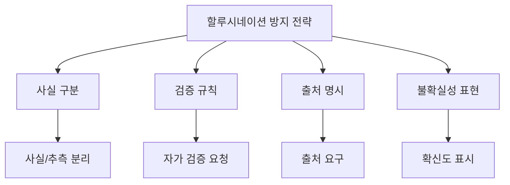
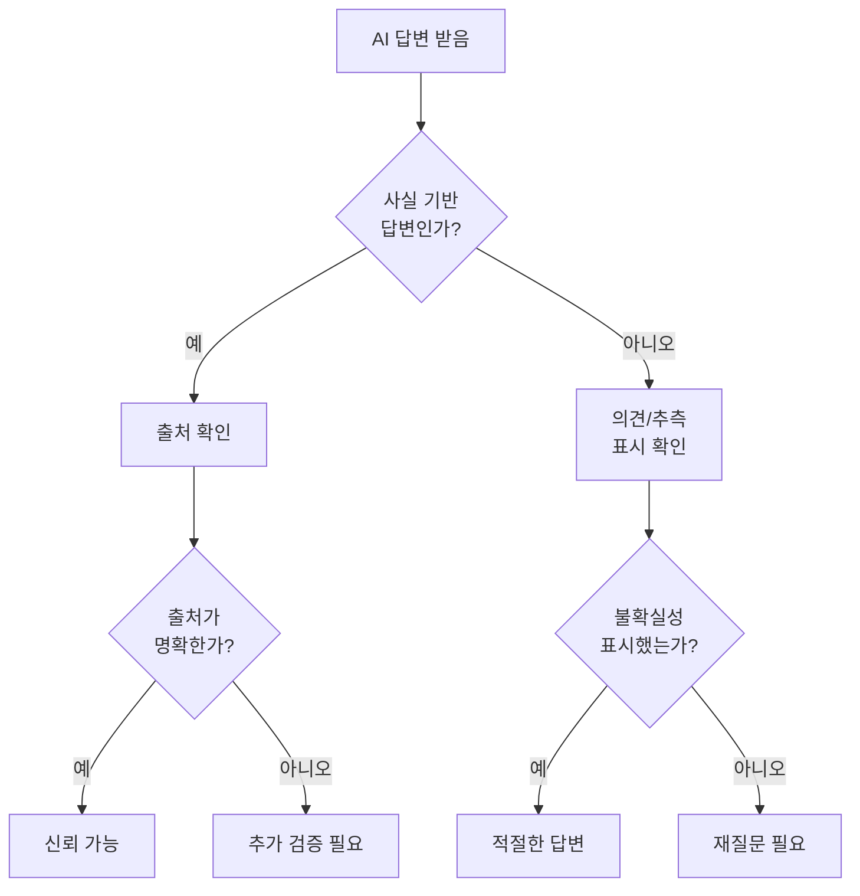
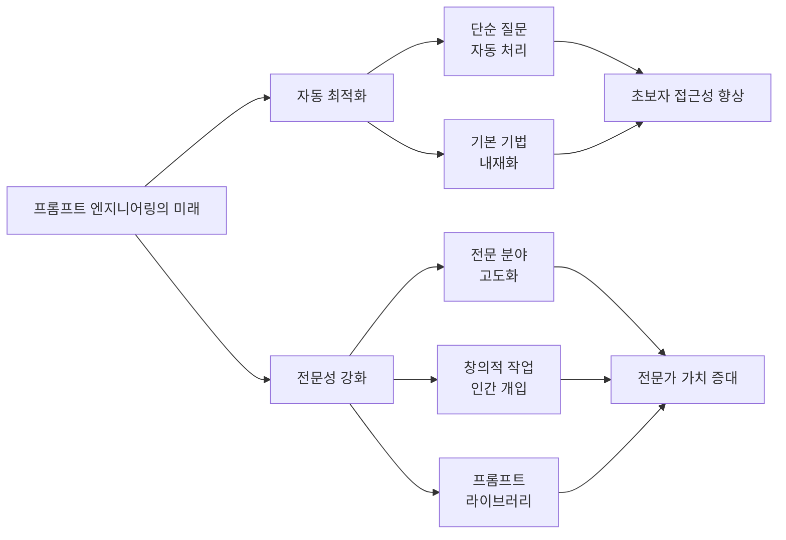
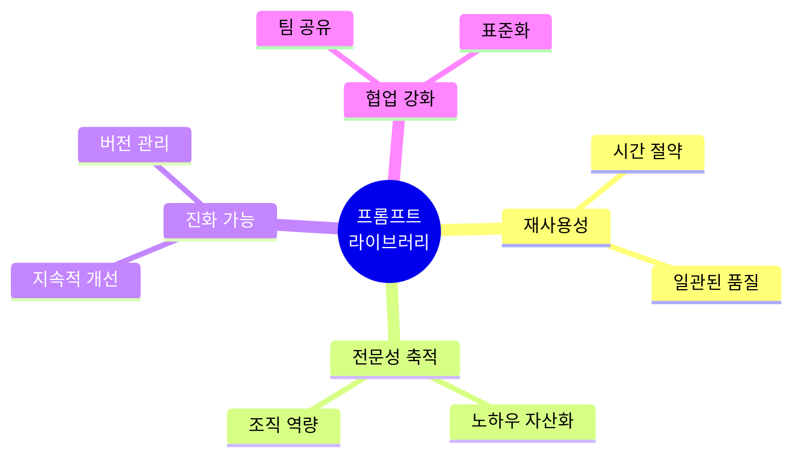

# 1. 할루시네이션 줄이기

예를 들어, 보고서에서 주요 이슈 분석 등의 사실 분석을 할 때에는 아래와 같이 할루시네이션을 줄일 수 있는 프롬프트를 작성할 수 있습니다. 포인트는 '사실'과 '거짓'을 구분할 수 있는 프롬프트를 작성하게 해주는 것이죠.

특히 검증과 같은 경우, 검증의 규칙을 설정할 수 있습니다. GPT 스스로 검증하게 하는 것이죠. 프롬프트로 모호한 것에 대한 검증 규칙 등을 설정할 수 있습니다. 배제의 규칙도 정할 수 있는데요. 이러한 '검증 초안' 조차도 GPT에게 물어볼 수 있습니다.



## 1.1 검증 구조를 포함한 프롬프트

```md
[프롬프트]
아래 형식에 맞춰서 2024년 1분기 시장 동향 보고서를 작성해줘.

제목: [보고서 제목]

작성일: YYYY-MM-DD

1. 개요
- 분석 기간:
- 분석 범위:

2. 주요 시장 지표
A) 경제 지표
  - 사실:
  - GPT의 견해:
  - 추측:
  - 검증:
B) 산업 지표
  - 사실:
  - GPT의 견해:
  - 추측:
  - 검증:

3. 주요 이슈 분석
- 이슈 1:
  - 사실:
  - GPT의 견해:
  - 추측:
  - 검증:

- 이슈 2:
  - 사실:
  - GPT의 견해:
  - 추측:
  - 검증:
- 이슈 3:
  - 사실:
  - GPT의 견해:
  - 추측:
  - 검증:

4. 전망 및 제언

* 모든 항목은 200자 이내로 작성
```

## 1.2 할루시네이션을 줄이는 추가 전략

**1. 출처 요구하기**

```md
다음 정보를 제공하되, 각 정보의 출처를 함께 명시해줘.
출처가 불확실한 경우 "출처 불명" 또는 "추정치"로 표시해줘.
```

**2. 확신도 표시 요청**

```md
각 답변에 대해 확신도를 다음과 같이 표시해줘.

- 높음 (90% 이상): 확실한 사실
- 중간 (50-90%): 일반적으로 알려진 정보
- 낮음 (50% 미만): 추측 또는 불확실
```

**3. 반대 관점 요청**

```md
이 주장에 대해

1. 지지하는 근거
2. 반대하는 근거
3. 중립적 평가

를 모두 제시해줘.
```

**4. 사실과 의견 분리**

```md
다음 형식으로 답변해줘.

[사실]
- 검증 가능한 객관적 정보만

[의견/분석]
- 해석이나 추론이 필요한 내용

[불확실]
- 확실하지 않거나 검증이 필요한 내용
```

## 1.3 할루시네이션 예방 체크리스트

```
프롬프트 작성 시 확인사항

- 사실과 추측을 구분하도록 요청했는가?
- 출처나 근거를 명시하도록 했는가?
- 불확실한 경우 명시하도록 했는가?
- 검증 가능한 형식으로 답변을 요청했는가?
- 반대 의견이나 다른 관점도 고려했는가?
```



# 2. 프롬프트 엔지니어링의 미래

프롬프트 엔지니어링은 계속해서 중요한 역할을 차지할까요? 이에 대해 두 가지 의견이 있습니다.

## 2.1 관점 1: 자동 최적화로 인한 무용론

먼저 '프롬프트 엔지니어링도 LLM이 학습해 최적화된 답변을 제공할 수 있다'라는 의견이 있습니다. 이제는 CoT(Chain of Thought)를 사용하지 않더라도, 수학적 지식 등 복잡한 문제에 대해 CoT 방식이 기본적으로 적용되어 더 나은 응답을 받을 수 있습니다.


무용론의 근거는 아래와 같습니다.

- AI 모델이 자동으로 최적의 사고 과정을 적용
- 사용자가 복잡한 기법을 알 필요 없어짐
- 단순한 질문만으로도 고품질 답변 생성

## 2.2 관점 2: 더욱 중요해지는 전문성

그렇다고 해서 'LLM의 응답이 정교해지면서 질문의 정교함이 더 중요해질 것'이라는 두 번째 의견이 틀렸다고 볼 수는 없습니다. 실제로 LLM이 발전할수록 사용자가 원하는 구체적인 결과를 얻기 위해서는 더욱 세밀하고 전문적인 프롬프트 작성 능력이 필요해질 것입니다.

전문성 강화론의 근거는 아래와 같습니다.

- 단순한 질문은 AI가 자동 최적화
- 특정 도메인의 전문적 작업은 인간의 섬세한 지시 필요
- 창의적 결과물을 위한 맥락 제공 중요
- 프롬프트 엔지니어링의 고도화 및 전문화



## 2.3 미래 전망: 양립하는 두 관점

따라서 프롬프트 엔지니어링은 사라지는 것이 아니라, **더욱 고도화되고 전문화된 형태로 진화**할 가능성이 높습니다.

**단순 작업 (자동화)**
- 일상적 질문
- 기본 정보 검색
- 간단한 문서 작성
→ AI가 자동으로 최적화

**전문 작업 (인간 개입)**
- 도메인 전문 지식
- 창의적 콘텐츠
- 복잡한 분석
- 맞춤형 솔루션
→ 프롬프트 엔지니어링 필수

## 2.4 프롬프트 라이브러리의 중요성 증대

미래에는 개인과 조직이 **검증된 프롬프트 라이브러리**를 구축하고 관리하는 것이 더욱 중요해질 것입니다.



프롬프트 라이브러리가 중요한 이유는 아래와 같습니다.

1. **재사용성**: 매번 새로 작성할 필요 없음
2. **품질 보장**: 검증된 프롬프트 사용
3. **지식 축적**: 조직의 노하우가 자산으로
4. **빠른 적응**: 신입도 즉시 활용 가능
5. **지속적 개선**: 피드백을 통한 진화

## 2.5 앞으로 필요한 역량

**1. 기본 역량 (모든 사용자)**
- AI 도구의 기본 사용법
- 명확한 질문 작성 능력
- 결과물 검증 능력

**2. 중급 역량 (업무 활용자)**
- 프롬프트 기법 이해
- 반복 작업 자동화
- 템플릿 활용 및 수정

**3. 고급 역량 (전문가)**
- 프롬프트 라이브러리 구축
- 도메인 특화 프롬프트 설계
- AI 한계 이해 및 보완
- 새로운 기법 연구 및 적용