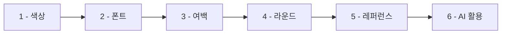

> *디자인을 전혀 모르는데 어떻게 해야 하나요?*

<highlight>Claude Code로 개발은 쉬워졌는데 막상 만들고 보니 뭔가 어색합니다.</highlight> "왜 이렇게 촌스러워 보이지?", "프로가 만든 것 같지 않네…" 이런 생각이 드시죠?

당연합니다. 기능이 완벽해도 디자인이 어설프면 사용자는 금세 알아차립니다. 첫인상은 단 3초 안에 결정되니까요. 하지만 걱정하지 마세요. 디자인을 알지 못하는 사람. 줄여서 '디알못'인 우리도 꼭 지켜야 할 몇 가지 황금률이 있습니다.

**우리의 목표는 명확합니다. 전문 디자이너처럼 화려한 디자인이 아니라 '최소한 불편하지 않은' 디자인을 만드는 것입니다.** 사용자에게 혼란을 주지 않고, 정보를 명확하게 전달하며, 사용하기 편안한 서비스. 이것만 달성하면 성공입니다.

# 1. 색상은 최소한으로, 명확하게

<highlight>색상은 서비스의 분위기를 만들지만 너무 많으면 오히려 혼란스럽게 보일 수 있어요.</highlight> '디알못'이라면 다음 5가지 역할을 기억하고 활용하는 게 좋습니다.

| 역할 | 설명 | 예시 |
| --- | --- | --- |
| **서비스 메인 색상** | 대표 색상으로 개성 표현 | 주황(활기), 파랑(신뢰), 초록(자연) |
| **메인 폰트 색상** | 주요 텍스트 색상 | 검정 또는 진한 회색 |
| **서브 폰트 색상** | 부가 설명용 색상 | 연한 회색 계열 |
| **배경 색상** | 화면 바탕색 | 하얀색, 연한 미색 |
| **서브 배경 색상** | 영역 구분용 색상 | 연한 회색 |

# 2. 폰트는 한 가지만

<highlight>폰트는 정보 전달뿐만 아니라 서비스의 전반적인 느낌을 좌우합니다.</highlight> '디알못'이라면 고민하지 말고, 가독성이 좋고 깔끔한 **Pretendard** 또는 **Noto Sans** 중 하나만 선택해서 사용하는 것을 강력 추천합니다.

폰트 종류를 정했다면 각 역할에 따라 **폰트 사이즈 시스템**을 정해두고 그 안에서만 사용하세요.

| 역할 | 설명 | 권장 크기 |
| --- | --- | --- |
| **제목** | 페이지의 주요 내용 | 24px, 20px |
| **내용** | 본문 정보 전달 | 16px, 14px |
| **설명** | 부가적인 설명 | 12px |
| **버튼** | 버튼 내부 텍스트 | 16px |

# 3. 여백의 미

여백은 단순히 비어있는 공간이 아닙니다. 정보를 숨 쉬게 하고, 사용자의 시선을 원하는 곳으로 유도하는 중요한 디자인 요소입니다.

- **페이지 상하좌우 여백 기본 설정**: 스마트폰 화면이든 웹 화면이든, 콘텐츠가 화면 끝에 붙어있으면 답답하고 불안정해 보입니다. 모든 페이지의 가장자리에 일정한 여백(패딩)을 두어 안정감을 주세요. (예: 좌우 16px 또는 20px)
- **요소별 여백**: 제목과 본문 사이, 이미지와 텍스트 사이, 버튼과 버튼 사이 등 각 요소 사이에 충분한 간격(마진)을 두어야 정보가 뭉쳐 보이지 않고 명확하게 구분됩니다.

# 4. 모서리 라운드로 부드러움을 더한다

아주 사소해 보이지만, **모서리에 약간의 둥근 라운드**만 주어도 디자인이 훨씬 부드럽고 현대적으로 변합니다.

- **적용 대상**: 버튼, 카드 형태의 정보 박스, 입력창, 이미지 등 각진 요소에 적용해 보세요.
- **정도**: 너무 과하게 둥글게 하지 말고, 아주 살짝만 라운드를 주는 것이 자연스럽습니다. (예: `border-radius: 4px` 또는 `8px` 정도)

# 5. 레퍼런스를 많이 살펴본다

"어떻게 좋은 디자인을 구분하나요?"라는 질문의 답은 바로 우리 주변에 있습니다. 여러분이 매일 사용하는 웹사이트나 앱이 바로 최고의 교과서입니다.

여러분이 만들고자 하는 서비스와 비슷한 다른 서비스들은 어떤 디자인을 가지고 있는지 유심히 살펴보세요.

- "이 버튼은 왜 여기에 있지?"
- "이 정보는 왜 이렇게 배치했을까?"
- "이 색상은 어떤 느낌을 주지?"
- "나는 어떤 부분이 편리했고, 어떤 부분이 불편했지?"

이런 질문을 하면서 보다 보면 저절로 눈이 생깁니다.

# 6. AI의 도움을 받는다

ChatGPT, Claude, Gemini, Grok 등 다양한 LLM 모델에게 여러분의 서비스 기획과 의도를 자세히 설명하고 UI/UX 추천을 받아보세요. "음식 배달 앱을 만드는데 어떤 색상 조합이 좋을까?"라고 물어보면 구체적이고 실용적인 답변을 해줍니다.

---

:::div{.callout}
**핵심 요약** 
이 6가지 원칙만 지켜도 '디알못'에서 벗어날 수 있습니다. 완벽하지 않아도 괜찮아요. 최소한 사용자가 불편해하지 않을 정도면 충분합니다. 나머지는 Claude Code와 함께 점점 발전시켜 나가면 됩니다.
:::