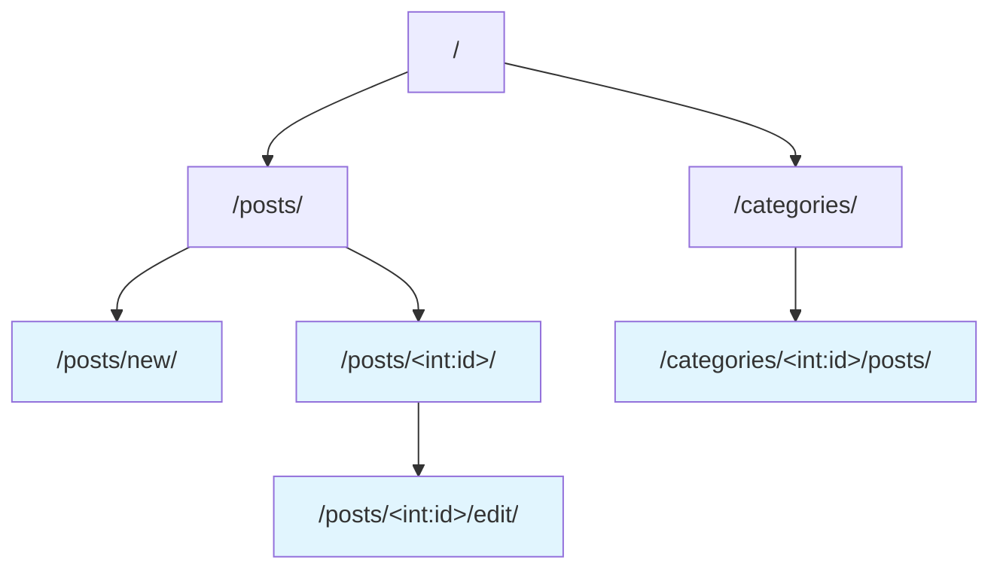
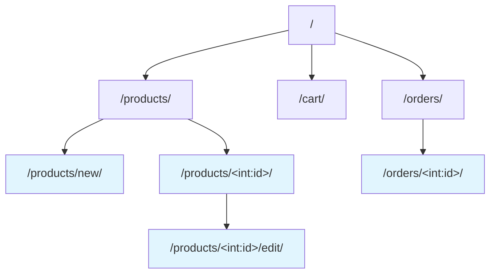

URL 설계는 백엔드 개발의 첫 번째 단계입니다. 사용자가 어떤 주소로 접속하면 어떤 기능이 실행되는지를 정의하는 것이죠. 잘 설계된 URL은 직관적이고, 확장하기 쉬우며, AI도 이해하기 쉽습니다. 바이브 코딩에서 URL 설계는 첫 단계이자 매우 중요한 핵심입니다. 이 단계에서 올바른 방향으로 설계해야 이후 개발에서 이것을 기반으로 DB 설계, 구현 등을 요청할 수 있습니다. 이번 챕터에서는 URL 설계의 기본 개념과 RESTful 설계 원칙, 그리고 AI를 활용한 URL 설계 방법을 다룹니다.

# 1. URL이란

URL(Uniform Resource Locator)은 웹에서 특정 자원의 위치를 나타내는 주소입니다. 쉽게 말해 "이 주소로 오면 이것을 보여줄게"라는 약속입니다.

```
https://example.com/blog/posts/1
```

위 URL을 분해하면 다음과 같습니다.

- `https://`: 통신 방식 (프로토콜)
- `example.com`: 서버 주소 (도메인)
- `/blog/posts/1`: 서버 내 자원의 경로 (우리가 설계할 부분)

백엔드 개발에서 URL 설계란 바로 이 '경로' 부분을 어떻게 구성할지 정하는 것입니다.

# 2. RESTful URL 설계 원칙

REST(Representational State Transfer)는 웹 API를 설계하는 대표적인 방법론입니다. 복잡한 이론은 생략하고, 실무에서 꼭 알아야 할 핵심 원칙만 설명하겠습니다. 이 원칙을 몰라도 괜찮아요. AI에게 RESTful하게 설계해달라고 요청하면 되니까요. 다만 어떤 원칙들이 있는지는 알아두면 좋습니다.

## 2.1 명사를 사용하세요

URL에는 동사가 아닌 명사를 사용합니다. 행동(동사)은 HTTP 메서드로 표현합니다.

```
# 좋은 예
GET /posts          # 게시글 목록 조회
GET /posts/1        # 1번 게시글 조회
POST /posts         # 게시글 생성
PUT /posts/1        # 1번 게시글 수정
DELETE /posts/1     # 1번 게시글 삭제

# 나쁜 예
GET /getPosts
POST /createPost
POST /deletePost/1
```

여기서 GET, POST, PUT, DELETE는 HTTP 메서드입니다. 각각 '조회', '생성', '수정', '삭제'를 의미합니다. 다만 꼭 GET이 '조회'만 뜻하는 것은 아닙니다. 상황에 따라 '생성'도 할 수 있어요. 더 세부적인 내용은 이 책에서 다루지 않습니다. 수업에서는 간단하게 이해하고 넘어가셔도 됩니다.

## 2.2 복수형을 사용하세요

자원의 이름은 복수형으로 작성합니다. `/post`보다 `/posts`가 일관성 있고 직관적입니다.

```
/users              # 사용자들
/products           # 상품들
/orders             # 주문들
/comments           # 댓글들
```

## 2.3 계층 구조를 표현하세요

자원 간의 관계는 URL 경로로 표현합니다.

```
/users/1/posts          # 1번 사용자의 게시글들
/posts/1/comments       # 1번 게시글의 댓글들
/shops/1/products       # 1번 상점의 상품들
```

## 2.4 소문자와 하이픈을 사용하세요

URL은 소문자로 작성하고, 단어 사이는 하이픈(-)으로 연결합니다.

```
# 좋은 예
/user-profiles
/product-categories

# 나쁜 예
/userProfiles
/User_Profiles
```

# 3. AI 네이티브 URL 설계

AI를 활용하면 URL 설계를 빠르게 시작할 수 있습니다. 아래 프롬프트를 참고하세요. 여기서 Restful URL 설계 원칙을 반영해달라고 요청하지 않았는데요. AI가 이미 그 원칙들을 준수하여 URL을 설계하기 때문입니다. 특히 여기서 GET, POST 같은 HTTP 메서드도 함께 알려달라고 요청하지 않았는데요. 그 이유는 추후에 AI가 RESTful 설계 원칙에 따라 자연스럽게 HTTP 메서드도 함께 제안하기 때문입니다. 그러한 메서드가 오히려 SW를 배우지 않은 사람에게는 혼란을 줄 수 있기 때문에, 처음에는 URL 설계에만 집중하는 것이 좋습니다.

## 3.1 기본 프롬프트

```
나는 [서비스 종류]를 만들려고 해.
주요 기능은 다음과 같아:
- [기능 1]
- [기능 2]
- [기능 3]

Django 기반으로 URL을 설계해줘. 
이번 단계에서는 화면 단위의 URL만 설계해줘.
```

## 3.2 블로그 서비스 예시

```
나는 개인 블로그를 만들려고 해.
주요 기능은 다음과 같아:
- 게시글 작성, 수정, 삭제
- 게시글 목록 보기
- 게시글 상세 보기
- 카테고리별 게시글 필터링
- 댓글 작성, 삭제

Django 기반으로 URL을 설계해줘.
이번 단계에서는 화면 단위의 URL만 설계해줘.
```

AI는 다음과 같은 설계를 제안할 것입니다.

| URL | 기능 |
| --- | --- |
| `/posts/` | 게시글 목록 화면 |
| `/posts/<int:id>/` | 게시글 상세 화면 |
| `/posts/new/` | 게시글 작성 화면 |
| `/posts/<int:id>/edit/` | 게시글 수정 화면 |
| `/categories/` | 카테고리 목록 화면 |
| `/categories/<int:id>/posts/` | 특정 카테고리의 게시글 목록 화면 |

## 3.3 쇼핑몰 서비스 예시

```
나는 간단한 쇼핑몰을 만들려고 해.
주요 기능은 다음과 같아:
- 상품 등록, 수정, 삭제 (관리자)
- 상품 목록 보기
- 상품 상세 보기
- 장바구니 담기, 빼기
- 주문하기
- 주문 내역 보기

Django 기반으로 URL을 설계해줘.
이번 단계에서는 화면 단위의 URL만 설계해줘.
```

# 4. URL 설계 시각화

URL 설계는 시각적으로 정리하면 전체 구조를 한눈에 파악할 수 있습니다. Mermaid 다이어그램을 활용하면 좋습니다. 나중에 README.md나 문서에 포함시켜주세요. AI를 위한 것이 아닙니다. 여러분을 위한 것입니다.

## 4.1 블로그 URL 구조



## 4.2 쇼핑몰 URL 구조



# 5. Django URL 패턴 이해하기

URL을 설계할 때 `<int:id>`나 `<slug:slug>` 같은 표현을 사용합니다. 이것은 Django의 URL 패턴 문법으로, "이 자리에 특정 타입의 값이 들어온다"는 의미입니다. AI에게 URL 설계를 요청하면 이런 패턴들을 사용하므로, 각 패턴이 무엇을 의미하는지 알아두면 좋습니다. 첫번째가 타입이며, 두번째가 이름입니다.

## 5.1 자주 사용하는 URL 패턴

| 패턴 | 설명 | URL 예시 |
| --- | --- | --- |
| `<int:id>` | 정수(숫자)를 받습니다 | `/posts/1/`, `/posts/42/` |
| `<int:pk>` | 정수를 받습니다 (pk는 primary key의 약자) | `/users/1/`, `/products/100/` |
| `<slug:slug>` | 영문, 숫자, 하이픈으로 된 문자열을 받습니다 | `/posts/my-first-post/` |
| `<str:username>` | 일반 문자열을 받습니다 | `/users/hong/`, `/users/kim/` |

## 5.2 패턴 읽는 방법

패턴은 `<타입:이름>` 형식입니다.

- **타입**: 어떤 종류의 값을 받을지 (int, slug, str 등)
- **이름**: 그 값을 부르는 이름 (id, pk, slug 등)

```
/posts/<int:id>/edit/
```

위 URL은 "posts 다음에 **숫자**가 오고, 그 숫자를 **id**라고 부르겠다. 그 뒤에 edit이 온다"라는 의미입니다. 실제로는 `/posts/1/edit/`, `/posts/99/edit/` 같은 주소와 매칭됩니다.

## 5.3 실제 예시로 이해하기

```
/posts/                     → 게시글 목록 (고정된 경로)
/posts/<int:id>/            → 특정 게시글 (숫자에 따라 다른 게시글)
/posts/new/                 → 게시글 작성 (고정된 경로)
/posts/<int:id>/edit/       → 특정 게시글 수정 (숫자에 따라 다른 게시글)
/categories/<int:id>/posts/ → 특정 카테고리의 게시글들
```

`new`나 `edit`처럼 고정된 단어는 그대로 쓰고, 변하는 값(게시글 번호, 카테고리 번호 등)은 `<int:id>` 같은 패턴으로 표현합니다.
