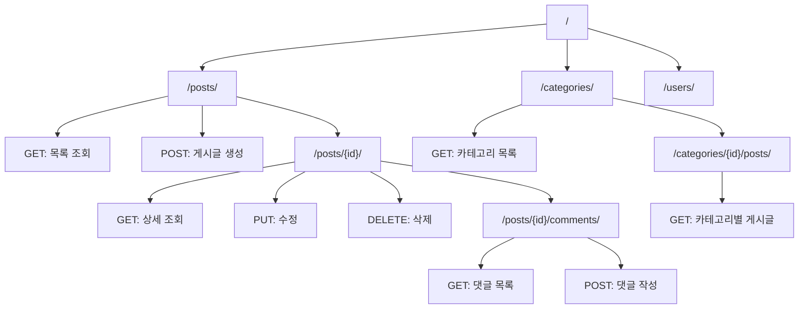
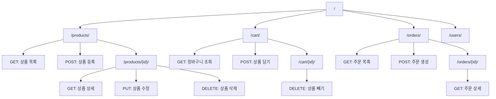

URL 설계는 백엔드 개발의 첫 번째 단계입니다. 사용자가 어떤 주소로 접속하면 어떤 기능이 실행되는지를 정의하는 것이죠. 잘 설계된 URL은 직관적이고, 확장하기 쉬우며, AI도 이해하기 쉽습니다.

# 1. URL이란

URL(Uniform Resource Locator)은 웹에서 특정 자원의 위치를 나타내는 주소입니다. 쉽게 말해 "이 주소로 오면 이것을 보여줄게"라는 약속입니다.

```
https://example.com/blog/posts/1
```

위 URL을 분해하면 다음과 같습니다.

- `https://`: 통신 방식 (프로토콜)
- `example.com`: 서버 주소 (도메인)
- `/blog/posts/1`: 서버 내 자원의 경로 (우리가 설계할 부분)

백엔드 개발에서 URL 설계란 바로 이 '경로' 부분을 어떻게 구성할지 정하는 것입니다.

# 2. RESTful URL 설계 원칙

REST(Representational State Transfer)는 웹 API를 설계하는 대표적인 방법론입니다. 복잡한 이론은 생략하고, 실무에서 꼭 알아야 할 핵심 원칙만 설명하겠습니다. 이 원칙을 몰라도 괜찮아요. AI에게 RESTful하게 설계해달라고 요청하면 되니까요. 다만 어떤 원칙들이 있는지는 알아두면 좋습니다.

## 2.1 명사를 사용하세요

URL에는 동사가 아닌 명사를 사용합니다. 행동(동사)은 HTTP 메서드로 표현합니다.

```
# 좋은 예
GET /posts          # 게시글 목록 조회
GET /posts/1        # 1번 게시글 조회
POST /posts         # 게시글 생성
PUT /posts/1        # 1번 게시글 수정
DELETE /posts/1     # 1번 게시글 삭제

# 나쁜 예
GET /getPosts
POST /createPost
POST /deletePost/1
```

여기서 GET, POST, PUT, DELETE는 HTTP 메서드입니다. 각각 '조회', '생성', '수정', '삭제'를 의미합니다. 다만 꼭 GET이 '조회'만 뜻하는 것은 아닙니다. 상황에 따라 '생성'도 할 수 있어요. 더 세부적인 내용은 이 책에서 다루지 않습니다. 수업에서는 간단하게 이해하고 넘어가셔도 됩니다.

## 2.2 복수형을 사용하세요

자원의 이름은 복수형으로 작성합니다. `/post`보다 `/posts`가 일관성 있고 직관적입니다.

```
/users              # 사용자들
/products           # 상품들
/orders             # 주문들
/comments           # 댓글들
```

## 2.3 계층 구조를 표현하세요

자원 간의 관계는 URL 경로로 표현합니다.

```
/users/1/posts          # 1번 사용자의 게시글들
/posts/1/comments       # 1번 게시글의 댓글들
/shops/1/products       # 1번 상점의 상품들
```

## 2.4 소문자와 하이픈을 사용하세요

URL은 소문자로 작성하고, 단어 사이는 하이픈(-)으로 연결합니다.

```
# 좋은 예
/user-profiles
/product-categories

# 나쁜 예
/userProfiles
/User_Profiles
```

# 3. AI 네이티브 URL 설계

AI를 활용하면 URL 설계를 빠르게 시작할 수 있습니다. 아래 프롬프트를 참고하세요. 여기서 Restful URL 설계 원칙을 반영해달라고 요청하지 않았는데요. AI가 이미 그 원칙들을 준수하여 URL을 설계하기 때문입니다.

## 3.1 기본 프롬프트

```
나는 [서비스 종류]를 만들려고 해.
주요 기능은 다음과 같아:
- [기능 1]
- [기능 2]
- [기능 3]

Django 기반으로 URL을 설계해줘.
각 URL에 대해 HTTP 메서드와 기능 설명도 함께 알려줘.
```

## 3.2 블로그 서비스 예시

```
나는 개인 블로그를 만들려고 해.
주요 기능은 다음과 같아:
- 게시글 작성, 수정, 삭제
- 게시글 목록 보기
- 게시글 상세 보기
- 카테고리별 게시글 필터링
- 댓글 작성, 삭제

Django 기반으로 URL을 설계해줘.
각 URL에 대해 HTTP 메서드와 기능 설명도 함께 알려줘.
```

AI는 다음과 같은 설계를 제안할 것입니다.

| URL | HTTP 메서드 | 기능 |
| --- | --- | --- |
| `/posts/` | GET | 게시글 목록 조회 |
| `/posts/` | POST | 게시글 생성 |
| `/posts/<id>/` | GET | 게시글 상세 조회 |
| `/posts/<id>/` | PUT | 게시글 수정 |
| `/posts/<id>/` | DELETE | 게시글 삭제 |
| `/categories/` | GET | 카테고리 목록 조회 |
| `/categories/<id>/posts/` | GET | 특정 카테고리의 게시글 목록 |
| `/posts/<id>/comments/` | GET | 댓글 목록 조회 |
| `/posts/<id>/comments/` | POST | 댓글 작성 |
| `/comments/<id>/` | DELETE | 댓글 삭제 |

## 3.3 쇼핑몰 서비스 예시

```
나는 간단한 쇼핑몰을 만들려고 해.
주요 기능은 다음과 같아:
- 상품 등록, 수정, 삭제 (관리자)
- 상품 목록 보기
- 상품 상세 보기
- 장바구니 담기, 빼기
- 주문하기
- 주문 내역 보기

Django 기반으로 RESTful URL을 설계해줘.
각 URL에 대해 HTTP 메서드와 기능 설명도 함께 알려줘.
```

# 4. URL 설계 시각화

URL 설계는 시각적으로 정리하면 전체 구조를 한눈에 파악할 수 있습니다. Mermaid 다이어그램을 활용하면 좋습니다. 나중에 README.md나 문서에 포함시켜주세요. AI를 위한 것이 아닙니다. 여러분을 위한 것입니다.

## 4.1 블로그 URL 구조



## 4.2 쇼핑몰 URL 구조



# 5. Django에서의 URL 설정

설계한 URL을 Django에서 어떻게 구현하는지 간단히 살펴보겠습니다. 자세한 구현은 AI가 구현합니다. 여러분은 어떤 URL이 어떻게 연결되는지 이해하시면 됩니다.

## 5.1 기본 구조

Django에서는 `urls.py` 파일에서 URL을 정의합니다.

```python
# config/urls.py
from django.urls import path, include

urlpatterns = [
    path('admin/', admin.site.urls),
    path('posts/', include('posts.urls')),
    path('users/', include('users.urls')),
]
```

```python
# posts/urls.py
from django.urls import path
from . import views

urlpatterns = [
    path('', views.post_list),              # /posts/
    path('<int:pk>/', views.post_detail),   # /posts/1/
]
```

## 5.2 URL 패턴의 의미

- `''`: 빈 문자열은 해당 앱의 루트 경로를 의미합니다.
- `<int:pk>/`: 정수형 변수를 받습니다. `/posts/1/`, `/posts/2/` 등과 매칭됩니다.
- `<slug:slug>/`: 슬러그 형태의 문자열을 받습니다. `/posts/my-first-post/` 등과 매칭됩니다.
