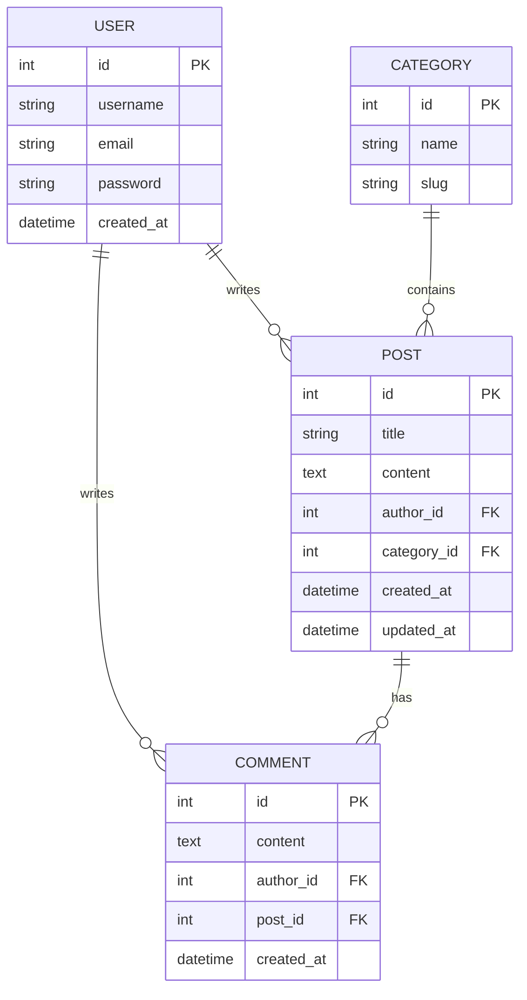
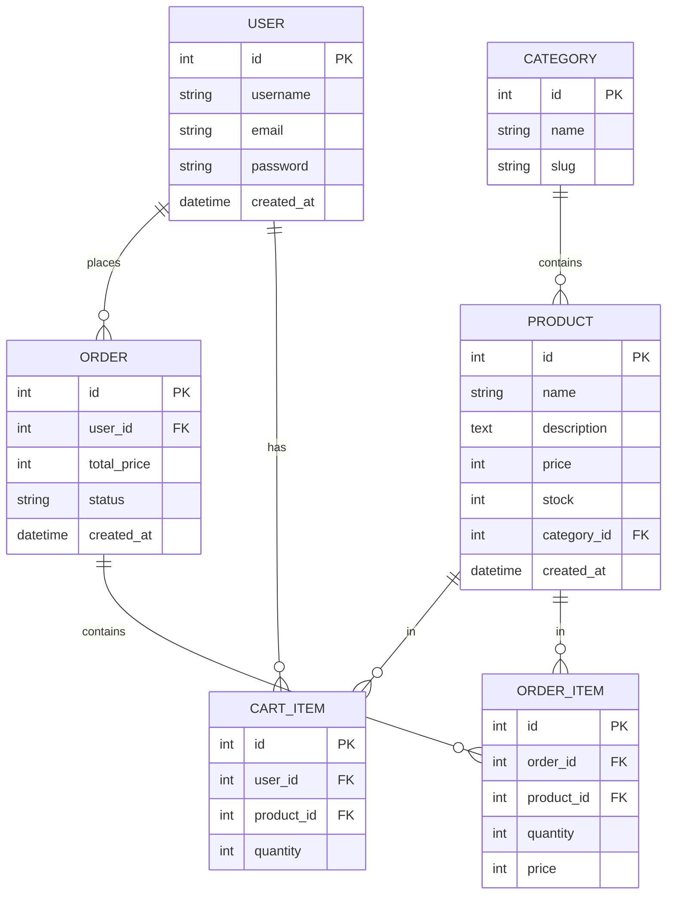

데이터베이스(DB) 설계는 서비스의 데이터를 어떻게 저장하고 관리할지 정하는 과정입니다. 잘 설계된 데이터베이스는 데이터의 무결성을 보장하고, 검색 속도를 높이며, 확장하기 쉽습니다.

# 1. 데이터베이스란

데이터베이스는 데이터를 체계적으로 저장하는 공간입니다. 엑셀 시트를 떠올리면 이해하기 쉽습니다.

| id | 제목 | 내용 | 작성자 | 작성일 |
| --- | --- | --- | --- | --- |
| 1 | 첫 번째 글 | 안녕하세요 | 홍길동 | 2025-01-01 |
| 2 | 두 번째 글 | 반갑습니다 | 김철수 | 2025-01-02 |

위와 같은 표 하나를 **테이블(Table)** 이라고 합니다. 데이터베이스는 이런 테이블들의 모음입니다.

- **테이블(Table)**: 데이터를 저장하는 표
- **행(Row)**: 하나의 데이터 레코드 (예: 하나의 게시글)
- **열(Column)**: 데이터의 속성 (예: 제목, 내용, 작성자)
- **기본키(Primary Key)**: 각 행을 고유하게 식별하는 값 (예: id)

# 2. 테이블 간의 관계

실제 서비스에서는 여러 테이블이 서로 연결되어 있습니다. 이 연결 관계를 이해하는 것이 DB 설계의 핵심입니다.

## 2.1 일대다 관계 (1:N)

가장 흔한 관계입니다. 하나의 레코드가 여러 개의 레코드와 연결됩니다.

```
사용자(1) ─────< 게시글(N)
하나의 사용자가 여러 개의 게시글을 작성할 수 있음

게시글(1) ─────< 댓글(N)
하나의 게시글에 여러 개의 댓글이 달릴 수 있음

카테고리(1) ─────< 상품(N)
하나의 카테고리에 여러 개의 상품이 속할 수 있음
```

## 2.2 다대다 관계 (N:M)

양쪽 모두 여러 개와 연결될 수 있는 관계입니다. 중간 테이블이 필요합니다.

```
학생(N) ─────<>───── 강좌(M)
한 학생이 여러 강좌를 수강하고, 한 강좌에 여러 학생이 등록

게시글(N) ─────<>───── 태그(M)
한 게시글에 여러 태그, 한 태그가 여러 게시글에 사용
```

## 2.3 일대일 관계 (1:1)

하나의 레코드가 정확히 하나의 레코드와 연결됩니다.

```
사용자(1) ─────── 프로필(1)
한 사용자는 하나의 프로필만 가짐
```

# 3. AI 네이티브 DB 설계

AI를 활용하면 복잡한 DB 설계도 빠르게 시작할 수 있습니다.

## 3.1 기본 프롬프트

```
나는 [서비스 종류]를 만들려고 해.
주요 기능은 다음과 같아:
- [기능 1]
- [기능 2]
- [기능 3]

Django 모델로 데이터베이스를 설계해줘.
각 모델의 필드와 관계를 설명해주고,
ERD(Entity Relationship Diagram)도 Mermaid로 그려줘.
```

## 3.2 블로그 서비스 예시

```
나는 개인 블로그를 만들려고 해.
주요 기능은 다음과 같아:
- 사용자 회원가입, 로그인
- 게시글 작성, 수정, 삭제
- 카테고리별 게시글 분류
- 댓글 작성, 삭제

Django 모델로 데이터베이스를 설계해줘.
각 모델의 필드와 관계를 설명해주고,
ERD도 Mermaid로 그려줘.
```

AI는 다음과 같은 설계를 제안할 것입니다.

### User (사용자)
Django의 기본 User 모델을 사용하거나 확장합니다.

| 필드 | 타입 | 설명 |
| --- | --- | --- |
| id | Integer | 기본키, 자동 증가 |
| username | CharField | 사용자 아이디 |
| email | EmailField | 이메일 주소 |
| password | CharField | 비밀번호 (암호화) |
| created_at | DateTimeField | 가입일 |

### Category (카테고리)

| 필드 | 타입 | 설명 |
| --- | --- | --- |
| id | Integer | 기본키, 자동 증가 |
| name | CharField | 카테고리 이름 |
| slug | SlugField | URL용 식별자 |

### Post (게시글)

| 필드 | 타입 | 설명 |
| --- | --- | --- |
| id | Integer | 기본키, 자동 증가 |
| title | CharField | 제목 |
| content | TextField | 내용 |
| author | ForeignKey(User) | 작성자 (1:N) |
| category | ForeignKey(Category) | 카테고리 (1:N) |
| created_at | DateTimeField | 작성일 |
| updated_at | DateTimeField | 수정일 |

### Comment (댓글)

| 필드 | 타입 | 설명 |
| --- | --- | --- |
| id | Integer | 기본키, 자동 증가 |
| content | TextField | 댓글 내용 |
| author | ForeignKey(User) | 작성자 (1:N) |
| post | ForeignKey(Post) | 게시글 (1:N) |
| created_at | DateTimeField | 작성일 |

## 3.3 쇼핑몰 서비스 예시

```
나는 간단한 쇼핑몰을 만들려고 해.
주요 기능은 다음과 같아:
- 사용자 회원가입, 로그인
- 상품 등록, 수정, 삭제
- 카테고리별 상품 분류
- 장바구니 기능
- 주문 및 주문 내역

Django 모델로 데이터베이스를 설계해줘.
각 모델의 필드와 관계를 설명해주고,
ERD도 Mermaid로 그려줘.
```

# 4. DB 설계 시각화 (ERD)

ERD(Entity Relationship Diagram)는 테이블 간의 관계를 시각적으로 표현합니다. Mermaid를 사용하면 쉽게 그릴 수 있습니다.

## 4.1 블로그 ERD



## 4.2 쇼핑몰 ERD



# 5. Django 모델로 구현하기

설계한 DB를 Django 모델로 구현하는 방법을 살펴보겠습니다. 역시나 AI가 코드를 거의 오류 없이 작성하기 때문에, 여러분은 모델이 어떤 파일에서 어떻게 구성되는지 이해하는 데 집중하세요.

## 5.1 블로그 모델 예시

```python
# models.py
from django.db import models
from django.contrib.auth.models import User

class Category(models.Model):
    name = models.CharField(max_length=100)
    slug = models.SlugField(unique=True)

    def __str__(self):
        return self.name

class Post(models.Model):
    title = models.CharField(max_length=200)
    content = models.TextField()
    author = models.ForeignKey(User, on_delete=models.CASCADE)
    category = models.ForeignKey(Category, on_delete=models.SET_NULL, null=True)
    created_at = models.DateTimeField(auto_now_add=True)
    updated_at = models.DateTimeField(auto_now=True)

    def __str__(self):
        return self.title

class Comment(models.Model):
    content = models.TextField()
    author = models.ForeignKey(User, on_delete=models.CASCADE)
    post = models.ForeignKey(Post, on_delete=models.CASCADE, related_name='comments')
    created_at = models.DateTimeField(auto_now_add=True)

    def __str__(self):
        return f'{self.author}의 댓글'
```

## 5.2 주요 필드 타입

| 필드 타입 | 설명 | 예시 |
| --- | --- | --- |
| `CharField` | 짧은 문자열 | 제목, 이름 |
| `TextField` | 긴 문자열 | 본문, 설명 |
| `IntegerField` | 정수 | 가격, 수량 |
| `DecimalField` | 소수점 숫자 | 정확한 가격 |
| `BooleanField` | 참/거짓 | 공개 여부 |
| `DateTimeField` | 날짜와 시간 | 작성일, 수정일 |
| `EmailField` | 이메일 | 사용자 이메일 |
| `ImageField` | 이미지 파일 | 프로필 사진, 상품 이미지 |
| `ForeignKey` | 일대다 관계 | 게시글의 작성자 |
| `ManyToManyField` | 다대다 관계 | 게시글의 태그들 |

## 5.3 관계 설정 옵션

```python
# 일대다 관계 (ForeignKey)
author = models.ForeignKey(
    User,
    on_delete=models.CASCADE,  # 사용자 삭제 시 게시글도 삭제
    related_name='posts'        # 역참조 이름: user.posts.all()
)

# on_delete 옵션
# CASCADE: 함께 삭제
# SET_NULL: NULL로 설정 (null=True 필요)
# SET_DEFAULT: 기본값으로 설정 (default 필요)
# PROTECT: 삭제 방지 (에러 발생)
```

# 6. 설계 팁

아래 3개를 고려하여 AI가 데이터베이스를 작성하도록 합니다. 또한 작성된 데이터에서 어떤 데이터가 더 추가되면 좋을지 고민하고 추가한 다음 다시 검토를 받는 것이 좋습니다.

## 6.1 작게 시작하세요

처음부터 완벽한 설계를 하려고 하지 마세요. 핵심 기능에 필요한 테이블만 먼저 만들고, 기능을 추가하면서 테이블도 확장하세요.

## 6.2 정규화를 고려하세요

같은 데이터가 여러 곳에 중복되지 않도록 하세요. 예를 들어 카테고리 이름을 게시글마다 저장하는 대신, 카테고리 테이블을 별도로 만들고 관계로 연결하세요.

## 6.3 확장성을 고려하세요

나중에 기능이 추가될 것을 대비해 유연한 구조를 만드세요. 예를 들어 태그 기능을 추가하려면 다대다 관계가 필요합니다.
