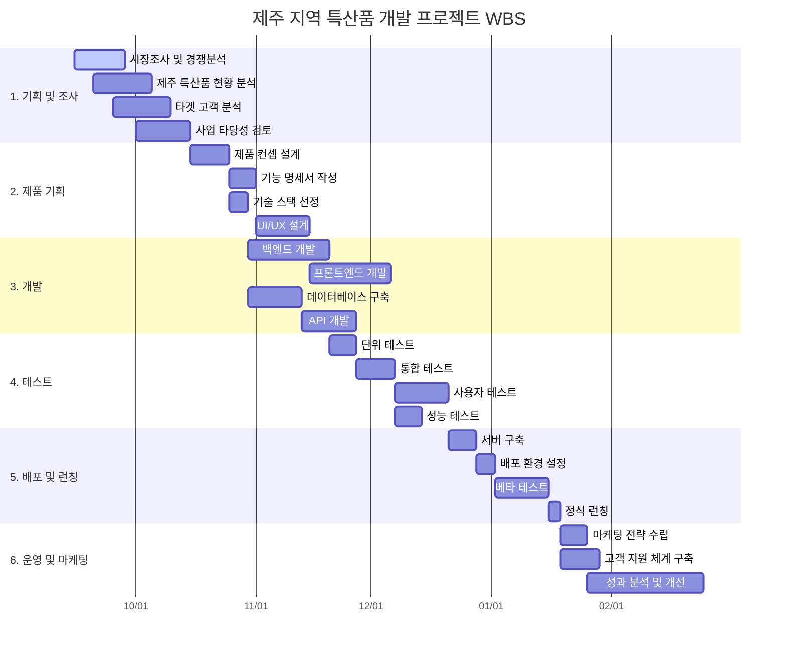

# 10.1 함께사용하면 좋을 SW

# 1. VSCode 익스텐션

VSCode에서 좀 더 Claude를 쉽게 쓸 수 있는 프로그램입니다.

10.1-1

이 확장 프로그램을 사용하면 오른쪽 상단에 툴팁으로 Clade Code가 나타납니다.

실행은 터미널과 같습니다. 다만 터미널 창에서 열리지 않고 오른쪽 창에서 열린다는 것이 다릅니다.

25년 9월 30일 업데이트 이후에 해당 익스텐션 사용성이 많이 개선되었습니다. 이제 아래와 같은 UI로 명령을 내릴 수 있습니다. 위 사진에 있는 이전 버전과 비교해보시면 좋을 것 같습니다.

# 2. YOYO

프롬프트 질문하고 마음에 들지 않아 이전버전으로 되돌아가고 싶을 때 쓰기 좋습니다. VSCode에서 익스텐션으로 설치 가능합니다. VSCode말고도 Cursor등 다양한 에디터를 지원합니다.

10.1-2

[YOYO – AI Version Control for Vibe Coding](https://www.runyoyo.com/)

10.1-3

다만 9월 30일 이후 Claude에도 이전 버전으로 되돌아갈 수 있는 `/rewind`명령어가 생겼기 때문에 이러한 부가 SW의 경쟁력은 날이 갈수록 없어질 것이라 생각합니다. 좋은 SW가 나오면 Claude에서 해당 기능을 흡수하고 있는 상황입니다.

# 3. Mermaid

머메이드는 표, 차트, 다이어그램 등을 빠르게 그릴 수 있게 해주는 자바스크립트 기반의 도구입니다. 특히나 바이브 코딩을 할 때 시각화된 자료가 필요할 때 코드와 함께 작성하게 하는 것이 좋습니다. 깃헙이나 노션, VSCode 등 다양한 곳에서 활용할 수 있습니다.

더 어려운 도형이나 흐름을 그리는 것도 가능합니다. 라이브 머메이드에서 시각화해볼 수 있습니다.

[Online FlowChart & Diagrams Editor - Mermaid Live Editor](https://mermaid.live/)

# 4. CodeViz

텍스트 기반으로 프로젝트의 함수, 의존성 등을 시각적으로 만들어주는 도구입니다. 바이브 코딩으로 프로젝트를 하게 되면 길을 잃어버리기 일수이며, 어떤 함수가 어떻게 구현되었는지 확인하기 어려운데 이 도구를 이용하면 한 번에 시각화 할 수 있어 좋습니다.

