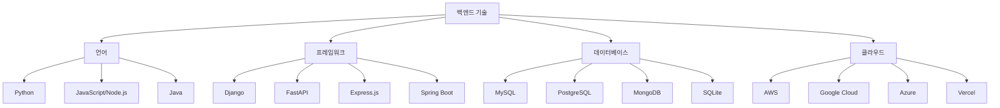

# 9.1 백엔드 언어와 생태계

# 1. 백엔드 언어와 생태계

백엔드는 웹사이트의 '뒷단'을 담당하는 부분입니다. 사용자가 보는 화면이 프론트엔드라면, 데이터를 저장하고 처리하는 서버 쪽이 백엔드입니다. 바이브 코딩을 하다 보면 단순한 정적 웹사이트를 넘어서 로그인, 게시판, 쇼핑몰 같은 동적인 기능이 필요한 순간이 옵니다. 이때 백엔드가 필요합니다.

다만 만약 비개발자 분이라면, 이 기능이 반드시 필요한 것인지, 다른 대체제가 없는지 꼭 확인해보세요. 왜냐하면 백엔드는 생각보다 고려해야 할 것이 많기 때문입니다. 예를 들어, 채팅 서비스를 만든다고 하면 민감한 데이터가 들어가야 하기 때문에 데이터를 암호화 해야 합니다. 거래 서비스를 만든다고 하면 단지 서비스를 만들면 되는 것이 아니라 마약과 같은 불법 거래가 이뤄지지 않게 단속을 해야 합니다. 단지 게시판 하나를 만들더라도, 성인 광고가 올라오지 않도록 관리 또는 모니터링을 해야 합니다.

대체제가 없는 것이 아닙니다. google form만 연결해도 상품 주문 등을 받을 수 있습니다. Zapier 같은 자동화 도구를 사용하면 문자 메시지로도 받을 수 있습니다. disqus와 같은 서비스를 사용하면 댓글이나 공유를 할 수 있게 할 수 있습니다. 이러한 서비스를 통해서도 구현할 수 있는 서비스가 아닐 때 백엔드를 구현하는 것을 권합니다.

아래와 같은 백엔드 없이 개발할 수 있는 노코드 서비스를 이용하는 것도 좋습니다.

[아임웹](https://imweb.me/)

백엔드 기술을 선택할 때는 언어, 프레임워크, 데이터베이스, 클라우드를 함께 고려해야 합니다. 초급자에게는 이 모든 선택이 부담스러울 수 있지만, 바이브 코딩을 한다면 Python과 Django 조합을 강력히 권합니다. 그 이유를 지금부터 설명드리겠습니다.

9.1-1

# 2. 권하는 언어와 프레임워크

개발 언어는 Python, 프레임워크는 Django를 권합니다.

비전공자나 초급자가 백엔드를 시작할 때 가장 큰 진입 장벽은 복잡한 설정과 구조입니다. 데이터베이스를 연결하고, 사용자 인증을 구현하고, 관리자 페이지를 만드는 것은 숙련된 개발자에게도 시간이 걸리는 작업입니다. 그런데 Django는 이 모든 것이 기본으로 제공됩니다.

Django의 가장 큰 장점은 '관리자 페이지'입니다. Claude Code에게 “Django로 블로그를 만들어줘”라고 요청하면, 자동으로 관리자 페이지가 포함된 프로젝트를 생성해줍니다. 이 관리자 페이지에서는 데이터를 추가, 수정, 삭제할 수 있습니다. 코드를 한 줄도 작성하지 않고도 완전한 CRUD(Create, Read, Update, Delete) 기능을 가진 관리 시스템을 얻는 것입니다.

9.1-2 만들지 않아도 만들어지는 관리자 페이지

9.1-3 관리자 페이지에서 게시물 관리

예를 들어 쇼핑몰을 만든다고 해봅시다. 상품을 등록하고 관리하는 페이지를 처음부터 만들려면 몇 주가 걸릴 수 있습니다. 하지만 Django를 사용하면 모델만 정의하면 바로 관리자 페이지에서 상품을 관리할 수 있습니다. 이미지 업로드, 카테고리 분류, 검색 기능까지 모두 자동으로 생성됩니다.

또 다른 큰 장점은 SQLite입니다. SQLite는 별도의 데이터베이스 서버 설치가 필요 없는 파일 기반 데이터베이스입니다. MySQL이나 PostgreSQL은 설치와 설정이 복잡하지만, SQLite는 Django 프로젝트를 생성하면 자동으로 사용할 수 있습니다. 개발 단계나 소규모 프로젝트에서는 SQLite만으로도 충분합니다. 비개발자에게는 Django만으로도 충분히 MVP를 개발할 수 있습니다.

# 3. 백엔드 언어 비교

## 3.1 Python

Python은 ‘읽기 쉬운 코드’로 유명합니다. 영어 문장처럼 자연스럽게 읽히는 문법 덕분에 프로그래밍을 처음 배우는 사람도 쉽게 이해할 수 있습니다. 웹 개발 외에도 데이터 분석, 인공지능, 자동화 등 다양한 분야에서 사용되어 한 번 배워두면 활용도가 매우 높습니다.

Python의 생태계는 매우 풍부합니다. 웹 개발을 위한 Django와 FastAPI, 데이터 분석을 위한 pandas와 numpy, 머신러닝을 위한 scikit-learn과 tensorflow 등 거의 모든 분야에 훌륭한 라이브러리가 있습니다. 특히 Django는 웹 서비스 개발에 필요한 대부분의 것을 제공합니다.

단점은 실행 속도가 상대적으로 느리다는 것입니다. 하지만 대규모 프로젝트가 아니라면 체감할 수 없는 수준이고, 정말 속도가 중요한 부분만 다른 언어로 최적화하는 방법도 있습니다.

## 3.2 JavaScript (Node.js)

JavaScript로 백엔드를 개발할 수 있게 해주는 것이 Node.js입니다. 프론트엔드와 백엔드를 같은 언어로 개발할 수 있다는 것이 가장 큰 장점입니다. 하나의 언어만 배우면 되니 학습 부담이 줄어듭니다.

하지만 Express.js 같은 Node.js 프레임워크는 Django처럼 많은 기능을 기본으로 제공하지 않습니다. 관리자 페이지, 사용자 인증, ORM 등을 별도로 구축해야 하므로 초급자에게는 부담이 될 수 있습니다.

## 3.3 Java

Java는 대규모 기업 환경에서 가장 많이 사용되는 언어입니다. 안정성과 성능이 뛰어나고, 수십 년간 검증된 생태계를 가지고 있습니다. Spring Boot는 Java의 대표적인 웹 프레임워크로, 엔터프라이즈급 애플리케이션 개발에 최적화되어 있습니다.

Java의 장점은 시스템이 엄격해서 대규모 프로젝트에서 버그를 미리 방지할 수 있으며 성능이 뛰어나고 동시 처리에 강합니다.

단점은 학습 곡선이 가파르다는 것입니다. 문법이 장황하고, 설정이 복잡하며, 초급자가 이해해야 할 개념이 많습니다. 바이브 코딩으로 빠르게 프로토타입을 만들고자 하는 분들에게는 적합하지 않습니다.

# 4. 프레임워크 선택 가이드

초급자라면 관리자 페이지가 있는 Django를 권합니다. 만약 개발을 조금 하실 수 있는 분이라면 여러가지 선택지 중 ‘익숙한 것’을 고르는 대신 ‘적합한 것’을 고르게 Claude Code와 대화해보시는 것이 좋습니다. 익숙한 것을 사용하는 것이 이전에는 매우 큰 장점이었다면 이제는 그 장벽이 매우 희미해졌습니다. 특히나 개발자에게는요. 다른 프레임워크의 장단점을 가볍게 살펴보겠습니다.

FastAPI는 Python의 또 다른 웹 프레임워크로, API 개발에 특화되어 있습니다. Django보다 빠르고 현대적이지만, 관리자 페이지 같은 편의 기능은 제공하지 않습니다. 간단한 API를 만들기에, 모바일 앱의 백엔드를 만들 때 좋은 선택입니다.

Express.js는 Node.js의 미니멀한 프레임워크입니다. 자유도가 높지만 그만큼 직접 구현해야 할 것이 많습니다. Spring Boot는 Java의 강력한 프레임워크지만, 설정과 학습이 복잡합니다.

# 5. 데이터베이스의 이해

데이터베이스는 정보를 체계적으로 저장하고 관리하는 창고입니다. 웹사이트의 회원 정보, 게시글, 상품 정보 등 모든 데이터가 여기에 저장됩니다.

SQLite는 초급자에게 완벽한 선택입니다. 파일 하나로 동작하므로 설치가 필요 없고, Django와 함께 자동으로 설정됩니다. 개발 중에는 SQLite를 사용하다가, 나중에 서비스가 커지면 PostgreSQL이나 MySQL로 쉽게 전환할 수 있습니다.

MySQL과 PostgreSQL은 본격적인 프로덕션 환경에서 사용하는 데이터베이스입니다. 더 많은 동시 접속과 대용량 데이터를 처리할 수 있지만, 별도의 서버 설치와 관리가 필요합니다. MongoDB는 NoSQL 데이터베이스로, 유연한 데이터 구조가 필요할 때 사용합니다.

바이브 코딩을 할 때는 “SQLite를 사용해줘”라고 요청하는 것이 가장 간단합니다. Django를 사용하면 이러한 요청도 필요 없습니다. 자동으로 세팅이 됩니다.

# 6. 클라우드 플랫폼

개발한 웹사이트를 인터넷에 공개하려면 서버가 필요합니다. 클라우드 플랫폼은 이런 서버를 제공하는 서비스입니다.

AWS(Amazon Web Services)는 가장 큰 클라우드 플랫폼으로 모든 것이 가능하지만 복잡합니다. Google Cloud와 Azure도 비슷한 수준의 서비스를 제공합니다. 이들은 기업용으로는 훌륭하지만, 초급자에게는 부담스럽습니다.

Vercel은 프론트엔드 배포에 특화된 플랫폼으로, Next.js 같은 프레임워크와 잘 어울립니다. 하지만 Django 같은 백엔드는 지원하지 않습니다.

초급자라면 Heroku, PythonAnywhere, Railway, Render 같은 간단한 플랫폼부터 시작하는 것을 권합니다. 특히 PythonAnywhere나 Render는 Django에 최적화되어 있어 몇 번의 클릭만으로 배포할 수 있습니다.

만약 MVP까지 개발할 생각이 있으시다면 가장 권하는 것은 Render입니다.