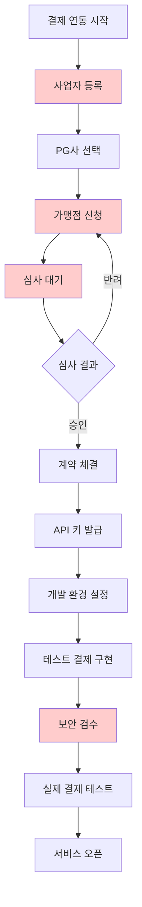

# 9.3 결제 연동

# 1. 결제 연동

온라인 쇼핑몰이나 서비스를 만들다 보면 반드시 마주치는 관문이 있습니다. 바로 결제 연동입니다. 아무리 Claude Code가 뛰어난 코드를 생성해도, 결제 연동은 단순히 코드만으로 해결되는 문제가 아닙니다. 사업자 등록, PG사 계약, 보안 인증 등 복잡한 절차가 기다리고 있습니다. 이 챕터에서는 한국에서 결제를 연동하는 과정과 현실적인 어려움, 그리고 이를 가장 쉽게 만들어주는 토스페이먼츠에 대해 이야기하겠습니다.




9.3-1

위 도표를 보면 결제 연동이 얼마나 복잡한 과정인지 알 수 있습니다. 빨간색으로 표시된 부분들은 특히 시간이 오래 걸리거나 까다로운 단계입니다. 코드를 작성하는 것은 전체 과정의 일부에 불과합니다.

# 2. 한국의 결제 시스템 이해하기

한국의 온라인 결제는 독특한 구조를 가지고 있습니다. 가맹점(여러분의 쇼핑몰)과 카드사 사이에 PG사(Payment Gateway)라는 중간 역할을 하는 회사가 있습니다. PG사는 복잡한 카드사 연동을 대신 처리해주고, 통합된 API를 제공합니다. 대표적인 PG사로는 KG이니시스, NHN KCP, 나이스페이, 토스페이먼츠 등이 있습니다.

PG사를 통해 결제를 연동하려면 먼저 사업자 등록이 필수입니다. 개인 사업자든 법인 사업자든 사업자 등록증이 있어야 PG사와 계약할 수 있습니다. 이것이 첫 번째 진입 장벽입니다. 취미로 만든 프로젝트나 포트폴리오용 사이트에는 실제 결제를 연동할 수 없다는 뜻입니다.

사업자 등록을 마쳤다면 PG사를 선택해야 합니다. 각 PG사마다 수수료율, 정산 주기, 지원하는 결제 수단이 다릅니다. 신용카드 수수료는 보통 2.5~3.5%, 계좌이체는 1.5~2% 정도입니다. 정산 주기는 D+2(결제 후 2일)부터 D+7까지 다양합니다. 초기 사업자는 신용도가 낮아 정산 주기가 길어질 수 있습니다.

# 3. 가맹점 신청의 현실

PG사를 선택했다면 가맹점 신청을 해야 합니다. 이 과정이 생각보다 까다롭습니다. 사업자 등록증은 기본이고, 통신판매업 신고증, 사업장 임대차 계약서, 대표자 신분증, 통장 사본 등 다양한 서류를 제출해야 합니다. 판매할 상품이나 서비스에 대한 상세한 설명도 필요합니다.

특히 온라인 교육, 디지털 콘텐츠, 구독 서비스 같은 무형 상품은 심사가 더 까다롭습니다. 환불 정책, 서비스 이용 약관, 개인정보 처리방침 등을 명확히 작성해야 합니다. 심사 기간은 보통 3~7일이지만, 서류 보완 요청이 있으면 2주 이상 걸리기도 합니다.

심사를 통과하고 계약을 체결하면 드디어 API 키를 받을 수 있습니다. 하지만 이것이 끝이 아닙니다. 테스트 환경과 실제 환경의 키가 다르고, 각각 설정해야 할 것들이 있습니다. 웹훅(Webhook) URL 설정, 허용 도메인 등록, 보안 설정 등을 해야 합니다.

# 4. 토스페이먼츠가 만든 변화

이런 복잡한 과정을 획기적으로 개선한 것이 토스페이먼츠입니다. 토스페이먼츠는 개발자 경험(Developer Experience)에 집중하여 결제 연동의 진입 장벽을 크게 낮췄습니다.

먼저 문서가 정말 잘 되어 있습니다. 한국어로 된 명확한 가이드, 실제 작동하는 예제 코드, 단계별 튜토리얼이 제공됩니다. 다른 PG사들의 문서가 마치 90년대에 작성된 것처럼 보인다면, 토스페이먼츠는 2020년대의 현대적인 문서를 제공합니다.

테스트 환경도 혁신적입니다. 사업자 등록 없이도 테스트 계정을 만들어 바로 개발을 시작할 수 있습니다. 테스트 카드 번호를 제공하여 실제와 동일한 결제 플로우를 체험할 수 있습니다. 이렇게 먼저 개발하고 테스트한 후, 나중에 사업자 등록을 하고 실제 결제로 전환할 수 있습니다.

코드도 정말 간단합니다. 토스페이먼츠의 결제 위젯을 사용하면 몇 줄의 코드로 결제 화면을 구현할 수 있습니다. 아래는 실제 코드 예시입니다.

```jsx
// 토스페이먼츠 결제 위젯 초기화
const tossPayments = TossPayments('클라이언트_키');
const payment = tossPayments.payment({
  customerKey: '고객_키'
});

// 결제 요청
await payment.requestPayment({
  method: 'CARD',
  amount: 15000,
  orderId: '주문_ID',
  orderName: '토스 티셔츠 외 2건',
  successUrl: window.location.origin + '/success',
  failUrl: window.location.origin + '/fail',
});
```

이 정도면 Claude Code에게 "토스페이먼츠를 사용한 결제 페이지를 만들어줘"라고 요청하면 바로 구현 가능한 수준입니다.

# 5. 그럼에도 남는 어려움

토스페이먼츠가 많은 부분을 개선했지만, 여전히 개발자가 아니면 넘기 힘든 산들이 있습니다. 가장 큰 문제는 에러 처리입니다. 결제는 돈이 오가는 민감한 부분이므로 수많은 예외 상황이 발생합니다.

카드 한도 초과, 정지된 카드, 본인인증 실패, 네트워크 오류, 중복 결제, 부분 취소 등 처리해야 할 에러 케이스가 수십 가지입니다. 각 에러마다 사용자에게 적절한 안내 메시지를 보여주고, 로그를 남기고, 필요하면 관리자에게 알림을 보내야 합니다.

보안도 큰 이슈입니다. 결제 정보는 절대 클라이언트에 노출되어서는 안 됩니다. 서버 사이드에서 검증하고, HTTPS를 적용하고, SQL 인젝션이나 XSS 같은 공격을 방어해야 합니다. PCI DSS(Payment Card Industry Data Security Standard) 같은 보안 표준을 준수해야 하는 경우도 있습니다.

정산과 세금 처리도 복잡합니다. 매출이 발생하면 부가가치세를 신고해야 하고, 현금영수증과 세금계산서를 발행해야 합니다. 환불이 발생하면 정산 내역을 수정해야 하고, 부분 환불의 경우 계산이 더 복잡해집니다.

# 6. 실제 결제 연동 개발기 - 나이스페이 포스타트

## 6.1 위니버시티 프로젝트

'위니버시티'는 위니브에서 개발한 LMS(Learning Management System) 플랫폼입니다. 인프런이나 유데미 같은 온라인 강의 플랫폼과 유사하며 특히 ‘바이브 코딩’, ‘AI’ 교육을 위한 플랫폼으로 만들어졌습니다. 이 챕터에서는 위니버시티 프로젝트에서 실제 결제 연동을 하며 고민하고 겪었던 것을 알려드리고자 합니다.

## 6.2 결제사 선택

가장 먼저 결제사 선택을 회의했습니다. 결제사를 선택하지 않고 네이버 페이 연동 등 다양한 대안이 나왔습니다. 토스페이먼츠가 개발자 친화적이고 문서도 잘 정리되어 있어서 도입을 가장 오랫동안 고민했습니다.

다만 토스페이먼츠의 경우 가입비 220,000원, 연관리비 110,000원의 초기 비용이 발생하고, 정산 한도가 1,000만 원을 초과할 경우 보증보험에 가입해야 합니다. 물론 이는 일반적인 PG사 대비 합리적인 수준이지만 서비스가 시작도 하기 전에 33만원의 초기 비용을 지출하는 것보다는 추후 옮겨가기로 회의를 마쳤습니다.

반면 나이스페이 포스타트의 베이직 요금제는 프로모션 기간 동안 가입비와 연관리비가 면제되었습니다. 또한 보증보험의 최소 가입 금액이 200만원으로 설정되어 있어 서비스 초기에는 충분한 수준이었습니다. 온라인 강의 플랫폼의 특성상 초기에는 월 매출이 크지 않을 것으로 예상되었기 때문에 높은 보증보험 한도는 당장 필요하지 않다고 판단했습니다.

**토스페이먼츠 VS 나이스페이 포스타트 비교표**

|  | 토스페이먼츠 | 나이스페이 포스타트 (베이직) | 비고 |
| --- | --- | --- | --- |
| **초기 비용** |  |  |  |
| 가입비 | 220,000원 (최초 1회) | 면제 (프로모션 기간) | 33만원 차이 |
| 연관리비 | 110,000원 (연 1회) | 면제 (프로모션 기간) |  |
| **결제 수수료 (VAT 별도)** |  |  |  |
| 신용카드 | 3.4% (일반 등급) | 3.3% | 나이스페이 약간 유리 |
| 가상계좌 | 건당 400원 | 건당 500원 | 토스페이먼츠 유리 |
| 간편결제 | 3.4% | 3.3% | 나이스페이 약간 유리 |
| 계좌이체 | 2.0% (최저 200원) | 2.9% | 토스페이먼츠 유리 |
| **정산 조건** |  |  |  |
| 정산 주기 | 5일 이내 (평균) | 영업일 기준 5일 | 비슷한 수준 |
| 보증보험 필요 시점 | 월 정산 1,000만원 초과시 | 처음부터 필수 | 토스페이먼츠 유리 |
| 보증보험 최소 한도 | 1,000만원 | 200만원 | 나이스페이 진입장벽 낮음 |
| 보증보험료 | 연 0.72% | 연 0.72% | 동일 |
| **개발자 경험** |  |  |  |
| API 문서 품질 | 매우 우수 | 보통 | 토스페이먼츠 압승 |
| SDK 지원 | 다양한 언어 지원 | 제한적 | 토스페이먼츠 우수 |
| 웹훅 시스템 | 현대적, 안정적 | 전통적 | 토스페이먼츠 우수 |
| 커뮤니티 지원 | 활발함 | 제한적 | 토스페이먼츠 우수 |
| **서비스 특징** |  |  |  |
| 미리 오픈 서비스 | 6분만에 선제공 | 별도 안내 없음 | 토스페이먼츠 독특한 장점 |
| 계약 완료 시간 | 평균 5일 | 하루 (포스타트) | 나이스페이 빠름 |
| 브랜드 인지도 | 높음 | 중간 | 토스페이먼츠 우수 |
| **비즈니스 모델 적합성** |  |  |  |
| 스타트업 초기 | 초기비용 부담 | 진입장벽 낮음 | 나이스페이 유리 |
| 성장 단계 | 확장성 우수 | 한도 제한 있음 | 토스페이먼츠 유리 |
| 장기 운영 | 종합적 우수 | 기능 제한적 | 토스페이먼츠 유리 |

이러한 비교 끝에 위니버시티 프로젝트는 초기 단계에서 나이스페이 포스타트의 장점이 단점보다 크다고 판단했지만, API 연동, 비즈니스 로직 구상 및 개발 등 서비스 개발에 이미 익숙한 개발자가 아니라면 나이스페이의 개발 문서는 다소 불친절하게 느껴질 수 있습니다. 따라서 개발지식이 전무하거나 이제 막 개발을 배우기 시작하신 분들에게는 초기 투자 비용을 고려하더라도 개발의 안정성 측면에서 토스페이먼츠가 유리합니다.

## 6.3 개발 문서

결제 개발 문서는 생각보다 복잡합니다. 결제 플로우를 단계별로 정확히 이해해야 하며, 주고받는 값에 명세를 회사 내에도 정리해두어야 합니다.


9.3-2 출처: 나이스페이 포스타트 개발 가이드

특히 초급 개발자라면 '인증'과 '승인'의 구분이 어려울 것입니다. 일반적으로 우리가 온라인 결제를 할 때, 사용자가 결제 버튼을 누르면 결제창이 나타나고 결제창에 모든 정보를 입력한 후 최종 승인 버튼을 누르면 여러 번의 단계를 거칠 필요 없이 단숨에 결제가 되는 것처럼 보입니다.

하지만 실제 개발 로직은 다릅니다. 위 이미지를 보시면 ‘인증’과 ‘승인’ 이 두 단계가 명확히 분리되어 있습니다. 인증은 결제 가능 여부를 확인하는 단계이고, 승인은 실제로 돈이 이동하는 단계입니다.

위와 같은 개발 문서를 ‘나만 이해’하면 되는 것이 아니라 앞으로 이 프로젝트를 인계받는 모든 사람이 이해할 수 있는 형태로 만들어두는 것이 중요합니다. 또한 AI가 이 모듈을 개발할 것이라면 AI도 개발할 수 있도록 문서화 하는 것이 중요합니다.

다만, AI가 개발을 아무리 잘 하는 시대가 온다고 하더라도 결제처럼 민감한 모듈은 모든 흐름을 개발자가 통제하고 있어야 합니다. 일반적인 웹 애플리케이션에서는 버그가 발생해도 사용자 경험만 나빠질 뿐이지만, 결제 시스템에서는 작은 실수가 금전적 손실로 직결될 수 있습니다. 결제가 실패했는데 사용자에게는 결제 완료 메시지가 가거나, 반대로 결제는 성공했는데 서비스는 제공되지 않는 상황이 발생하면 고객 신뢰도와 직결되는 문제가 됩니다.

개발자가 개발을 하더라도 일반 모듈보다 더 꼼꼼한 테스트와 검증을 거치게 됩니다. 이는 AI가 개발하더라도 마찬가지일 것입니다. 결제 시스템은 기술적 이해뿐만 아니라 금융 도메인에 대한 이해, 보안에 대한 고려, 그리고 다양한 예외 상황에 대한 경험이 필요한 영역이기 때문입니다.

# 7. 바이브 코딩을 위한 결제 연동

바이브 코딩을 위한 다양한 결제 편의를 제공하는 회사가 늘어나고 있습니다. 예를 들어, 토스나 포트원은 결제서비스를 구현할 수 있는 MCP를 제공합니다. 이 MCP를 이용하면 바이브 코딩으로 결제서비스를 적정 수준까지 개발할 수 있습니다.

[LLMs로 결제 연동하기 | 토스페이먼츠 개발자센터](https://docs.tosspayments.com/guides/v2/get-started/llms-guide)

[토스페이먼츠 결제 시스템 연동을 돕는 MCP 서버 구현기](https://toss.tech/article/tosspayments-mcp)

아래 JSON 파일을 Claude Code에 JSON 파일로 저장하여 개발할 수 있습니다.

```markdown
{
  "mcpServers": {
    "tosspayments-integration-guide": {
      "command": "npx",
      "args": ["-y", "@tosspayments/integration-guide-mcp@latest"]
    }
  }
}
```

이렇게 하지 않고도, 아래 텍스트를 다운로드 받아 ‘참고하여 개발해달라’고 요청해도 됩니다. 다양한 개발 문서가 있는 경로를 저장해둔 파일입니다.

[docs.tosspayments.com](https://docs.tosspayments.com/llms.txt)

만약 실제 결제 연동이 필요하지 않고, 결제 연동이 되는 테스트 정도만 필요하다면 Claude Code에게 "토스페이먼츠 테스트 환경으로 결제 페이지를 만들어줘"라고 요청하는 것만으로도 기본 구조를 잡을 수 있습니다. 이 단계에서는 사업자 등록이 필요 없습니다.


9.3-3

실제 바이브 코딩으로 모든 결제 기능을 구현했다 하더라도 앞서 강조해드린 것처럼 모든 단계에서 개발자 이해는 필수입니다. 또한 개발이 다 되었다면 돈이 오가는 실제 테스트를 소액으로 수십번 테스트 해보시기 바랍니다. 꼭 환불도 진행해보세요. 모든 기능이 완료되었다면 사업자에 통신판매업을 신고하셔야 합니다. 아래는 배포 체크리스트입니다.

[배포 체크리스트 | 토스페이먼츠 개발자센터](https://docs.tosspayments.com/guides/v2/deploy-checklist)

# 8. 비개발자를 위한 결제 대안

위에서 언급한 것처럼 생각보다 결제 연동은 쉽지 않습니다. 빠르게 시장 검증을 해야 한다면 아래 2가지 방법을 제안해 드립니다.

1. 계좌이체
2. 결제 서비스 리다이렉트

첫번째로 계좌이체입니다. 계좌 이체를 하면 서비스에서 직접 사용자에게 ‘입금 확인’으로 여러분이 옵션을 변경해주는 것이죠. 이 방법은 여러분이 바빠서 입금 확인을 못하는 리스크 외에는 특별한 리스크가 없습니다. 이체가 오면 문자가 오게 하는 등에 여러 편의기능만 잘 해두면 비전공자 분들도 잘 쓰실 수 있습니다.

두번째로는 결제가 가능한 서비스에 리다이렉트를 하는 것이죠. 상품 설명 등은 웹 서비스에서 모두 다 해놓고 결제만 다른 웹에서 하게 하는 것입니다. 예를 들어, 네이버 스토어가 있습니다. 실제 위니브에서도 시장검증이 빠르게 필요한 서비스를 네이버 스토어에서 진행한 적이 있었습니다.

많은 분들이 오해하시는 것 중 하나가 서비스가 잘 만들어져야 상품이 팔린다고 오해를 하는 것입니다. 서비스가 잘 만들어지지 않아도, 바이브 코딩 부트캠프는 랜딩페이지와 계좌 이체만으로도 한 달에 수백만원씩 수익을 얻었습니다. 오히려 로그인이나 회원가입이 허들이 될 수 있습니다.