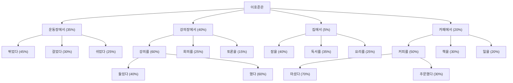

딥러닝과 트랜스포머 모델, GPT 모델 등의 다양한 인공지능 기술의 발전으로, 생성형 AI는 점점 더 복잡하고 정교한 작업을 수행할 수 있게 되었습니다. 특히 대규모 언어 모델(LLM)은 AI 발전 속에서 중요한 역할을 하며, 자연어 처리와 생성에서 새로운 가능성을 열고 있습니다. 딥러닝이 이미지 인식과 음성 처리에서 혁신을 가져온 것처럼, LLM은 AI가 사람처럼 언어를 이해하고 생성하는 수준으로 발전하게 했습니다.

# 1. LLM이란?

LLM은 '대규모 언어 모델'로, 방대한 양의 텍스트 데이터를 학습하여 사람처럼 언어를 이해하고 생성할 수 있는 모델입니다. 기본적으로 확률에 기반하여 문장을 예측하며, '이해'보다는 '수식화된 예측'을 수행한다고 보는 것이 더 정확합니다.

예를 들어, '이호준은'라는 문장을 입력하면 LLM은 확률에 따라 가장 적절한 문장을 선택해 완성합니다.

이 과정은 앞서 설명한 딥러닝과 이어집니다. 마스크 착용 여부를 구분할 때도 확률을 기반으로 작동했죠. LLM은 확률에 기반해 문맥을 고려한 예측을 수행하며, 이를 통해 적합한 문장을 생성합니다. 따라서 LLM이 '사실을 말하는 것'이 아니라, '잘 예측한 것'이라고 보는 것이 적절합니다.

ChatGPT도 마찬가지입니다. 확률에 기반해 예측을 할 뿐이지 ‘진실을 말한다!’라고 착각해서는 안됩니다. 또한 앞선 프롬프트에 영향도 받습니다. 따라서 글의 주도권을 글 작성자가 자기고 있어야 합니다. 잘못된 프롬프트는 잘못된 결과를 초래할 수 있습니다. 이를 방지하려면 기반 데이터를 제공하여 할루시네이션을 줄이는 것이 중요합니다.

- 진실을 말하지 않는 경우를 **할루시네이션**이라고 하는데 이는 오류가 아닙니다. ‘기능’인거죠. 확률에 기반한 것입니다. 따라서 활용을 지식의 습득의 창구로 사용할 때에는 주의를 요합니다.
- 할루시네이션을 줄이기 위해서는 기반 데이터를 주어야 합니다.

# 2. ChatGPT의 등장

ChatGPT는 OpenAI에서 개발한 LLM 중 하나로, 사람과 대화할 수 있도록 설계되었습니다. GPT는 모델 이름입니다. 앞서 우리가 Google 티처블머신에서 `Train Model`이라는 버튼을 클릭했었죠? 바로 그 `Model`입니다. 

ChatGPT는 GPT(Generative Pre-trained Transformer) 아키텍처를 기반으로 하고 있으며, 다음과 같은 특징을 가지고 있습니다.

- **대화 능력**: ChatGPT는 사람과 자연스럽게 대화할 수 있습니다. 사용자의 질문에 대해 의미 있는 답변을 제공하고, 다양한 주제에 대해 대화를 이어갈 수 있습니다.
- **지속적인 학습**: ChatGPT는 사용자의 피드백을 수집하여 정기적인 업데이트를 통해 성능이 개선됩니다.
- **다양한 활용**: ChatGPT는 고객 서비스, 교육, 개인 비서, 콘텐츠 생성 등 다양한 분야에서 활용될 수 있습니다.

ChatGPT 웹 서비스에서는 DALL-E를 사용하여 자연어로 이미지를 생성할 수 있습니다. 또한 맞춤형 GPTs를 탐색하여 질의응답을 할 수도 있습니다.

보통은 GPT와 ChatGPT 웹 서비스를 같은 동의어로 사용하는데 GPT와 ChatGPT 웹 서비스는 동의어가 아닙니다. GPT는 모델 이름이고 ChatGPT는 서비스 이름인 것이죠.

# 3. GPT 모델의 역사

GPT 모델은 2018년 OpenAI에 의해 처음 발표되었으며, 자연어 처리에 혁신적인 변화를 가져왔습니다. 이 모델은 대량의 텍스트 데이터로 사전 학습되어, 다양한 언어 작업을 수행할 수 있었습니다. 기존의 특정 작업에 특화된 AI 모델들과는 달리, 범용적인 언어 이해와 생성이 가능했습니다. 

2019년 발표된 GPT-2는 더 큰 규모와 자연스러운 텍스트 생성 능력을 보여주었으며, 2020년의 GPT-3는 1,750억 개의 매개변수를 통해 더 다양한 작업을 수행할 수 있었습니다.

2022년에는 대화에 특화된 GPT-3.5 기반의 ChatGPT가 출시되었고, 2023년에는 GPT-4 기반의 버전이 등장했습니다. 이로 인해 AI는 코드 작성 및 데이터 분석과 같은 복잡한 작업도 수행할 수 있게 되었습니다.

2024년에는 GPT-4o가 발표되었습니다. GPT는 텍스트뿐만 아니라 이미지, 음성, 비디오와 같은 다양한 데이터를 이해하고 생성할 수 있게 되었습니다. 이러한 발전은 교육, 의료, 예술 등 다양한 산업에서 AI 활용의 새로운 가능성을 열었습니다. 또한 24년 말에는 $200 지불로 강화된 o1 모델을 사용할 수 있게 하였습니다. 이 모델은 수학 난제를 해결하는 등 또 한 번에 도약으로 평가받고 있습니다.

# 4. ChatGPT의 주요 특징

ChatGPT는 다음과 같은 특징을 가지고 있습니다.

1. 맥락 이해: 이전 대화 내용을 기억하고, 일관성 있는 대화를 나눌 수 있습니다.
2. 자연스러운 대화: ChatGPT는 이전 대화 내용을 기억하여 문맥을 고려하게 되었기에, 인간과 유사한 대화 스타일로 소통할 수 있습니다.
3. 다양한 주제 대응: 일상 대화부터 전문적인 주제까지 폭넓은 영역의 대화가 가능합니다.
4. 사용자 지시 이행: 사용자의 요청에 따라 다양하고 복잡한 작업을 수행할 수 있습니다. 텍스트 생성뿐만 아니라 코드 작성, 데이터 분석, 정보 검색 및 정리 등이 가능합니다. 

# 5. ChatGPT의 발전과 영향

ChatGPT는 AI 기술의 대중화에 큰 영향을 미쳤습니다. 누구나 쉽게 접근 가능하고 사용할 수 있어, AI에 대한 대중의 인식과 접근 방식을 변화시켰습니다. 다양한 분야에서 실질적 적용사례가 늘어나고 있습니다.

교육 분야에서는 ChatGPT가 학생들의 학습 보조 도구로 자리잡고 있습니다. 전통적인 교육 방식에서는 인력 또는 비용의 문제로 어려웠던 개인화된 학습 경험이 가능해졌으며, 복잡한 개념을 이해하거나 과제를 해결하는 데에 있어 맞춤화된 도움을 받을 수 있습니다.

비즈니스 영역에서는 ChatGPT가 고객 서비스, 데이터 분석, 콘텐츠 생성 등 다양한 업무에 활용되면서 업무의 효율성과 생산성을 크게 향상시키고 있습니다. 

창작 활동에도 ChatGPT는 새로운 영감을 제공하는 도구로 사용되고 있습니다. 시나 소설의 캐릭터를 구상하거나 줄거리를 생성하기도 하고, 음악 가사를 만들거나 장르에 맞는 멜로디와 비트를 만들어내는 등 창의적인 콘텐츠를 만들어내고 있습니다. 

프로그래밍 분야에서도 ChatGPT는 개발자의 일상적 업무를 더 효율적으로 수행할 수 있도록 돕습니다. 코드 작성과 디버깅, 복잡한 코드 구조 이해까지 개발자의 보조로서 활용되고 있습니다.

이외에도 다양한 분야에서 ChatGPT는 실질적인 도구로 활용되며 생산성 및 효율성 향상을 기반으로 각 분야의 혁신을 이끄는 원동력이 되고 있습니다. 

# 6. 다양한 AI 모델의 등장

인공지능 기술의 급속한 발전과 함께, 다양한 분야에서 혁신적인 AI 모델들이 지속적으로 등장하고 있습니다. 이러한 모델들의 진화는 AI의 능력과 적용 범위를 넓혀가고 있습니다.

* 연도별 나타난 LLM들 (출처: 트랜스포머 모델: 소개 및 카탈로그, https://arxiv.org/pdf/2302.07730.pdf)

초기 AI 모델들은 주로 텍스트 처리에 중점을 두었습니다. 자연어 처리에서 시작된 이 모델들은 텍스트 생성, 번역, 요약 등의 작업을 수행할 수 있습니다. GPT (Generative Pre-trained Transformer) 시리즈와 BERT(Bidirectional Encoder Representations from Transformers) 같은 모델들이 이 분야를 선도했습니다. 이는 검색 엔진 개선, 챗봇 개발, 자동 번역 서비스 등 다양한 응용 분야를 열었습니다.

텍스트 처리 기술이 성숙해지면서 AI는 시각적 데이터 처리로 영역을 넓혔습니다. DALL-E와 Stable Diffusion 같은 이미지 인 및과 생성 모델들은 AI가 사진을 분석하고, 텍스트 설명을 바탕으로 이미지를 생성할 수 있도록 하였습니다. 이로 인해 디자인, 예술 창작, 의료 영상 분석 등에서 혁신적인 변화가 생겼습니다.

다음으로 AI는 청각적 데이터 처리에도 도전했습니다. Whisper와 같은 음성 인식과 합성 모델의 발전으로 AI는 인간의 말을 텍스트로 변환하거나, 텍스트를 자연스러운 음성으로 변환하는 능력ㅇ르 갖추게 되었습니다. 이 기술은 음성 비서, 자동 자막 생성, 청각 장애인을 위한 보조 기술 등에 활용되고 있습니다.

최근에는 여러 기술들이 통합되어 멀티모달 AI 모델이 등장하고 있습니다. CLIP (Contrastive Language-Image Pre-training) 같은 모델은 텍스트, 이미지, 음성을 동시에 처리하고 이해할 수 있어, 더욱 복잡하고 종합적인 작업을 수행할 수 있습니다. 예를 들어, 영상 내용을 이해하고 설명하거나, 텍스트 설명을 바탕으로 영상을 생성하는 것도 가능해졌습니다.

더 나아가 AI는 이제 과학 데이터 처리까지 영역을 확장했습니다. AlphaFold와 같은 모델은 복잡한 단백질 구조를 예측하거나 신약 개발을 지원하는 등 과학 연구 분야에서도 AI가 중요한 역할을 하고 있습니다.

다양한 AI 모델의 출현은 AI 기술의 응용 범위를 크게 확장시켰습니다. **주목할 점은 이러한 모델들이 모두 최근 10년 안에 등장했다는 것**입니다. AI는 이제 창작, 연구, 의사결정 지원 등 광범위한 영역에서 활용되며, 우리의 일상과 업무 방식을 근본적으로 변화시키고 있습니다.

기존 모델들도 끊임없이 발전하고 있습니다. 아래의 LLM 순위를 보면 Google의 Gemini가 치고 올라온 것을 확인할 수 있습니다. 얼마 전 GPT의 $200 구독 버전 pro는 아직 올라오지 않은 상태입니다. 또한 GPT의 o3 모델을 얼마전 발표 했으니 순위 변동은 클 것으로 보입니다. 

* huggingface LLM 순위, Rank(StyleCtrl 순), https://huggingface.co/spaces/lmarena-ai/chatbot-arena-leaderboard

# 7. 향후 전망

ChatGPT를 비롯한 LLM은 앞으로도 계속 발전할 것입니다. 이미 ChatGPT Pro 버전은 학사 이상의 수준으로 수학과 코딩을 합니다. 여기에서 멈추지 않고 2025년에는 OpenAI의 o3 같은 새로운 버전 등장이 예고되어 있습니다. 영상을 생성할 수 있는 Sora도 공개되었으니 이제 음성인식, 실시간 대화, 이미지 인식 등 다양한 주제에 대한 대화가 보다 편리하게 사용될 수 있을 것으로 보이고, 다양한 분야에서 더욱 폭넓게 활용될 것입니다. 

ChatGPT로 대표되는 대화형 AI의 발전은 우리 사회의 많은 영역에 변화를 가져올 것입니다. 이러한 기술의 잠재력을 최대한 활용하면서 인간의 역할을 재정립하고 동시에 발생할 수 있는 문제들을 해결해 나가는 것이 우리 사회의 중요한 과제가 될 것입니다.