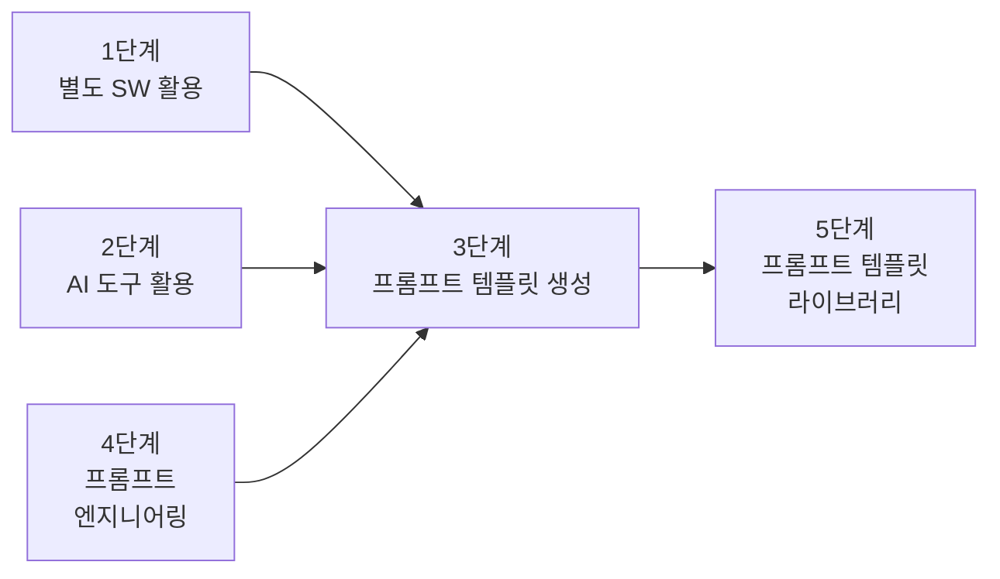
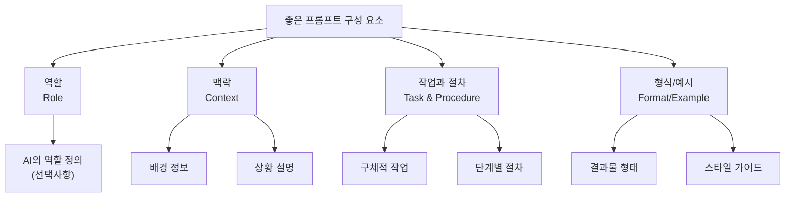
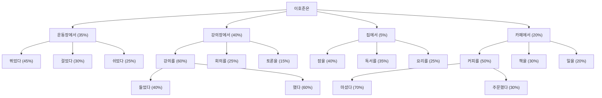
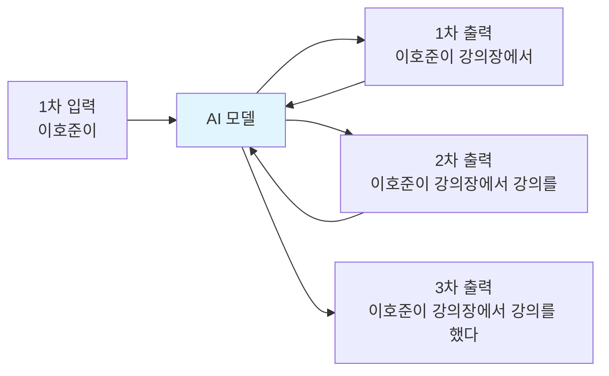

# 1. 프롬프트의 기본 개념

프롬프트는 컴퓨터 시스템에서 사용자의 입력을 기다리는 상태를 의미하는 오래된 개념입니다. 이는 단순히 최신 AI 모델인 ChatGPT와 같은 도구에만 국한되지 않고, 컴퓨터 역사 전반에 걸쳐 사용된 오래된 개념이죠. 아래와 같이 터미널에서 커서가 깜빡이며 사용자의 명령어 입력을 기다리는 상태도 하나의 프롬프트입니다.


최근 **AI 및 대화형 인터페이스의 발전으로 프롬프트의 개념은 더욱 확장**되었습니다. 대규모 언어 모델(LLM)과 함께 프롬프트는 단순한 입력 요청을 넘어, AI 시스템과의 상호작용을 하는 공간으로 변하였습니다.

아래 이미지에서 저는 Claude에게 인스타그램을 똑같이 만들라는 프롬프트를 입력했고, Claude는 이를 위한 코드와 실행 결과를 보여주고 있습니다.


ChatGPT에서도 별도 설정 없이 프롬프트를 통해 그래프와 같은 다양한 결과물을 받을 수 있습니다.


## 1.1 프롬프트 엔지니어링의 중요성

우리는 **프롬프트로 다양한 형태의 결과물을 받아볼 수 있게 되었습니다. 인간이 사용하는 '자연어'를 사용**해서 말이죠.

프롬프트로 더 많은 작업을 수행할 수 있게 되면서 AI 모델이 정확하고 유용한 결과를 만들어내도록 프롬프트를 설계하고 최적화하는 기술은 더욱 중요해졌습니다. 특히 GPT-3, GPT-4와 같은 고급 언어 모델이 등장하면서, 프롬프트 엔지니어링의 중요성은 더 커졌습니다.

단순히 즉흥적으로 생각나는 질문을 작성하는 것이 아니라 원하는 것을 얻기 위한 **전략적 접근**이 필요해진거죠. 예를 들어, 수학 풀이는 LLM이 잘 못하는 부분 중 하나입니다. 이는 LLM이 발전해도 마찬가지일 것입니다. LLM은 확률에 근거해서 텍스트를 생성하기 때문이죠. 이를 해결하기 위해 CoT 기법 등이 있습니다. 이러한 기법을 잘 활용하면 **결과의 품질과 정확도**를 크게 올릴 수 있습니다. 이는 AI 모델의 잠재력을 최대한 끌어내는 데 프롬프트 엔지니어링이 핵심적인 역할을 한다는 것을 의미합니다.

**또한 잘 구조화된 프롬프트는 반복적으로 사용**할 수 있어 **자산화** 할 수 있고, 이를 통해 일정한 퀄리티의 결과를 낼 수 있 수 있습니다. 이는 업무 프로세스의 표준화와 자동화로 이어져 개인과 기업의 생산성을 크게 올릴 수 있죠. 예를 들어, 위니브에서 사용 중인 '디자인 프롬프트 시스템'은 반복적인 페이지 작업을 효율적으로 처리하여, 업무의 신속성과 정확성을 크게 높여줍니다.

마지막으로 **프롬프트 엔지니어링은 AI가 잘못된 정보를 생성하는 할루시네이션 문제를 줄이는 데에도 중요한 역할**을 합니다. 특히 최신 데이터가 반영되지 않거나, 오류를 일으킬 수 있는 상황에서, 적절하게 설계된 프롬프트는 AI가 더 정확한 응답을 제공할 수 있도록 만듭니다.

프롬프트 엔지니어링은 AI의 잠재력을 최대한 발휘하고, 인간과 AI의 상호작용을 최적화하는 데 필수적인 기술입니다. 앞으로 AI 기술이 더욱 발전할수록, 프롬프트 엔지니어링의 중요성은 지속적으로 증가할 것으로 예상됩니다.

:::div{.callout}
모든 프롬프트 엔지니어링이 프롬프트 안으로 들어와서 결국 아무것도 소용없을 것이라는 무용론도 있습니다. 다만 프롬프트 엔지니어링이 AI 모델의 한계를 극복하고, 더 나은 결과를 얻기 위한 중요한 도구라는 점은 분명합니다.
:::

## 1.2 프롬프트 활용방법 5단계



1. **유저 - 프롬프트 - 생성형AI - 답변 - 별도 SW**
    - 예를 들어, 머메이드, PlantUML, Graphviz, D2(Declarative Diagramming), Kroki와 같은 도구를 활용하는 것을 의미합니다.

2. **유저 - 프롬프트 - 생성형AI - 생성형AI 도구 - 답변**
    - 예를 들어, 압축을 풀게 한다던지, PDF를 읽게 한다던지, 웹 페이지에서 정보를 가져오는 것이나 이미지에서 텍스트를 추출하는 것 등을 의미합니다. 

:::div{.callout}
생성형 AI는 압축을 풀거나 PDF를 읽어오는 기능이 없습니다. 생성형 AI는 가상환경이라는 것을 내부에 구축하여 여러분이 준 파일이나 요청이 생성형 AI로 수행할 수 없는 것이라면 별도의 도구를 활용하여 그 작업을 수행한 후, 그 결과물을 다시 생성형 AI에게 주어 답변을 생성합니다. 이러한 특성을 알고 있으면 GPT의 한글 깨짐 현상 등을 해결할 수 있습니다.

* 링크: https://pypi.org/project/koreanize-matplotlib/#files
:::

3. **프롬프트 엔지니어링**
    - 프롬프트에게 더 좋은 답변을 얻기 위해 프롬프트를 설계하고 최적화하는 것을 의미합니다.

4. **유저 - 프롬프트 템플릿 요구 - 생성형AI - 프롬프트 템플릿 생성 - 프롬프트 재구성 - 생성형AI - 답변**
    - 예를 들어, 프롬프트 템플릿을 요구하는 것을 의미합니다. 아래와 같이 프롬프트 템플릿을 요구하여 내용을 채우는 것이 핵심입니다. '리라이팅'이라고도 부릅니다.

```
나는 바이브 코딩 부트캠프를 운영하는 개발자야. 바이브 코딩 랜딩페이지를 만들고 싶은데 그냥 만들지는 않고, 너에게 프롬프트 템플릿을 받아서 그걸 채운다음 완성도 높게 만들고 싶어. 프롬프트 템플릿을 만들어줘.
```

5. **프롬프트 템플릿 라이브러리**
    - 이미 만들어진 프롬프트 라이브러리를 활용하는 것을 의미합니다. 회사에서 직접 구축할 수도 있으며, 구축된 것을 가져와서 사용할 수 있습니다. 예를 들어, [PromptHero](https://prompthero.com/), [포켓 프롬프트](https://pocket-prompt.com/prompt/text)와 같은 사이트에서 프롬프트를 가져오는 것을 의미합니다. 아래와 같이 직접 지시할 수도 있습니다.

```
나는 프로젝트를 만들 때 '요구사항.md(4번에서 작성한 템플릿)' 파일처럼 작성을 해야 프로덕트의 퀄리티가 향상된다는 것을 알게 되었어. 그래서 모든 단계에서 이러한 프롬프트 템플릿을 만들어 놓고 반복해서 사용하고 싶어. 조금 규모가 있는 프로젝트라고 생각하고 이러한 프롬프트 템플릿 라이브러리를 만들어줘.

각각의 단계는 폴더로 구분하고, 각 폴더 안에는 해당 단계에서 사용할 수 있는 프롬프트 템플릿 파일들을 포함시켜줘. 예를 들어, '아이디어 구상', '요구사항 정의', '설계', '개발', '테스트', '배포' 같은 단계들이 있을 수 있어. 각 단계별로 최소 3개의 프롬프트 템플릿 파일을 만들어줘.
```

# 2. 좋은 프롬프트 만들기

효과적인 프롬프트 작성은 AI와의 상호작용을 최적화하는 데 핵심적인 역할을 합니다. AI의 성능을 극대화하기 위해 다양한 전략과 기법이 개발되어 왔습니다.

지금은 ChatGPT, Claude와 같은 곳에서 프롬프트 엔지니어링을 소개하고, 이를 통해 AI와의 상호작용을 개선하기 위한 다양한 기법을 제시하고 있습니다.

링크: https://docs.claude.com/en/docs/build-with-claude/prompt-engineering/overview

좋은 프롬프트에는 다음과 같은 요소들이 포함됩니다.

```
1. 역할 (Role): AI가 어떤 역할을 해야 하는지 - 선택
2. 맥락 (Context): 배경 정보와 상황 설명
3. 작업과 절차 (Task and Procedure): 구체적으로 무엇을 해야 하는지
4. 형식 또는 예시 (Format or Example): 결과물의 형태와 스타일
```



좋지 못한 프롬프트는 아래와 같습니다. 단순히 한 줄로 요구사항만 짧게 적은 경우죠. 이렇게 되었을 때 통계적으로도 좋은 결과가 나오기 어렵지만, 이 결과물의 답변을 기다리고 읽어보는데 시간을 더 쓴다는 사실을 기억해야 합니다.

```md
마케팅 글 써줘
```

구성 요소를 모두 작성한 프롬프트는 아래와 같습니다.

```md
역할: 너는 B2B 마케팅 전문가야.
맥락: 우리는 중소기업 대상 프로젝트 관리 툴을 출시했어. 이 툴은 다른 툴과 OOOO이 비교되고, OOOO한 문제를 해결할 수 있어. 대표적으로는 OOOO 장점이 있어.
작업: 제품 출시 이메일을 작성해줘.
형식: 제목(10자 이내) + 본문(200자) + CTA 버튼 문구
```

아래는 이러한 프롬프트를 작성하기 위한 템플릿입니다. 먼저 여러분의 목적을 ChatGPT, Claude와 같은 AI 모델에게 말하고, 아래와 같은 템플릿을 요구하셔도 좋습니다. 중요한 것은 AI에게 명확한 답변을 얻기 위해서는 '노력'을 해야 한다는 점입니다.

```md
[역할]
너는 [산업/분야]의 전문 콘텐츠 마케터야.

[맥락]
- 타겟 독자: [구체적인 독자층]
- 목적: [인지도 향상/리드 생성/교육 등]
- 톤앤매너: [전문적/친근한/유머러스 등]

[작업]
다음 주제로 블로그 글을 써줘: [주제]

[형식]
- 제목: [클릭을 유도하는 제목]
- 도입부: [독자의 관심을 끄는 질문이나 통계]
- 본문: [3-5개 소제목으로 구조화]
- 결론: [명확한 CTA (Call To Action)]
- 길이: 약 [글자 수]
```

## 2.1 상세한 정보 제공하기

**상세한 정보 제공하는 것은 텍스트 생성의 길을 제시하는 것과 같습니다.** AI에게 명확한 역할, 대상, 목표, 답변 형식, 예시 등을 구체적으로 제시하면 생성형AI가 다음 텍스트를 더 명확하게 예측할 수 있습니다.

앞서 살펴보았던 내용입니다.



예를 들어, '이호준이'를 입력하면 다음 문장은 '이호준이 강의장에서'가 나오게 됩니다. 이렇게 나온 문장은 다시 모델로 들어가 '이호준이 강의장에서 강의를'이 나오게 하죠. 이를 도식화 하면 아래와 같습니다.



결국 좋은 프롬프트란 좋은 답변이 나오게 하기 위한 확률을 높여줄 수 있는 모든 행위, 정보를 제공하는 것입니다.

## 2.2 여러번 질문해보기

AI와 대화할 때, 여러 창을 띄어놓고 똑같은 질문을 던져보는 것도 좋은 방법입니다. AI는 확률에 기반한 모델이기 때문에, 같은 질문이라도 매번 다른 답변이 나오게 됩니다. 여러 번 질문을 던져보고, 그 중에서 가장 적합한 답변을 선택하거나, 다양한 답변을 조합하여 최종 결과물을 만드는 것도 효과적인 전략입니다.

# 3. 각 분야별 프롬프트 활용 템플릿

실무에서 바로 활용할 수 있는 분야별 프롬프트 템플릿을 소개합니다. 각 템플릿은 역할, 맥락, 작업, 형식을 포함하여 구조화되어 있으며, 필요에 따라 세부 내용을 수정하여 사용할 수 있습니다.

## 3.1 마케팅 프롬프트 템플릿

### 3.1.1 SNS 콘텐츠 기획

```md
[역할]
너는 [브랜드명]의 소셜미디어 마케팅 전문가야.

[맥락]
- 플랫폼: [Instagram/LinkedIn/Twitter/Facebook 등]
- 타겟: [연령대, 직업, 관심사]
- 브랜드 톤앤매너: [친근한/전문적인/유머러스/감성적인]
- 목표: [인지도 향상/참여 유도/리드 생성]

[작업]
[주제/이벤트/제품]에 대한 SNS 콘텐츠를 7일간의 포스팅 계획으로 만들어줘.

[형식]
각 포스팅마다 다음을 포함:
- 날짜 및 시간
- 메인 문구 (첫 줄은 후킹 포인트)
- 해시태그 (최대 10개)
- 이미지/영상 콘셉트 설명
- 예상 참여율을 높이기 위한 CTA
```

### 3.1.2 이메일 마케팅

```md
[역할]
너는 [업종]의 이메일 마케팅 전문가야.

[맥락]
- 수신자: [신규 고객/기존 고객/잠재 고객]
- 목적: [제품 소개/이벤트 알림/뉴스레터/재구매 유도]
- 브랜드 가치: [핵심 가치 2-3개]
- 경쟁사 대비 차별점: [구체적 차별점]

[작업]
[캠페인 목적]을 위한 이메일 시퀀스를 3단계로 작성해줘.

[형식]
각 이메일마다:
- 제목 (15자 이내, A/B 테스트용 2개)
- 프리헤더 텍스트
- 본문 (인사 - 가치 제안 - 혜택 - CTA 구조)
- CTA 버튼 문구
- 발송 시점 (이전 이메일 대비)
```

### 3.1.3 광고 카피라이팅

```md
[역할]
너는 [제품/서비스] 분야의 퍼포먼스 마케팅 전문가야.

[맥락]
- 광고 플랫폼: [Google Ads/Meta Ads/네이버 검색광고]
- 제품/서비스: [상세 설명]
- 타겟 페르소나: [구체적 특성]
- 주요 페인 포인트: [고객이 겪는 문제]
- 솔루션/혜택: [제품이 해결하는 방법]

[작업]
전환율을 높이기 위한 광고 카피를 5가지 버전으로 작성해줘.

[형식]
각 버전마다:
- 헤드라인 (25자 이내)
- 서브 헤드라인 (40자 이내)
- 본문 (80자 이내)
- CTA (행동 유도 문구)
- 타겟팅 포인트 (어떤 심리/니즈를 공략하는지)
```

### 3.1.4 콘텐츠 SEO 최적화

```md
[역할]
너는 SEO 전문 콘텐츠 마케터야.

[맥락]
- 타겟 키워드: [메인 키워드 + 롱테일 키워드]
- 검색 의도: [정보성/거래성/탐색성]
- 타겟 독자: [구체적 페르소나]
- 경쟁 콘텐츠 분석: [상위 랭킹 콘텐츠의 특징]

[작업]
[주제]에 대한 SEO 최적화 블로그 글을 작성해줘.

[형식]
- 메타 제목 (60자 이내, 키워드 포함)
- 메타 설명 (155자 이내)
- H1, H2, H3 구조 (키워드 자연스럽게 분산)
- 도입부 (200자, 후킹 + 핵심 가치)
- 본문 (1500-2000자, 소제목별 구조화)
- FAQ 섹션 (3-5개)
- 결론 및 CTA
```

## 3.2 기획 프롬프트 템플릿

### 3.2.1 서비스 기획

```md
[역할]
너는 [서비스 도메인]의 프로덕트 매니저야.

[맥락]
- 서비스 개요: [서비스 한 줄 설명]
- 타겟 유저: [페르소나 상세]
- 해결하고자 하는 문제: [핵심 문제점]
- 시장 상황: [시장 크기, 경쟁사, 트렌드]

[작업]
이 서비스의 핵심 기능과 사용자 플로우를 기획해줘.

[형식]
1. 핵심 가치 제안 (Value Proposition)
2. 주요 기능 목록 (우선순위 포함)
3. 사용자 시나리오 (3가지 주요 시나리오)
4. 사용자 플로우 (mermaid 다이어그램)
5. 핵심 지표 (KPI) 정의
6. MVP 범위 설정
```

### 3.2.2 요구사항 정의서 작성

```md
[역할]
너는 [프로젝트명]의 비즈니스 애널리스트야.

[맥락]
- 프로젝트 배경: [why]
- 이해관계자: [개발팀/디자인팀/비즈니스팀 등]
- 제약사항: [기술적/비즈니스적 제약]
- 목표: [정량적 목표 포함]

[작업]
[기능명]에 대한 상세 요구사항 정의서를 작성해줘.

[형식]
1. 기능 개요
2. 기능 요구사항 (Functional Requirements)
   - 필수 기능 (Must Have)
   - 선택 기능 (Nice to Have)
3. 비기능 요구사항 (Non-Functional Requirements)
   - 성능, 보안, 확장성 등
4. 사용자 스토리 (As a [역할], I want [기능], So that [목적])
5. 인수 기준 (Acceptance Criteria)
6. 제외 사항 (Out of Scope)
```

### 3.2.3 경쟁사 분석

```md
[역할]
너는 [산업 분야]의 전략 기획자야.

[맥락]
- 우리 서비스: [서비스 설명]
- 분석 대상 경쟁사: [경쟁사 리스트]
- 분석 목적: [벤치마킹/차별화 포인트 발굴/시장 포지셔닝]

[작업]
경쟁사 분석 리포트를 작성해줘.

[형식]
1. Executive Summary
2. 경쟁사별 상세 분석
   - 핵심 기능
   - 가격 정책
   - 타겟 고객
   - 강점/약점
3. 기능 비교 매트릭스 (표)
4. SWOT 분석
5. 시사점 및 전략 제안
6. 차별화 포인트 도출
```

### 3.2.4 데이터 분석 리포트

```md
[역할]
너는 데이터 분석가야.

[맥락]
- 분석 데이터: [데이터 종류 및 기간]
- 분석 목적: [의사결정 지원/문제 원인 파악/기회 발견]
- 주요 관심 지표: [핵심 KPI들]

[작업]
다음 데이터를 분석하고 인사이트를 도출해줘:
[데이터 또는 데이터 요약 정보]

[형식]
1. 분석 개요
2. 주요 발견사항 (Key Findings)
   - 정량적 수치
   - 시각화 제안 (차트 유형)
3. 트렌드 분석
4. 이상치 및 특이사항
5. 인사이트 및 해석
6. 액션 아이템 제안
```

## 3.3 개발 프롬프트 템플릿

### 3.3.1 코드 리뷰

```md
[역할]
너는 [언어/프레임워크]의 시니어 개발자야.

[맥락]
- 프로젝트: [프로젝트 설명]
- 코드 목적: [해당 코드가 하는 일]
- 기술 스택: [사용 기술]
- 코딩 컨벤션: [팀 규칙]

[작업]
다음 코드를 리뷰하고 개선점을 제시해줘:
```[언어]
[코드 붙여넣기]
```

[형식]
1. 코드 개요 및 동작 설명
2. 잘된 점 (Best Practices)
3. 개선 필요 사항
   - 성능
   - 가독성
   - 유지보수성
   - 보안
   - 에러 핸들링
4. 리팩토링 제안 (코드 포함)
5. 테스트 케이스 제안
```

### 3.3.2 버그 디버깅

```md
[역할]
너는 [기술 스택]에 능숙한 디버깅 전문가야.

[맥락]
- 환경: [개발/스테이징/프로덕션, OS, 버전 등]
- 기술 스택: [상세 기술 스택]
- 발생 상황: [언제, 어떤 조건에서 발생하는지]

[작업]
다음 버그를 해결하는 방법을 단계별로 알려줘:

에러 메시지:
```
[에러 메시지 붙여넣기]
```

관련 코드:
```[언어]
[관련 코드]
```

[형식]
1. 에러 원인 분석
2. 재현 방법
3. 해결 방법 (단계별)
4. 수정된 코드
5. 예방 방법
6. 관련 테스트 케이스
```

### 3.3.3 API 설계

```md
[역할]
너는 RESTful API 설계 전문가야.

[맥락]
- 서비스: [서비스 설명]
- 기능: [API가 제공할 기능]
- 사용자: [API를 사용할 클라이언트]
- 보안 요구사항: [인증/인가 방식]

[작업]
[기능명]을 위한 API를 설계해줘.

[형식]
1. API 개요
2. 엔드포인트 목록
   - HTTP Method
   - URL 경로
   - Request (Headers, Body, Query Parameters)
   - Response (Success/Error)
   - Status Code
3. 데이터 모델 (스키마)
4. 에러 처리 전략
5. 페이지네이션/필터링 방식
6. API 사용 예시 (curl 또는 코드)
```

### 3.3.4 테스트 코드 작성

```md
[역할]
너는 TDD를 실천하는 QA 엔지니어야.

[맥락]
- 테스트 프레임워크: [Jest/Pytest/JUnit 등]
- 테스트 대상: [함수/클래스/컴포넌트]
- 커버리지 목표: [목표 퍼센트]

[작업]
다음 코드에 대한 테스트 코드를 작성해줘:
```[언어]
[테스트할 코드]
```

[형식]
1. 테스트 시나리오 목록
2. 단위 테스트 코드
   - 정상 케이스
   - 경계값 테스트
   - 예외 케이스
3. 통합 테스트 코드 (필요시)
4. Mock/Stub 설정
5. 테스트 커버리지 확인 방법
```

### 3.3.5 기술 문서 작성

```md
[역할]
너는 기술 문서 작성 전문가야.

[맥락]
- 독자: [신입 개발자/팀원/외부 개발자]
- 문서 목적: [온보딩/가이드/레퍼런스]
- 기술 수준: [초급/중급/고급]

[작업]
[기술/라이브러리/시스템]에 대한 기술 문서를 작성해줘.

[형식]
1. 개요 (한 줄 설명 + 주요 특징)
2. 사전 요구사항
3. 설치 및 설정 방법
4. 기본 사용법 (코드 예제 포함)
5. 주요 기능 상세 설명
6. 트러블슈팅
7. FAQ
8. 참고 자료
```

## 3.4 디자인 프롬프트 템플릿

### 3.4.1 UI/UX 디자인 기획

```md
[역할]
너는 사용자 경험을 중시하는 UI/UX 디자이너야.

[맥락]
- 프로젝트: [앱/웹사이트 이름]
- 타겟 사용자: [연령, 특성, 기술 숙련도]
- 디바이스: [모바일/태블릿/데스크톱]
- 디자인 트렌드: [미니멀/뉴모피즘/글래스모피즘 등]
- 브랜드 아이덴티티: [핵심 가치, 색상, 느낌]

[작업]
[화면명/기능명]의 UI/UX 디자인 컨셉을 제안해줘.

[형식]
1. 디자인 목표 및 방향성
2. 사용자 페르소나 및 니즈
3. 정보 구조 (IA)
4. 와이어프레임 설명 (레이아웃, 주요 요소 배치)
5. UI 컴포넌트 목록
6. 인터랙션 시나리오
7. 접근성 고려사항
8. 디자인 시스템 요소 (색상, 타이포그래피, 간격)
```

### 3.4.2 브랜딩 및 아이덴티티

```md
[역할]
너는 브랜드 전략가이자 비주얼 디자이너야.

[맥락]
- 브랜드명: [이름]
- 산업/분야: [업종]
- 타겟: [고객층]
- 브랜드 가치: [핵심 가치 3가지]
- 경쟁 환경: [경쟁사 브랜딩 특징]

[작업]
[브랜드명]의 브랜드 아이덴티티를 디자인해줘.

[형식]
1. 브랜드 포지셔닝
2. 브랜드 퍼스널리티 (성격, 톤앤매너)
3. 로고 컨셉
   - 형태/심볼 설명
   - 컬러 팔레트 (hex 코드, 의미)
   - 타이포그래피
4. 비주얼 언어
   - 그래픽 스타일
   - 이미지 무드
   - 패턴/텍스처
5. 적용 예시 (명함, 웹사이트, 포장 등)
6. 브랜드 가이드라인 요약
```

### 3.4.3 이미지 생성 프롬프트 (MidJourney/DALL-E/Stable Diffusion)

```md
[역할]
너는 이미지 생성 AI 프롬프트 엔지니어야.

[맥락]
- 용도: [SNS/블로그/광고/프레젠테이션]
- 분위기: [밝은/어두운/몽환적/사실적]
- 스타일: [일러스트/사진/3D/수채화 등]

[작업]
[주제/컨셉]의 이미지를 생성하기 위한 프롬프트를 작성해줘.

[형식]
1. 메인 프롬프트 (영문)
   - 주제 (Subject)
   - 디테일 (Details)
   - 스타일 (Style)
   - 조명 (Lighting)
   - 색감 (Color Palette)
   - 구도 (Composition)
   - 품질 키워드 (Quality Modifiers)
2. 네거티브 프롬프트 (제외할 요소)
3. 파라미터 설정 (비율, 퀄리티 등)
4. 예상 결과물 설명
5. 대안 프롬프트 3가지
```

### 3.4.4 사용자 리서치 및 테스트

```md
[역할]
너는 UX 리서처야.

[맥락]
- 제품/서비스: [설명]
- 리서치 목적: [가설 검증/문제 발견/개선점 도출]
- 참여자: [수, 특성]
- 방법: [사용성 테스트/인터뷰/서베이/A/B 테스트]

[작업]
[기능/화면]에 대한 사용자 리서치 계획을 수립해줘.

[형식]
1. 리서치 목표 및 가설
2. 참여자 모집 기준
3. 테스트 시나리오 및 태스크
4. 질문 리스트
5. 측정 지표 (성공률, 소요 시간, 만족도 등)
6. 데이터 수집 방법
7. 분석 계획
8. 예상 일정 및 리소스
```

## 3.5 엑셀과 같은 OA 툴 프롬프트 템플릿

### 3.5.1 엑셀 수식 및 함수

```md
[역할]
너는 엑셀 전문가야.

[맥락]
- 데이터 구조: [어떤 데이터가 어떤 열에 있는지]
- 목적: [원하는 결과]
- 엑셀 버전: [Excel 2016/365/Google Sheets]

[작업]
다음 작업을 수행하는 수식을 만들어줘:
[구체적인 작업 설명]

[형식]
1. 수식 (셀 참조 포함)
2. 수식 설명 (각 함수의 역할)
3. 사용된 함수 목록 및 문법
4. 예시 데이터 및 결과
5. 대안 수식 (있는 경우)
6. 주의사항
```

예시:
```md
[역할]
너는 엑셀 전문가야.

[맥락]
- A열: 제품명
- B열: 판매일자 (YYYY-MM-DD)
- C열: 판매금액
- D열: 지역
목적: 2024년 1월 서울 지역 판매 금액 합계
엑셀 버전: Excel 365

[작업]
조건에 맞는 데이터의 합계를 구하는 수식을 만들어줘.

[형식]
1. 수식: =SUMIFS(C:C, B:B, ">=2024-01-01", B:B, "<=2024-01-31", D:D, "서울")
2. 설명: SUMIFS로 여러 조건을 동시에 만족하는 C열 합계
3. 함수: SUMIFS(합계범위, 조건범위1, 조건1, 조건범위2, 조건2, ...)
4. 예시: 1월 서울 지역 판매 데이터 3건이 있다면 그 합계 반환
5. 대안: 피벗 테이블 사용 또는 FILTER + SUM 함수 조합
6. 주의: 날짜 형식이 텍스트가 아닌 날짜 형식이어야 함
```

### 3.5.2 데이터 시각화

```md
[역할]
너는 데이터 시각화 전문가야.

[맥락]
- 데이터 종류: [시계열/범주형/비율/비교 등]
- 목적: [트렌드 파악/비교/분포 확인]
- 대상: [경영진/팀원/고객]

[작업]
다음 데이터를 가장 효과적으로 시각화하는 방법을 제안해줘:
[데이터 설명 또는 샘플]

[형식]
1. 추천 차트 유형 (이유 포함)
2. 차트 설정
   - X축/Y축 설정
   - 계열 구성
   - 색상 스키마
   - 레이블 및 범례
3. 생성 단계 (엑셀/구글 시트 기준)
4. 대시보드 구성안 (여러 차트 조합 시)
5. 인사이트를 강조하는 방법
```

### 3.5.3 피벗 테이블 및 데이터 분석

```md
[역할]
너는 데이터 분석가야.

[맥락]
- 데이터셋: [데이터 구조 설명]
- 분석 목표: [어떤 인사이트를 얻고 싶은지]

[작업]
피벗 테이블을 사용해서 다음 분석을 수행하는 방법을 알려줘:
[분석 내용]

[형식]
1. 피벗 테이블 구성
   - 행/열/값/필터 영역 설정
   - 집계 함수 (합계/평균/개수 등)
2. 생성 단계 (스크린샷 설명 포함)
3. 추가 계산 필드 (필요시)
4. 슬라이서/필터 설정
5. 결과 해석 방법
6. 관련 차트 추천
```

### 3.5.4 업무 자동화 (매크로/VBA)

```md
[역할]
너는 엑셀 VBA 개발자야.

[맥락]
- 반복 작업: [어떤 작업을 반복하는지]
- 데이터 범위: [작업 대상 데이터]
- 조건: [특정 조건이 있다면]

[작업]
다음 작업을 자동화하는 매크로를 작성해줘:
[자동화할 작업]

[형식]
1. VBA 코드
2. 코드 설명 (주석 포함)
3. 매크로 실행 방법
4. 단축키 설정 방법
5. 에러 처리
6. 사용 시 주의사항
```

### 3.5.5 파워포인트 슬라이드 구성

```md
[역할]
너는 프레젠테이션 전문가야.

[맥락]
- 발표 목적: [설득/정보 전달/교육]
- 청중: [임원/팀원/고객/투자자]
- 발표 시간: [분]
- 핵심 메시지: [전달하고 싶은 메시지]

[작업]
[주제]에 대한 프레젠테이션 슬라이드 구성안을 만들어줘.

[형식]
1. 슬라이드 개수 및 시간 배분
2. 슬라이드별 구성
   - 슬라이드 제목
   - 핵심 메시지
   - 콘텐츠 (텍스트/차트/이미지)
   - 레이아웃 제안
3. 스토리 플로우
4. 비주얼 컨셉 (색상, 폰트, 이미지 스타일)
5. 인포그래픽 아이디어
6. 발표 스크립트 주요 포인트
```

### 3.5.6 구글 워크스페이스 자동화

```md
[역할]
너는 구글 앱스 스크립트 개발자야.

[맥락]
- 사용 도구: [Google Sheets/Docs/Forms/Gmail]
- 자동화 목적: [작업 설명]
- 트리거: [시간 기반/이벤트 기반]

[작업]
다음 작업을 자동화하는 Google Apps Script를 작성해줘:
[자동화할 작업]

[형식]
1. Apps Script 코드
2. 코드 설명
3. 스크립트 편집기 접근 방법
4. 권한 설정
5. 트리거 설정 방법
6. 테스트 방법
7. 실행 로그 확인 방법
```