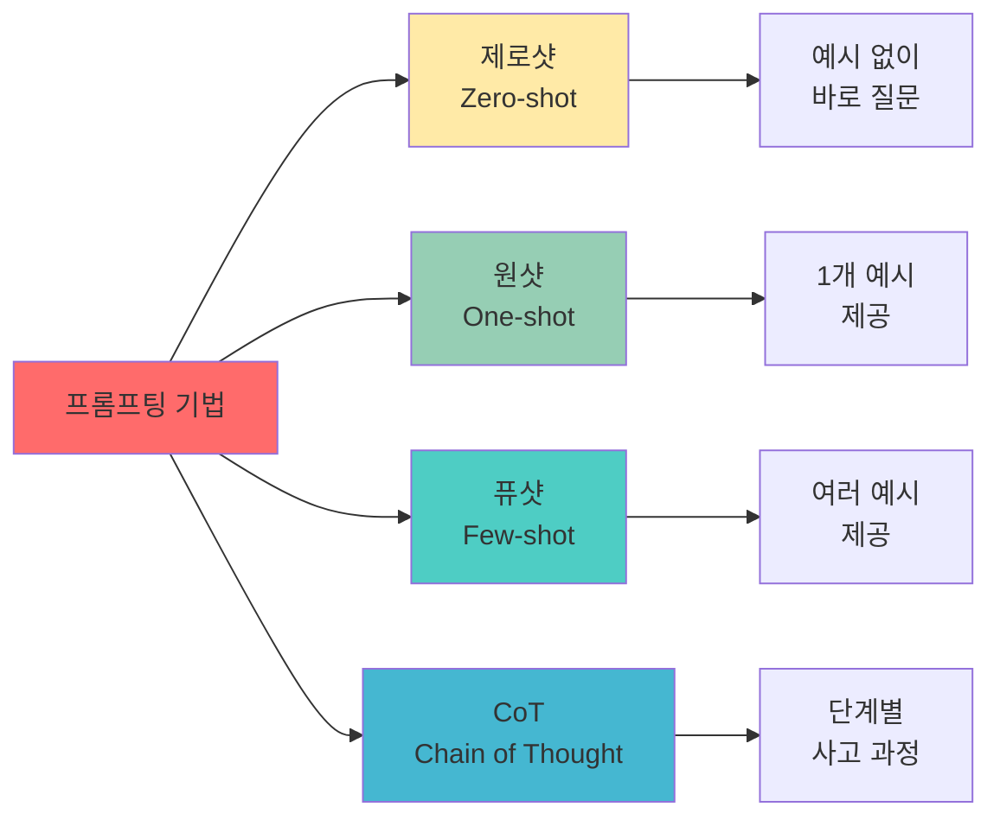
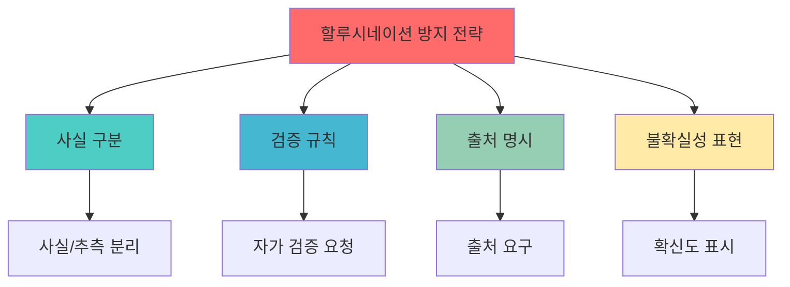
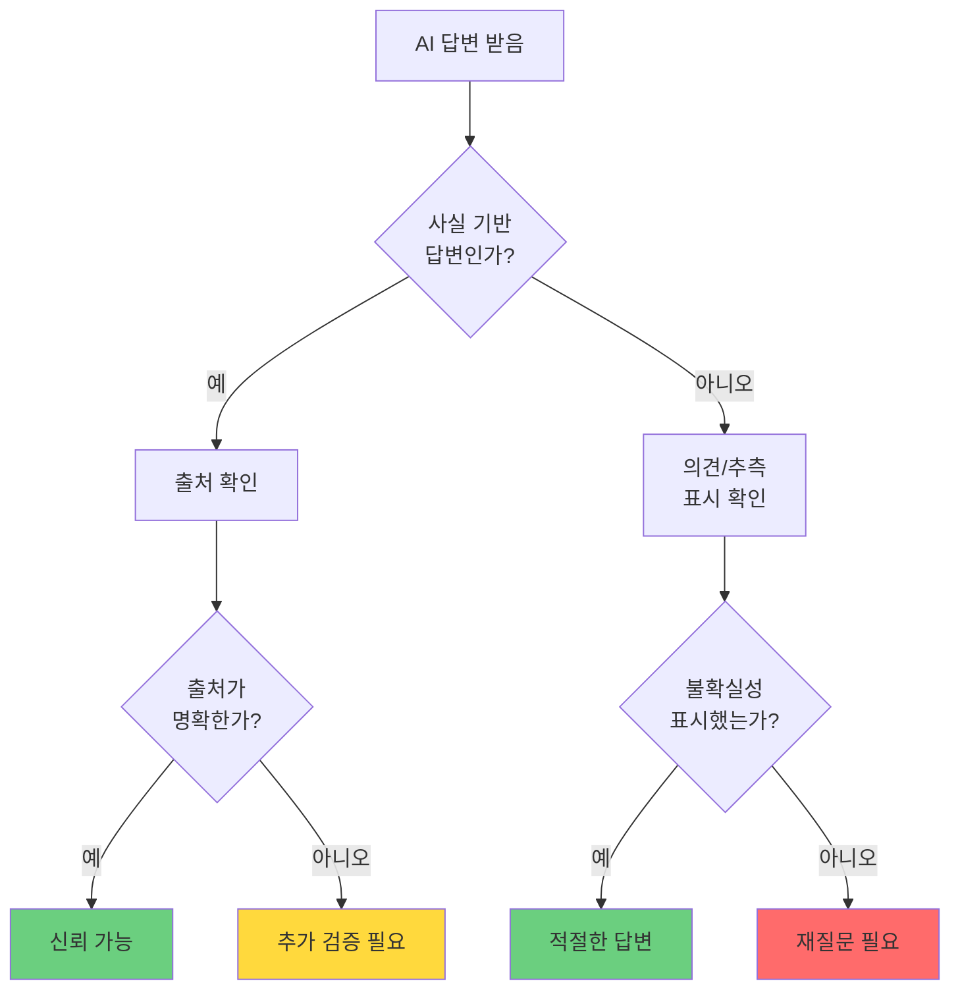
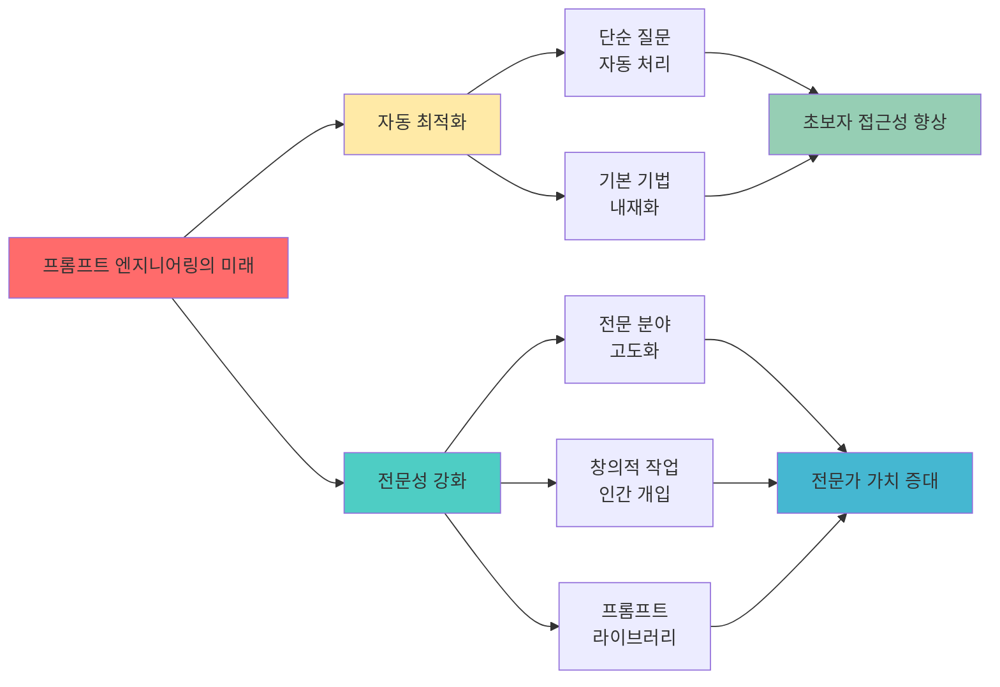
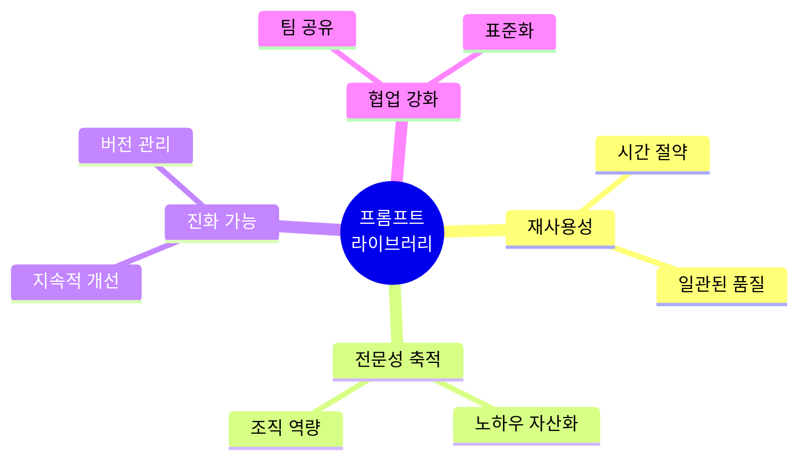
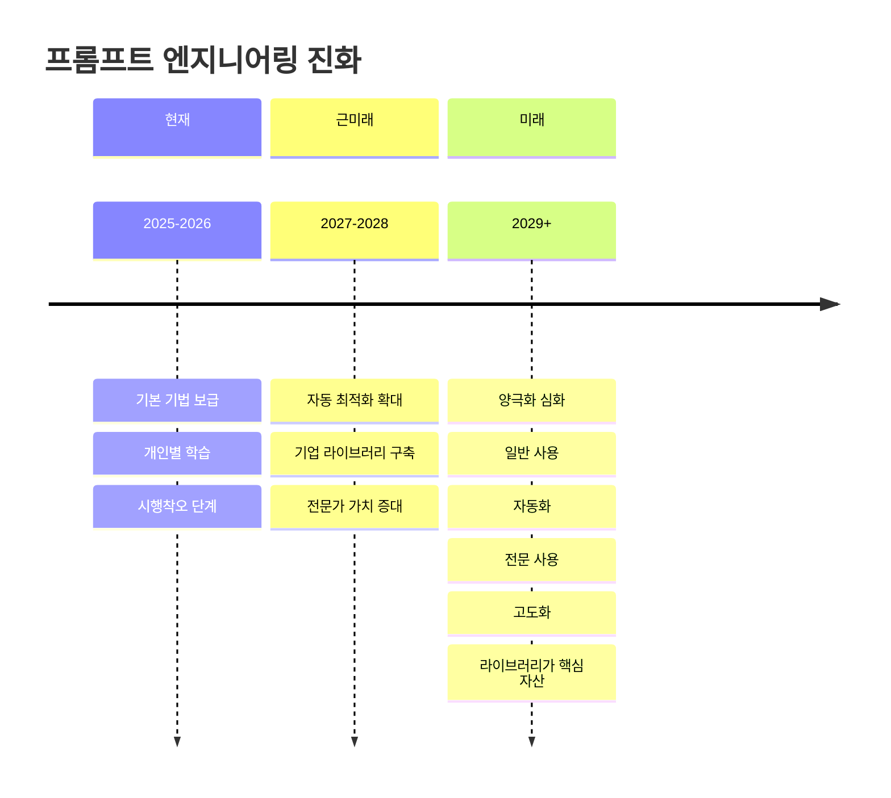

# 1. 프롬프팅 기법 활용하기

아래와 같은 **프롬프팅 기법**을 활용하면 AI의 성능을 한 단계 더 끌어올릴 수 있습니다.

## 1.1 제로샷 프롬프팅 (Zero-shot Prompting)

인공지능이 특정 작업을 수행하기 위해 **사전 학습 없이 바로 답변을 생성하는 방식**입니다. 예를 들어, "고양이에 대해 설명해줘"라는 질문에 대해 고양이에 대한 정보를 제공하는 것입니다. 다만 이 방식은 효율이 그리 좋지 않습니다. 아래 그래프를 참고해주세요. 원샷이나 퓨샷을 권합니다.

.](/images/essentials-chatgpt/03_1_7.png)

Brown, T. B. 외 (2020). *Language models are few-shot learners*. arXiv, [https://arxiv.org/abs/2005.14165](https://arxiv.org/abs/2005.14165).



## 1.2 원샷 러닝 (One-shot Learning)

인공지능이 **단 하나의 예시만 보고 학습하여 유사한 작업을 수행하는 방식**입니다. 예를 들어, 아래와 같은 프롬프트가 원샷 러닝에 속합니다.

```
이 문장을 아래와 같은 형식으로 번역해줘.

(한국어)안녕: (영어)'hello'
```

## 1.3 퓨샷 러닝 (Few-shot Learning)

인공지능이 **몇 개의 예시를 보고 학습하여 유사한 작업을 수행하는 방식**입니다. 다만 위에도 나와있는 것처럼 예제를 아주 많이 준다고 하더라도 올라가는 퍼센테이지가 그리 높지 않으니 들어가는 노력에 비해 얼마나 효율을 높일 수 있을지 실험해봐야 합니다.

**퓨샷 러닝 예시:**

```
다음 예시를 참고하여 제품 리뷰를 감정 분석해줘.

예시 1:
리뷰: "정말 훌륭한 제품입니다. 강력 추천합니다!"
감정: 긍정 (★★★★★)

예시 2:
리뷰: "가격 대비 별로입니다. 실망했어요."
감정: 부정 (★★☆☆☆)

예시 3:
리뷰: "그냥 그래요. 특별한 건 없네요."
감정: 중립 (★★★☆☆)

이제 이 리뷰를 분석해줘:
"배송은 빠른데 품질이 기대 이하입니다."
```

## 1.4 CoT (Chain of Thought)

인공지능이 문제를 해결하기 위해 **단계별로 생각 과정**을 거치는 방식입니다. 이 방식은 특히 복잡한 문제나 수학 문제, 논리적 추론이 필요한 작업에 유용합니다.

예를 들어, 수학 문제를 풀 때, 문제를 이해하고, 필요한 정보를 찾고, 단계별로 계산하여 답을 도출하는 과정을 step by step으로 예시를 주고, step by step로 풀게하는 방법입니다.

**CoT 기법 예시:**

```
3 * (1 + 4)은 아래와 같이 풀 수 있어.

step1. 1에 4를 더한 결과는 5야.
step2. 앞에서 얻은 결과 5에 3을 곱해 15라는 결과를 얻을 수 있어.

답은 15야. 3 * (1 + 4) + 6 * (2 + 3) 은 정답이 무엇일까?
```

## 1.5 제로샷 CoT (Zero-shot Chain of Thought)

사전 학습 없이 문제를 단계별로 해결하는 방식입니다. 질문 뒤에 "step by step로 풀어줘"라는 말로 제로샷 CoT를 구현할 수 있습니다.

**제로샷 CoT 예시:**

```
다음 문제를 step by step로 풀어줘:

한 회사의 직원이 100명입니다.
올해 20명이 새로 입사했고, 15명이 퇴사했습니다.
그 후 10%가 추가로 채용되었습니다.
현재 직원 수는 몇 명일까요?
```

## 1.6 롤플레잉 (Role Prompting)

롤을 정해서 질문하면 답변의 퀄리티가 **일부** 올라갑니다.

**롤플레잉 예시:**

```
당신은 20년 경력의 시니어 UX/UI 디자이너입니다.
사용자 경험을 최우선으로 생각하며, 데이터 기반의 의사결정을 중시합니다.

우리 앱의 회원가입 프로세스가 복잡하다는 피드백이 많습니다.
현재 단계는 다음과 같습니다.

1. 이메일 입력
2. 비밀번호 설정
3. 이름, 생년월일 입력
4. 전화번호 인증
5. 약관 동의 (5개)
6. 프로필 사진 업로드

어떻게 개선하면 좋을까요?
```

:::div{.callout}
롤플레잉을 하는 프롬프트와 그렇지 않은 프롬프트를 비교해보시는 것을 권해드립니다. 창을 4개정도 띄우고 2개는 롤플레잉 2개는 롤플레잉이 아닌 것으로 해주시면 좋을 것 같습니다.

- 롤 기반에 대한 것은 긍정적 측면과 부정적 측면의 연구가 있습니다. 따라서 이걸 하나의 프롬프트 기법으로 보는 것이 좋습니다.

[When "A Helpful Assistant" Is Not Really Helpful: Personas in System Prompts Do Not Improve Performances of Large Language Models](https://arxiv.org/html/2311.10054v3)

- 아래 글은 긍정과 부정 모두에 대한 연구 결과를 보여줍니다.

[PromptHub Blog: Role-Prompting: Does Adding Personas to Your Prompts Really Make a Difference?](https://www.prompthub.us/blog/role-prompting-does-adding-personas-to-your-prompts-really-make-a-difference)
:::

# 2. 고급 활용 방법

## 2.1 맞춤형 데이터 업데이트 하기

AI 모델의 지식 한계를 보완하기 위해 **데이터 업데이트와 맞춤화가** 중요합니다. 대부분의 AI 모델은 특정 시점까지의 데이터로 학습(**보통 1년 전 데이터**)되어 있으므로, 최신 정보나 특정 분야의 전문 지식이 필요한 경우 이를 프롬프트에 포함해야합니다.

ChatGPT의 'My GPTs' 기능을 통해 개인화된 모델을 생성할 수 있으며, 이를 통해 특정 도메인에 특화된 AI 어시스턴트를 만들 수 있습니다. 개발자들 사이에서는 이처럼 특수 목적의 GPT를 만드는 것을 파인튜닝한다고 얘기하는데요. 이제 이러한 파인튜닝을 개발자가 아니더라도 누구나 할 수 있게 되었습니다. `My GPTs`라는 이름으로요.


직접 만든 GPTs: [나만의 ChatGPT를 만들기 / 출처: 유튜브 채널 '제주코딩베이스캠프'](https://youtu.be/YoUtkkdDnDg)

## 2.2 적절한 언어 선택하기

언어 선택도 중요한 고려사항입니다. 많은 AI 모델이 주로 영어 데이터로 학습되었기 때문에, 복잡하거나 전문적인 주제에서는 영어로 프롬프트를 작성할 경우 더 정확하고 상세한 응답을 받을 수 있습니다.

그러나 이는 모델의 특성과 사용 환경, 시점에 따라 다를 수 있습니다. 지금은 언어 지원이 고도화 되어서 영어 답변과 한국어 답변이 크게 다르지 않습니다.

다만 이 두개의 질문의 답변이 다를 수 있다는 것을 인지하고, 다양한 언어로 여러번 질문하여 좋은 답변을 얻을 수 있는 가능성에 대해 열어두는 것이 좋습니다.

## 2.3 개인화 기능 활용하기

개인화 기능을 활용하면 더욱 맞춤화된 결과를 얻을 수 있습니다. ChatGPT, Claude는 모두 맞춤형 지침과 메모리를 가지고 있습니다. 맞춤형 지침은 '이모지를 사용하지 말아줘' 등에 지침으로 줄 수 있습니다. 아래 지침은 제가 사용하는 지침입니다.

```md
- 학문적, 교육적 맥락에 적합하게 전문적이면서도 명확한 설명을 제공합니다.
- 학생들에게 설명하듯 쉽게 풀어주되, 원하면 더 깊은 학술적 배경을 덧붙입니다.
- 코드 예시는 가급적 최신 표준과 모범 사례를 따르며, 교육용으로 직관적이고 깔끔하게 작성합니다.
- 필요할 경우 비유, 다이어그램 설명, 단계별 설명을 활용해 이해를 돕습니다.
- 연구자 및 교수로서 참고할 만한 최신 정보(논문, 기술 동향 등)는 최신 자료를 기반으로 보강합니다.
- 말투는 지나치게 딱딱하지 않고, 교수와 동료 연구자 또는 조교가 대화하는 듯한 친근하면서도 전문적인 톤을 유지합니다.
```

ChatGPT는 `설정` > `개인 맞춤 설정` 탭에 맞춤형 지침이 있습니다. Claude는 `설정`에 `일반`에 개인 선호 사항을 입력할 수 있는 란이 있습니다.

메모리 부분은 ChatGPT는 `설정` > `개인 맞춤 설정` > `메모리` 탭에 있습니다. Claude는 `설정` > `개인정보보호` 탭에 있습니다. Claude의 경우 이 메뉴를 `설정` > `기능` 탭에서도 켜거나 끌 수 있습니다.

:::div{.callout}
가족과 함께 사용하는 경우 메모리 기능을 끄시길 권해드립니다. 메모리 기능이 켜져 있으면, 이전 대화 내용이 저장되어 이후 대화에 영향을 미칠 수 있기 때문입니다. 예를 들어, 내가 질문한 내용의 답변 퀄리티로 아이의 질문에 답변할 수도 있습니다.
:::

## 2.4 다양한 문서 양식 활용하기

업무에서는 다양한 파일을 종합적으로 검토하거나, 이전에 작성된 문서들을 바탕으로 새로운 자료를 만들어야 할 때가 있습니다. 2024년 7월 기준으로 ChatGPT를 활용하면 압축 파일 내의 데이터를 찾거나 요약, 발췌할 수 있어 다양한 파일을 종합적으로 검토하는 데에 유용합니다.


Claude에는 최대 5개의 파일을 업로드하여 이를 결합한 프로젝트 형태로 처리할 수 있는 Claude Project 기능이 있습니다. 팀원들과 실시간으로 작업 내용을 공유하며, 아티팩트 기능을 통해 프로젝트 진행 상황을 시각적으로 확인할 수 있어 협업의 효율성이 크게 향상됩니다.

다만 주의할 점이 있어요. 대량의 파일을 처리할 때는 파일의 정확도와 응답 품질이 저하될 수 있다는 점입니다. 고품질의 문서를 분류별로 모아두는 것이 매우 중요합니다. 이를 위해서는 정기적인 데이터 클렌징과 업데이트 프로세스를 구축하고, 문서의 품질 및 메타데이터 관리를 강화해야 합니다.

이렇게 압축 파일만 가능한 것이 아닙니다. 워드나 엑셀 양식의 파일 양식으로 답변을 요구할 수 있습니다.


## 2.5 출력 결과 형식 정해주기

일반적인 텍스트 답변을 주기 보다는 아래와 같이 예시를 주면서 JSON이나 문서에 대한 양식을 지정해주면 답변의 '정확도'를 높일 수 있습니다. 답변의 퀄리티를 올리는 것이 아니라 '정확도'를 올린다는 점을 주목하시면 좋을 것 같습니다.

또 이렇게 만들어진 JSON 답변 등을 가지고 있으면 줄글로 표현해달라고 하여 원하는 답변의 형식으로 '변환'시키기도 쉽습니다.

:::div{.callout}
문단만 구분해도 답변에 퀄리티가 달라진다는 얘기도 있습니다. 이는 토큰을 분석할 때 띄어쓰기, 개행이 주제를 파악하기 더 좋게 만들어주기 때문입니다. 아래와 같은 형식으로 주는 것도 같은 맥락이라 할 수 있죠. 같은 방식으로 괄호로 프롬프트의 맥락을 알려주는 것도 좋은 방식입니다.
:::

**JSON 형식 예시:**

```md
[프롬프트]
다음과 같은 JSON 형식으로 애플, 삼성, 구글의 최신 스마트폰 정보를 알려줘.

{
  "brand": "브랜드명",
  "model": "모델명",
  "release_date": "출시일",
  "key_features": [
    "주요기능1",
    "주요기능2",
    "주요기능3"
  ],
  "price": "출시가격(원)"
}
```

**보고서 형식 예시:**

```md
[프롬프트]
아래 형식에 맞춰서 2024년 1분기 시장 동향 보고서를 작성해줘.

제목: [보고서 제목]

작성일: YYYY-MM-DD

1. 개요
- 분석 기간:
- 분석 범위:

2. 주요 시장 지표
A) 경제 지표
B) 산업 지표

3. 주요 이슈 분석
- 이슈 1:
- 이슈 2:
- 이슈 3:

4. 전망 및 제언

* 모든 항목은 200자 이내로 작성
```

이런 식으로 구체적인 보고서 템플릿을 제시하면, AI는 정확히 해당 구조를 따르면서 각 섹션의 글자 수 제한도 지킬 것입니다. 보고서나 문서 작성 시 일관된 구조를 유지하는 데 효과적입니다.

# 3. 할루시네이션 줄이기

예를 들어, 보고서에서 주요 이슈 분석 등의 사실 분석을 할 때에는 아래와 같이 할루시네이션을 줄일 수 있는 프롬프트를 작성할 수 있습니다. 포인트는 '사실'과 '거짓'을 구분할 수 있는 프롬프트를 작성하게 해주는 것이죠.

특히 검증과 같은 경우, 검증의 규칙을 설정할 수 있습니다. GPT스스로 검증하게 하는 것이죠. 프롬프트로 모호한 것에 대한 검증 규칙 등을 설정할 수 있습니다. 배제의 규칙도 정할 수 있는데요. 이러한 '검증 초안' 조차도 GPT에게 물어볼 수 있습니다.



## 3.1 검증 구조를 포함한 프롬프트

```md
[프롬프트]
아래 형식에 맞춰서 2024년 1분기 시장 동향 보고서를 작성해줘.

제목: [보고서 제목]

작성일: YYYY-MM-DD

1. 개요
- 분석 기간:
- 분석 범위:

2. 주요 시장 지표
A) 경제 지표
  - 사실:
  - GPT의 견해:
  - 추측:
  - 검증:
B) 산업 지표
  - 사실:
  - GPT의 견해:
  - 추측:
  - 검증:

3. 주요 이슈 분석
- 이슈 1:
  - 사실:
  - GPT의 견해:
  - 추측:
  - 검증:

- 이슈 2:
  - 사실:
  - GPT의 견해:
  - 추측:
  - 검증:
- 이슈 3:
  - 사실:
  - GPT의 견해:
  - 추측:
  - 검증:

4. 전망 및 제언

* 모든 항목은 200자 이내로 작성
```

## 3.2 할루시네이션을 줄이는 추가 전략

**1. 출처 요구하기**

```md
다음 정보를 제공하되, 각 정보의 출처를 함께 명시해줘.
출처가 불확실한 경우 "출처 불명" 또는 "추정치"로 표시해줘.
```

**2. 확신도 표시 요청**

```md
각 답변에 대해 확신도를 다음과 같이 표시해줘.

- 높음 (90% 이상): 확실한 사실
- 중간 (50-90%): 일반적으로 알려진 정보
- 낮음 (50% 미만): 추측 또는 불확실
```

**3. 반대 관점 요청**

```md
이 주장에 대해

1. 지지하는 근거
2. 반대하는 근거
3. 중립적 평가

를 모두 제시해줘.
```

**4. 사실과 의견 분리**

```md
다음 형식으로 답변해줘.

[사실]
- 검증 가능한 객관적 정보만

[의견/분석]
- 해석이나 추론이 필요한 내용

[불확실]
- 확실하지 않거나 검증이 필요한 내용
```

## 3.3 할루시네이션 예방 체크리스트

```
프롬프트 작성 시 확인사항

- 사실과 추측을 구분하도록 요청했는가?
- 출처나 근거를 명시하도록 했는가?
- 불확실한 경우 명시하도록 했는가?
- 검증 가능한 형식으로 답변을 요청했는가?
- 반대 의견이나 다른 관점도 고려했는가?
```



# 4. 프롬프트 엔지니어링의 미래

프롬프트 엔지니어링은 계속해서 중요한 역할을 차지할까요? 이에 대해 두 가지 의견이 있습니다.

## 4.1 관점 1: 자동 최적화로 인한 무용론
먼저 '프롬프트 엔지니어링도 LLM이 학습해 최적화된 답변을 제공할 수 있다'라는 의견이 있습니다. 이제는 CoT(Chain of Thought)를 사용하지 않더라도, 수학적 지식 등 복잡한 문제에 대해 CoT 방식이 기본적으로 적용되어 더 나은 응답을 받을 수 있습니다.


무용론의 근거는 아래와 같습니다.

- AI 모델이 자동으로 최적의 사고 과정을 적용
- 사용자가 복잡한 기법을 알 필요 없어짐
- 단순한 질문만으로도 고품질 답변 생성

## 4.2 관점 2: 더욱 중요해지는 전문성

그렇다고 해서 'LLM의 응답이 정교해지면서 질문의 정교함이 더 중요해질 것'이라는 두 번째 의견이 틀렸다고 볼 수는 없습니다. 실제로 LLM이 발전할수록 사용자가 원하는 구체적인 결과를 얻기 위해서는 더욱 세밀하고 전문적인 프롬프트 작성 능력이 필요해질 것입니다.

전문성 강화론의 근거는 아래와 같습니다.

- 단순한 질문은 AI가 자동 최적화
- 특정 도메인의 전문적 작업은 인간의 섬세한 지시 필요
- 창의적 결과물을 위한 맥락 제공 중요
- 프롬프트 엔지니어링의 고도화 및 전문화



## 4.3 미래 전망: 양립하는 두 관점

따라서 프롬프트 엔지니어링은 사라지는 것이 아니라, **더욱 고도화되고 전문화된 형태로 진화**할 가능성이 높습니다.

**단순 작업 (자동화)**
- 일상적 질문
- 기본 정보 검색
- 간단한 문서 작성
→ AI가 자동으로 최적화

**전문 작업 (인간 개입)**
- 도메인 전문 지식
- 창의적 콘텐츠
- 복잡한 분석
- 맞춤형 솔루션
→ 프롬프트 엔지니어링 필수

## 4.4 프롬프트 라이브러리의 중요성 증대

미래에는 개인과 조직이 **검증된 프롬프트 라이브러리**를 구축하고 관리하는 것이 더욱 중요해질 것입니다.



프롬프트 라이브러리가 중요한 이유는 아래와 같습니다.

1. **재사용성**: 매번 새로 작성할 필요 없음
2. **품질 보장**: 검증된 프롬프트 사용
3. **지식 축적**: 조직의 노하우가 자산으로
4. **빠른 적응**: 신입도 즉시 활용 가능
5. **지속적 개선**: 피드백을 통한 진화

## 4.5 앞으로 필요한 역량

**1. 기본 역량 (모든 사용자)**
- AI 도구의 기본 사용법
- 명확한 질문 작성 능력
- 결과물 검증 능력

**2. 중급 역량 (업무 활용자)**
- 프롬프트 기법 이해
- 반복 작업 자동화
- 템플릿 활용 및 수정

**3. 고급 역량 (전문가)**
- 프롬프트 라이브러리 구축
- 도메인 특화 프롬프트 설계
- AI 한계 이해 및 보완
- 새로운 기법 연구 및 적용

## 4.6 결론

프롬프트 엔지니어링의 미래는 **양극화**될 것입니다.
- 일반 사용자: AI가 대부분 자동 처리
- 전문가/조직: 고도화된 프롬프트 엔지니어링 필수

중요한 것은 **자신의 필요와 수준에 맞는 접근**을 하는 것입니다. 단순 사용자라면 기본만 익히고, 전문적으로 활용하려면 체계적으로 학습하고 라이브러리를 구축해야 합니다.



**다음 장에서는** 이러한 이론을 바탕으로 실제 조직에 AI를 도입하는 구체적인 방법을 다룹니다.
