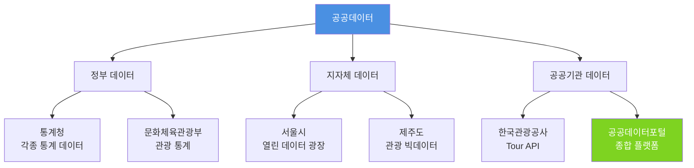
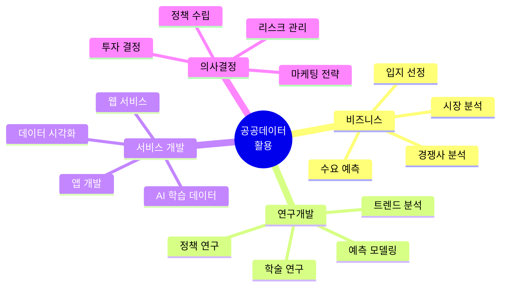
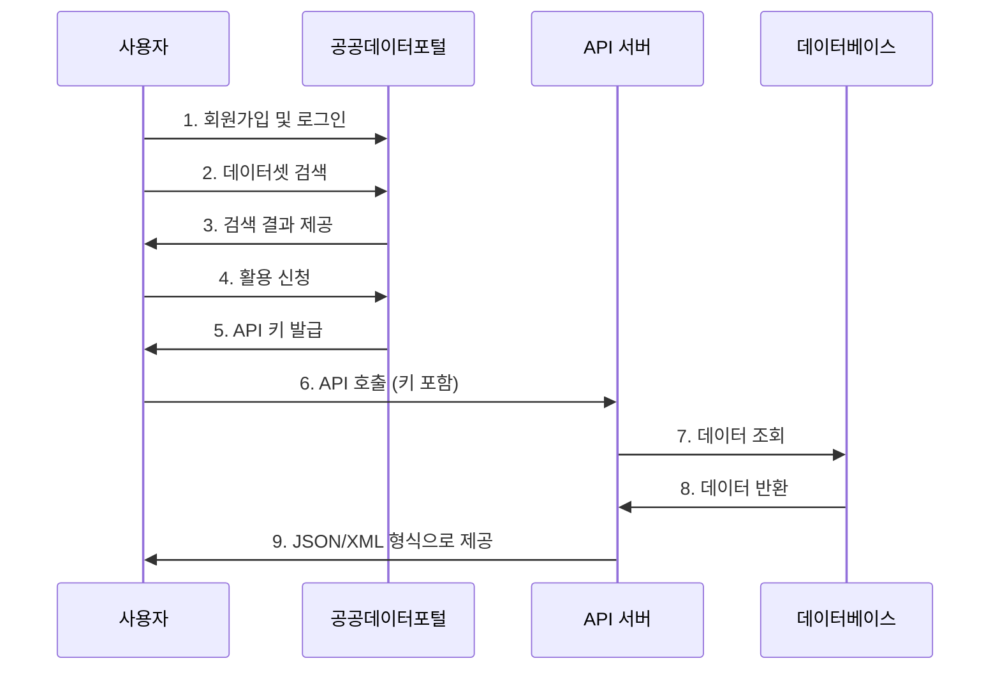
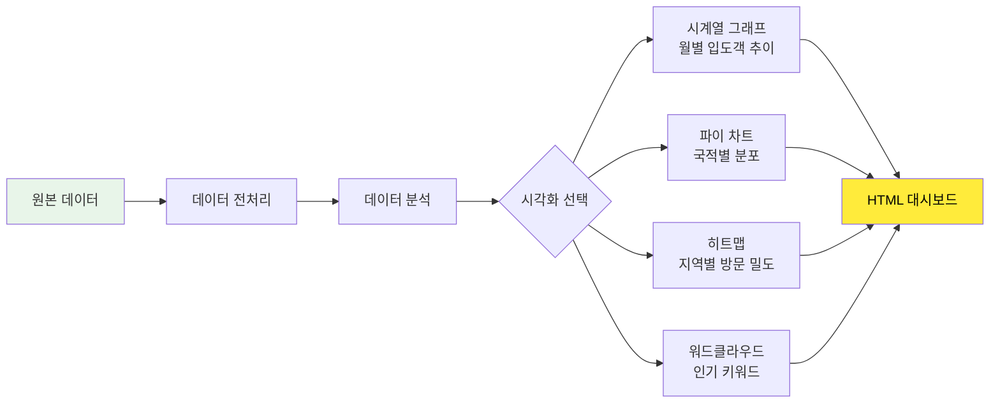
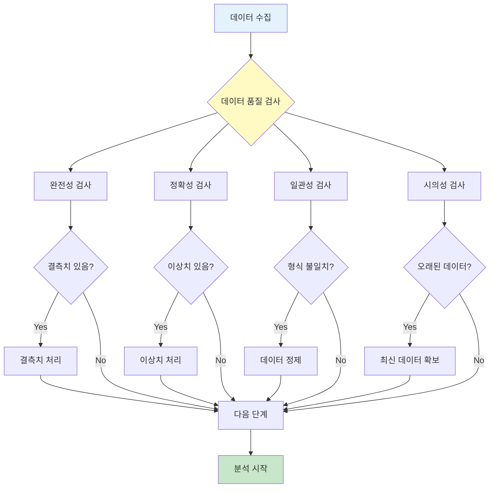
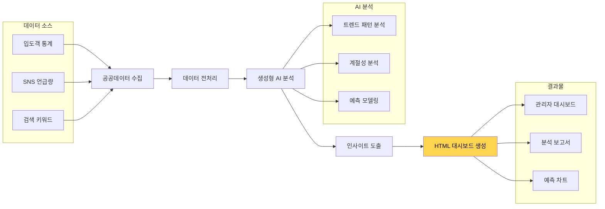
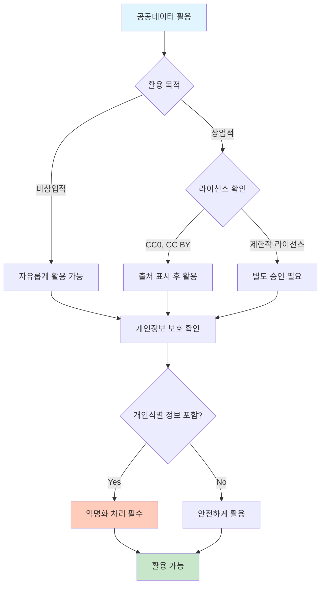

# 1. 공공데이터란?

공공데이터는 정부, 지방자치단체, 공공기관 등이 생성하거나 취득하여 관리하고 있는 데이터를 의미합니다. 이러한 데이터는 국민 누구나 활용할 수 있도록 개방되어 있으며, 다양한 분야에서 활용 가치가 높습니다.



## 1.1 공공데이터의 특징

**1. 무료 또는 저렴한 비용**
- 대부분의 공공데이터는 무료로 제공됩니다.
- 일부 데이터는 소액의 이용료가 있을 수 있습니다.

**2. 신뢰성**
- 공공기관이 직접 수집하고 관리하는 데이터로 신뢰도가 높습니다.
- 정기적인 업데이트와 품질 관리가 이루어집니다.

**3. 다양한 형식**
- CSV, JSON, XML, API 등 다양한 형식으로 제공됩니다.
- 개발자와 분석가 모두 활용하기 편리합니다.

**4. 법적 보호**
- 공공데이터법에 의해 개방과 활용이 법적으로 보장됩니다.
- 개인정보는 철저히 보호됩니다.

## 1.2 공공데이터의 활용 분야



# 2. 제주 관광 공공데이터 플랫폼

## 2.1 공공데이터포털 (data.go.kr)

공공데이터포털은 대한민국 정부가 운영하는 공공데이터 통합 제공 시스템입니다.

**주요 제주 관광 데이터셋:**

| 데이터명 | 제공기관 | 내용 | 활용도 |
|---------|---------|------|--------|
| 제주 관광지 정보 | 제주관광공사 | 관광지 위치, 설명, 카테고리 | ★★★★★ |
| 제주 숙박업소 현황 | 제주특별자치도 | 호텔, 펜션, 게스트하우스 정보 | ★★★★☆ |
| 제주 음식점 정보 | 제주특별자치도 | 레스토랑, 카페 정보 | ★★★★☆ |
| 제주 입도객 통계 | 제주관광공사 | 월별/연도별 방문객 통계 | ★★★★★ |
| 제주 교통 데이터 | 제주특별자치도 | 대중교통, 렌터카 통계 | ★★★☆☆ |

**데이터 수집 절차:**



## 2.2 제주관광 빅데이터서비스 플랫폼 (data.ijto.or.kr)

제주관광공사가 운영하는 전문 관광 데이터 플랫폼입니다.

**제공 데이터:**

1. **입도객 통계**
   - 일별/월별/연도별 방문객 수
   - 내국인/외국인 구분
   - 국적별 분포
   - 연령대별 분포

2. **관광 트렌드**
   - 인기 관광지 순위
   - 검색 키워드 분석
   - SNS 언급량 분석
   - 계절별 트렌드

3. **상권 분석**
   - 업종별 매출 통계
   - 지역별 상권 현황
   - 유동인구 데이터
   - 카드 소비 패턴

**데이터 시각화 예시:**



## 2.3 한국관광공사 Tour API

한국관광공사가 제공하는 관광 정보 API 서비스입니다.

**주요 API 목록:**

| API 명 | 기능 | 예시 활용 |
|--------|------|----------|
| 지역기반 관광정보 조회 | 제주도 전체 관광지 목록 | 관광 앱 개발 |
| 위치기반 관광정보 조회 | 현재 위치 주변 관광지 | 위치 기반 추천 |
| 키워드 검색 | '한라산', '해수욕장' 검색 | 검색 기능 구현 |
| 축제/공연/행사 정보 | 제주 축제 일정 | 이벤트 캘린더 |
| 숙박 정보 조회 | 호텔, 펜션 정보 | 숙박 예약 플랫폼 |

# 3. 공공데이터 활용 실습

## 3.1 데이터 다운로드 방법

**방법 1: 파일 다운로드**
```
1. 공공데이터포털 접속 (https://www.data.go.kr)
2. '제주 관광' 검색
3. 원하는 데이터셋 선택
4. '파일데이터' 탭에서 CSV 또는 Excel 다운로드
```

**방법 2: API 활용**
```
1. 공공데이터포털에서 API 서비스 신청
2. 승인 후 API 키 발급 (1-2일 소요)
3. API 문서 확인 후 엔드포인트 호출
4. JSON 또는 XML 형식으로 데이터 수신
```

**방법 3: 웹 스크래핑 (참고용)**
```
1. 제주관광공사 웹사이트 접속
2. robots.txt 확인 (스크래핑 허용 여부)
3. 법적 문제 없는 범위에서 데이터 수집
4. 과도한 요청으로 서버 부하 주지 않기
```

## 3.2 생성형 AI를 활용한 데이터 탐색

공공데이터를 다운로드한 후, ChatGPT나 Claude와 같은 생성형 AI를 활용하여 데이터를 분석할 수 있습니다.

**기본 데이터 탐색 프롬프트:**

```
나는 제주 관광 데이터를 분석하려고 해. 첨부한 CSV 파일을 분석해서 다음 정보를 알려줘:

1. 데이터의 전체 구조 (컬럼명, 데이터 타입, 행 개수)
2. 각 컬럼의 결측치 비율
3. 기초 통계량 (평균, 중앙값, 최대값, 최소값)
4. 데이터에서 발견되는 특이사항이나 패턴

그리고 이 데이터로 할 수 있는 흥미로운 분석 3가지를 추천해줘.
```

**데이터 시각화 프롬프트 (HTML 대시보드 생성):**

```
첨부한 제주 입도객 데이터를 사용해서 인터랙티브 HTML 대시보드를 만들어줘.

요구사항:
1. Chart.js 또는 D3.js를 사용한 시각화
2. 반응형 디자인 (모바일에서도 잘 보이게)
3. 다음 차트를 포함:
   - 월별 입도객 추이 (선 그래프)
   - 국적별 방문객 비율 (파이 차트)
   - 연도별 비교 (막대 그래프)
4. 테마: 제주를 연상시키는 파랑/초록 계열 색상
5. 제목, 설명, 데이터 출처 표시

완성된 HTML 파일 하나로 제공해줘.
```

**데이터 분석 보고서 프롬프트:**

```
제주 관광 데이터를 분석해서 경영진에게 제출할 분석 보고서를 HTML 형식으로 만들어줘.

보고서 구성:
1. 요약 (Executive Summary)
2. 데이터 개요
3. 주요 발견사항 (Key Findings)
   - 입도객 트렌드 분석
   - 성수기/비수기 패턴
   - 국적별 특성
4. 시각화 자료 (차트 포함)
5. 인사이트 및 제언
6. 결론

스타일:
- 전문적이고 깔끔한 디자인
- 인쇄 가능한 레이아웃
- 차트는 이미지가 아닌 Chart.js로 구현
- PDF 변환 가능하게 페이지 구분
```

## 3.3 데이터 품질 확인

공공데이터를 사용하기 전에 품질을 확인하는 것이 중요합니다.



**데이터 품질 확인 프롬프트:**

```
첨부한 CSV 파일의 데이터 품질을 검사해줘.

확인 항목:
1. 결측치 (Missing Values)
   - 각 컬럼별 결측치 개수와 비율
   - 결측치 패턴 분석 (완전 무작위인지, 특정 패턴이 있는지)

2. 이상치 (Outliers)
   - 수치형 데이터의 이상치 탐지
   - 상자 그림(Box Plot)으로 시각화

3. 데이터 형식
   - 날짜 형식의 일관성
   - 문자열 인코딩 문제
   - 숫자 형식 (쉼표, 소수점 등)

4. 중복 데이터
   - 중복 행 개수
   - 중복 기준 (모든 컬럼 vs 특정 컬럼)

검사 결과를 표로 정리하고, 발견된 문제에 대한 해결 방안을 제시해줘.
```

# 4. 실전 활용 사례

## 4.1 제주 관광 트렌드 분석



## 4.2 관광 상품 기획

공공데이터를 활용하여 데이터 기반 관광 상품을 기획할 수 있습니다.

**활용 프롬프트 예시:**

```
제주 관광 데이터를 분석해서 새로운 관광 상품을 기획하고 싶어.

첨부한 데이터:
1. 최근 3년간 입도객 통계
2. 인기 관광지 순위
3. SNS 언급 키워드

분석 및 기획 요청사항:
1. 데이터 기반으로 타겟 고객층 3가지 정의
2. 각 고객층별 선호하는 관광 패턴 분석
3. 시장에 없는 새로운 관광 상품 아이디어 3가지 제안
4. 각 상품의 예상 수요와 수익성 분석
5. 마케팅 전략 제안

결과를 HTML 형식의 사업 기획서로 만들어줘. 차트와 표를 적극 활용하고, 인쇄했을 때 깔끔하게 보이도록 해줘.
```

## 4.3 지역별 관광 전략 수립

```
제주도를 4개 권역(제주시, 서귀포시, 동부, 서부)으로 나눠서 각 지역별 관광 전략을 수립하려고 해.

데이터:
- 지역별 방문객 수
- 지역별 관광지 현황
- 지역별 소비 패턴
- 교통 편의성 데이터

요청사항:
1. 각 권역의 현재 상황 분석 (SWOT 분석)
2. 권역별 차별화 전략 제안
3. 권역 간 연계 관광 루트 개발
4. 예상 효과 시뮬레이션

결과를 인터랙티브 HTML 대시보드로 만들어줘:
- 제주 지도에 권역 표시
- 각 권역 클릭 시 상세 분석 표시
- 비교 차트 제공
- 전략 로드맵 타임라인
```

# 5. 데이터 활용 시 주의사항

## 5.1 법적 고려사항



**주의사항:**

1. **저작권 확인**
   - 각 데이터셋의 라이선스 정보 확인
   - 출처 명시 의무 준수

2. **개인정보 보호**
   - 개인을 식별할 수 있는 정보 제거
   - 통계 데이터로만 활용

3. **상업적 이용**
   - 상업적 목적 사용 시 별도 확인 필요
   - 일부 데이터는 상업적 이용 제한

4. **데이터 재배포**
   - 가공한 데이터의 재배포 가능 여부 확인
   - 원본 데이터 재배포는 대부분 제한

## 5.2 데이터 윤리

공공데이터를 활용할 때는 윤리적 측면도 고려해야 합니다.

**윤리적 고려사항:**

- **편향 확인**: 데이터에 내재된 편향이 있는지 확인
- **공정성**: 특정 집단에 불리하지 않도록 주의
- **투명성**: 분석 방법과 한계를 명확히 밝힘
- **책임**: 분석 결과의 사회적 영향 고려

# 6. 다음 단계

이제 공공데이터를 확보하고 기본적인 탐색을 마쳤다면, 다음 챕터에서는 생성형 AI를 활용하여 본격적인 데이터 분석을 진행하겠습니다.

**다음 챕터 미리보기:**
- ChatGPT/Claude를 활용한 데이터 분석
- 파이썬 코드 생성 없이 분석하기
- HTML 기반 분석 보고서 자동 생성
- 인터랙티브 대시보드 만들기

:::div{.callout}
**실습 팁**: 지금 바로 공공데이터포털(https://www.data.go.kr)에 접속하여 '제주 관광' 또는 본인이 관심있는 키워드로 검색해보세요. 다양한 데이터셋을 살펴보면서 어떤 분석이 가능할지 상상해보는 것만으로도 좋은 학습이 됩니다.
:::
