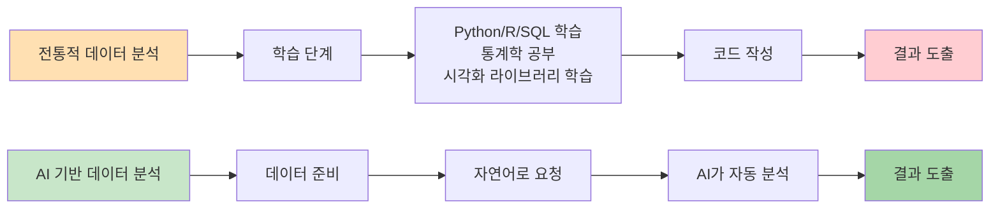
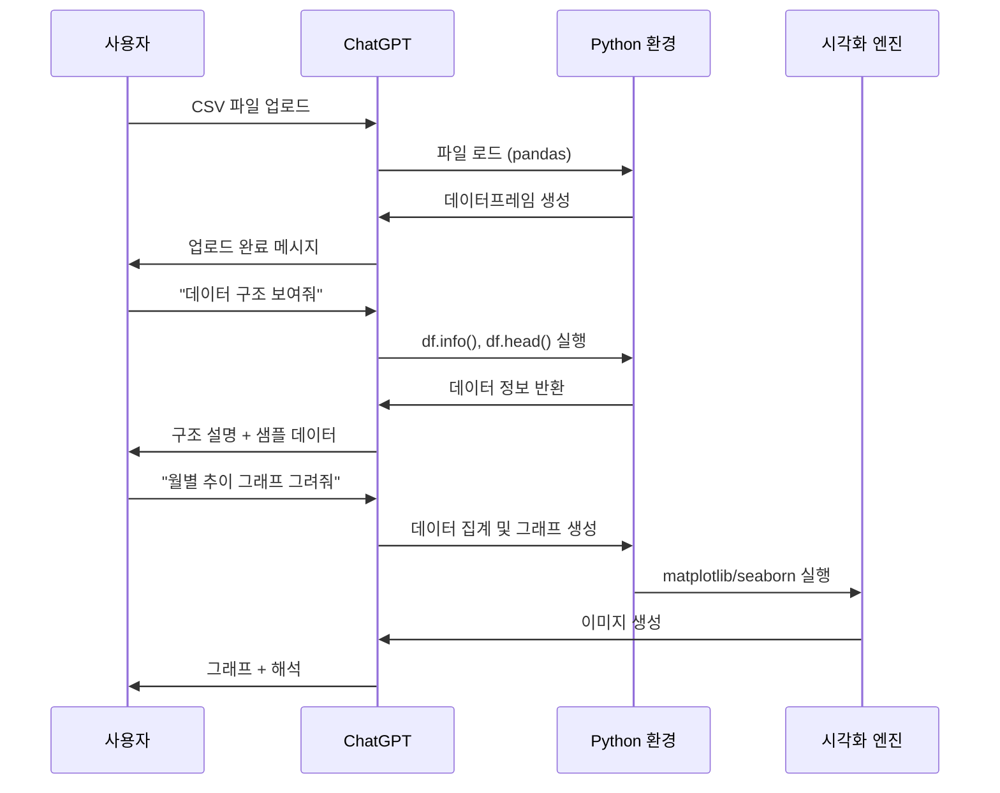
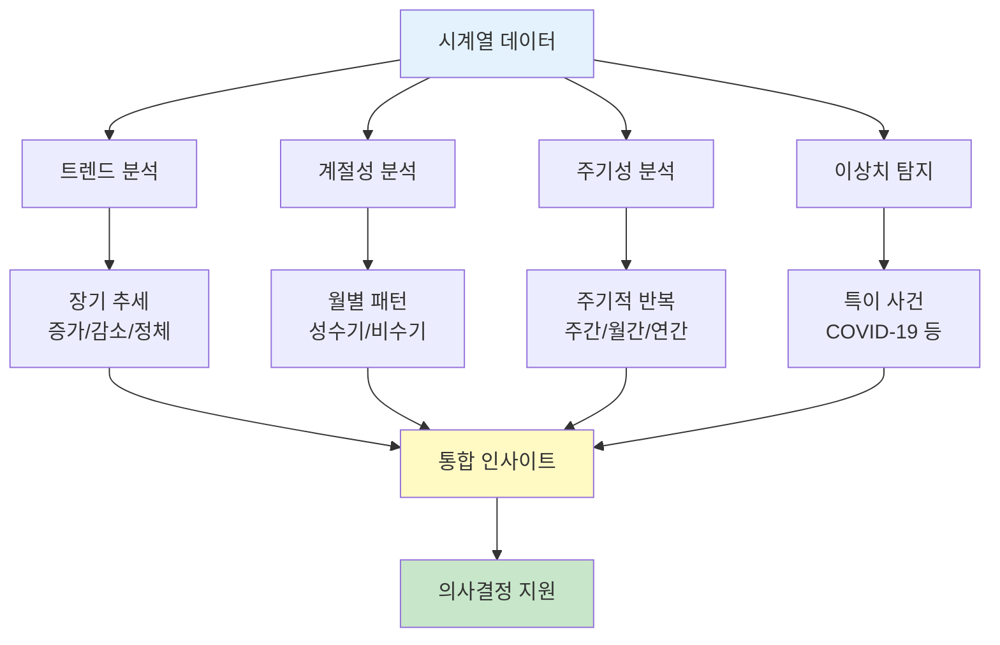
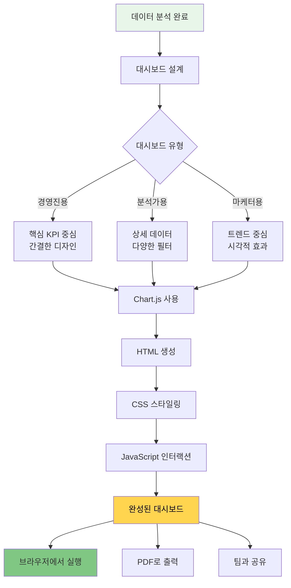
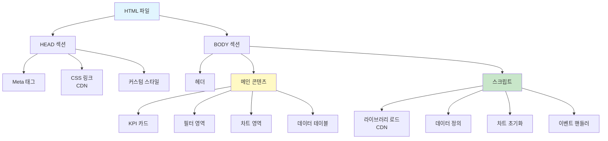
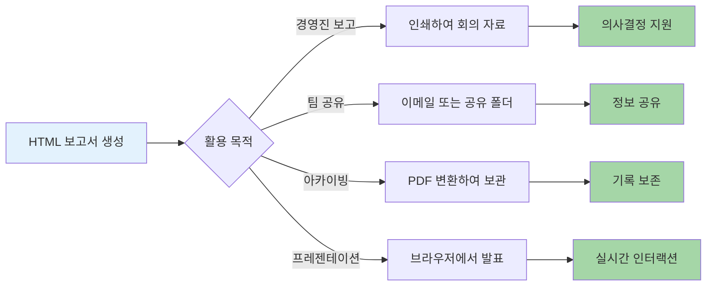
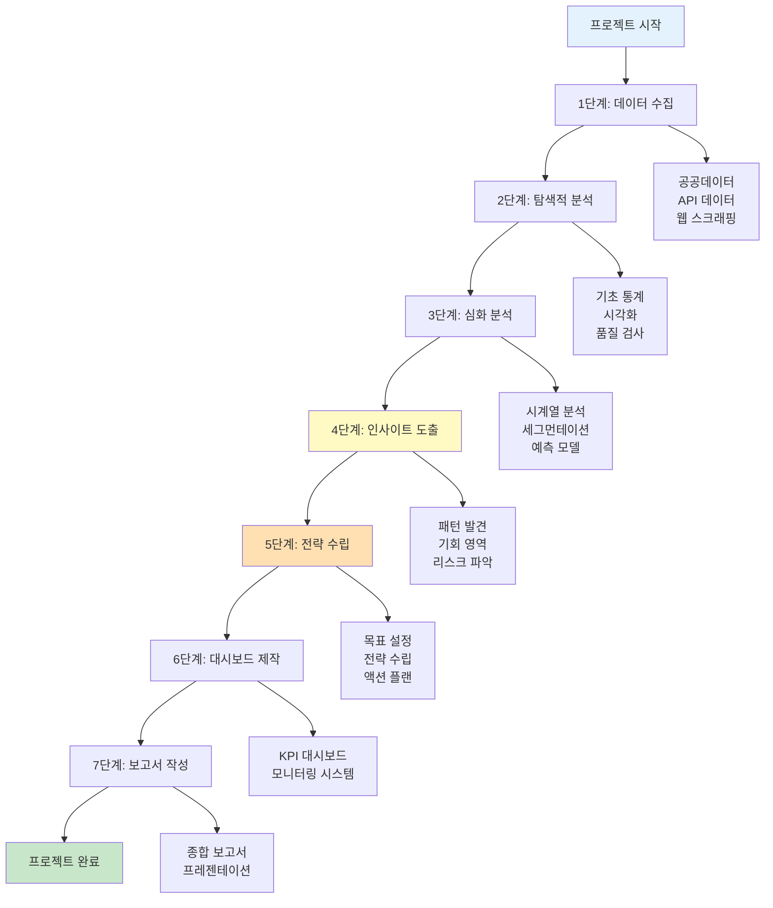
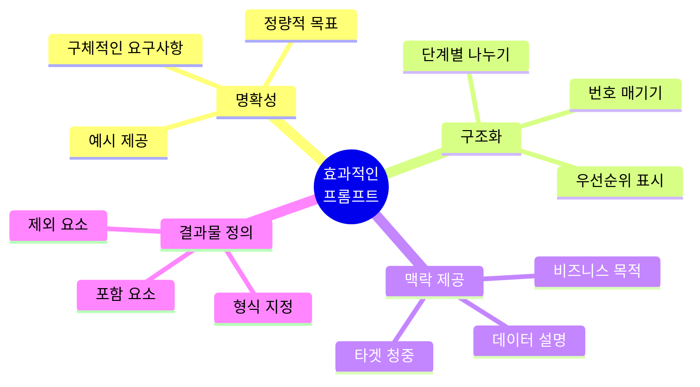

# 1. 생성형 AI로 데이터 분석하기

이전 챕터에서 공공데이터를 확보하는 방법을 배웠습니다. 이제 생성형 AI를 활용하여 실제로 데이터를 분석해보겠습니다.

전통적인 데이터 분석에서는 파이썬, R, SQL 같은 프로그래밍 언어를 배워야 했지만, 생성형 AI를 활용하면 자연어로 데이터 분석을 요청하고 결과를 얻을 수 있습니다.



## 1.1 생성형 AI 데이터 분석의 장점

**1. 진입 장벽 낮음**
- 프로그래밍 지식 불필요
- 자연어로 분석 요청
- 즉각적인 결과 확인

**2. 빠른 프로토타이핑**
- 다양한 분석 아이디어를 빠르게 테스트
- 실시간 피드백
- 반복 개선 용이

**3. 자동화된 시각화**
- 차트 자동 생성
- HTML 대시보드 즉시 생성
- 인터랙티브 요소 추가

**4. 통찰력 제공**
- AI가 패턴 발견
- 추가 분석 방향 제안
- 비즈니스 인사이트 도출

## 1.2 지원하는 생성형 AI 도구

| 도구 | 데이터 분석 기능 | 장점 | 제한사항 |
|------|----------------|------|----------|
| ChatGPT (Plus) | 파일 업로드, Code Interpreter | Python 실행 환경, 차트 생성 | 파일 크기 제한 |
| Claude | 파일 업로드, 데이터 분석 | 긴 문맥 이해, 상세한 설명 | 실행 환경 제한적 |
| Google Gemini | Google Sheets 연동 | 실시간 데이터 연동 | 복잡한 분석 제한 |
| Perplexity | 웹 검색 + 분석 | 최신 데이터 접근 | 심화 분석 제한 |

# 2. ChatGPT를 활용한 데이터 분석

## 2.1 기본 데이터 업로드 및 탐색

ChatGPT에 데이터를 업로드하고 기본적인 탐색을 진행합니다.

**1단계: 데이터 업로드**



**프롬프트 예시 1: 데이터 구조 파악**

```
첨부한 '제주_입도객_통계.csv' 파일을 분석해줘.

먼저 다음 정보를 알려줘:
1. 전체 행 개수와 컬럼 개수
2. 각 컬럼의 이름과 데이터 타입
3. 결측치가 있는 컬럼과 그 개수
4. 데이터의 시간 범위 (가장 빠른 날짜 ~ 가장 늦은 날짜)
5. 샘플 데이터 5행

표 형식으로 정리해서 보여줘.
```

**예상 응답:**

ChatGPT는 다음과 같은 정보를 제공합니다:

| 항목 | 정보 |
|------|------|
| 전체 행 개수 | 1,825행 |
| 컬럼 개수 | 8개 |
| 시간 범위 | 2019-01-01 ~ 2023-12-31 |

| 컬럼명 | 데이터 타입 | 결측치 개수 | 설명 |
|--------|------------|-----------|------|
| date | object | 0 | 날짜 |
| total_visitors | int64 | 0 | 전체 방문객 수 |
| domestic | int64 | 3 | 내국인 수 |
| foreign | int64 | 15 | 외국인 수 |
| nationality | object | 15 | 국적 |
| age_group | object | 0 | 연령대 |
| purpose | object | 120 | 방문 목적 |
| region | object | 0 | 출발 지역 |

## 2.2 기초 통계 분석

**프롬프트 예시 2: 기초 통계량 분석**

```
이제 기초 통계 분석을 해줘:

1. 전체 방문객 수의 기초 통계량 (평균, 중앙값, 최대, 최소, 표준편차)
2. 내국인과 외국인 비율
3. 가장 많이 방문한 연령대 Top 3
4. 월별 평균 방문객 수
5. 요일별 방문 패턴

각 분석에 대해 비즈니스 인사이트도 함께 제공해줘.
```

**프롬프트 예시 3: 결측치 처리**

```
결측치가 있는 컬럼들을 처리하고 싶어.

각 컬럼별로:
1. 결측치가 발생한 패턴 분석 (무작위인지, 특정 기간에 집중되어 있는지)
2. 적절한 처리 방법 제안 (삭제, 평균값 대체, 보간 등)
3. 처리 방법별 장단점 설명

그리고 가장 적절한 방법으로 결측치를 처리한 후, 처리 전후 비교를 보여줘.
```

## 2.3 시계열 분석

제주 관광 데이터는 시계열 데이터이므로 시간에 따른 변화를 분석하는 것이 중요합니다.



**프롬프트 예시 4: 시계열 트렌드 분석**

```
제주 입도객 데이터의 시계열 분석을 해줘:

1. 연도별 전체 트렌드 (증가/감소/정체)
2. 계절성 분석 (어떤 달이 성수기인지)
3. COVID-19 영향 분석 (2020-2021년 변화)
4. 회복세 분석 (2022-2023년)
5. 2024년 예측

분석 결과를 다음과 같이 시각화해줘:
- 월별 방문객 추이 선 그래프
- 연도별 비교 막대 그래프
- 계절성 박스플롯
- 요일별 히트맵

각 그래프에 대한 해석도 함께 제공해줘.
```

**프롬프트 예시 5: 국적별 분석**

```
외국인 방문객 데이터를 국적별로 상세 분석해줘:

1. 국적별 방문객 수 Top 10
2. 각 국가별 선호 계절 (언제 가장 많이 방문하는지)
3. 국가별 체류 기간 패턴 (데이터에 있다면)
4. 연도별 국적 변화 추이 (어떤 국가가 증가/감소했는지)
5. 국적별 특성 분석

결과를:
- 파이 차트 (국적별 비율)
- 히트맵 (국적 × 월)
- 시계열 그래프 (주요 국가 3-5개)
로 시각화해줘.

그리고 이 데이터를 바탕으로 국가별 마케팅 전략을 제안해줘.
```

# 3. HTML 대시보드 자동 생성

## 3.1 인터랙티브 대시보드 프롬프트

생성형 AI의 가장 강력한 기능 중 하나는 분석 결과를 즉시 HTML 대시보드로 만들어주는 것입니다.



**프롬프트 예시 6: 경영진용 대시보드**

```
제주 관광 데이터를 분석한 결과로 경영진에게 보고할 HTML 대시보드를 만들어줘.

대시보드 구성:
1. 헤더
   - 제목: "제주 관광 현황 대시보드"
   - 데이터 기간 표시
   - 마지막 업데이트 일시

2. KPI 카드 (4개, 큰 숫자로 강조)
   - 전체 방문객 수 (전년 대비 증감율 포함)
   - 평균 일일 방문객
   - 외국인 비율
   - 성장률

3. 메인 차트
   - 월별 방문객 추이 (선 그래프, 3년치 비교)
   - 국적별 분포 (도넛 차트)
   - 계절별 비교 (막대 그래프)
   - 요일별 패턴 (히트맵)

4. 인사이트 섹션
   - 주요 발견사항 3-5개
   - 액션 아이템

5. 기술 요구사항
   - Chart.js 사용
   - 반응형 디자인 (모바일 지원)
   - 프린트 친화적
   - 다크/라이트 모드 토글
   - 차트 호버 시 상세 정보 표시

6. 색상 테마
   - 제주 바다를 연상시키는 블루 계열
   - 전문적이고 깔끔한 느낌

완성된 HTML 파일 하나로 제공해줘. 외부 의존성 최소화하고 CDN 사용.
```

**프롬프트 예시 7: 분석가용 인터랙티브 대시보드**

```
데이터 분석가를 위한 인터랙티브 HTML 대시보드를 만들어줘.

기능 요구사항:
1. 필터링 기능
   - 날짜 범위 선택 (Date Range Picker)
   - 국적 선택 (멀티 셀렉트)
   - 연령대 선택
   - 지역 선택

2. 인터랙티브 차트
   - 차트 클릭 시 드릴다운
   - 범례 클릭으로 데이터 토글
   - 줌 인/아웃 기능
   - 데이터 포인트 호버 시 툴팁

3. 데이터 테이블
   - 정렬 가능
   - 검색 기능
   - 페이지네이션
   - CSV 다운로드 버튼

4. 통계 패널
   - 선택된 필터에 따른 실시간 통계 업데이트
   - 평균, 중앙값, 표준편차 등
   - 비교 분석 (전년 동기 대비)

5. 고급 기능
   - 대시보드 상태 URL로 저장 (북마크 가능)
   - 차트 이미지로 다운로드
   - 레포트 생성 버튼

사용 라이브러리:
- Chart.js (차트)
- DataTables (테이블)
- Flatpickr (날짜 선택)
- Select2 (멀티 셀렉트)

모든 라이브러리는 CDN 사용해서 단일 HTML 파일로 만들어줘.
```

## 3.2 대시보드 예시 코드 구조

생성형 AI가 생성하는 HTML 대시보드는 다음과 같은 구조를 가집니다.



# 4. 분석 보고서 자동 생성

## 4.1 전문적인 분석 보고서

대시보드 외에도 문서 형태의 분석 보고서가 필요할 때가 있습니다.

**프롬프트 예시 8: 종합 분석 보고서**

```
제주 관광 데이터 분석 결과를 바탕으로 전문적인 분석 보고서를 HTML 형식으로 작성해줘.

보고서 구조:
1. 커버 페이지
   - 보고서 제목
   - 작성일
   - 분석 기간
   - 보고서 요약 (Executive Summary)

2. 목차 (TOC)
   - 클릭 가능한 링크

3. 1장: 분석 개요
   - 분석 목적
   - 데이터 소스
   - 분석 방법론
   - 데이터 품질 평가

4. 2장: 기초 분석
   - 기술 통계량
   - 데이터 분포
   - 상관관계 분석
   - 이상치 분석

5. 3장: 트렌드 분석
   - 시계열 분석
   - 계절성 분석
   - 연도별 비교
   - COVID-19 영향 분석

6. 4장: 세그먼트 분석
   - 국적별 분석
   - 연령대별 분석
   - 지역별 분석
   - 목적별 분석

7. 5장: 핵심 발견사항 (Key Findings)
   - 주요 인사이트 5-7개
   - 각 인사이트의 근거 데이터
   - 비즈니스 영향 평가

8. 6장: 제언 (Recommendations)
   - 단기 액션 아이템
   - 중장기 전략 제안
   - 추가 분석 필요 영역

9. 7장: 결론
   - 종합 정리
   - 향후 모니터링 지표

10. 부록
    - 상세 데이터 테이블
    - 분석 코드 (필요시)
    - 용어 설명

스타일 요구사항:
- 페이지 구분 (인쇄 시 페이지 브레이크)
- 전문적인 타이포그래피
- 차트는 고해상도
- 페이지 번호
- 헤더/푸터
- 인용 스타일 각주

모든 차트는 Chart.js로 구현하고, 인쇄 시에도 잘 보이게 해줘.
PDF로 변환 가능하게 만들어줘.
```

## 4.2 분석 보고서의 활용



# 5. 고급 분석 기법

:::div{.callout}
고급 예측을 할 때에는 colab 환경에서 진행하는 것을 권합니다. colab 환경에서도 gemini가 붙어있어 프롬프트 기반 분석이 가능합니다.
:::

## 5.1 예측 모델링

**프롬프트 예시 9: 방문객 예측**

```
제주 입도객 데이터를 사용해서 향후 6개월의 방문객 수를 예측해줘.

요구사항:
1. 시계열 분석 기법 사용 (ARIMA, Prophet 등)
2. 계절성과 트렌드를 고려
3. 과거 데이터로 모델 검증 (최근 6개월 제외하고 학습, 예측 결과와 실제 비교)
4. 예측 정확도 평가 (MAPE, RMSE)
5. 95% 신뢰구간 함께 제공

결과를 다음과 같이 시각화해줘:
- 과거 데이터 + 예측값 선 그래프
- 신뢰구간을 음영으로 표시
- 주요 이벤트 표시 (공휴일, 축제 등)

그리고 예측 결과를 바탕으로 다음을 제안해줘:
- 성수기 대비 전략
- 비수기 활성화 방안
- 리스크 요인
```

## 5.2 고객 세그먼테이션

**프롬프트 예시 10: 클러스터링 분석**

```
제주 방문객 데이터를 사용해서 고객 세그먼테이션을 수행해줘.

분석 방법:
1. K-means 또는 DBSCAN 클러스터링
2. 변수: 방문 빈도, 체류 기간, 지출액, 연령대, 국적, 방문 계절
3. 최적 클러스터 개수 결정 (Elbow method, Silhouette score)
4. 각 세그먼트의 특성 분석

결과물:
1. 세그먼트별 프로필 (페르소나)
   - 인구통계학적 특성
   - 행동 패턴
   - 선호하는 관광지/활동
   - 지출 수준

2. 시각화
   - 3D 산점도 (PCA로 차원 축소)
   - 세그먼트별 레이더 차트
   - 세그먼트 크기 비교 (파이 차트)

3. 마케팅 전략
   - 각 세그먼트별 타겟 마케팅 방안
   - 채널 전략
   - 메시지 전략

HTML 대시보드로 만들어서 각 세그먼트를 클릭하면 상세 정보가 나오게 해줘.
```

## 5.3 A/B 테스트 분석

**프롬프트 예시 11: 캠페인 효과 분석**

```
제주 관광 마케팅 캠페인의 효과를 분석하고 싶어.

데이터:
- 캠페인 기간: 2023년 7-8월
- 타겟: 20-30대 내국인
- 캠페인 내용: SNS 광고 + 할인 프로모션

분석 요청:
1. 캠페인 전후 비교
   - 방문객 수 변화
   - 타겟 세그먼트 비중 변화
   - 지출액 변화

2. 통계적 유의성 검정
   - t-test 또는 Mann-Whitney U test
   - p-value 계산
   - 효과 크기 (Cohen's d)

3. 대조군 설정
   - 전년 동기 데이터
   - 타 지역 비교 (가능하다면)

4. ROI 계산
   - 캠페인 비용 대비 수익 증가
   - Break-even 분석

5. 시각화
   - 캠페인 전후 비교 막대 그래프
   - 일별 트렌드 (캠페인 기간 강조)
   - 세그먼트별 효과 히트맵

결과를 경영진에게 보고할 한 페이지 요약 + 상세 분석 보고서로 만들어줘.
```

# 6. 실전 프로젝트: 제주 관광 전략 수립

## 6.1 종합 분석 프로젝트

이제 배운 모든 내용을 종합하여 실제 제주 관광 전략을 수립하는 프로젝트를 진행해봅시다.



**종합 프로젝트 프롬프트:**

```
제주 관광 데이터를 종합적으로 분석하여 2024년 관광 전략을 수립하고 싶어.

첨부 파일:
- 입도객 통계 (2019-2023, 5년치)
- 관광지별 방문 데이터
- 숙박 시설 현황
- 소비 패턴 데이터

프로젝트 목표:
1. 현재 상황 진단
2. 성장 기회 발견
3. 경쟁 우위 확보 방안
4. 2024년 목표 수립 (정량적)
5. 실행 전략 및 로드맵

분석 내용:
[1단계: 현황 분석]
- 과거 5년 트렌드
- 강점/약점 분석
- 경쟁 지역 비교 (제주 vs 부산 vs 강원도)

[2단계: 세그먼트 분석]
- 핵심 고객층 정의
- 고가치 고객 특성
- 성장 잠재력 세그먼트

[3단계: 기회 탐색]
- 비수기 활성화 방안
- 신규 시장 진출 (어떤 국가를 타겟할지)
- 니치 마켓 발굴

[4단계: 전략 수립]
- 마케팅 전략 (채널, 메시지, 타이밍)
- 상품 개발 전략 (어떤 관광 상품을 만들지)
- 인프라 투자 우선순위

[5단계: 목표 및 KPI]
- 2024년 방문객 목표
- 세그먼트별 세부 목표
- 모니터링 KPI 정의

결과물:
1. 경영진 보고용 파워포인트 스타일 HTML (15-20페이지)
   - 각 페이지는 1개의 핵심 메시지
   - 임팩트 있는 비주얼
   - 페이지 전환 애니메이션

2. 실무진용 상세 분석 보고서 HTML (50+ 페이지)
   - 모든 분석 근거
   - 상세 데이터 테이블
   - 참고 자료

3. 라이브 대시보드 HTML
   - 실시간 KPI 모니터링
   - 목표 대비 달성률
   - 알림 기능 (목표 미달 시 경고)

4. 실행 계획서 HTML
   - 분기별 액션 아이템
   - 책임자 지정
   - 예산 배분
   - 타임라인 (Gantt 차트)

모든 결과물은 인터랙티브하고, 인쇄 가능하며, 브랜드 일관성 있게 디자인해줘.
색상 테마는 제주의 자연을 반영한 블루-그린 계열로.
```

## 6.2 프로젝트 체크리스트

프로젝트를 진행할 때 다음 체크리스트를 활용하세요:

**데이터 준비**
- [ ] 필요한 모든 데이터 수집 완료
- [ ] 데이터 품질 검사 완료
- [ ] 결측치 및 이상치 처리 완료
- [ ] 데이터 백업 완료

**분석 단계**
- [ ] 탐색적 데이터 분석 (EDA) 완료
- [ ] 주요 패턴 및 인사이트 문서화
- [ ] 통계적 검정 수행
- [ ] 시각화 자료 준비

**전략 수립**
- [ ] 비즈니스 목표 명확히 정의
- [ ] 데이터 기반 근거 확보
- [ ] 실행 가능성 검토
- [ ] 리스크 평가 완료

**결과물 제작**
- [ ] 대시보드 기능 테스트
- [ ] 모든 차트 정상 작동 확인
- [ ] 모바일 반응형 확인
- [ ] 인쇄 레이아웃 확인
- [ ] 최종 리뷰 및 수정

# 7. 팁과 모범 사례

## 7.1 효과적인 프롬프트 작성 팁



**Do's:**
- ✅ 구체적으로 요청 ("그래프 그려줘" → "월별 추이를 보여주는 선 그래프를 그려줘")
- ✅ 예상 결과 예시 제공
- ✅ 데이터 맥락 설명
- ✅ 단계적으로 진행
- ✅ 중간 확인 및 피드백

**Don'ts:**
- ❌ 모호한 요청 ("데이터 분석해줘")
- ❌ 한 번에 너무 많은 요청
- ❌ 맥락 없이 데이터만 업로드
- ❌ 결과 형식 미지정
- ❌ 에러 무시하고 진행

## 7.2 생성형 AI 분석의 한계와 보완

**한계점:**

1. **데이터 크기 제한**
   - 업로드 가능 파일 크기 제한
   - 대용량 데이터 처리 속도 느림

2. **복잡한 분석의 정확성**
   - 고급 통계 기법의 정확성 검증 필요
   - 도메인 지식 필요

3. **재현성**
   - 같은 프롬프트에도 다른 결과 가능
   - 코드 보존 필요

**보완 방법:**

```
분석 결과의 신뢰성을 높이기 위해:

1. 사용한 분석 방법론을 상세히 설명해줘
2. 각 단계의 Python 코드를 제공해줘
3. 통계적 가정과 제약사항을 명시해줘
4. 결과의 한계점과 주의사항을 알려줘
5. 추가 검증이 필요한 부분을 표시해줘

이렇게 하면 나중에 전문가 리뷰나 재분석이 가능해.
```

# 8. 다음 단계

제주 관광 데이터 분석을 완료했다면, 이제 이 방법을 회사 데이터에 적용할 차례입니다.

**다음 챕터 미리보기:**
- 회사 내부 데이터 분석 (매출, 인사, 운영 데이터)
- 동종 업계 벤치마킹 데이터 수집 및 분석
- 회사 맞춤형 대시보드 구축
- 정기 리포트 자동화

:::div{.callout}
**실습 과제**: 이번 챕터에서 배운 프롬프트를 실제로 ChatGPT나 Claude에 입력해보세요. 공공데이터포털에서 제주 관광 데이터를 다운로드하거나, 관심있는 다른 데이터로 시도해봐도 좋습니다. 생성된 대시보드나 보고서를 팀원들과 공유하고 피드백을 받아보세요!
:::
