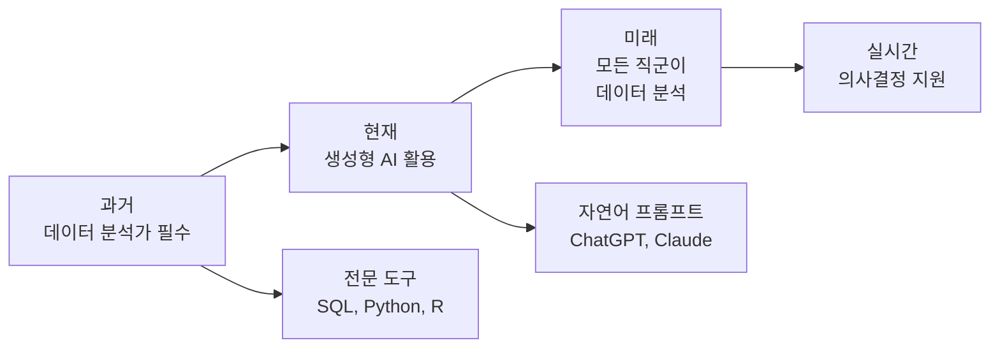
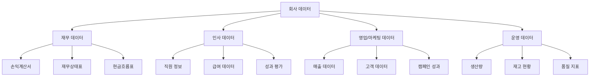
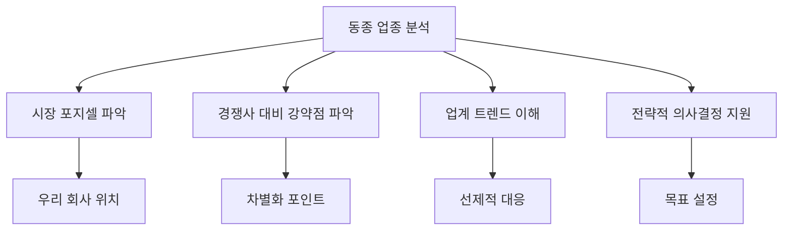
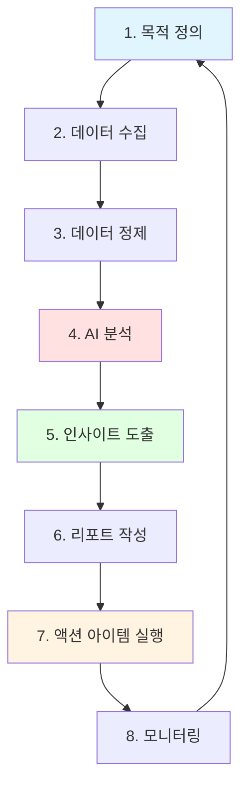

# 1. 생성형 AI를 활용한 회사 데이터 분석의 중요성

기업의 데이터는 의사결정의 핵심 자산입니다. 과거에는 데이터 분석 전문가만이 복잡한 데이터를 다룰 수 있었지만, 생성형 AI의 등장으로 이제 모든 직군이 데이터를 분석하고 인사이트를 도출할 수 있게 되었습니다.

## 1.1 기업 데이터 분석의 패러다임 전환



생성형 AI를 활용하면:
- **분석 시간 단축**: 몇 시간 걸리던 분석이 몇 분으로 단축
- **진입 장벽 완화**: 코딩 없이 자연어로 데이터 분석
- **인사이트 자동 도출**: AI가 패턴을 발견하고 해석 제공
- **시각화 자동 생성**: 그래프와 차트를 즉시 생성

## 1.2 분석 가능한 회사 데이터 유형



# 2. 회사 사내 데이터 분석

## 2.1 재무 데이터 분석

### 2.1.1 수집 가능한 재무 데이터

```
재무 데이터 카테고리
├── 수익 데이터
│   ├── 월별/분기별 매출
│   ├── 제품별/서비스별 매출
│   └── 지역별/고객별 매출
├── 비용 데이터
│   ├── 고정비 (인건비, 임차료)
│   ├── 변동비 (재료비, 마케팅비)
│   └── 부서별 예산 집행
├── 수익성 지표
│   ├── 매출총이익률
│   ├── 영업이익률
│   └── 순이익률
└── 현금흐름
    ├── 영업활동 현금흐름
    ├── 투자활동 현금흐름
    └── 재무활동 현금흐름
```

### 2.1.2 재무 데이터 분석 프롬프트

```
[역할]
너는 재무 분석 전문가야.

[맥락]
- 회사명: [회사명]
- 산업: [업종]
- 분석 기간: [YYYY-MM ~ YYYY-MM]
- 데이터: 아래 첨부된 CSV/Excel 파일 참조

[작업]
다음 재무 데이터를 분석하고 경영진에게 보고할 인사이트를 도출해줘.

[첨부 데이터]
[CSV 또는 Excel 데이터 붙여넣기]

[형식]
1. 전체 요약 (Executive Summary)
2. 주요 지표 분석
   - 매출 성장률 (YoY, MoM)
   - 수익성 지표 (매출총이익률, 영업이익률, 순이익률)
   - 비용 구조 분석
3. 트렌드 분석 (시계열 그래프로 시각화)
4. 이상치 및 특이사항
5. 개선 방안 제안
6. 차기 분기 전망

추가 요구사항:
- 모든 수치는 전년 동기 대비 비교
- 시각화는 mermaid 또는 HTML 차트로 제공
- 구체적인 액션 아이템 3가지 이상 제시
```

### 2.1.3 실전 활용 예시

만약 2024년 월별 매출 데이터가 다음과 같다면:

| 월 | 매출 (백만원) | 비용 (백만원) | 영업이익 (백만원) |
|----|------------|------------|---------------|
| 1월 | 150 | 120 | 30 |
| 2월 | 145 | 115 | 30 |
| 3월 | 180 | 130 | 50 |
| 4월 | 165 | 125 | 40 |
| 5월 | 190 | 135 | 55 |
| 6월 | 210 | 145 | 65 |

이 데이터를 ChatGPT나 Claude에 넣고 위 프롬프트와 함께 분석 요청하면:
- 매출 증가 트렌드 파악
- 3월, 6월 매출 급증 원인 추정
- 비용 대비 매출 효율성 분석
- 향후 3개월 매출 예측

## 2.2 인사(HR) 데이터 분석

### 2.2.1 수집 가능한 HR 데이터

```
HR 데이터 카테고리
├── 직원 현황
│   ├── 인원수 (부서별, 직급별, 연령별)
│   ├── 근속 연수
│   └── 재직/퇴사 현황
├── 채용 데이터
│   ├── 채용 소요 시간
│   ├── 채용 경로별 지원자 수
│   └── 채용 성공률
├── 이직률 및 리텐션
│   ├── 부서별 이직률
│   ├── 퇴사 사유 분석
│   └── 리텐션 리스크 직원
├── 성과 데이터
│   ├── 평가 점수 분포
│   ├── 목표 달성률
│   └── 승진 현황
└── 급여 및 복지
    ├── 급여 수준 (시장 대비)
    ├── 인센티브 지급 현황
    └── 복지 만족도
```

### 2.2.2 HR 데이터 분석 프롬프트

```
[역할]
너는 인사 데이터 분석 전문가야.

[맥락]
- 회사 규모: [직원 수]
- 주요 이슈: [높은 이직률/채용 어려움/성과 관리 등]
- 분석 목적: [문제 파악/개선 방안 도출/정책 수립]

[작업]
다음 HR 데이터를 분석하고 인사 전략을 제안해줘.

[데이터]
[HR 데이터 붙여넣기]

[형식]
1. 인력 현황 요약
2. 주요 발견사항
   - 이직률 분석 (부서별, 직급별, 근속연수별)
   - 채용 효율성 분석
   - 성과 분포 및 이상치
3. 문제점 진단
4. 개선 방안
   - 단기 (3개월 이내)
   - 중기 (6개월~1년)
   - 장기 (1년 이상)
5. 예상 효과 (정량적 수치 포함)
```

## 2.3 영업/마케팅 데이터 분석

### 2.3.1 수집 가능한 영업/마케팅 데이터

```
영업/마케팅 데이터
├── 고객 데이터
│   ├── 고객 세그먼트별 분석
│   ├── 신규 고객 vs 기존 고객
│   ├── 고객 생애 가치 (LTV)
│   └── 고객 이탈률 (Churn Rate)
├── 세일즈 퍼널 데이터
│   ├── 단계별 전환율
│   ├── 평균 거래 규모
│   ├── 영업 사이클 기간
│   └── 성사율
├── 마케팅 캠페인 성과
│   ├── 채널별 ROI (광고, SNS, 이메일 등)
│   ├── CAC (고객 획득 비용)
│   ├── 캠페인별 전환율
│   └── 콘텐츠 성과 분석
└── 웹/앱 데이터
    ├── 트래픽 및 유입 경로
    ├── 페이지별 체류 시간
    ├── 이탈률
    └── 전환 경로 분석
```

### 2.3.2 마케팅 성과 분석 프롬프트

```
[역할]
너는 디지털 마케팅 분석 전문가야.

[맥락]
- 회사: [회사명 및 업종]
- 분석 기간: [기간]
- 주요 마케팅 채널: [Google Ads, Meta Ads, 네이버, 인스타그램 등]
- 예산: [총 마케팅 예산]

[작업]
다음 마케팅 캠페인 데이터를 분석하고 최적화 방안을 제시해줘.

[데이터]
| 채널 | 비용 | 노출수 | 클릭수 | 전환수 | 매출 |
|------|------|--------|--------|--------|------|
[데이터 입력]

[형식]
1. 채널별 성과 요약
2. 주요 지표 분석
   - CTR (Click Through Rate)
   - CPC (Cost Per Click)
   - CVR (Conversion Rate)
   - CPA (Cost Per Acquisition)
   - ROAS (Return On Ad Spend)
3. 채널별 효율성 비교 (표와 차트)
4. 비효율 채널 및 원인 분석
5. 예산 재배분 제안
6. A/B 테스트 아이디어
7. 다음 달 KPI 목표 설정

시각화:
- 채널별 ROAS 비교 차트
- 퍼널 전환율 시각화
- 주간/월간 트렌드 그래프
```

## 2.4 운영 데이터 분석

### 2.4.1 운영 데이터 유형

제조업, 서비스업, IT 기업 등 업종에 따라 운영 데이터는 다르지만, 공통적으로 분석할 수 있는 데이터는:

- **생산성 지표**: 처리량, 생산량, 작업 완료율
- **품질 지표**: 불량률, 고객 불만율, 재작업률
- **효율성 지표**: 리소스 활용률, 대기 시간, 처리 시간
- **재고 관리**: 재고 회전율, 적정 재고 수준, 발주 주기

### 2.4.2 운영 데이터 분석 프롬프트

```
[역할]
너는 운영 효율성 분석 전문가야.

[맥락]
- 업종: [제조/서비스/IT 등]
- 분석 대상: [생산 라인/서비스 프로세스/개발 프로세스]
- 목표: [생산성 향상/비용 절감/품질 개선]

[작업]
운영 데이터를 분석하고 병목 지점과 개선 방안을 찾아줘.

[데이터]
[운영 데이터 붙여넣기]

[형식]
1. 현황 요약
2. 주요 지표 분석
   - 처리량 및 생산성
   - 품질 지표
   - 리소스 활용률
3. 병목 구간 식별
4. 근본 원인 분석 (5 Whys 또는 Fishbone Diagram)
5. 개선 방안 (Quick Wins + 중장기 과제)
6. 예상 효과 (시간/비용 절감 정량화)
```

# 3. 동종 업종 분석 (벤치마킹)

## 3.1 동종 업종 분석의 중요성



## 3.2 수집 가능한 동종 업종 데이터

### 3.2.1 공개 데이터 소스

**1. 금융감독원 전자공시시스템 (DART)**
- 상장사의 사업보고서, 분기보고서
- 재무제표 및 주석 정보
- 주요 경영 지표

**2. 통계청 및 정부 기관**
- 산업별 통계
- 시장 규모 및 성장률
- 업종별 평균 지표

**3. 시장조사 기관 리포트**
- 한국신용정보원
- 한국은행 경제통계
- 업계 협회 발간 자료

**4. 뉴스 및 언론**
- 경쟁사 보도자료
- 업계 뉴스
- 전문가 분석 기사

**5. 웹 크롤링 (합법적 범위 내)**
- 경쟁사 홈페이지
- 채용 공고 (기술 스택, 조직 규모 추정)
- SNS 및 리뷰 사이트

## 3.3 동종 업종 벤치마킹 프롬프트

### 3.3.1 재무 벤치마킹

```
[역할]
너는 업계 분석 전문가야.

[맥락]
- 우리 회사: [회사명, 매출 규모, 직원 수]
- 경쟁사: [경쟁사 A, B, C]
- 업종: [업종명]
- 분석 목적: [우리 회사의 시장 포지션 파악]

[작업]
우리 회사와 경쟁사의 재무 지표를 비교 분석해줘.

[데이터]
우리 회사:
- 매출: [금액]
- 영업이익률: [%]
- 순이익률: [%]
- 직원 1인당 매출: [금액]

경쟁사 A:
[동일 지표]

경쟁사 B:
[동일 지표]

경쟁사 C:
[동일 지표]

[형식]
1. 비교 테이블 (모든 지표 한눈에)
2. 우리 회사의 상대적 위치
   - 매출 규모: 업계 [상위/중위/하위] [%]
   - 수익성: 업계 평균 대비 [높음/비슷/낮음]
3. 각 지표별 분석
   - 강점 지표 (업계 평균 이상)
   - 약점 지표 (업계 평균 이하)
4. 시사점 및 전략 제안
5. 개선 목표 설정 (SMART 기준)
```

### 3.3.2 제품/서비스 비교 분석

```
[역할]
너는 제품 전략 분석가야.

[맥락]
- 우리 제품: [제품명 및 설명]
- 경쟁 제품: [경쟁사 제품들]
- 타겟 고객: [고객 세그먼트]

[작업]
우리 제품과 경쟁 제품을 다면적으로 비교 분석해줘.

[비교 항목]
1. 기능 및 특징
2. 가격 정책
3. 사용자 경험 (UX)
4. 고객 리뷰 및 평점
5. 시장 점유율
6. 마케팅 전략
7. 기술 스택 (해당 시)

[형식]
1. 제품 비교 매트릭스 (표)
2. SWOT 분석 (우리 제품 관점)
3. 경쟁 우위 요소
4. 차별화 포인트 발굴
5. 개선이 필요한 영역
6. 제품 로드맵 제안
```

### 3.3.3 시장 트렌드 분석

```
[역할]
너는 시장 리서치 전문가야.

[맥락]
- 업종: [업종명]
- 분석 기간: [과거 3~5년 + 향후 3년 전망]
- 관심 영역: [기술 트렌드/소비자 행동/규제 변화 등]

[작업]
다음 정보를 바탕으로 업계 트렌드를 분석하고 우리 회사의 대응 전략을 제안해줘.

[수집 정보]
- 시장 규모 및 성장률 데이터
- 주요 뉴스 및 기사 요약
- 경쟁사 동향
- 신기술 등장
- 정부 정책 및 규제

[형식]
1. 시장 개요
   - 현재 시장 규모
   - 성장률 및 전망
2. 주요 트렌드 (Top 5)
   - 각 트렌드별 설명
   - 시장에 미치는 영향
3. 기회 요인 (Opportunities)
4. 위협 요인 (Threats)
5. 우리 회사 대응 전략
   - 단기 (6개월)
   - 중기 (1~2년)
   - 장기 (3년 이상)
6. 핵심 성공 요인 (CSF)
```

## 3.4 생성형 AI로 경쟁사 정보 수집하기

### 3.4.1 웹 검색 기반 정보 수집 프롬프트

ChatGPT Plus (웹 브라우징 기능) 또는 Perplexity AI를 활용하면 실시간 웹 검색으로 경쟁사 정보를 수집할 수 있습니다.

```
[역할]
너는 경쟁사 인텔리전스 전문가야.

[맥락]
- 경쟁사: [경쟁사명]
- 분석 목적: [최근 동향 파악/신제품 출시 여부/채용 현황 등]

[작업]
다음 경쟁사에 대한 최신 정보를 웹에서 검색하고 정리해줘.

[수집 정보]
1. 최근 6개월 내 주요 뉴스
2. 신제품/서비스 출시 현황
3. 채용 공고 분석 (직무, 인원, 기술 스택)
4. SNS 활동 및 마케팅 전략
5. 고객 리뷰 및 평판
6. 재무 정보 (공개된 경우)

[형식]
1. 요약 (한 페이지)
2. 상세 정보 (카테고리별 정리)
3. 주요 발견사항 (우리에게 시사하는 바)
4. 모니터링 포인트 (지속 관찰 필요 항목)
```

### 3.4.2 SNS 및 리뷰 감성 분석

```
[역할]
너는 소셜 리스닝 전문가야.

[맥락]
- 분석 대상: [우리 회사 + 경쟁사 A, B]
- 플랫폼: [인스타그램, 네이버 플레이스, 구글 리뷰 등]

[작업]
다음 리뷰 및 SNS 멘션을 분석하고 인사이트를 도출해줘.

[데이터]
[리뷰 데이터 또는 SNS 멘션 텍스트 붙여넣기]

[형식]
1. 감성 분석
   - 긍정/중립/부정 비율
   - 회사별 비교
2. 주요 키워드 (워드 클라우드)
3. 고객이 언급하는 강점/약점
4. 불만 사항 및 개선 요청
5. 경쟁사 대비 차별화 포인트
6. 개선 액션 아이템
```

# 4. 데이터 분석 실전 워크플로우

## 4.1 단계별 프로세스



## 4.2 데이터 정제 팁

생성형 AI에 데이터를 넣기 전에 다음과 같이 정제하면 더 좋은 결과를 얻을 수 있습니다:

1. **형식 통일**: CSV 또는 Excel 형식으로 변환
2. **결측치 처리**: 빈 셀 확인 및 처리 방법 명시
3. **단위 명시**: 모든 수치에 단위 표기 (원, %, 명 등)
4. **날짜 형식 통일**: YYYY-MM-DD 형식 권장
5. **컬럼명 명확화**: 영문보다 한글로 의미 명확하게

## 4.3 AI 도구 선택 가이드

| 도구 | 강점 | 추천 상황 |
|------|------|----------|
| **ChatGPT** | 다양한 플러그인, 코드 인터프리터 | 데이터 시각화, Python 코드 실행 필요 시 |
| **Claude** | 긴 문맥 이해, 파일 업로드 | 대용량 보고서 분석, 여러 파일 동시 분석 |
| **Gemini** | Google Workspace 연동 | Google Sheets 데이터 분석 |
| **Perplexity** | 실시간 웹 검색 | 최신 시장 동향, 경쟁사 정보 수집 |

:::div{.callout}
**보안 주의사항**: 민감한 회사 데이터(고객 개인정보, 영업 비밀 등)는 절대 외부 AI 서비스에 업로드하지 마세요. 필요 시 사내 AI 솔루션을 구축하거나, 데이터를 익명화/가공 후 활용하세요.
:::

# 5. 실전 활용 사례

## 5.1 사례 1: 월별 매출 급감 원인 분석

**상황**: 2024년 8월 매출이 전월 대비 30% 감소

**분석 프로세스**:
1. 월별 매출 데이터 CSV로 준비
2. ChatGPT에 업로드 + 분석 프롬프트 입력
3. AI가 발견한 인사이트:
   - 특정 고객사의 대량 발주 종료
   - 여름 휴가 시즌으로 B2B 거래 감소
   - 경쟁사 프로모션과 겹침
4. 제안 받은 액션:
   - 신규 고객사 개발 집중
   - 9월 프로모션 기획
   - 휴가 시즌 대비 전략 수립

**결과**: 9월 매출 15% 회복

## 5.2 사례 2: 이직률 증가 원인 파악

**상황**: 최근 6개월 이직률이 연평균 대비 2배 증가

**분석 프로세스**:
1. 퇴사자 데이터 수집 (부서, 직급, 근속연수, 퇴사사유)
2. Claude에 업로드 + HR 분석 프롬프트
3. AI 발견사항:
   - 특정 부서(개발팀) 이직률 40%
   - 근속 2~3년차 집중 퇴사
   - 퇴사 사유: 급여 및 성장 기회 부족
4. 제안 액션:
   - 개발팀 급여 벤치마킹 및 조정
   - 경력 개발 프로그램 도입
   - 1-on-1 미팅 강화

**결과**: 다음 분기 이직률 50% 감소

# 6. 정리

생성형 AI를 활용하면 **데이터 분석의 민주화**가 가능합니다. 더 이상 데이터 분석 전문가만이 데이터를 다루는 시대가 아닙니다.

**핵심 포인트**:
1. 명확한 목적과 프롬프트로 AI에게 분석 요청
2. 사내 데이터 + 동종 업종 데이터 결합 분석
3. 인사이트를 액션 아이템으로 전환
4. 지속적인 모니터링과 개선

**다음 장에서는** 분석한 데이터를 바탕으로 전문적인 분석 보고서와 HTML 대시보드를 생성하는 방법을 배웁니다.
