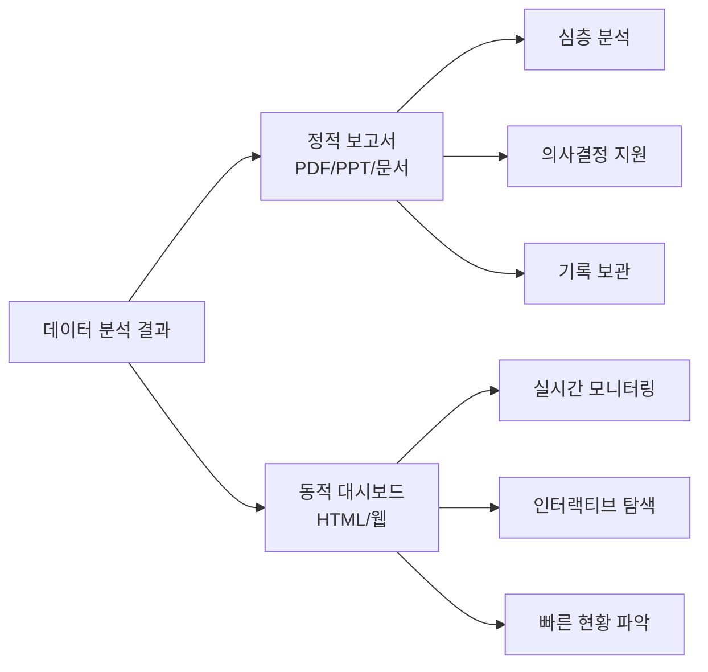
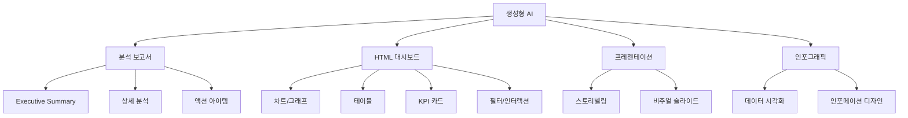
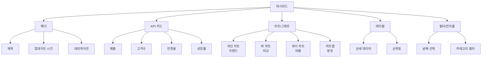
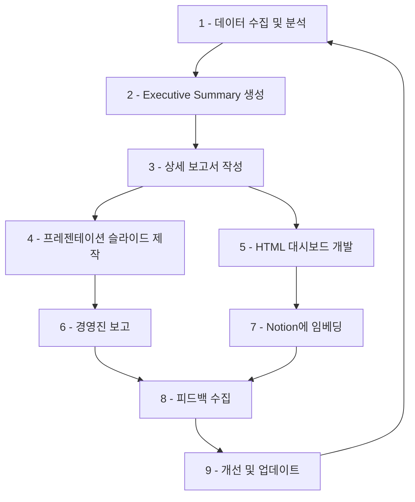

# 2. 분석보고서와 대시보드 만들기

이 장에서는 분석한 데이터를 바탕으로 전문적인 분석 보고서(Executive Summary, 상세 보고서, PPT)와 인터랙티브 HTML 대시보드를 생성형 AI로 만드는 방법을 학습합니다.

## 2.1 분석 보고서와 대시보드의 중요성

데이터를 분석하는 것도 중요하지만, 그 결과를 **효과적으로 전달**하는 것이 더 중요합니다. 생성형 AI를 활용하면 전문적인 분석 보고서와 인터랙티브한 HTML 대시보드를 빠르게 생성할 수 있습니다.

### 2.1.1 보고서 vs 대시보드



**분석 보고서 (Report)**
- 특정 시점의 분석 결과를 상세히 기술
- PDF, PowerPoint, Word 등 정적 문서
- 경영진 보고, 프로젝트 결과 공유 시 활용
- 심층 분석과 인사이트 제공

**대시보드 (Dashboard)**
- 핵심 지표를 한눈에 시각화
- HTML, 웹 기반 인터랙티브 요소
- 실시간 또는 주기적 업데이트
- 빠른 현황 파악 및 의사결정 지원

### 2.1.2 생성형 AI로 만들 수 있는 결과물



## 2.2 생성형 AI로 분석 보고서 만들기

### 2.2.1 Executive Summary 생성

#### Executive Summary란?

경영진을 위한 1~2페이지 요약본으로, 바쁜 의사결정자가 빠르게 핵심만 파악할 수 있도록 작성합니다.

**포함 요소**:
1. 배경 및 목적
2. 주요 발견사항 (Top 3~5)
3. 결론 및 권고사항
4. 예상 효과

#### Executive Summary 생성 프롬프트

```
[역할]
너는 경영 컨설턴트야.

[맥락]
- 보고 대상: [CEO/임원진/이사회]
- 보고 목적: [분기 실적 보고/문제 해결 제안/신규 사업 검토]
- 독자의 관심사: [매출 성장/비용 절감/시장 점유율]

[작업]
다음 분석 결과를 바탕으로 Executive Summary를 작성해줘.

[분석 결과 데이터]
[앞서 분석한 데이터 및 인사이트 붙여넣기]

[형식]
# Executive Summary

## 1. 배경 및 목적
[2-3문장으로 간결하게]

## 2. 주요 발견사항
1. [가장 중요한 발견]
   - 수치 및 근거
2. [두 번째 발견]
   - 수치 및 근거
3. [세 번째 발견]
   - 수치 및 근거

## 3. 결론 및 권고사항
- [액션 1]: [구체적 실행 방안]
- [액션 2]: [구체적 실행 방안]
- [액션 3]: [구체적 실행 방안]

## 4. 예상 효과
- 정량적 효과: [매출 증대 X%, 비용 절감 X원 등]
- 정성적 효과: [조직 문화 개선, 고객 만족도 향상 등]

[요구사항]
- 전체 분량: A4 1~2페이지 이내
- 전문 용어 최소화
- 숫자와 데이터 기반 서술
- 액션 아이템은 SMART 기준 충족
```

#### 실전 예시

**입력 데이터**: 2024년 3분기 매출 분석 결과

**생성된 Executive Summary**:

```markdown
# Executive Summary: 2024년 3분기 실적 분석

## 1. 배경 및 목적
2024년 3분기 매출이 전년 동기 대비 15% 증가하였으나, 목표 대비 5% 미달하였습니다.
본 보고서는 미달 원인을 분석하고 4분기 목표 달성을 위한 전략을 제시합니다.

## 2. 주요 발견사항
1. **신규 고객 유입 감소 (-30%)**
   - 마케팅 예산 축소로 인한 리드 생성 감소
   - 경쟁사의 공격적인 프로모션으로 시장 점유율 하락

2. **기존 고객 재구매율 증가 (+25%)**
   - 고객 만족도 개선으로 리텐션 향상
   - 구독형 서비스 전환 성공

3. **제품별 편차 심화**
   - A 제품: 목표 대비 120% 달성
   - B 제품: 목표 대비 70% 미달 (품질 이슈)

## 3. 결론 및 권고사항
- **신규 고객 확보 강화**: 4분기 마케팅 예산 30% 증액, 디지털 광고 집중
- **B 제품 품질 개선**: 고객 불만 사항 즉시 해결, 제품 업데이트 출시
- **구독 서비스 확대**: 기존 고객 대상 구독 전환 프로모션 진행

## 4. 예상 효과
- 정량적 효과: 4분기 매출 25% 증가 (120억원 → 150억원)
- 정성적 효과: 브랜드 신뢰도 회복, 고객 이탈률 감소
```

### 2.2.2 상세 분석 보고서 생성

#### 보고서 구조

```
분석 보고서 구조
├── 표지
├── 목차
├── Executive Summary
├── 1. 서론
│   ├── 1.1 배경
│   ├── 1.2 목적
│   └── 1.3 범위
├── 2. 분석 방법론
│   ├── 2.1 데이터 수집
│   ├── 2.2 분석 기법
│   └── 2.3 가정 및 제약사항
├── 3. 분석 결과
│   ├── 3.1 현황 분석
│   ├── 3.2 트렌드 분석
│   ├── 3.3 비교 분석
│   └── 3.4 주요 발견사항
├── 4. 인사이트 및 시사점
├── 5. 권고사항
│   ├── 5.1 단기 액션 아이템
│   ├── 5.2 중장기 전략
│   └── 5.3 실행 로드맵
├── 6. 결론
└── 부록 (데이터 테이블, 추가 차트)
```

#### 상세 보고서 생성 프롬프트

```
[역할]
너는 비즈니스 애널리스트야.

[맥락]
- 보고서 제목: [제목]
- 분석 기간: [YYYY-MM-DD ~ YYYY-MM-DD]
- 보고 대상: [부서명/직급]
- 보고서 목적: [상세 분석 공유/문제 해결/전략 수립]

[작업]
다음 데이터를 바탕으로 전문적인 분석 보고서를 작성해줘.

[데이터]
[분석 데이터 및 인사이트]

[형식]
위의 '분석 보고서 구조'를 따라 작성하되, 다음을 포함:
- 각 섹션마다 구체적인 데이터와 근거 제시
- 시각화 (표, 그래프) 포함 (mermaid 또는 markdown 표)
- 전문적이면서도 이해하기 쉬운 문체
- 핵심 메시지는 볼드 처리

[요구사항]
- 분량: 10~15페이지
- 모든 주장은 데이터 기반
- 액션 아이템은 우선순위 및 담당자 명시
- 부록에 상세 데이터 테이블 첨부
```

### 2.2.3 프레젠테이션 슬라이드 생성

#### PPT 구성안 생성 프롬프트

```
[역할]
너는 프레젠테이션 전문가야.

[맥락]
- 발표 시간: [10분/30분/1시간]
- 청중: [임원/팀원/고객]
- 발표 목적: [설득/정보 전달/교육]
- 핵심 메시지: [전달하고 싶은 메시지]

[작업]
다음 분석 보고서를 바탕으로 프레젠테이션 슬라이드 구성안을 만들어줘.

[보고서 내용]
[분석 보고서 또는 주요 내용]

[형식]
각 슬라이드마다:
- 슬라이드 번호 및 제목
- 핵심 메시지 (한 문장)
- 콘텐츠 구성 (텍스트/차트/이미지 설명)
- 발표 스크립트 요약

[예시]
---
**슬라이드 1: 표지**
- 제목: "2024년 3분기 매출 분석 및 개선 방안"
- 부제: "데이터 기반 의사결정"
- 발표자, 날짜

---
**슬라이드 2: Agenda**
- 분석 배경
- 주요 발견사항
- 개선 방안
- Q&A

---
**슬라이드 3: 핵심 메시지**
- 메시지: "신규 고객 유입 감소가 목표 미달의 주원인"
- 비주얼: 신규 vs 기존 고객 매출 비교 차트
- 스크립트: "3분기 매출 목표 미달의 가장 큰 원인은..."

[요구사항]
- 슬라이드 수: 발표 시간 고려 (1분당 1~2장)
- 각 슬라이드 1개 핵심 메시지
- 텍스트는 최소화, 비주얼 중심
- 스토리 플로우 명확하게
```

#### 발표 스크립트 생성

```
[역할]
너는 스피치 코치야.

[맥락]
- 발표자: [직급/경험]
- 청중: [배경/관심사]
- 발표 시간: [분]

[작업]
다음 슬라이드에 맞는 발표 스크립트를 작성해줘.

[슬라이드 내용]
[슬라이드 구성안]

[형식]
각 슬라이드마다:
1. 오프닝 멘트
2. 핵심 설명
3. 데이터/차트 해석
4. 다음 슬라이드 연결

[요구사항]
- 자연스럽고 대화체
- 청중과의 상호작용 포함 (질문 던지기)
- 중요한 수치는 강조
- 시간 배분 표시
```

## 2.3 HTML 대시보드 생성하기

### 2.3.1 대시보드 구성 요소



### 2.3.2 간단한 HTML 대시보드 생성 프롬프트

#### 기본 대시보드 생성

```
[역할]
너는 프론트엔드 개발자이자 데이터 시각화 전문가야.

[맥락]
- 대시보드 목적: [매출 현황/HR 현황/마케팅 성과]
- 사용자: [경영진/팀원/고객]
- 데이터 업데이트 주기: [실시간/일간/주간/월간]

[작업]
다음 데이터를 시각화하는 HTML 대시보드를 만들어줘.

[데이터]
[데이터 또는 데이터 구조 설명]

[형식]
- 단일 HTML 파일 (HTML + CSS + JavaScript)
- 라이브러리: Chart.js 또는 D3.js 사용
- 반응형 디자인 (모바일/태블릿/데스크톱)
- 모던하고 깔끔한 UI

[포함 요소]
1. 헤더 (제목, 마지막 업데이트 시간)
2. KPI 카드 4개 (주요 지표)
3. 라인 차트 (월별 트렌드)
4. 바 차트 (카테고리별 비교)
5. 데이터 테이블 (상위 10개)

[요구사항]
- 색상: 기업 컬러 [#색상코드] 활용
- 인터랙티브: 차트 호버 시 상세 정보 표시
- 주석: 코드에 설명 추가
- 즉시 실행 가능 (외부 파일 의존성 최소화)
```

#### 실전 예시: 매출 대시보드

**프롬프트**:
```
HTML 대시보드를 만들어줘. 다음 데이터를 포함:

데이터:
- 이번 달 매출: 150억원 (전월 대비 +12%)
- 신규 고객: 320명 (전월 대비 -5%)
- 평균 객단가: 468,750원 (전월 대비 +18%)
- 재구매율: 42% (전월 대비 +7%p)

월별 매출 (2024년):
1월: 120, 2월: 115, 3월: 145, 4월: 138, 5월: 152, 6월: 165, 7월: 158, 8월: 134, 9월: 150

제품별 매출:
A제품: 60억, B제품: 45억, C제품: 30억, D제품: 15억

Chart.js 사용, 파란색 계열 색상, 깔끔한 디자인
```

**생성된 HTML 예시** (일부):

:::div{.callout}
아래 코드를 가지고 바로 실행 가능한 HTML 대시보드를 생성할 수 있습니다. 바탕화면에 `.html` 파일로 저장한 후 브라우저에서 열면 됩니다.
:::

```html
<!DOCTYPE html>
<html lang="ko">
<head>
    <meta charset="UTF-8">
    <meta name="viewport" content="width=device-width, initial-scale=1.0">
    <title>매출 대시보드</title>
    <script src="https://cdn.jsdelivr.net/npm/chart.js"></script>
    <style>
        * {
            margin: 0;
            padding: 0;
            box-sizing: border-box;
        }
        body {
            font-family: 'Segoe UI', Tahoma, Geneva, Verdana, sans-serif;
            background: #f5f7fa;
            padding: 20px;
        }
        .dashboard {
            max-width: 1400px;
            margin: 0 auto;
        }
        .header {
            background: linear-gradient(135deg, #667eea 0%, #764ba2 100%);
            color: white;
            padding: 30px;
            border-radius: 10px;
            margin-bottom: 30px;
        }
        .header h1 {
            font-size: 32px;
            margin-bottom: 10px;
        }
        .update-time {
            opacity: 0.9;
            font-size: 14px;
        }
        .kpi-grid {
            display: grid;
            grid-template-columns: repeat(auto-fit, minmax(250px, 1fr));
            gap: 20px;
            margin-bottom: 30px;
        }
        .kpi-card {
            background: white;
            padding: 25px;
            border-radius: 10px;
            box-shadow: 0 2px 10px rgba(0,0,0,0.1);
            transition: transform 0.3s;
        }
        .kpi-card:hover {
            transform: translateY(-5px);
        }
        .kpi-title {
            color: #666;
            font-size: 14px;
            margin-bottom: 10px;
        }
        .kpi-value {
            font-size: 32px;
            font-weight: bold;
            color: #333;
            margin-bottom: 10px;
        }
        .kpi-change {
            font-size: 14px;
            padding: 5px 10px;
            border-radius: 20px;
            display: inline-block;
        }
        .kpi-change.positive {
            background: #d4edda;
            color: #155724;
        }
        .kpi-change.negative {
            background: #f8d7da;
            color: #721c24;
        }
        .chart-grid {
            display: grid;
            grid-template-columns: repeat(auto-fit, minmax(500px, 1fr));
            gap: 20px;
            margin-bottom: 30px;
        }
        .chart-container {
            background: white;
            padding: 25px;
            border-radius: 10px;
            box-shadow: 0 2px 10px rgba(0,0,0,0.1);
        }
        .chart-title {
            font-size: 18px;
            font-weight: bold;
            margin-bottom: 20px;
            color: #333;
        }
        @media (max-width: 768px) {
            .chart-grid {
                grid-template-columns: 1fr;
            }
        }
    </style>
</head>
<body>
    <div class="dashboard">
        <!-- 헤더 -->
        <div class="header">
            <h1>매출 대시보드</h1>
            <div class="update-time">마지막 업데이트: 2024년 9월 30일 23:59</div>
        </div>

        <!-- KPI 카드 -->
        <div class="kpi-grid">
            <div class="kpi-card">
                <div class="kpi-title">이번 달 매출</div>
                <div class="kpi-value">150억원</div>
                <span class="kpi-change positive">▲ 12% (전월 대비)</span>
            </div>
            <div class="kpi-card">
                <div class="kpi-title">신규 고객</div>
                <div class="kpi-value">320명</div>
                <span class="kpi-change negative">▼ 5% (전월 대비)</span>
            </div>
            <div class="kpi-card">
                <div class="kpi-title">평균 객단가</div>
                <div class="kpi-value">468,750원</div>
                <span class="kpi-change positive">▲ 18% (전월 대비)</span>
            </div>
            <div class="kpi-card">
                <div class="kpi-title">재구매율</div>
                <div class="kpi-value">42%</div>
                <span class="kpi-change positive">▲ 7%p (전월 대비)</span>
            </div>
        </div>

        <!-- 차트 -->
        <div class="chart-grid">
            <div class="chart-container">
                <div class="chart-title">월별 매출 트렌드</div>
                <canvas id="salesTrendChart"></canvas>
            </div>
            <div class="chart-container">
                <div class="chart-title">제품별 매출 비교</div>
                <canvas id="productSalesChart"></canvas>
            </div>
        </div>
    </div>

    <script>
        // 월별 매출 트렌드 차트
        const salesTrendCtx = document.getElementById('salesTrendChart').getContext('2d');
        new Chart(salesTrendCtx, {
            type: 'line',
            data: {
                labels: ['1월', '2월', '3월', '4월', '5월', '6월', '7월', '8월', '9월'],
                datasets: [{
                    label: '매출 (억원)',
                    data: [120, 115, 145, 138, 152, 165, 158, 134, 150],
                    borderColor: '#667eea',
                    backgroundColor: 'rgba(102, 126, 234, 0.1)',
                    borderWidth: 3,
                    fill: true,
                    tension: 0.4
                }]
            },
            options: {
                responsive: true,
                plugins: {
                    legend: {
                        display: false
                    }
                },
                scales: {
                    y: {
                        beginAtZero: true,
                        ticks: {
                            callback: function(value) {
                                return value + '억';
                            }
                        }
                    }
                }
            }
        });

        // 제품별 매출 비교 차트
        const productSalesCtx = document.getElementById('productSalesChart').getContext('2d');
        new Chart(productSalesCtx, {
            type: 'bar',
            data: {
                labels: ['A제품', 'B제품', 'C제품', 'D제품'],
                datasets: [{
                    label: '매출 (억원)',
                    data: [60, 45, 30, 15],
                    backgroundColor: [
                        'rgba(102, 126, 234, 0.8)',
                        'rgba(118, 75, 162, 0.8)',
                        'rgba(67, 160, 232, 0.8)',
                        'rgba(52, 211, 153, 0.8)'
                    ],
                    borderColor: [
                        '#667eea',
                        '#764ba2',
                        '#43a0e8',
                        '#34d399'
                    ],
                    borderWidth: 2
                }]
            },
            options: {
                responsive: true,
                plugins: {
                    legend: {
                        display: false
                    }
                },
                scales: {
                    y: {
                        beginAtZero: true,
                        ticks: {
                            callback: function(value) {
                                return value + '억';
                            }
                        }
                    }
                }
            }
        });
    </script>
</body>
</html>
```

### 2.3.3 고급 대시보드 생성

#### 필터 기능 추가 프롬프트

```
[역할]
너는 인터랙티브 대시보드 개발 전문가야.

[작업]
위의 대시보드에 다음 필터 기능을 추가해줘:

1. 날짜 범위 선택 (시작일 ~ 종료일)
2. 제품 카테고리 필터 (체크박스)
3. 지역 선택 (드롭다운)

필터 변경 시 모든 차트와 KPI가 자동 업데이트되도록 구현해줘.

[요구사항]
- 필터 UI는 헤더 아래 별도 섹션으로 배치
- 필터 적용 버튼과 초기화 버튼
- 데이터는 JavaScript 객체로 하드코딩 (API 연동 불필요)
- 부드러운 애니메이션 효과
```

#### 반응형 테이블 추가

```
[역할]
너는 UI/UX 개발자야.

[작업]
대시보드 하단에 다음 기능을 가진 데이터 테이블을 추가해줘:

[테이블 기능]
- 정렬 (각 컬럼 클릭 시 오름차순/내림차순)
- 검색 (실시간 필터링)
- 페이지네이션 (페이지당 10개)
- CSV 다운로드 버튼

[컬럼]
- 날짜
- 제품명
- 매출액
- 수량
- 성장률

[요구사항]
- 모바일에서도 가로 스크롤로 전체 테이블 표시
- 테이블 행 호버 시 하이라이트
- 성장률은 양수(초록)/음수(빨강) 색상 구분
```

### 2.3.4 대시보드 배포 및 공유

#### Notion에 임베딩하기

생성한 HTML 대시보드를 Notion 페이지에 임베딩하는 방법:

**방법 1: CodePen 활용**
1. CodePen (https://codepen.io/) 접속
2. 생성한 HTML 코드 붙여넣기
3. Save 후 공개 설정
4. Embed 링크 복사
5. Notion에서 `/embed` 명령 후 링크 붙여넣기

**방법 2: GitHub Pages**
1. GitHub 레포지토리 생성
2. HTML 파일 업로드 (파일명: `index.html`)
3. Settings > Pages에서 GitHub Pages 활성화
4. 생성된 URL을 Notion에 임베드

**방법 3: 외부 호스팅 서비스**
- github pages
- Netlify
- Vercel
- Surge

:::div{.callout}
**보안 팁**: 대시보드에 민감한 데이터가 포함된 경우, 비공개 호스팅을 사용하거나 비밀번호 인증을 추가하세요.
:::

#### 자동 업데이트 설정

**Google Sheets 연동 방법**:

```
[역할]
너는 풀스택 개발자야.

[작업]
위의 HTML 대시보드가 Google Sheets 데이터를 자동으로 불러오도록 수정해줘.

[요구사항]
1. Google Sheets API 연동 (또는 공개 CSV URL)
2. 페이지 로드 시 자동 데이터 fetch
3. "새로고침" 버튼으로 수동 업데이트 가능
4. 로딩 스피너 표시
5. 에러 처리 (데이터 로드 실패 시 메시지 표시)

[Google Sheets 구조]
Sheet 1: KPI 데이터 (매출, 고객수, 객단가, 재구매율)
Sheet 2: 월별 매출 데이터
Sheet 3: 제품별 매출 데이터
```

## 2.4 보고서와 대시보드 통합 워크플로우

### 2.4.1 전체 프로세스



### 2.4.2 단계별 프롬프트 체인

#### 단계 1: 데이터 → Executive Summary
```
[데이터 분석 결과를 Executive Summary로 요약해줘]
→ 출력: 1~2페이지 요약본
```

#### 단계 2: Executive Summary → 상세 보고서
```
[위의 Executive Summary를 바탕으로 10페이지 상세 보고서 작성해줘]
→ 출력: 전문 분석 보고서
```

#### 단계 3: 보고서 → PPT 구성안
```
[위의 보고서를 15분 프레젠테이션 슬라이드로 변환해줘]
→ 출력: 슬라이드 구성안 + 스크립트
```

#### 단계 4: 데이터 → HTML 대시보드
```
[데이터를 HTML 대시보드로 시각화해줘 (Chart.js 사용)]
→ 출력: 완성된 HTML 파일
```

#### 단계 5: 대시보드 개선
```
[위의 대시보드에 필터 기능과 테이블 추가해줘]
→ 출력: 업그레이드된 HTML
```

### 2.4.3 시간 절감 효과

| 작업 | 기존 방식 | AI 활용 | 절감 시간 |
|------|----------|---------|----------|
| Executive Summary | 2시간 | 10분 | **110분** |
| 상세 보고서 작성 | 8시간 | 30분 | **450분** |
| PPT 슬라이드 제작 | 4시간 | 20분 | **220분** |
| HTML 대시보드 개발 | 6시간 | 15분 | **345분** |
| **합계** | **20시간** | **1시간 15분** | **18시간 45분 (94%)** |

## 2.5 실전 활용 사례

### 2.5.1 사례 1: 월간 경영 보고서 자동화

**기업**: 중소 제조업 (직원 150명)

**Before**:
- 재무팀이 매월 말 3일간 보고서 작성
- Excel 데이터 → Word 보고서 → PPT 슬라이드 수작업 변환
- 경영진 보고 1주일 전 완료 필요

**After (AI 활용)**:
- ERP에서 데이터 추출 → CSV 저장
- Claude에 데이터 업로드 + 보고서 생성 프롬프트
- 30분 만에 보고서 + PPT + 대시보드 완성
- 나머지 2.5일은 인사이트 도출과 전략 수립에 투자

**결과**:
- 작업 시간 90% 감소
- 보고서 품질 향상 (일관된 포맷, 오타 감소)
- 재무팀 만족도 증가

### 2.5.2 사례 2: HR 대시보드 구축

**기업**: IT 스타트업 (직원 80명)

**Before**:
- HR 데이터는 Excel 시트로만 관리
- 경영진 요청 시마다 수동으로 차트 생성
- 실시간 현황 파악 어려움

**After (AI 활용)**:
- ChatGPT로 HTML 대시보드 생성
- Google Sheets 연동으로 자동 업데이트
- Notion 회사 위키에 임베딩

**대시보드 포함 지표**:
- 현재 인원수
- 부서별/직급별 분포
- 월별 채용/퇴사 현황
- 이직률 트렌드
- 성과 평가 분포

**결과**:
- 경영진이 실시간으로 HR 현황 확인
- 데이터 기반 의사결정 증가
- HR팀 요청 사항 50% 감소

### 2.5.3 사례 3: 마케팅 성과 리포트

**기업**: 이커머스 회사

**활용 방법**:
1. Google Analytics, Meta Ads, 네이버 데이터 추출
2. Claude에 업로드 후 통합 분석
3. 주간 마케팅 리포트 자동 생성
4. HTML 대시보드로 실시간 모니터링

**포함 내용**:
- 채널별 트래픽 및 전환율
- ROAS (Return on Ad Spend)
- 신규 vs 재방문 고객 비율
- 인기 제품 Top 10
- 캠페인별 성과

**결과**:
- 매주 금요일 오전 자동 리포트 발송
- 마케팅 팀 회의 효율성 2배 향상
- 데이터 기반 예산 조정으로 ROAS 30% 개선

## 2.6 프롬프트 라이브러리

### 2.6.1 보고서 생성 프롬프트 모음

#### 간단한 요약 보고서
```
다음 데이터를 3줄 요약해줘:
[데이터]
```

#### 비교 분석 보고서
```
A와 B를 비교 분석하고 표로 정리해줘:
- A: [데이터]
- B: [데이터]

비교 항목: [항목1, 항목2, 항목3]
```

#### 트렌드 분석 보고서
```
다음 시계열 데이터에서 트렌드를 분석하고 향후 3개월 예측해줘:
[월별 데이터]

분석 방법: 이동평균, 계절성 고려
```

### 2.6.2 대시보드 생성 프롬프트 모음

#### 미니멀 대시보드
```
단순하고 깔끔한 대시보드 만들어줘.
KPI 3개 + 라인 차트 1개만 포함.
색상: 흑백 + 포인트 컬러 1개
```

#### 데이터 집약형 대시보드
```
많은 정보를 한 화면에 표시하는 대시보드 만들어줘.
KPI 6개 + 차트 4개 + 테이블 1개
그리드 레이아웃 사용
```

#### 모바일 우선 대시보드
```
모바일에서 보기 좋은 대시보드 만들어줘.
세로 스크롤 중심
KPI 카드는 1열로 쌓이게
차트는 간결하게
```

## 2.7 정리

생성형 AI를 활용하면 **전문적인 분석 보고서와 인터랙티브 대시보드를 빠르게 생성**할 수 있습니다.

**핵심 포인트**:
1. **프롬프트 체인**: 데이터 → 요약 → 상세 보고서 → PPT → 대시보드 순서로 단계적 생성
2. **HTML 대시보드**: Chart.js 등을 활용해 즉시 사용 가능한 시각화 생성
3. **Notion 통합**: 보고서와 대시보드를 Notion에 임베딩하여 중앙 집중화
4. **자동화**: Google Sheets 연동으로 실시간 업데이트 대시보드 구축

<highlight>
보고서 & 대시보드 핵심 포인트<br/>
- Executive Summary → 상세 보고서 → PPT → 대시보드 단계적 생성<br/>
- Chart.js로 인터랙티브 HTML 대시보드 즉시 생성 가능<br/>
- CodePen, GitHub Pages, Notion 임베딩으로 공유<br/>
- Google Sheets 연동으로 실시간 업데이트 자동화
</highlight>

| 결과물 | 기존 소요 시간 | AI 활용 시 | 절감율 |
|-------|-------------|-----------|-------|
| Executive Summary | 2시간 | 10분 | 92% |
| 상세 보고서 | 8시간 | 30분 | 94% |
| PPT 슬라이드 | 4시간 | 20분 | 92% |
| HTML 대시보드 | 6시간 | 15분 | 96% |

**다음 장에서는** Notion을 소개하고, AX와 DX를 위한 협업 도구 비교를 진행합니다.
