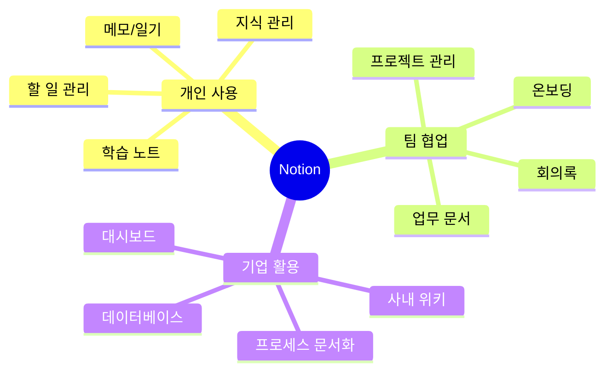
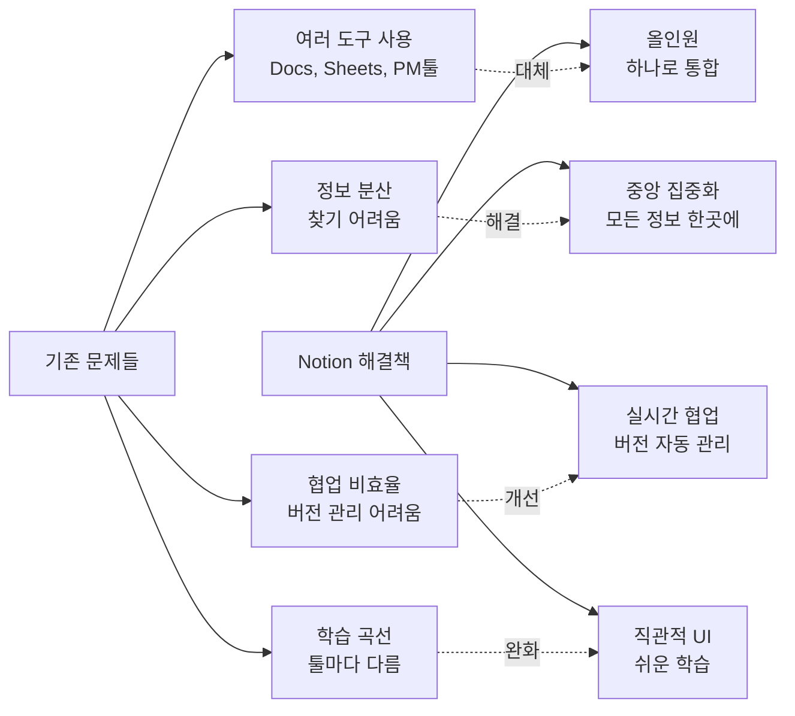
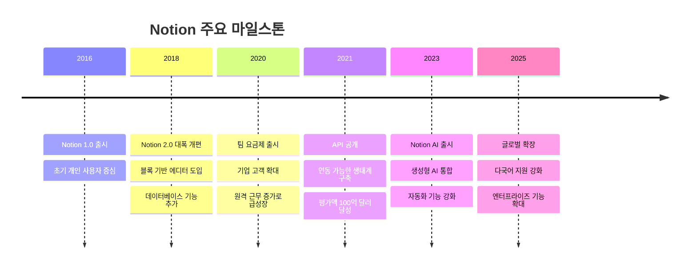
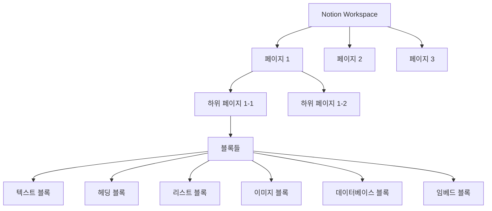
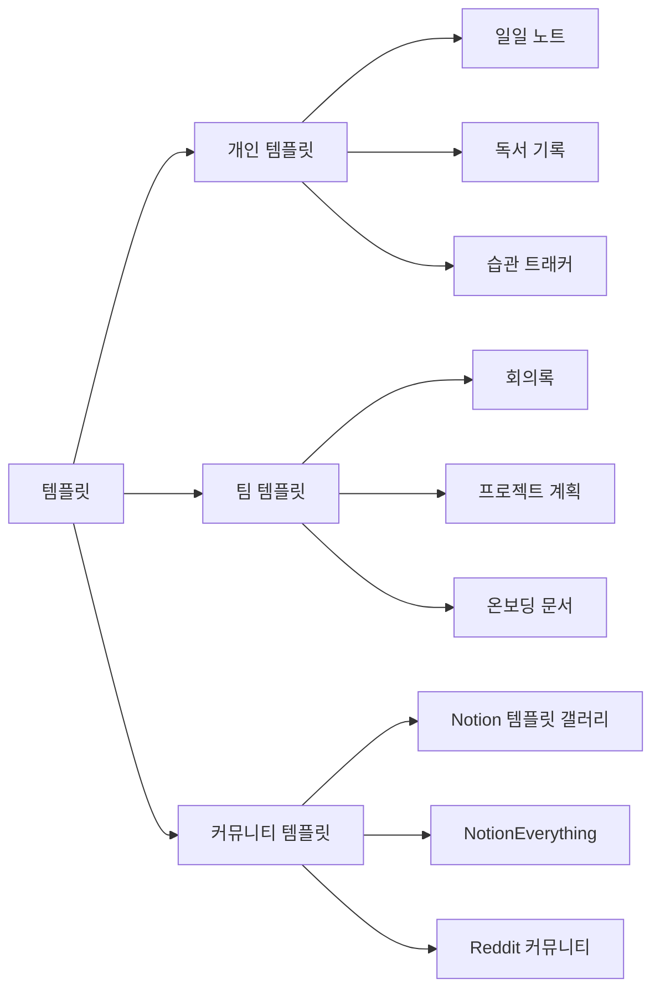
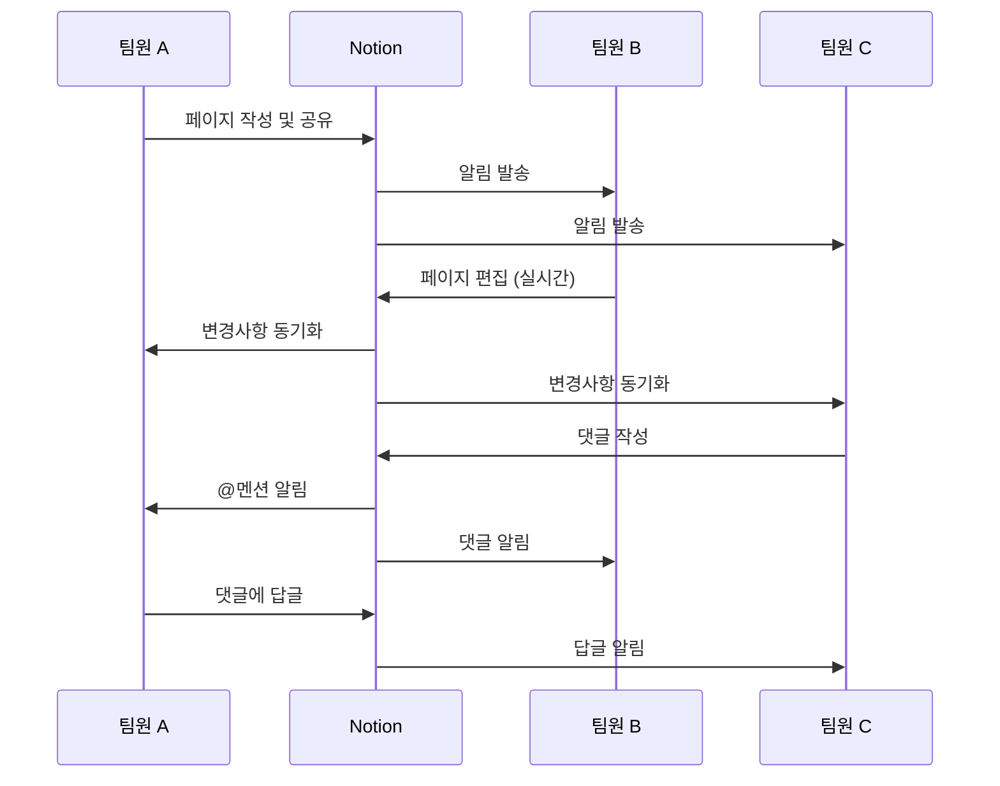
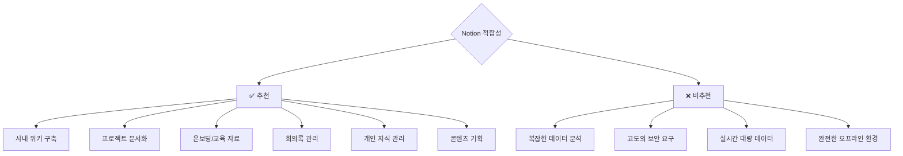
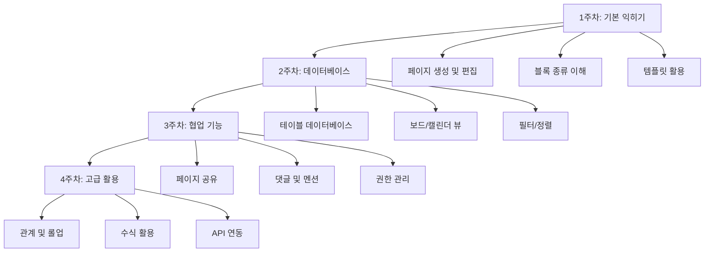

# 1. 노션 소개

이 장에서는 협업 도구인 노션(Notion)에 대해 알아봅니다. 노션의 핵심 기능과 특징, 장단점, 그리고 실제 활용 사례를 통해 왜 노션이 AX(업무 자동화 경험)와 DX(디지털 전환)의 핵심 도구로 주목받는지 이해할 수 있습니다.

## 1.1 노션이란?

Notion(노션)은 **올인원 워크스페이스**로, 문서 작성, 데이터베이스, 프로젝트 관리, 위키 등을 하나의 플랫폼에서 처리할 수 있는 협업 도구입니다.

2016년 Ivan Zhao와 Simon Last가 창업한 Notion Labs가 개발했으며, 현재 전 세계 수백만 명의 사용자가 개인 생산성부터 기업 협업까지 다양한 용도로 활용하고 있습니다.



### 1.1.1 노션의 핵심 특징

**1. 블록 기반 에디터**
- 모든 콘텐츠가 "블록" 단위로 구성
- 텍스트, 이미지, 표, 데이터베이스 등을 자유롭게 조합
- 드래그 앤 드롭으로 쉽게 재배치

**2. 강력한 데이터베이스**
- 테이블, 보드, 캘린더, 갤러리, 리스트 등 다양한 뷰
- 필터, 정렬, 그룹화 기능
- 관계형 데이터 연결 가능

**3. 협업 중심 설계**
- 실시간 공동 편집
- 댓글 및 멘션 기능
- 권한 관리 (보기/편집/댓글)

**4. 유연한 구조**
- 페이지 안에 페이지 (무한 중첩)
- 템플릿 활용
- 다양한 임베드 지원

**5. 크로스 플랫폼**
- 웹, Windows, Mac, iOS, Android
- 오프라인 모드 지원
- 모든 기기에서 동기화

### 1.1.2 노션이 해결하는 문제



## 1.2 노션의 역사와 성장

### 1.2.1 발전 과정



### 1.2.2 왜 노션이 인기 있을까?

**1. 팬데믹 이후 원격 근무 증가**
- 비대면 협업 도구 수요 급증
- Notion이 올인원 솔루션으로 부상

**2. 개인 생산성 트렌드**
- PKM (Personal Knowledge Management) 관심 증가
- "제2의 뇌" 개념 확산
- Notion이 이상적인 플랫폼으로 인식

**3. 커뮤니티와 생태계**
- 활발한 사용자 커뮤니티
- 수많은 템플릿 공유
- YouTube, 블로그 등 풍부한 학습 자료

**4. 무료 요금제**
- 개인 사용자에게 무료 제공
- 낮은 진입 장벽
- 입소문 마케팅 효과

## 1.3 노션의 주요 기능

### 1.3.1 페이지와 블록



**블록 유형**:
- **텍스트**: 문단, 제목, 리스트
- **미디어**: 이미지, 비디오, 파일
- **임베드**: YouTube, Figma, Google Maps 등
- **고급**: 데이터베이스, 코드, 수식

### 1.3.2 데이터베이스

Notion의 가장 강력한 기능 중 하나입니다.

**데이터베이스 뷰**:

| 뷰 타입 | 용도 | 예시 활용 |
|---------|------|----------|
| **테이블** | 스프레드시트처럼 데이터 정리 | 고객 관리, 재고 관리 |
| **보드** | 칸반 방식 작업 관리 | 프로젝트 진행 상황 |
| **캘린더** | 날짜 기반 일정 관리 | 콘텐츠 캘린더, 일정 관리 |
| **갤러리** | 카드 형태로 시각적 표시 | 포트폴리오, 제품 카탈로그 |
| **리스트** | 간결한 목록 형태 | 할 일 목록, 북마크 |
| **타임라인** | 간트 차트 | 프로젝트 타임라인 |

**프로퍼티 타입**:
- 텍스트, 숫자, 날짜
- 선택 (Select/Multi-select)
- 사람 (People)
- 파일 & 미디어
- 체크박스
- URL, 이메일, 전화번호
- **관계 (Relation)**: 다른 데이터베이스와 연결
- **롤업 (Rollup)**: 관계된 데이터 집계
- **수식 (Formula)**: 자동 계산

### 1.3.3 템플릿



**템플릿 활용 방법**:
1. 자주 사용하는 구조를 템플릿으로 저장
2. 버튼 클릭으로 즉시 생성
3. 변수 활용 (날짜, 작성자 자동 입력)

### 1.3.4 협업 기능



**권한 관리**:
- **전체 액세스**: 편집, 공유, 삭제 가능
- **편집 가능**: 콘텐츠 수정 가능
- **댓글 가능**: 읽기 + 댓글만
- **보기 전용**: 읽기만 가능

## 1.4 노션의 장단점

### 1.4.1 장점

✅ **올인원 플랫폼**
- 여러 도구를 하나로 통합 (Docs + Sheets + PM툴 + Wiki)
- 도구 전환 비용 감소

✅ **유연성**
- 자유로운 커스터마이징
- 모든 업무 프로세스에 맞춰 조정 가능

✅ **협업 친화적**
- 실시간 공동 편집
- 투명한 커뮤니케이션

✅ **무료 요금제**
- 개인 사용자 무료
- 중소 팀도 저렴하게 사용

✅ **아름다운 UI/UX**
- 직관적이고 깔끔한 디자인
- 사용자 경험 우수

✅ **크로스 플랫폼**
- 모든 기기에서 동기화
- 언제 어디서나 접근 가능

✅ **API 및 통합**
- Zapier, Slack, Google Drive 등 연동
- 자동화 가능

### 1.4.2 단점

❌ **학습 곡선**
- 초기 개념 이해에 시간 필요
- 고급 기능(데이터베이스, 관계) 습득 어려움

❌ **오프라인 제한**
- 완전한 오프라인 사용 불가
- 일부 기능 제약

❌ **성능 이슈**
- 페이지가 커지면 로딩 느려짐
- 복잡한 데이터베이스 성능 저하

❌ **백업 기능 부족**
- 자동 백업 없음 (수동 내보내기 필요)
- 실수로 삭제 시 복구 어려움

❌ **고급 분석 기능 부족**
- 차트, 피벗 테이블 등 제한적
- Excel/Google Sheets 대체 불가

❌ **가격 (대규모 팀)**
- 엔터프라이즈 요금이 비쌈
- 사용자 수 증가 시 비용 부담

### 1.4.3 적합한 사용 사례



## 1.5 노션 요금제

### 1.5.1 요금제 비교

| 요금제 | 가격 | 대상 | 주요 기능 |
|--------|------|------|----------|
| **Free** | 무료 | 개인 사용자 | - 무제한 페이지 및 블록<br/>- 10MB 파일 업로드<br/>- 7일 버전 히스토리 |
| **Plus** | $10/월 | 소규모 팀 | - 100MB 파일 업로드<br/>- 30일 버전 히스토리<br/>- 무제한 팀원 초대 |
| **Business** | $18/월 | 중대형 팀 | - SAML SSO<br/>- 비공개 팀스페이스<br/>- 고급 권한 관리<br/>- 90일 버전 히스토리 |
| **Enterprise** | 문의 | 대기업 | - 고급 보안 및 컴플라이언스<br/>- 전담 지원<br/>- 감사 로그<br/>- 무제한 버전 히스토리 |

:::div{.callout}
**학생/교육자 할인**: 교육 이메일(@ac.kr)로 가입 시 Plus 요금제 무료 제공
:::

### 1.5.2 Notion AI 추가 요금

- **Notion AI**: 월 $10 추가
- GPT-4 기반 AI 기능
- 자동 요약, 번역, 글쓰기 도움, 아이디어 생성 등

## 1.6 노션 사용 시작하기

### 1.6.1 회원가입 및 초기 설정


**단계별 가이드**:

1. **회원가입**
   - https://www.notion.so 접속
   - 이메일 또는 Google 계정으로 가입
   - 인증 메일 확인

2. **워크스페이스 생성**
   - 워크스페이스 이름 설정 (예: "ABC 회사")
   - 아이콘 및 커버 이미지 선택
   - 팀 vs 개인 선택

3. **첫 페이지 만들기**
   - 사이드바에서 "+ Add a page" 클릭
   - 페이지 제목 입력
   - 원하는 블록 추가 (텍스트, 이미지 등)

4. **템플릿 활용**
   - 빈 페이지에서 "Templates" 클릭
   - 또는 Notion 템플릿 갤러리 방문
   - 원하는 템플릿 복사하여 사용

5. **팀원 초대**
   - 페이지 우측 상단 "Share" 버튼
   - 이메일로 초대 또는 링크 공유
   - 권한 설정 (편집/댓글/보기)

### 1.6.2 필수 단축키

| 단축키 | 기능 |
|--------|------|
| **Cmd/Ctrl + N** | 새 페이지 생성 |
| **Cmd/Ctrl + P** | 빠른 검색 |
| **Cmd/Ctrl + E** | 인라인 코드 |
| **Cmd/Ctrl + Shift + K** | 링크 삽입 |
| **/** | 블록 메뉴 열기 |
| **@** | 사람/페이지 멘션 |
| **[ ]** | 체크박스 생성 |
| **Cmd/Ctrl + D** | 블록 복제 |
| **Cmd/Ctrl + Shift + M** | 댓글 추가 |

### 1.6.3 추천 학습 순서



## 1.7 실전 활용 사례

### 1.7.1 사례 1: 스타트업 사내 위키

**회사**: IT 스타트업 (직원 30명)

**Before**:
- 정보가 Slack, Email, Google Drive에 분산
- 새 직원 온보딩 시 필요한 정보 찾기 어려움
- 회의록, 문서 버전 관리 혼란

**After (Notion 도입)**:
- 모든 문서를 Notion에 중앙 집중화
- 체계적인 폴더 구조 (팀별/프로젝트별)
- 온보딩 페이지로 신입 교육 시간 50% 단축

**구조**:
```
📚 회사 위키
├── 👋 환영합니다
│   ├── 온보딩 체크리스트
│   ├── 회사 소개
│   └── 복지 및 규정
├── 📁 팀별 문서
│   ├── 개발팀
│   ├── 디자인팀
│   └── 마케팅팀
├── 📝 회의록
├── 🚀 프로젝트
└── 💡 아이디어 뱅크
```

### 1.7.2 사례 2: 프리랜서 포트폴리오 관리

**사용자**: 프리랜서 디자이너

**활용 방법**:
- 프로젝트 데이터베이스 구축
- 클라이언트별/상태별 관리
- 포트폴리오 페이지 링크로 공유

**데이터베이스 프로퍼티**:
- 프로젝트명
- 클라이언트
- 상태 (제안/진행중/완료)
- 시작일/마감일
- 금액
- 파일 (디자인 시안)
- 노트 (피드백, 요구사항)

### 1.7.3 사례 3: 마케팅팀 콘텐츠 캘린더

**팀**: 마케팅팀 (5명)

**활용 방법**:
- 캘린더 뷰로 콘텐츠 발행 일정 관리
- 상태 관리 (아이디어 → 작성중 → 검토 → 발행)
- 담당자 배정 및 진행 상황 추적

**효과**:
- 콘텐츠 발행 일정 준수율 30% 향상
- 팀원 간 업무 가시성 확보
- 중복 작업 방지

## 1.8 정리

<highlight>
노션 핵심 포인트<br/>
- 올인원 플랫폼: 문서, 데이터베이스, 협업을 하나로 통합<br/>
- 유연성: 블록 기반 에디터로 모든 워크플로우에 맞춤 가능<br/>
- 협업 중심: 실시간 공동 작업 및 세밀한 권한 관리<br/>
- 무료 시작: 낮은 진입 장벽과 교육 기관 무료 제공
</highlight>

| 특징 | 설명 | 활용 예시 |
|------|------|----------|
| **블록 기반** | 드래그 앤 드롭으로 재배치 | 자유로운 문서 구성 |
| **데이터베이스** | 다양한 뷰 (테이블, 보드, 캘린더) | 프로젝트 관리, CRM |
| **템플릿** | 자주 쓰는 구조 재사용 | 회의록, 온보딩 문서 |
| **협업** | 실시간 편집, 댓글, 멘션 | 팀 프로젝트 협업 |

- 다음 장에서 Notion과 다른 협업 도구 비교
- AX와 DX에 최적화된 도구 선택 방법 학습

:::div{.callout}
**실습 과제**: 지금 바로 Notion에 가입하고 첫 페이지를 만들어보세요! 간단한 할 일 목록이나 메모부터 시작하는 것을 추천합니다.
:::
