# 1. AX와 DX를 위한 협업 도구 선택의 중요성

현대 기업의 디지털 전환(DX)과 업무 자동화 경험(AX) 구축에서 협업 도구의 선택은 성공의 핵심 요소입니다. 적절한 도구를 선택하면 생산성이 향상되고, 잘못된 선택은 오히려 업무 효율을 떨어뜨릴 수 있습니다.

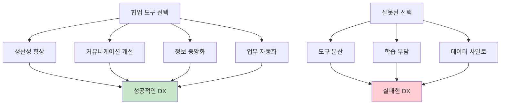
```mermaid
graph TD
    A[협업 도구 선택] --> B[생산성 향상]
    A --> C[커뮤니케이션 개선]
    A --> D[정보 중앙화]
    A --> E[업무 자동화]

    B --> F[성공적인 DX]
    C --> F
    D --> F
    E --> F

    G[잘못된 선택] --> H[도구 분산]
    G --> I[학습 부담]
    G --> J[데이터 사일로]

    H --> K[실패한 DX]
    I --> K
    J --> K

    style F fill:#C8E6C9
    style K fill:#FFCDD2
```

## 1.1 협업 도구 선택 기준

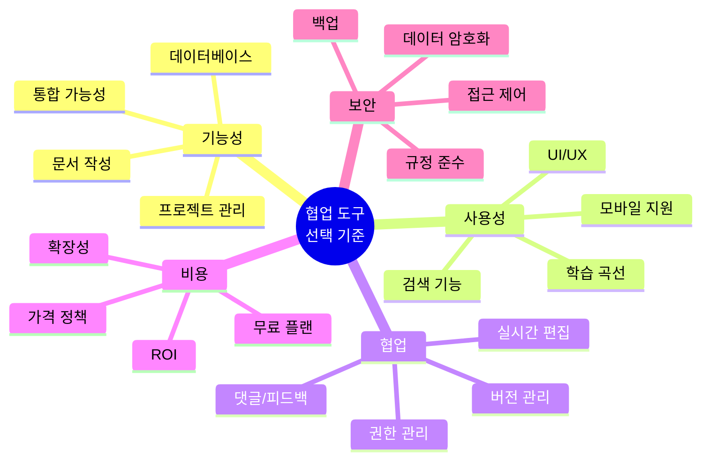
```mermaid
mindmap
  root((협업 도구<br/>선택 기준))
    기능성
      문서 작성
      데이터베이스
      프로젝트 관리
      통합 가능성
    사용성
      학습 곡선
      UI/UX
      모바일 지원
      검색 기능
    협업
      실시간 편집
      권한 관리
      댓글/피드백
      버전 관리
    비용
      가격 정책
      확장성
      ROI
      무료 플랜
    보안
      데이터 암호화
      백업
      접근 제어
      규정 준수
```

**핵심 고려사항**:

1. **팀 규모**: 소규모 팀 vs 대기업
2. **업무 특성**: 프로젝트 중심 vs 문서 중심
3. **기술 역량**: IT 전문가 vs 일반 사용자
4. **예산**: 무료/저가 vs 엔터프라이즈
5. **기존 시스템**: 통합 필요성

# 2. 주요 협업 도구 비교

## 2.1 Notion

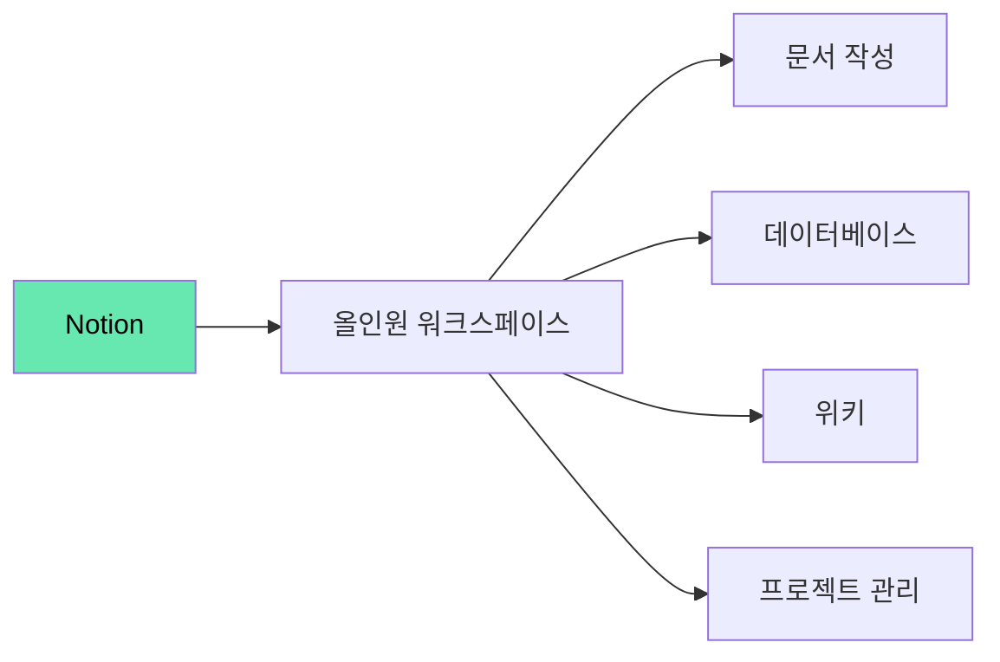
```mermaid
graph LR
    A[Notion] --> B[올인원 워크스페이스]

    B --> B1[문서 작성]
    B --> B2[데이터베이스]
    B --> B3[위키]
    B --> B4[프로젝트 관리]

    style A fill:#67E8B1,color:#000
```

### 2.1.1 Notion의 강점

**1. 올인원 플랫폼**
- 문서, 데이터베이스, 프로젝트 관리를 하나로 통합
- 도구 전환 비용 최소화
- 모든 정보를 한 곳에서 관리

**2. 유연성**
- 블록 기반으로 자유로운 커스터마이징
- 모든 워크플로우에 맞춰 조정 가능
- 무한한 확장성

**3. 강력한 데이터베이스**
- 관계형 데이터베이스 구축 가능
- 다양한 뷰 (테이블, 보드, 캘린더, 갤러리)
- 필터, 정렬, 그룹화 기능

**4. 협업 친화적**
- 실시간 공동 편집
- 댓글 및 멘션
- 세밀한 권한 관리

**5. 아름다운 UI/UX**
- 직관적이고 깔끔한 디자인
- 사용자 경험 우수

### 2.1.2 Notion의 약점

- 초기 학습 곡선이 있음
- 복잡한 데이터베이스 성능 저하 가능
- 오프라인 기능 제한적
- 고급 분석 기능 부족

### 2.1.3 Notion 적합성

| 적합한 경우 | 부적합한 경우 |
|-----------|-------------|
| 사내 위키 구축 | 복잡한 데이터 분석 필요 |
| 프로젝트 문서화 | 완전한 오프라인 환경 |
| 온보딩 자료 관리 | 실시간 대량 데이터 처리 |
| 개인 지식 관리 | 높은 보안 규제 산업 |
| 스타트업/중소기업 | 레거시 시스템 의존도 높음 |

## 2.2 Confluence

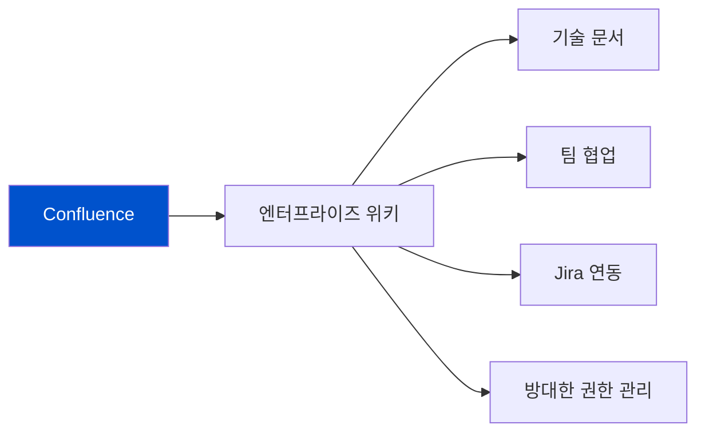
```mermaid
graph LR
    A[Confluence] --> B[엔터프라이즈 위키]

    B --> B1[기술 문서]
    B --> B2[팀 협업]
    B --> B3[Jira 연동]
    B --> B4[방대한 권한 관리]

    style A fill:#0052CC,color:#fff
```

### 2.2.1 Confluence의 강점

**1. Atlassian 생태계 통합**
- Jira, Trello, Bitbucket과 완벽한 연동
- 개발팀에 최적화
- 이슈 추적과 문서화 연결

**2. 강력한 권한 관리**
- 세밀한 접근 제어
- 스페이스별 권한 설정
- 엔터프라이즈급 보안

**3. 템플릿 생태계**
- 다양한 사전 제작 템플릿
- 회의록, 프로젝트 계획, 요구사항 문서 등
- 산업별/직무별 템플릿

**4. 검색 및 구조화**
- 강력한 검색 기능
- 계층적 페이지 구조
- 태그 및 라벨링

### 2.2.2 Confluence의 약점

- 높은 비용 (특히 대규모 팀)
- 복잡한 UI, 학습 곡선 높음
- 설정 및 관리 복잡
- 무거운 시스템, 느린 로딩

### 2.2.3 Confluence 적합성

| 적합한 경우 | 부적합한 경우 |
|-----------|-------------|
| Jira 사용 중인 개발팀 | 소규모 팀/스타트업 |
| 엔터프라이즈 환경 | 빠른 도입 필요 |
| 기술 문서 중심 | 단순한 문서 관리만 필요 |
| 복잡한 권한 필요 | 예산 제약 심함 |

## 2.3 Google Workspace (Docs, Sheets, Drive)

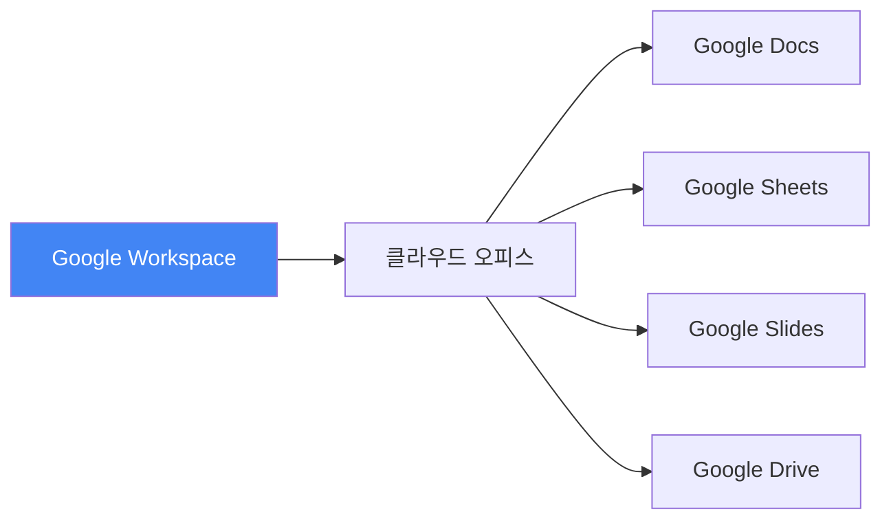
```mermaid
graph LR
    A[Google Workspace] --> B[클라우드 오피스]

    B --> B1[Google Docs]
    B --> B2[Google Sheets]
    B --> B3[Google Slides]
    B --> B4[Google Drive]

    style A fill:#4285F4,color:#fff
```

### 2.3.1 Google Workspace의 강점

**1. 익숙한 인터페이스**
- Microsoft Office와 유사한 UI
- 낮은 학습 곡선
- 모든 연령대가 쉽게 사용

**2. 실시간 협업**
- 동시 편집의 선구자
- 자동 저장 및 버전 관리
- 댓글 및 제안 모드

**3. 강력한 통합**
- Gmail, Calendar와 완벽 연동
- 수천 개의 서드파티 앱
- API 풍부

**4. 저렴한 가격**
- 무료 플랜 제공 (15GB 스토리지)
- 합리적인 유료 플랜
- 교육 기관 무료/할인

**5. 안정성**
- Google 인프라
- 거의 100% 가동시간
- 자동 백업

### 2.3.2 Google Workspace의 약점

- 문서 간 연결성 부족
- 체계적인 지식 관리 어려움
- 파일이 분산되기 쉬움
- 오프라인 기능 제한적

### 2.3.3 Google Workspace 적합성

| 적합한 경우 | 부적합한 경우 |
|-----------|-------------|
| 문서 작성/공유 중심 | 복잡한 프로젝트 관리 |
| 교육 기관 | 체계적인 위키 필요 |
| 예산 제약 있는 팀 | 데이터베이스 중심 업무 |
| Gmail 사용 조직 | 높은 보안 요구 (클라우드 제약) |

## 2.4 Airtable

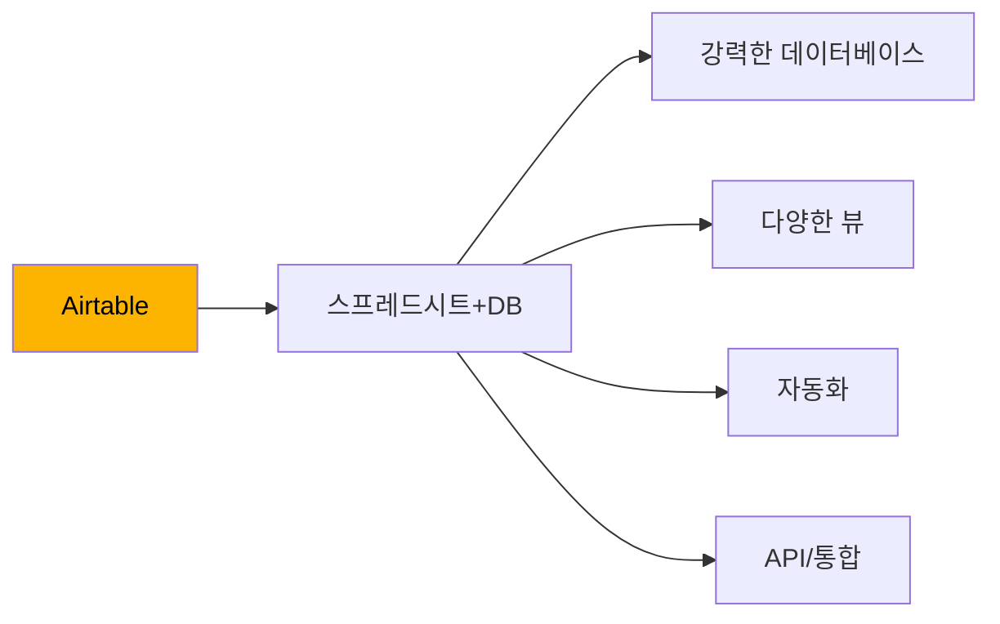
```mermaid
graph LR
    A[Airtable] --> B[스프레드시트+DB]

    B --> B1[강력한 데이터베이스]
    B --> B2[다양한 뷰]
    B --> B3[자동화]
    B --> B4[API/통합]

    style A fill:#FCB400,color:#000
```

### 2.4.1 Airtable의 강점

**1. 데이터베이스 + 스프레드시트**
- Excel의 친숙함 + 관계형 DB의 강력함
- 비개발자도 쉽게 사용
- 복잡한 데이터 관리 가능

**2. 다양한 뷰**
- Grid, Calendar, Kanban, Gallery, Form
- 동일 데이터를 여러 방식으로 시각화
- 사용자별 커스텀 뷰

**3. 강력한 자동화**
- 노코드 자동화 빌더
- 트리거 및 액션 조합
- Zapier 통합

**4. 협업 기능**
- 실시간 협업
- 댓글 및 멘션
- 권한 관리

### 2.4.2 Airtable의 약점

- 문서 작성 기능 약함
- 긴 텍스트 편집 불편
- 비용이 높음 (레코드 제한)
- 복잡한 워크플로우는 어려움

### 2.4.3 Airtable 적합성

| 적합한 경우 | 부적합한 경우 |
|-----------|-------------|
| 데이터 중심 업무 | 긴 문서 작성 필요 |
| CRM, 재고 관리 | 위키/지식 관리 |
| 프로젝트 추적 | 예산 제약 심함 |
| 노코드 솔루션 필요 | 오프라인 환경 |

## 2.5 Monday.com

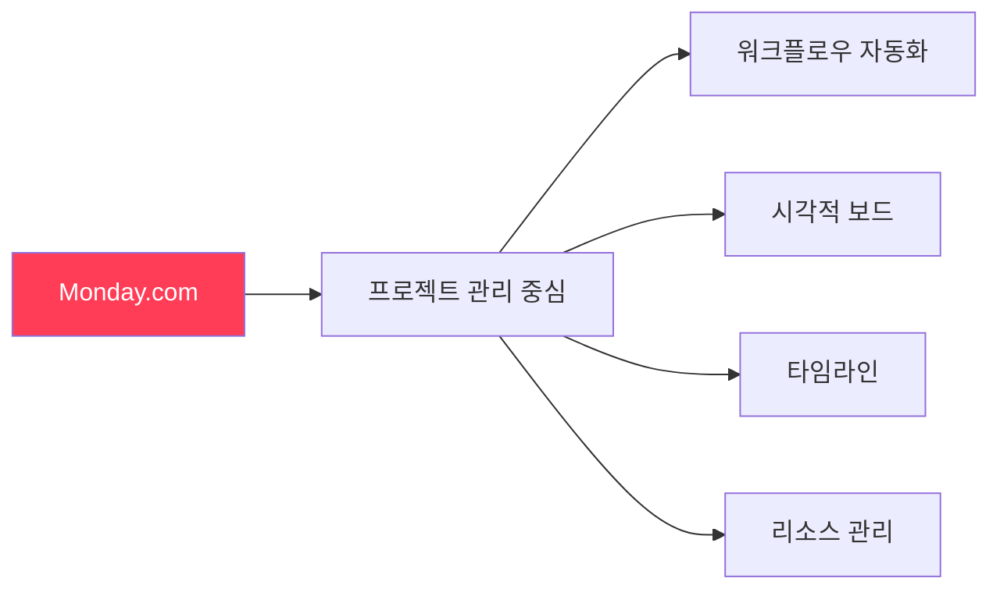
```mermaid
graph LR
    A[Monday.com] --> B[프로젝트 관리 중심]

    B --> B1[워크플로우 자동화]
    B --> B2[시각적 보드]
    B --> B3[타임라인]
    B --> B4[리소스 관리]

    style A fill:#FF3D57,color:#fff
```

### 2.5.1 Monday.com의 강점

**1. 시각적 프로젝트 관리**
- 색상 코딩과 아이콘
- 직관적인 보드 뷰
- 간트 차트 및 타임라인

**2. 강력한 자동화**
- 200+ 자동화 레시피
- 커스텀 자동화 생성
- 시간 절약

**3. 다양한 통합**
- Slack, Zoom, Microsoft Teams
- 2,000+ 앱 연동
- API 제공

**4. 리소스 관리**
- 팀 워크로드 시각화
- 시간 추적
- 예산 관리

### 2.5.2 Monday.com의 약점

- 높은 비용
- 문서 작성 기능 약함
- 과도한 기능으로 복잡할 수 있음
- 데이터 구조 변경 어려움

### 2.5.3 Monday.com 적합성

| 적합한 경우 | 부적합한 경우 |
|-----------|-------------|
| 프로젝트 중심 팀 | 문서/위키 중심 |
| 마케팅/제작 팀 | 소규모 팀 |
| 복잡한 워크플로우 | 단순한 협업만 필요 |
| 예산 여유 있음 | 개발팀 기술 문서 |

## 2.6 Slack / Discord

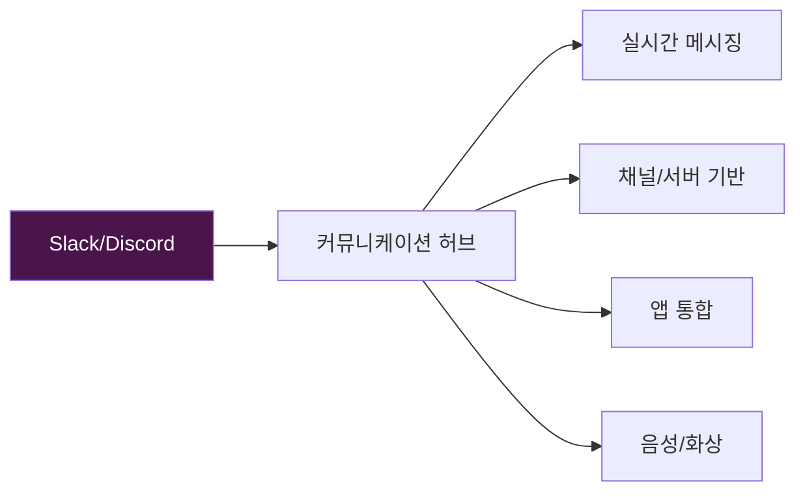
```mermaid
graph LR
    A[Slack/Discord] --> B[커뮤니케이션 허브]

    B --> B1[실시간 메시징]
    B --> B2[채널/서버 기반]
    B --> B3[앱 통합]
    B --> B4[음성/화상]

    style A fill:#4A154B,color:#fff
```

### 2.6.1 Slack의 강점

**1. 실시간 커뮤니케이션**
- 빠른 메시징
- 쓰레드 대화
- 화상/음성 통화

**2. 채널 기반 조직**
- 프로젝트/팀별 채널
- 투명한 소통
- 크로스 기능 협업

**3. 풍부한 통합**
- 2,400+ 앱 연동
- 워크플로우 빌더
- 봇 및 자동화

**4. 검색 및 아카이브**
- 강력한 메시지 검색
- 모든 대화 보관
- 파일 공유 및 저장

### 2.6.2 Discord의 강점

**1. 커뮤니티 중심**
- 대규모 커뮤니티 운영에 최적화
- 무료 음성/화상 채널 무제한
- 사용자 친화적 인터페이스

**2. 음성 커뮤니케이션 강점**
- 고품질 음성 채팅
- 화면 공유 및 스트리밍
- 항상 열린 음성 채널

**3. 완전 무료 핵심 기능**
- 메시지 제한 없음
- 무제한 통합
- 대부분 기능 무료 제공

**4. 유연한 권한 시스템**
- 역할 기반 권한
- 채널별 세밀한 제어
- 봇을 통한 자동화

### 2.6.3 Slack vs Discord 비교

| 특성 | Slack | Discord |
|------|-------|---------|
| **주요 대상** | 기업/비즈니스 | 커뮤니티/팀 |
| **가격** | 무료 플랜 제한적 | 대부분 기능 무료 |
| **음성 채팅** | 기본 제공 | 고품질, 무제한 |
| **비즈니스 통합** | 매우 강력 | 제한적 |
| **사용자 경험** | 비즈니스 중심 | 캐주얼, 친근함 |
| **검색 기능** | 강력 (유료) | 제한적 |

### 2.6.4 Slack의 약점

- 정보 과부하 (알림 피로)
- 문서/지식 관리 부족
- 중요 정보 휘발성
- 무료 플랜 메시지 제한

### 2.6.5 Discord의 약점

- 비즈니스 도구 통합 부족
- 전문적 협업 기능 제한적
- 검색 및 아카이브 기능 약함
- 기업 보안/규제 준수 제한

### 2.6.6 Slack 적합성

| 적합한 경우 | 부적합한 경우 |
|-----------|-------------|
| 실시간 소통 중요 | 문서 중심 업무 |
| 원격 팀 | 정보 아카이빙 중요 |
| 빠른 의사결정 필요 | 조용한 협업 선호 |
| 다른 도구와 함께 사용 | 단독 협업 도구로 사용 |

### 2.6.7 Discord 적합성

| 적합한 경우 | 부적합한 경우 |
|-----------|-------------|
| 커뮤니티 운영 | 엔터프라이즈 보안 필요 |
| 빈번한 음성 소통 | 비즈니스 도구 통합 중요 |
| 예산 제약 심함 | 전문적 프로젝트 관리 |
| 캐주얼한 팀 문화 | 엄격한 규제 산업 |

## 2.7 두레이 (Dooray!)

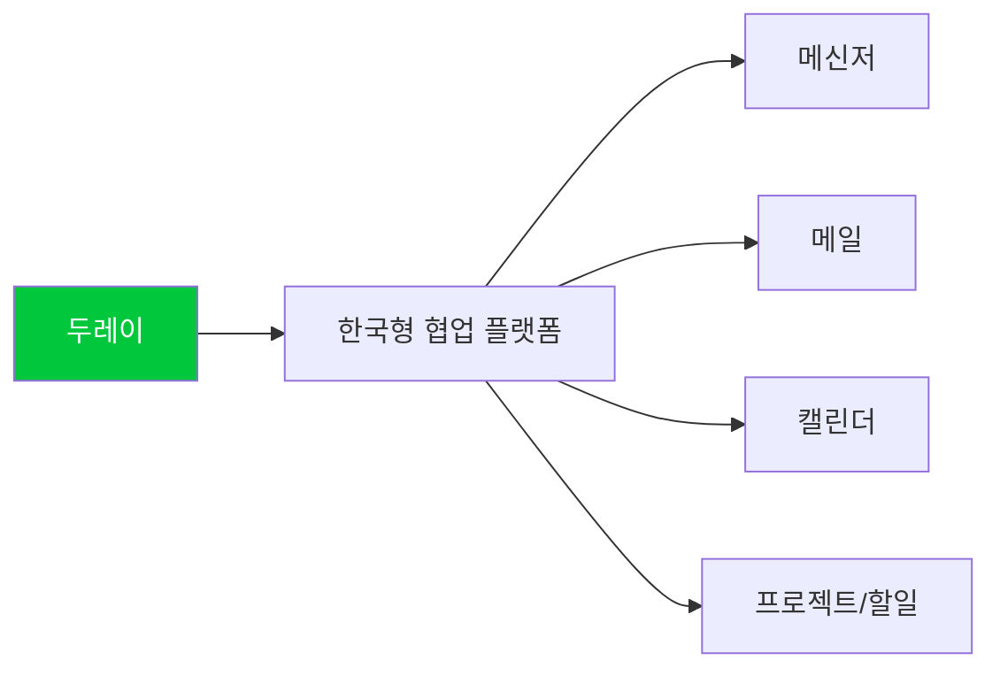
```mermaid
graph LR
    A[두레이] --> B[한국형 협업 플랫폼]

    B --> B1[메신저]
    B --> B2[메일]
    B --> B3[캘린더]
    B --> B4[프로젝트/할일]

    style A fill:#00C73C,color:#fff
```

### 2.7.1 두레이의 강점

**1. 한국 기업 최적화**
- 한글 지원 및 한국 업무 문화 반영
- NHN 클라우드 기반의 안정성
- 국내 기업 지원 및 서비스

**2. 올인원 그룹웨어**
- 메신저, 메일, 캘린더, 프로젝트 통합
- 별도 도구 없이 협업 가능
- 단일 플랫폼에서 모든 업무 처리

**3. 프로젝트 관리 기능**
- 할일 관리 및 이슈 트래킹
- 간트 차트 및 마일스톤
- 업무 흐름 시각화

**4. 합리적인 가격**
- 중소기업 친화적 가격 정책
- 사용자당 비용 효율적
- 무료 체험 제공

### 2.7.2 두레이의 약점

- 글로벌 통합 제한적 (주로 국내 서비스)
- 서드파티 앱 생태계 부족
- 고급 자동화 기능 제한적
- 해외 팀과의 협업 시 언어 제약

### 2.7.3 두레이 적합성

| 적합한 경우 | 부적합한 경우 |
|-----------|-------------|
| 한국 기업/팀 | 글로벌 협업 중심 |
| 그룹웨어 통합 필요 | 고급 자동화 필요 |
| 중소기업 | 복잡한 서드파티 통합 |
| 메일+메신저 통합 원함 | 영어권 주요 사용자 |

# 3. 종합 비교표

## 3.1 기능별 비교

### 3.1.1 협업 플랫폼 비교

| 기능 | Notion | Confluence | Google Workspace | Airtable | Monday.com | 두레이 |
|------|--------|-----------|------------------|----------|-----------|--------|
| **문서 작성** | ⭐⭐⭐⭐⭐ | ⭐⭐⭐⭐ | ⭐⭐⭐⭐⭐ | ⭐⭐ | ⭐⭐ | ⭐⭐⭐ |
| **데이터베이스** | ⭐⭐⭐⭐⭐ | ⭐⭐ | ⭐⭐⭐ | ⭐⭐⭐⭐⭐ | ⭐⭐⭐⭐ | ⭐⭐ |
| **프로젝트 관리** | ⭐⭐⭐⭐ | ⭐⭐⭐ | ⭐⭐ | ⭐⭐⭐⭐ | ⭐⭐⭐⭐⭐ | ⭐⭐⭐⭐ |
| **위키/지식관리** | ⭐⭐⭐⭐⭐ | ⭐⭐⭐⭐⭐ | ⭐⭐ | ⭐⭐ | ⭐⭐ | ⭐⭐⭐ |
| **실시간 협업** | ⭐⭐⭐⭐ | ⭐⭐⭐ | ⭐⭐⭐⭐⭐ | ⭐⭐⭐⭐ | ⭐⭐⭐⭐ | ⭐⭐⭐⭐ |
| **메신저/메일** | ⭐ | ⭐ | ⭐⭐⭐⭐⭐ | ⭐ | ⭐ | ⭐⭐⭐⭐⭐ |
| **자동화** | ⭐⭐⭐ | ⭐⭐ | ⭐⭐⭐ | ⭐⭐⭐⭐⭐ | ⭐⭐⭐⭐⭐ | ⭐⭐ |
| **통합/API** | ⭐⭐⭐⭐ | ⭐⭐⭐⭐ | ⭐⭐⭐⭐⭐ | ⭐⭐⭐⭐⭐ | ⭐⭐⭐⭐⭐ | ⭐⭐⭐ |
| **모바일 앱** | ⭐⭐⭐⭐ | ⭐⭐⭐ | ⭐⭐⭐⭐⭐ | ⭐⭐⭐⭐ | ⭐⭐⭐⭐ | ⭐⭐⭐⭐ |
| **검색 기능** | ⭐⭐⭐⭐ | ⭐⭐⭐⭐⭐ | ⭐⭐⭐⭐ | ⭐⭐⭐ | ⭐⭐⭐ | ⭐⭐⭐⭐ |
| **사용 편의성** | ⭐⭐⭐⭐ | ⭐⭐ | ⭐⭐⭐⭐⭐ | ⭐⭐⭐⭐ | ⭐⭐⭐⭐ | ⭐⭐⭐⭐ |
| **한국어 지원** | ⭐⭐⭐ | ⭐⭐⭐ | ⭐⭐⭐⭐ | ⭐⭐⭐ | ⭐⭐⭐ | ⭐⭐⭐⭐⭐ |

### 3.1.2 커뮤니케이션 도구 비교

| 기능 | Slack | Discord |
|------|-------|---------|
| **실시간 메시징** | ⭐⭐⭐⭐⭐ | ⭐⭐⭐⭐⭐ |
| **음성/화상 채팅** | ⭐⭐⭐⭐ | ⭐⭐⭐⭐⭐ |
| **화면 공유/스트리밍** | ⭐⭐⭐⭐ | ⭐⭐⭐⭐⭐ |
| **채널/서버 관리** | ⭐⭐⭐⭐⭐ | ⭐⭐⭐⭐⭐ |
| **검색 및 아카이브** | ⭐⭐⭐⭐⭐ | ⭐⭐ |
| **비즈니스 도구 통합** | ⭐⭐⭐⭐⭐ | ⭐⭐ |
| **봇 및 자동화** | ⭐⭐⭐⭐⭐ | ⭐⭐⭐⭐ |
| **모바일 앱** | ⭐⭐⭐⭐⭐ | ⭐⭐⭐⭐⭐ |
| **사용 편의성** | ⭐⭐⭐⭐⭐ | ⭐⭐⭐⭐⭐ |
| **무료 플랜** | ⭐⭐⭐ | ⭐⭐⭐⭐⭐ |
| **엔터프라이즈 기능** | ⭐⭐⭐⭐⭐ | ⭐⭐ |

## 3.2 가격 비교

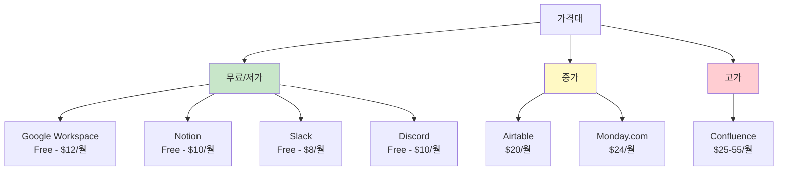
```mermaid
graph TD
    A[가격대] --> B[무료/저가]
    A --> C[중가]
    A --> D[고가]

    B --> B1[Google Workspace<br/>Free - $12/월]
    B --> B2[Notion<br/>Free - $10/월]
    B --> B3[Slack<br/>Free - $8/월]
    B --> B4[Discord<br/>Free - $10/월]

    C --> C1[Airtable<br/>$20/월]
    C --> C2[Monday.com<br/>$24/월]

    D --> D1[Confluence<br/>$25-55/월]

    style B fill:#C8E6C9
    style C fill:#FFF9C4
    style D fill:#FFCDD2
```

| 도구 | 무료 플랜 | 유료 플랜 (사용자당/월) | 엔터프라이즈 |
|------|----------|---------------------|------------|
| **Notion** | ✅ (무제한) | $10 (Plus)<br/>$18 (Business) | 별도 문의 |
| **Confluence** | ✅ (10명 제한) | $6.05 (Standard)<br/>$11.55 (Premium) | 별도 문의 |
| **Google Workspace** | ✅ (개인) | $6 (Business Starter)<br/>$12 (Standard) | $18 (Plus) |
| **Airtable** | ✅ (제한) | $20 (Team)<br/>$45 (Business) | 별도 문의 |
| **Monday.com** | ✅ (제한) | $9 (Basic)<br/>$12 (Standard)<br/>$19 (Pro) | 별도 문의 |
| **Slack** | ✅ (제한) | $8 (Pro)<br/>$12.50 (Business+) | 별도 문의 |
| **Discord** | ✅ (대부분 무료) | $10 (Nitro, 개인용)<br/>서버 부스트 옵션 | 별도 문의 |
| **두레이** | ✅ (30일) | 약 ₩5,000~7,000<br/>(프로젝트/메일 별도) | 별도 문의 |

## 3.3 AX/DX 적합도 평가

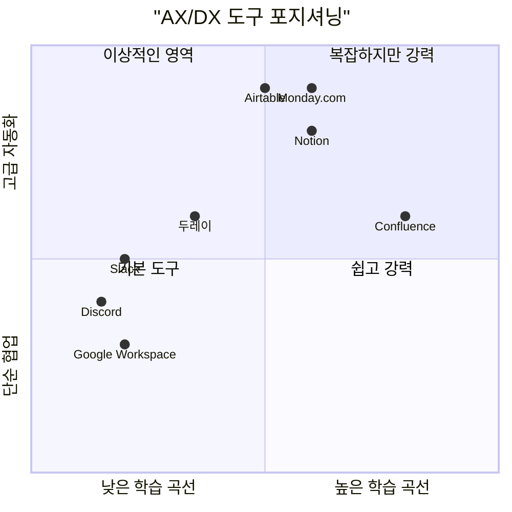
```mermaid
quadrantChart
    title "AX/DX 도구 포지셔닝"
    x-axis "낮은 학습 곡선" --> "높은 학습 곡선"
    y-axis "단순 협업" --> "고급 자동화"
    quadrant-1 "복잡하지만 강력"
    quadrant-2 "이상적인 영역"
    quadrant-3 "기본 도구"
    quadrant-4 "쉽고 강력"
    "Notion": [0.6, 0.8]
    "Confluence": [0.8, 0.6]
    "Google Workspace": [0.2, 0.3]
    "Airtable": [0.5, 0.9]
    "Monday.com": [0.6, 0.9]
    "Slack": [0.2, 0.5]
    "Discord": [0.15, 0.4]
    "두레이": [0.35, 0.6]
```

**해석**:
- **우상단 (복잡하지만 강력)**: Airtable, Monday.com - 고급 자동화 가능, 학습 필요
- **좌상단 (이상적)**: Notion, 두레이 - 강력한 기능 + 적절한 학습 곡선
- **우하단**: Confluence - 복잡하지만 기본적인 협업 중심
- **좌하단**: Google Workspace, Slack, Discord - 쉽고 기본적

# 4. 시나리오별 추천

## 4.1 시나리오 1: 스타트업 (직원 10-30명)

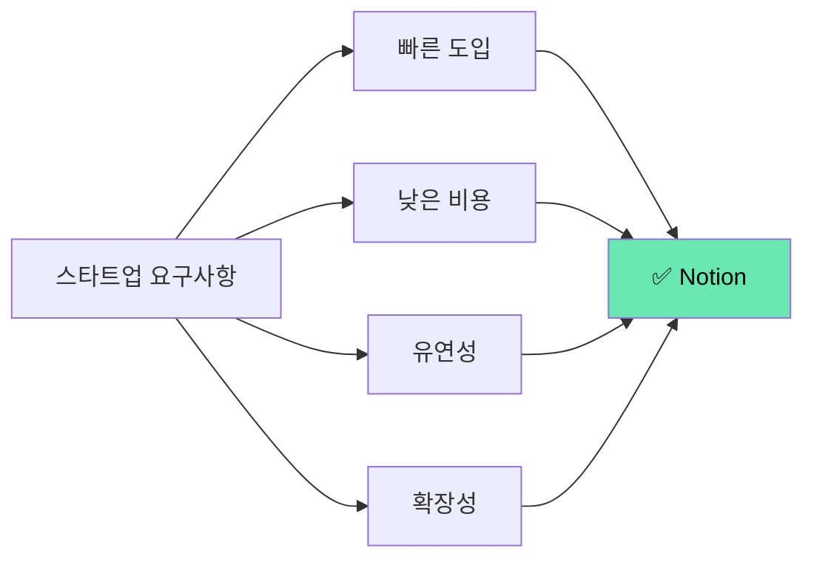
```mermaid
graph LR
    A[스타트업 요구사항] --> B[빠른 도입]
    A --> C[낮은 비용]
    A --> D[유연성]
    A --> E[확장성]

    B --> F[✅ Notion]
    C --> F
    D --> F
    E --> F

    style F fill:#67E8B1,color:#000
```

**추천**: **Notion + Slack (또는 Discord)**

**이유**:
- Notion: 문서, 위키, 프로젝트 관리 올인원
- Slack: 실시간 커뮤니케이션 (비즈니스 중심)
- Discord: 실시간 커뮤니케이션 (예산 제약 시, 음성 채팅 중요 시)
- 합리적인 가격 (무료 플랜 활용 가능)
- 빠른 도입 및 학습
- 함께 성장 가능

**구성 옵션 1 (비즈니스 중심)**:
- Notion: 사내 위키, 프로젝트 문서, 온보딩, 데이터베이스
- Slack: 일상 소통, 빠른 의사결정
- Google Workspace: 이메일, 캘린더

**구성 옵션 2 (예산 최소화)**:
- Notion: 사내 위키, 프로젝트 문서, 온보딩, 데이터베이스
- Discord: 일상 소통, 음성 채팅 (완전 무료)
- Google Workspace: 이메일, 캘린더

## 4.2 시나리오 2: 개발 중심 중견기업 (100명+)

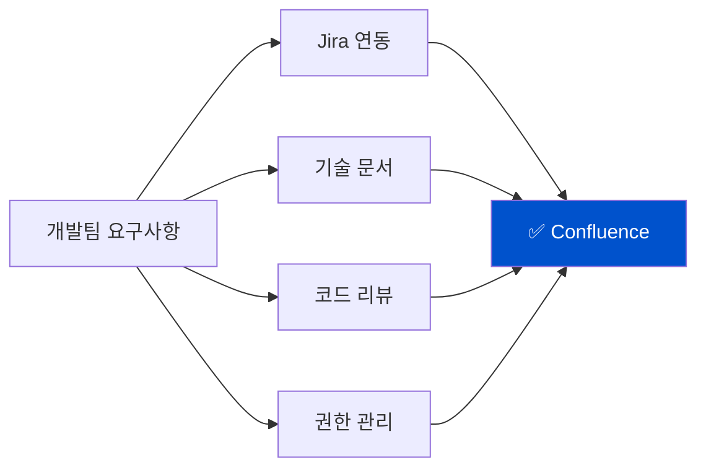
```mermaid
graph LR
    A[개발팀 요구사항] --> B[Jira 연동]
    A --> C[기술 문서]
    A --> D[코드 리뷰]
    A --> E[권한 관리]

    B --> F[✅ Confluence]
    C --> F
    D --> F
    E --> F

    style F fill:#0052CC,color:#fff
```

**추천**: **Confluence + Jira + Discord**

**이유**:
- Confluence: 기술 문서, API 문서, 아키텍처 설계
- Jira: 이슈 추적, 스프린트 관리
- Discord: 개발팀 실시간 소통 및 음성 채팅 (무료)
- 완벽한 Atlassian 생태계 통합
- 엔터프라이즈급 보안 및 권한

**구성**:
- Confluence: 모든 기술 문서 및 위키
- Jira: 프로젝트 관리 및 이슈 트래킹
- Discord: 팀 커뮤니케이션, 페어 프로그래밍 음성 채팅
- Bitbucket: 코드 저장소

## 4.3 시나리오 3: 마케팅/크리에이티브 에이전시

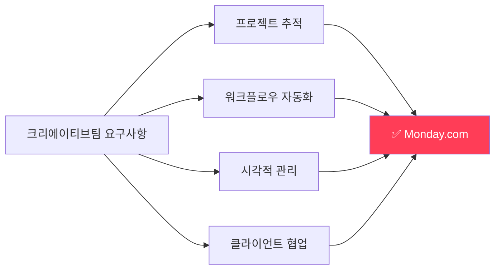
```mermaid
graph LR
    A[크리에이티브팀 요구사항] --> B[프로젝트 추적]
    A --> C[워크플로우 자동화]
    A --> D[시각적 관리]
    A --> E[클라이언트 협업]

    B --> F[✅ Monday.com]
    C --> F
    D --> F
    E --> F

    style F fill:#FF3D57,color:#fff
```

**추천**: **Monday.com + Google Workspace + Discord**

**이유**:
- Monday.com: 캠페인 관리, 콘텐츠 캘린더, 워크플로우
- 시각적이고 직관적
- 자동화로 반복 작업 제거
- 클라이언트와 공유 가능
- Discord: 크리에이티브 팀 협업 및 화면 공유 (무료)

**구성**:
- Monday.com: 프로젝트 및 캠페인 관리
- Google Workspace: 문서 작성 및 공유
- Discord: 팀 커뮤니케이션, 화면 공유, 디자인 리뷰
- Adobe Creative Cloud: 디자인 작업

## 4.4 시나리오 4: 데이터 중심 조직 (CRM, 영업, 운영)

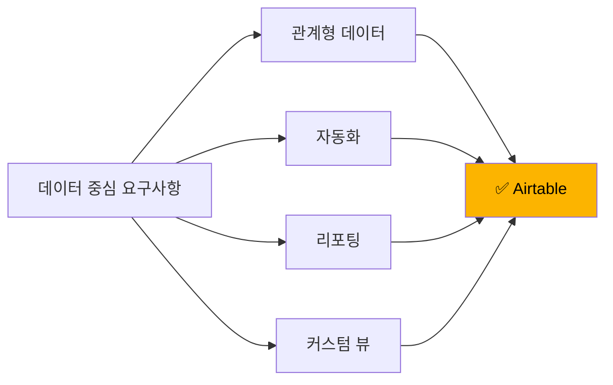
```mermaid
graph LR
    A[데이터 중심 요구사항] --> B[관계형 데이터]
    A --> C[자동화]
    A --> D[리포팅]
    A --> E[커스텀 뷰]

    B --> F[✅ Airtable]
    C --> F
    D --> F
    E --> F

    style F fill:#FCB400,color:#000
```

**추천**: **Airtable + Discord + Notion**

**이유**:
- Airtable: CRM, 영업 파이프라인, 재고 관리
- 강력한 데이터 관리 및 자동화
- 다양한 뷰로 데이터 시각화
- API로 다른 시스템 연동
- Discord: 팀 소통 및 알림 (무료)

**구성**:
- Airtable: 모든 데이터 관리 (고객, 제품, 주문 등)
- Notion: 프로세스 문서, 교육 자료
- Discord: 알림 및 소통, 봇 연동
- Zapier: 자동화 연결

## 4.5 시나리오 5: 교육 기관/비영리 단체

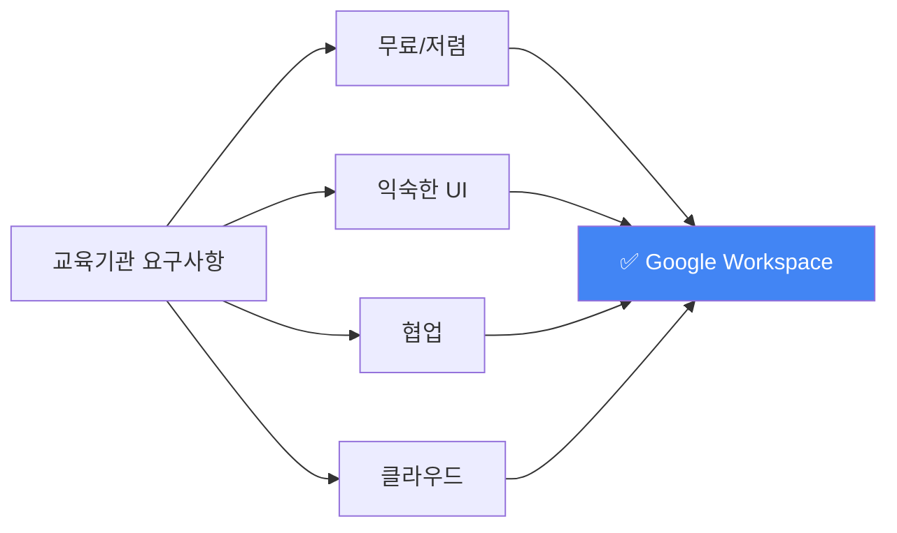
```mermaid
graph LR
    A[교육기관 요구사항] --> B[무료/저렴]
    A --> C[익숙한 UI]
    A --> D[협업]
    A --> E[클라우드]

    B --> F[✅ Google Workspace]
    C --> F
    D --> F
    E --> F

    style F fill:#4285F4,color:#fff
```

**추천**: **Google Workspace + Notion**

**이유**:
- Google Workspace: 교육 기관 무료 제공
- 익숙한 인터페이스 (Docs, Sheets, Slides)
- Notion: 수업 자료, 과제 관리, 학습 포트폴리오

**구성**:
- Google Classroom: 수업 관리
- Google Docs/Sheets: 문서 작성 및 협업
- Notion: 강의 노트, 리소스 허브
- Google Meet: 화상 수업

# 5. 의사결정 프레임워크

## 5.1 도구 선택 결정 트리

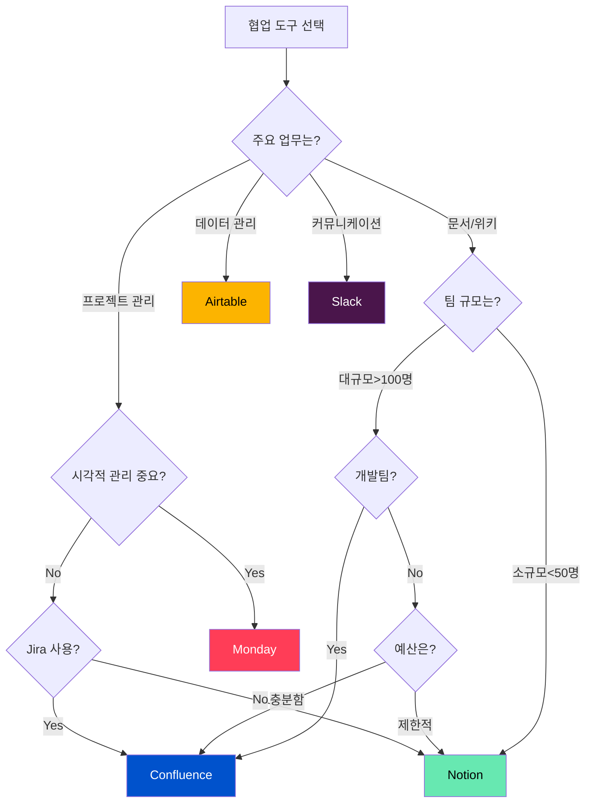
```mermaid
graph TD
    Start[협업 도구 선택] --> Q1{주요 업무는?}

    Q1 -->|문서/위키| Q2{팀 규모는?}
    Q1 -->|프로젝트 관리| Q3{시각적 관리 중요?}
    Q1 -->|데이터 관리| Airtable
    Q1 -->|커뮤니케이션| Slack

    Q2 -->|소규모<50명| Notion
    Q2 -->|대규모>100명| Q4{개발팀?}

    Q4 -->|Yes| Confluence
    Q4 -->|No| Q5{예산은?}

    Q5 -->|충분함| Confluence
    Q5 -->|제한적| Notion

    Q3 -->|Yes| Monday
    Q3 -->|No| Q6{Jira 사용?}

    Q6 -->|Yes| Confluence
    Q6 -->|No| Notion

    style Notion fill:#67E8B1,color:#000
    style Confluence fill:#0052CC,color:#fff
    style Airtable fill:#FCB400,color:#000
    style Monday fill:#FF3D57,color:#fff
    style Slack fill:#4A154B,color:#fff
```

## 5.2 평가 체크리스트

다음 체크리스트를 사용하여 귀사에 적합한 도구를 선택하세요:

**1. 기능 요구사항** (각 항목 1-5점)

| 항목 | Notion | Confluence | Google WS | Airtable | Monday | Slack | Discord | 두레이 |
|------|--------|-----------|-----------|----------|--------|-------|---------|--------|
| 문서 작성 | ___ | ___ | ___ | ___ | ___ | ___ | ___ | ___ |
| 데이터베이스 | ___ | ___ | ___ | ___ | ___ | ___ | ___ | ___ |
| 프로젝트 관리 | ___ | ___ | ___ | ___ | ___ | ___ | ___ | ___ |
| 위키 | ___ | ___ | ___ | ___ | ___ | ___ | ___ | ___ |
| 자동화 | ___ | ___ | ___ | ___ | ___ | ___ | ___ | ___ |
| 음성/화상 | ___ | ___ | ___ | ___ | ___ | ___ | ___ | ___ |
| 한국어 지원 | ___ | ___ | ___ | ___ | ___ | ___ | ___ | ___ |
| **총점** | ___ | ___ | ___ | ___ | ___ | ___ | ___ | ___ |

**2. 비기능 요구사항**

- [ ] 예산: 사용자당 월 $___ 이하
- [ ] 학습 시간: ___ 주 이내 도입 가능해야 함
- [ ] 모바일 필수 여부: Yes / No
- [ ] 오프라인 필수 여부: Yes / No
- [ ] 보안 인증 필요: Yes / No
- [ ] 기존 시스템 통합 필요: Yes / No (어떤 시스템? _______)

**3. 조직 특성**

- 팀 규모: ___ 명
- 업종: ___________
- 주요 부서: ___________
- IT 역량: 높음 / 중간 / 낮음
- 현재 사용 도구: ___________

## 5.3 생성형 AI를 활용한 도구 선택

```
[역할]
너는 IT 도구 컨설턴트야.

[맥락]
우리 회사에 최적의 협업 도구를 선택하려고 해.

[회사 정보]
- 업종: [업종]
- 직원 수: [숫자]
- 주요 부서: [부서들]
- 현재 사용 중인 도구: [도구들]
- 주요 업무: [업무 설명]
- 예산: 사용자당 월 [금액]
- IT 역량: [높음/중간/낮음]

[고려 도구]
Notion, Confluence, Google Workspace, Airtable, Monday.com, Slack, Discord, 두레이

[특별 고려사항]
- 한국 기업이므로 한국어 지원 및 국내 서비스 중요
- 그룹웨어(메일, 메신저, 캘린더) 통합 여부

[요청]
1. 각 도구의 우리 회사 적합도 점수 (10점 만점)
2. 추천 도구 Top 3와 이유
3. 추천 도구 조합 (예: Notion + Discord, 두레이 + Notion)
4. 도입 로드맵 (3개월)
5. 예상 ROI 및 효과

[형식]
표와 차트를 포함한 HTML 보고서로 작성해줘.
```

# 6. 마이그레이션 전략

## 6.1 도구 전환 프로세스


```mermaid
graph LR
    A[1 - 현황 분석] --> B[2 - 도구 선택]
    B --> C[3 - 파일럿 테스트]
    C --> D[4 - 데이터 마이그레이션]
    D --> E[5 - 교육 및 온보딩]
    E --> F[6 - 전면 도입]
    F --> G[7 - 모니터링 및 최적화]

    style A fill:#E1F5FE
    style G fill:#C8E6C9
```

**단계별 가이드**:

**1단계: 현황 분석 (1주)**
- 현재 사용 중인 도구 목록
- 데이터 양 및 구조 파악
- 사용자 인터뷰 (불만사항, 요구사항)
- 통합 필요 시스템 확인

**2단계: 도구 선택 (1-2주)**
- 후보 도구 3개 선정
- 무료 체험판 테스트
- 데모 요청 및 영업 미팅
- 비용 견적 비교

**3단계: 파일럿 테스트 (1개월)**
- 소규모 팀 (5-10명) 선정
- 실제 업무에 적용
- 피드백 수집
- 문제점 파악 및 해결

**4단계: 데이터 마이그레이션 (2-4주)**
- 중요 데이터 우선 이전
- 자동화 스크립트 활용 (가능 시)
- 수동 이전 병행
- 데이터 검증

**5단계: 교육 및 온보딩 (2주)**
- 온라인 교육 자료 제작
- 실습 워크숍 개최
- 도입 가이드 문서 배포
- Q&A 세션

**6단계: 전면 도입 (1개월)**
- 단계적 롤아웃 (부서별)
- 헬프 데스크 운영
- 실시간 지원
- 기존 도구 병행 사용

**7단계: 모니터링 및 최적화 (지속)**
- 사용률 모니터링
- 사용자 만족도 조사
- 추가 교육 제공
- 워크플로우 최적화

## 6.2 일반적인 마이그레이션 경로

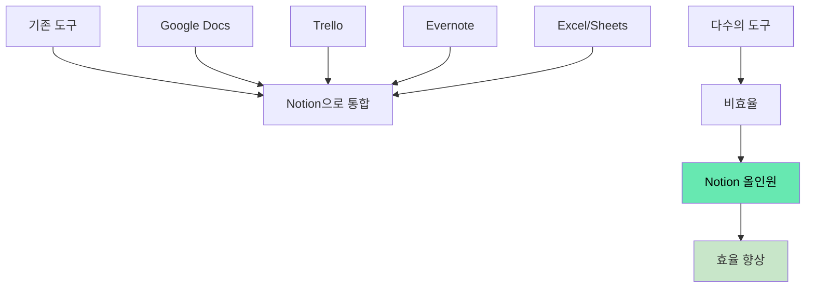
```mermaid
graph TD
    A[기존 도구] --> B[Notion으로 통합]

    C[Google Docs] --> B
    D[Trello] --> B
    E[Evernote] --> B
    F[Excel/Sheets] --> B

    G[다수의 도구] --> H[비효율]
    H --> I[Notion 올인원]
    I --> J[효율 향상]

    style I fill:#67E8B1,color:#000
    style J fill:#C8E6C9
```

**주요 마이그레이션 사례**:

1. **Google Docs → Notion**
   - Google Takeout으로 내보내기
   - Notion 임포트 기능 활용
   - 하이퍼링크 및 구조 재설정

2. **Trello → Notion**
   - JSON 내보내기
   - Notion 데이터베이스로 변환
   - 보드 뷰 재생성

3. **Confluence → Notion**
   - HTML 내보내기
   - 수동 복사 (구조가 복잡할 경우)
   - 페이지 계층 재구성

# 7. 정리

## 7.1 핵심 요약

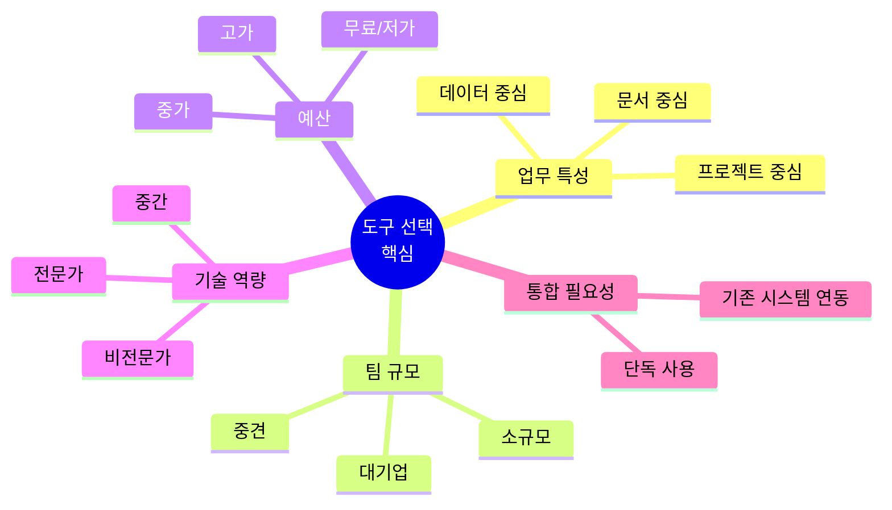
```mermaid
mindmap
  root((도구 선택<br/>핵심))
    업무 특성
      문서 중심
      프로젝트 중심
      데이터 중심
    팀 규모
      소규모
      중견
      대기업
    예산
      무료/저가
      중가
      고가
    기술 역량
      비전문가
      중간
      전문가
    통합 필요성
      단독 사용
      기존 시스템 연동
```

**결론**:
- **만능 도구는 없다** - 조직 특성에 맞춰 선택
- **올인원 vs 베스트 오브 브리드** - 통합 도구 vs 전문 도구 조합
- **파일럿 테스트 필수** - 실제 사용 후 결정
- **마이그레이션 계획** - 충분한 시간과 리소스 확보

## 7.2 추천 조합

**소규모 팀 (10-30명)**:
- 🥇 Notion + Discord + Google Workspace (추천)
- 🥈 두레이 단독 (한국 기업, 그룹웨어 통합 원함)
- 🥉 Notion + Slack + Google Workspace (비즈니스 통합 중요 시)
- 비용 효율적, 빠른 도입, 확장 가능
- Discord의 무료 음성/화상 채팅이 소규모 팀에 이상적
- 두레이는 메일+메신저+프로젝트를 하나로 통합

**중견 기업 (50-200명)**:
- 🥇 Notion + Discord + Airtable (부서별)
- 🥈 두레이 + Notion (한국 기업, 그룹웨어 + 강력한 위키)
- 🥉 Confluence + Jira + Discord (개발 중심)
- Discord로 비용 절감하면서도 강력한 커뮤니케이션 유지
- 두레이로 그룹웨어 통합, Notion으로 지식 관리 강화

**대기업 (200명+)**:
- 🥇 Confluence + Jira + Slack + Monday.com (부서별)
- 🥈 두레이 + Confluence (한국 기업, 기술 문서 중요)
- 엔터프라이즈급 보안 및 권한 관리 필요
- Slack의 엔터프라이즈 기능 활용
- Discord는 특정 커뮤니티나 비공식 소통 채널로 병행 가능
- 두레이는 국내 기업 특화 그룹웨어 솔루션

:::div{.callout}
**실습 과제**: 위 체크리스트를 활용하여 귀사에 적합한 도구를 평가해보세요. 생성형 AI에 회사 정보를 입력하고 추천을 받아 비교해보는 것도 좋은 방법입니다.
:::
