# 1. AX와 DX란 무엇인가?

## 1.1 디지털 전환 (DX: Digital Transformation)

**디지털 전환**은 기업이 디지털 기술을 활용하여 비즈니스 모델, 조직 문화, 고객 경험을 근본적으로 변화시키는 과정입니다.

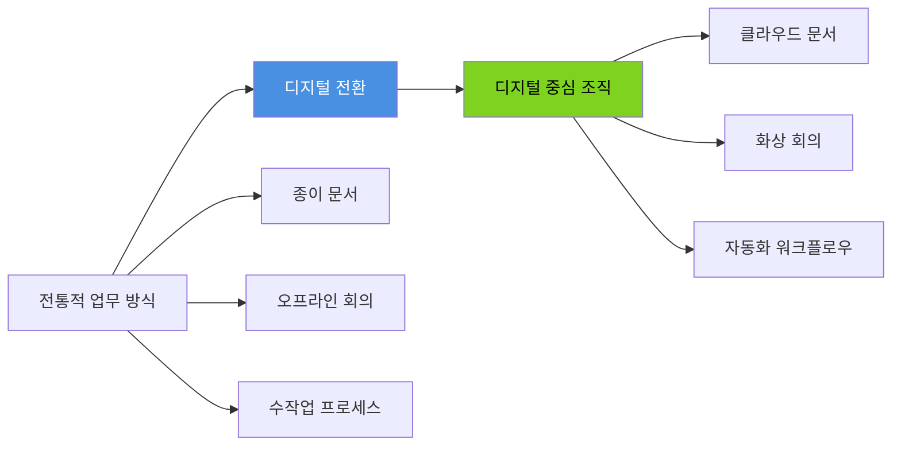

**DX의 핵심 요소**:

1. **기술 도입**: 클라우드, AI, 빅데이터, IoT 등
2. **프로세스 혁신**: 업무 방식의 디지털화
3. **조직 문화**: 디지털 마인드셋 확산
4. **고객 경험**: 디지털 채널을 통한 고객 접점 강화

## 1.2 업무 자동화 경험 (AX: Automation Experience)

**AX**는 단순히 업무를 자동화하는 것을 넘어, 직원들이 자동화된 환경에서 더 나은 업무 경험을 갖도록 하는 것입니다.

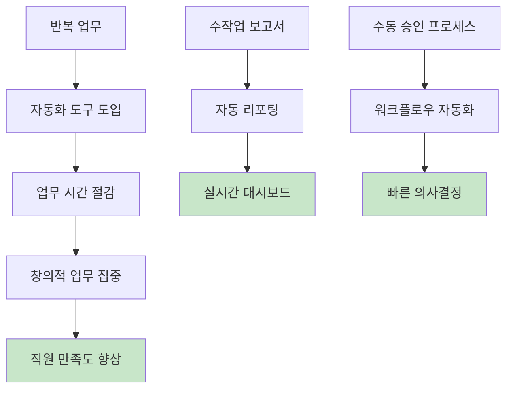

**AX의 핵심 요소**:

1. **반복 작업 자동화**: 수작업 제거
2. **직관적 도구**: 쉽게 사용 가능한 자동화
3. **워크플로우 최적화**: 불필요한 단계 제거
4. **데이터 기반 의사결정**: 자동 수집 및 분석

## 1.3 DX와 AX의 관계

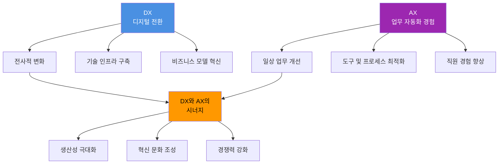

**관계 정리**:
- **DX는 전략**, **AX는 실행**
- DX가 방향을 제시하면, AX가 구체적인 도구와 프로세스로 실현
- AX의 성공이 모여 DX를 완성

# 2. DX의 목표

## 2.1 비즈니스 목표

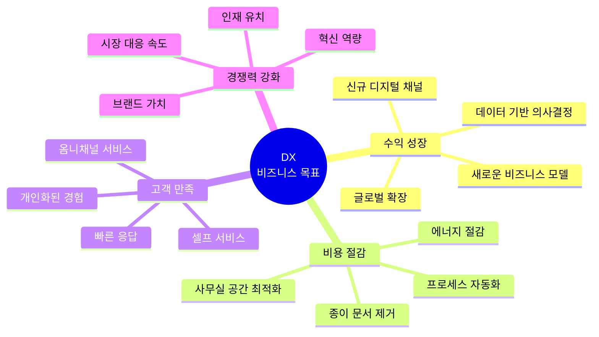

### 2.1.1 수익 성장

**목표**:
- 디지털 채널을 통한 매출 증대
- 새로운 시장 진출
- 데이터 기반 제품/서비스 개발

**측정 지표 (KPI)**:

| 지표 | 설명 | 목표 예시 |
|------|------|----------|
| **디지털 매출 비중** | 전체 매출 중 디지털 채널 비율 | 3년 내 50% 달성 |
| **신규 고객 획득** | 디지털 채널을 통한 신규 고객 수 | 월 1,000명 |
| **고객 생애 가치 (LTV)** | 디지털 서비스 이용 고객의 LTV | 30% 증가 |
| **제품 출시 속도** | 신제품 개발부터 출시까지 기간 | 50% 단축 |

### 2.1.2 비용 절감

**목표**:
- 운영 비용 감소
- 인력 효율성 향상
- 리소스 최적화

**측정 지표**:

| 지표 | 설명 | 목표 예시 |
|------|------|----------|
| **프로세스 비용** | 업무 프로세스당 소요 비용 | 40% 절감 |
| **종이 사용량** | 인쇄 및 종이 문서 사용량 | 80% 감소 |
| **회의 비용** | 출장 및 오프라인 회의 비용 | 60% 절감 |
| **IT 인프라 비용** | 클라우드 전환으로 인한 비용 변화 | 30% 절감 |

### 2.1.3 고객 만족도 향상

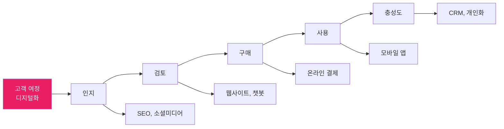

**측정 지표**:

| 지표 | 설명 | 목표 예시 |
|------|------|----------|
| **NPS (Net Promoter Score)** | 고객 추천 의향 | 50점 이상 |
| **고객 만족도 (CSAT)** | 서비스 만족도 점수 | 4.5/5.0 |
| **응답 시간** | 고객 문의 응답 시간 | 1시간 이내 |
| **이탈률** | 서비스 이탈 고객 비율 | 10% 이하 |

## 2.2 조직 목표

### 2.2.1 업무 효율성 향상

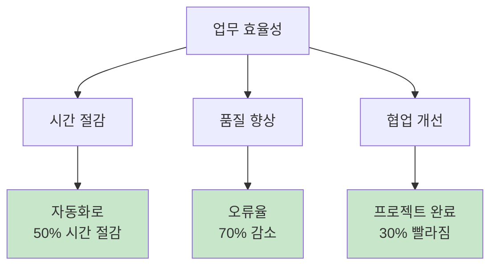

**측정 지표**:

| 지표 | 설명 | 목표 예시 |
|------|------|----------|
| **업무 처리 시간** | 주요 업무 완료까지 소요 시간 | 40% 단축 |
| **오류율** | 업무 처리 과정의 실수/오류 | 70% 감소 |
| **문서 검색 시간** | 필요한 정보 찾는 시간 | 80% 단축 |
| **회의 시간** | 불필요한 회의 제거 | 30% 감소 |

### 2.2.2 데이터 기반 의사결정

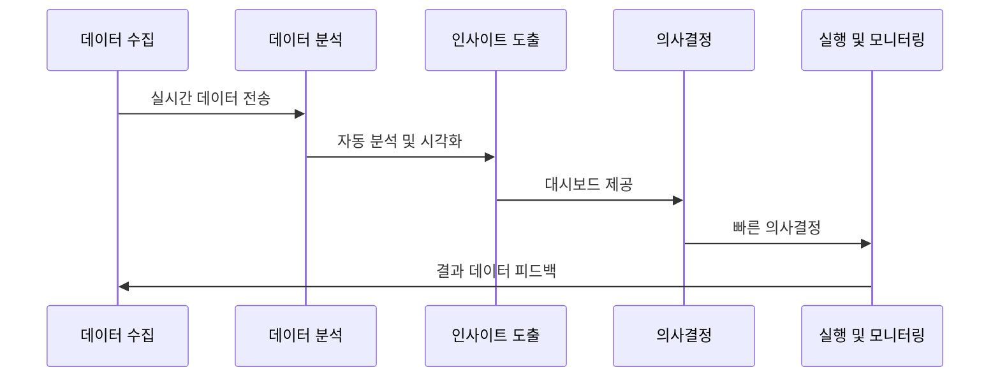

**목표**:
- 모든 중요 의사결정에 데이터 활용
- 실시간 비즈니스 인텔리전스
- 예측 분석 기반 전략 수립

**측정 지표**:

| 지표 | 설명 | 목표 예시 |
|------|------|----------|
| **데이터 활용률** | 의사결정 시 데이터 활용 비율 | 80% 이상 |
| **리포트 생성 시간** | 경영 보고서 작성 시간 | 자동화로 90% 단축 |
| **데이터 접근성** | 직원이 필요 데이터 접근 가능 여부 | 100% |
| **예측 정확도** | AI 기반 예측의 정확도 | 85% 이상 |

### 2.2.3 조직 문화 혁신

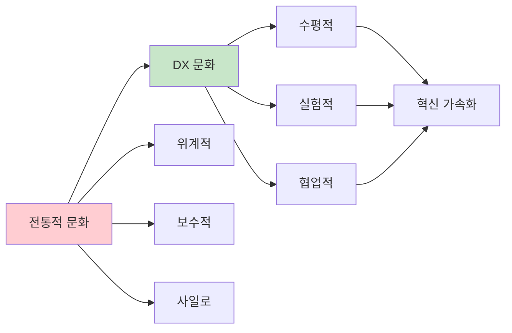

**목표**:
- 디지털 마인드셋 확산
- 실패를 두려워하지 않는 문화
- 크로스 기능 협업 활성화

## 2.3 기술 목표

### 2.3.1 IT 인프라 현대화

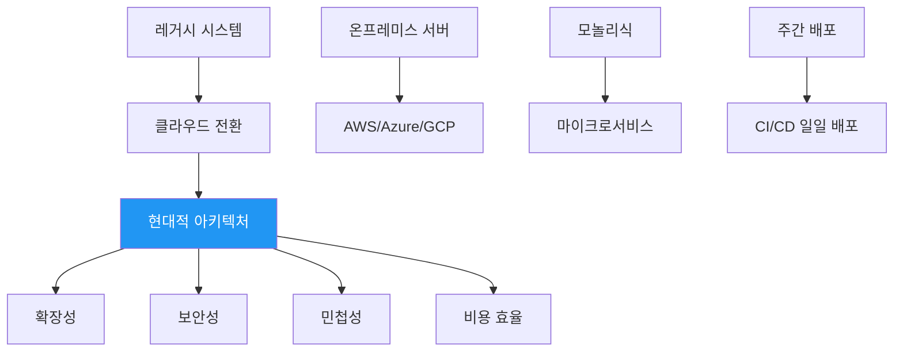

**목표**:
- 클라우드 퍼스트 전략
- API 중심 아키텍처
- 마이크로서비스 전환

### 2.3.2 보안 및 컴플라이언스

| 목표 | 설명 | KPI |
|------|------|-----|
| **데이터 보안** | 모든 데이터 암호화 | 100% |
| **접근 제어** | 역할 기반 권한 관리 | 100% 적용 |
| **규정 준수** | GDPR, ISO 27001 등 | 인증 획득 |
| **보안 사고** | 데이터 유출 사고 | 제로 (0건) |

# 3. AX의 목표

## 3.1 직원 경험 향상

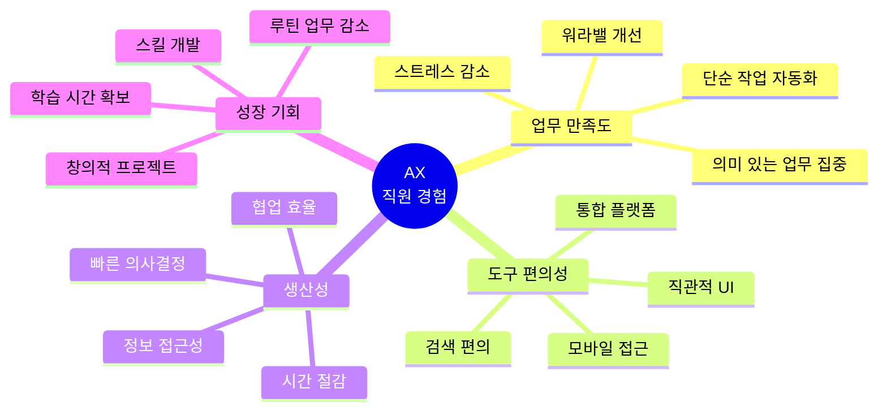

### 3.1.1 업무 만족도 향상

**목표**:
- 직원들이 더 의미 있는 업무에 집중
- 반복 작업으로 인한 스트레스 감소
- 워라밸 개선

**측정 지표**:

| 지표 | 설명 | 목표 예시 |
|------|------|----------|
| **직원 만족도** | 연 2회 설문 조사 | 4.0/5.0 이상 |
| **업무 스트레스** | 스트레스 관련 질문 점수 | 30% 감소 |
| **이직률** | 자발적 이직률 | 10% 이하 |
| **추천 의향** | eNPS (직원 NPS) | 30점 이상 |

### 3.1.2 반복 업무 자동화

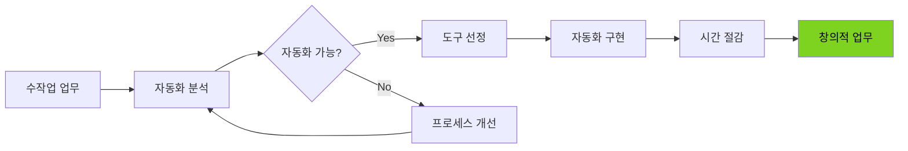

**자동화 대상 업무**:

| 업무 유형 | 예시 | 자동화 도구 |
|----------|------|------------|
| **데이터 입력** | 엑셀 데이터 → CRM 입력 | Zapier, Power Automate |
| **보고서 생성** | 주간 실적 보고서 | Notion 자동화, Google Apps Script |
| **승인 프로세스** | 휴가/구매 승인 | Notion 워크플로우, Monday.com |
| **회의록 작성** | 회의 내용 → 문서화 | Notion AI, Otter.ai |
| **이메일 분류** | 수신 메일 자동 라벨링 | Gmail 필터, Zapier |

**목표**:
- 직원 1인당 주 5시간 이상 절감
- 단순 반복 업무 70% 자동화
- 오류율 80% 감소

## 3.2 협업 효율성 향상

### 3.2.1 정보 접근성 개선

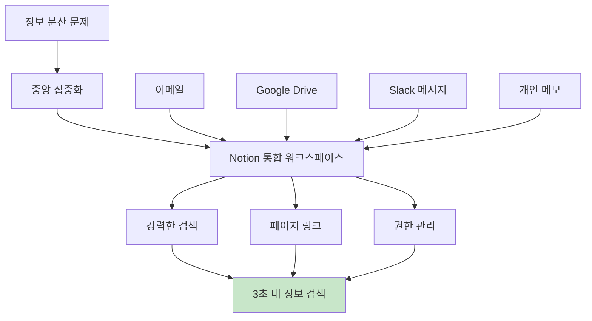

**목표**:

| 지표 | 현재 | 목표 |
|------|------|------|
| **정보 검색 시간** | 평균 15분 | 평균 3분 |
| **문서 중복 생성** | 월 50건 | 월 5건 이하 |
| **권한 요청 시간** | 평균 1일 | 즉시 (자동화) |
| **문서 최신성** | 60% | 95% |

### 3.2.2 실시간 협업 강화

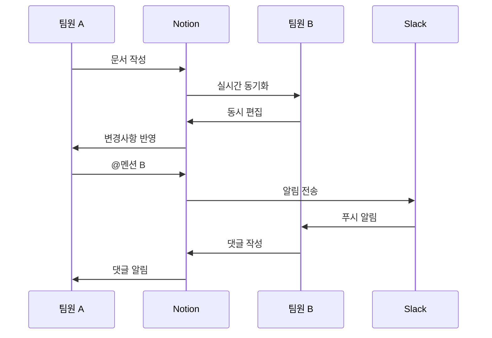

**목표**:
- 비동기 협업 80% (회의 감소)
- 피드백 응답 시간 4시간 이내
- 프로젝트 투명성 100% (누구나 진행 상황 확인 가능)

## 3.3 워크플로우 최적화

### 3.3.1 프로세스 간소화

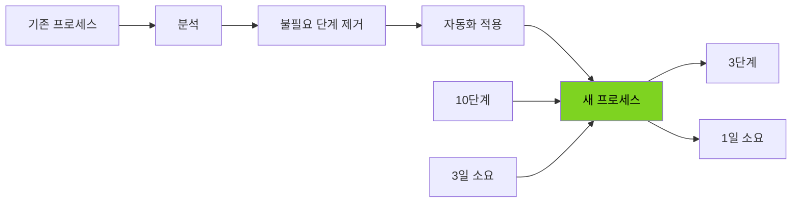

**예시: 휴가 신청 프로세스**

**Before**:
1. 휴가 신청서 다운로드 (인트라넷)
2. 양식 작성 (수기)
3. 스캔 또는 사진 촬영
4. 이메일로 팀장에게 전송
5. 팀장 승인 이메일
6. HR에게 전달
7. HR 시스템 수동 입력
8. 승인 완료 이메일
9. 개인 캘린더에 수동 입력

**총 소요 시간**: 1-2일

**After (Notion 자동화)**:
1. Notion 휴가 신청 데이터베이스에서 버튼 클릭
2. 폼 작성 (자동으로 날짜, 일수 계산)
3. 자동으로 팀장에게 Slack 알림
4. 팀장이 Notion에서 원클릭 승인
5. 자동으로 HR 데이터베이스에 반영
6. Google Calendar에 자동 추가

**총 소요 시간**: 1시간

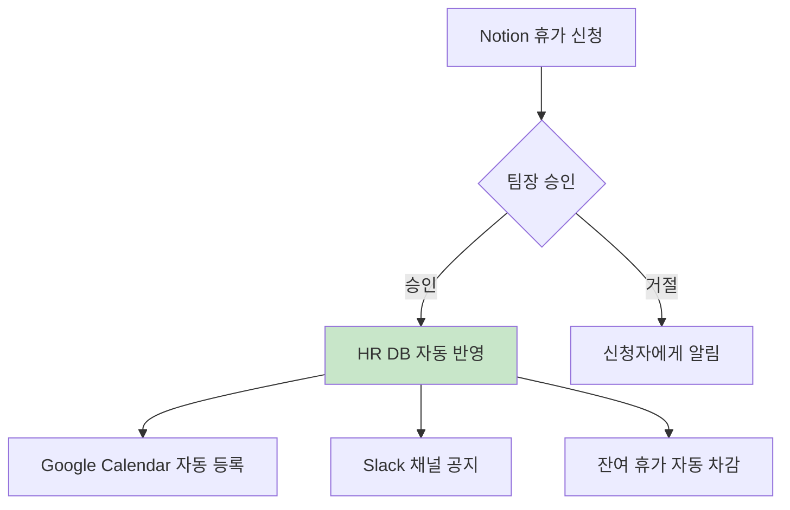

### 3.3.2 승인 프로세스 자동화

**목표**:

| 프로세스 | 기존 소요 시간 | 목표 시간 | 자동화율 |
|---------|-------------|----------|---------|
| **휴가 승인** | 1-2일 | 1시간 | 90% |
| **구매 요청** | 3-5일 | 1일 | 70% |
| **프로젝트 승인** | 1주 | 2일 | 60% |
| **문서 검토** | 2-3일 | 4시간 | 80% |

## 3.4 데이터 기반 개인 생산성

### 3.4.1 개인 업무 가시화

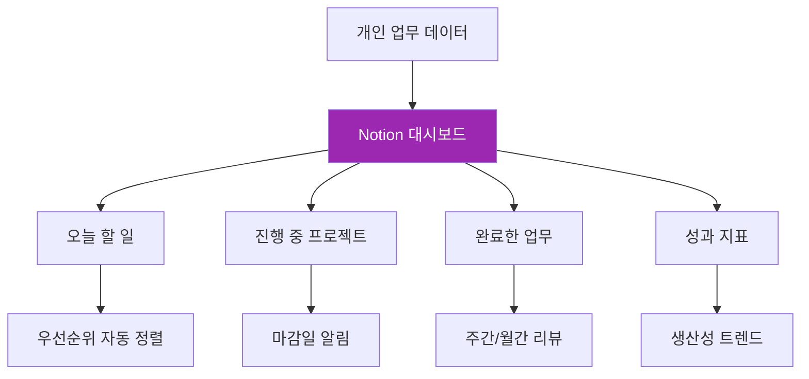

**목표**:
- 모든 직원이 개인 대시보드 활용
- 업무 우선순위 명확화
- 생산성 자가 측정 및 개선

### 3.4.2 학습 및 성장 지원

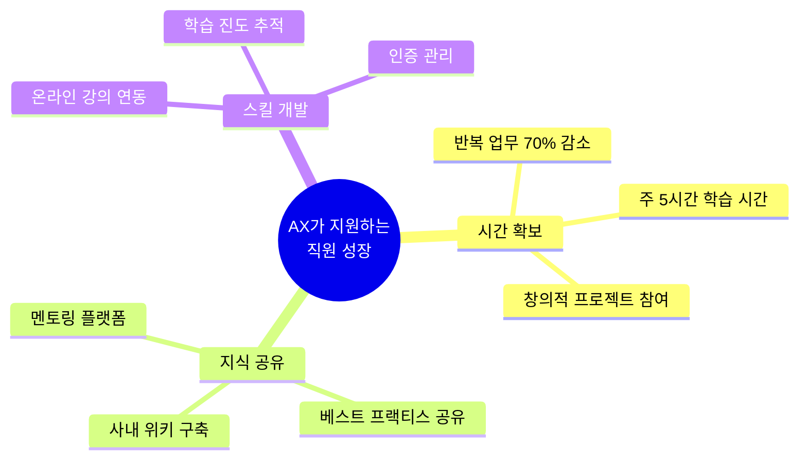

# 4. AX/DX 성공 지표 (KPI)

## 4.1 정량적 지표

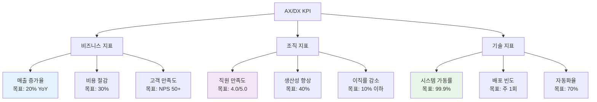

### 4.1.1 비즈니스 KPI

| KPI | 측정 방법 | 목표 | 측정 주기 |
|-----|----------|------|----------|
| **디지털 매출 비중** | (디지털 매출 / 전체 매출) × 100 | 50% | 월간 |
| **프로세스 비용** | 업무당 소요 비용 (인건비 포함) | 40% 절감 | 분기 |
| **고객 획득 비용 (CAC)** | 마케팅 비용 / 신규 고객 수 | 30% 감소 | 월간 |
| **고객 유지율** | (기존 고객 / 전체 고객) × 100 | 90% | 월간 |

### 4.1.2 조직 KPI

| KPI | 측정 방법 | 목표 | 측정 주기 |
|-----|----------|------|----------|
| **업무 처리 시간** | 주요 업무 완료까지 평균 시간 | 40% 단축 | 월간 |
| **문서 검색 시간** | 정보 찾기까지 평균 시간 | 80% 단축 | 월간 |
| **회의 시간** | 직원 1인당 주간 회의 시간 | 30% 감소 | 주간 |
| **협업 만족도** | 설문 조사 점수 | 4.0/5.0 | 분기 |

### 4.1.3 기술 KPI

| KPI | 측정 방법 | 목표 | 측정 주기 |
|-----|----------|------|----------|
| **자동화 커버리지** | (자동화된 프로세스 / 전체) × 100 | 70% | 분기 |
| **도구 활용률** | (활성 사용자 / 전체 사용자) × 100 | 90% | 월간 |
| **데이터 품질** | 정확하고 최신 데이터 비율 | 95% | 월간 |
| **시스템 응답 시간** | 평균 페이지 로드 시간 | 2초 이하 | 일간 |

## 4.2 정성적 지표

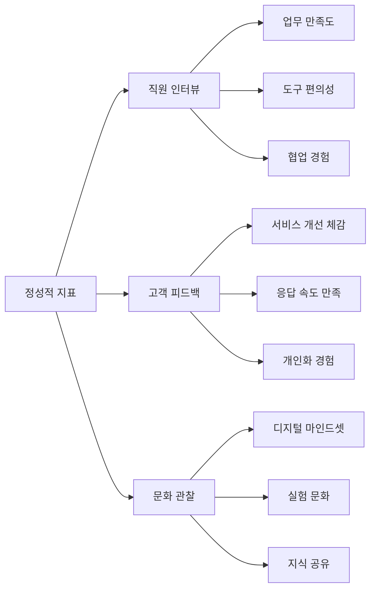

**측정 방법**:
- 분기별 직원 인터뷰 (20% 샘플링)
- 월간 고객 피드백 수집
- 반기별 조직 문화 서베이

# 5. AX/DX 로드맵

## 5.1 단계별 전략

**AX/DX 3년 로드맵**

| 단계 | 기간 | 주요 활동 |
|------|------|----------|
| **1년차 Q1** | 1-3개월 | • 현황 진단<br/>• 도구 선정 (Notion, Discord 등)<br/>• 파일럿 팀 구성 (10명) |
| **1년차 Q2** | 4-6개월 | • 핵심 프로세스 디지털화<br/>• 사내 위키 구축<br/>• 기본 자동화 (휴가, 구매) |
| **1년차 Q3** | 7-9개월 | • 전사 확대<br/>• 전 직원 교육<br/>• 데이터베이스 구축 |
| **1년차 Q4** | 10-12개월 | • 정착 및 최적화<br/>• 사용률 90% 달성<br/>• 초기 ROI 측정 |
| **2년차 Q1-Q2** | 13-18개월 | • 고급 자동화<br/>• 워크플로우 통합<br/>• AI 도입 (Notion AI) |
| **2년차 Q3-Q4** | 19-24개월 | • 데이터 분석 강화<br/>• 대시보드 구축<br/>• 예측 분석 |
| **3년차 Q1-Q2** | 25-30개월 | • 전략적 혁신<br/>• 새로운 비즈니스 모델<br/>• 고객 경험 재설계 |
| **3년차 Q3-Q4** | 31-36개월 | • 지속 가능성<br/>• 문화 내재화<br/>• 차세대 기술 탐색 |

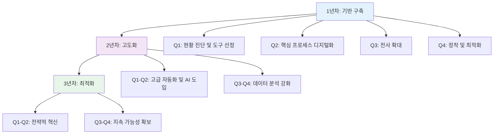

## 5.2 1년차 상세 계획 (Notion 중심)

### Q1: 기반 구축 (1-3개월)

```mermaid
graph LR
    A[Week 1-2<br/>현황 진단] --> B[Week 3-4<br/>도구 선정]
    B --> C[Week 5-8<br/>파일럿 구축]
    C --> D[Week 9-12<br/>피드백 및 개선]

    A --> A1[기존 도구 사용 현황]
    A --> A2[업무 프로세스 매핑]
    A --> A3[직원 인터뷰]

    B --> B1[Notion 무료 체험]
    B --> B2[템플릿 테스트]
    B --> B3[통합 계획 수립]

    C --> C1[파일럿 팀 온보딩]
    C --> C2[핵심 페이지 구축]
    C --> C3[초기 자동화 설정]

    D --> D1[사용 데이터 수집]
    D --> D2[만족도 조사]
    D --> D3[개선사항 반영]
```

**주요 활동**:

1. **Week 1-2: 현황 진단**
   - 현재 사용 중인 도구 목록 작성
   - 업무 프로세스 문서화
   - 직원 니즈 조사

2. **Week 3-4: Notion 도입 준비**
   - Notion 워크스페이스 생성
   - 기본 구조 설계 (위키, 프로젝트, 데이터베이스)
   - 파일럿 팀 선정 (각 부서 2명)

3. **Week 5-8: 파일럿 운영**
   - 파일럿 팀 교육 (2시간 워크숍)
   - 핵심 페이지 생성:
     - 회사 위키
     - 회의록 데이터베이스
     - 프로젝트 관리 보드
   - 주간 피드백 수집

4. **Week 9-12: 피드백 반영**
   - 사용성 개선
   - 템플릿 정리
   - 전사 확대 계획 수립

### Q2-Q4: 전사 확대 및 정착

**Q2 (4-6개월)**:
- 전 직원 온보딩 (부서별 단계 롤아웃)
- 주요 프로세스 디지털화 (휴가, 구매, 회의록)
- 데이터 마이그레이션 (기존 문서 → Notion)

**Q3 (7-9개월)**:
- 고급 기능 활용 (관계, 롤업, 수식)
- 부서별 커스텀 데이터베이스 구축
- 자동화 확대 (Zapier 연동)

**Q4 (10-12개월)**:
- 사용률 목표 달성 (90% 활성 사용자)
- ROI 측정 및 보고
- 2년차 계획 수립

## 5.3 성공 요인

```mermaid
mindmap
  root((AX/DX<br/>성공 요인))
    리더십
      경영진 지원
      명확한 비전
      리소스 확보
    직원 참여
      교육 및 훈련
      인센티브
      챔피언 육성
    기술 선택
      사용 편의성
      확장 가능성
      통합성
    문화 변화
      실험 장려
      실패 허용
      지속적 개선
    측정 및 개선
      명확한 KPI
      정기 리뷰
      빠른 피드백
```

# 6. 생성형 AI를 활용한 AX/DX 계획 수립

## 6.1 프롬프트: AX/DX 현황 진단

```
[역할]
너는 디지털 전환(DX) 및 업무 자동화(AX) 컨설턴트야.

[맥락]
우리 회사의 AX/DX 현황을 진단하고 개선 계획을 수립하려고 해.

[회사 정보]
- 업종: [제조/IT/서비스/etc]
- 직원 수: [숫자]
- 주요 업무: [설명]
- 현재 사용 도구: [나열]
- 주요 문제점: [설명]

[요청]
1. 현재 AX/DX 성숙도 평가 (5단계 중 몇 단계?)
   - Level 1: 아날로그 중심
   - Level 2: 부분적 디지털화
   - Level 3: 디지털 기반 구축
   - Level 4: 고도화 및 자동화
   - Level 5: 완전 최적화

2. 주요 개선 기회 (Top 5)

3. 우선순위별 액션 플랜
   - Quick Wins (1개월 이내)
   - 중기 과제 (3-6개월)
   - 장기 과제 (6-12개월)

4. 예상 ROI 계산
   - 시간 절감
   - 비용 절감
   - 생산성 향상

5. 추천 도구 및 이유

[형식]
HTML 형식의 진단 보고서로 작성해줘. 차트와 표를 포함하고, 경영진에게 프레젠테이션 가능하도록 해줘.
```

## 6.2 프롬프트: Notion 기반 AX 구조 설계

```
[역할]
너는 Notion 전문가이자 업무 효율화 컨설턴트야.

[맥락]
우리 회사가 Notion을 도입하여 AX를 구현하려고 해.

[회사 정보]
- 직원 수: [숫자]
- 부서: [마케팅, 개발, 영업, HR, 운영 등]
- 주요 업무 프로세스:
  1. [프로세스 1]
  2. [프로세스 2]
  3. [프로세스 3]

[요청]
1. Notion 워크스페이스 구조 설계
   - 폴더/페이지 계층 구조
   - 각 부서별 페이지 구성
   - 공통 페이지 (위키, 회의록 등)

2. 핵심 데이터베이스 설계 (최소 5개)
   - 프로퍼티 정의
   - 뷰 구성 (테이블, 보드, 캘린더 등)
   - 관계 및 롤업 설정

3. 자동화 워크플로우 제안 (최소 3개)
   - 트리거 및 액션
   - 예상 시간 절감

4. 템플릿 목록
   - 회의록, 프로젝트 계획, 보고서 등

5. 도입 로드맵 (3개월)

[형식]
Markdown 또는 HTML로 작성해줘. Mermaid 다이어그램을 포함하여 시각적으로 표현해줘.
```

## 6.3 프롬프트: KPI 대시보드 설계

```
[역할]
너는 비즈니스 인텔리전스(BI) 전문가야.

[맥락]
AX/DX 성과를 측정하기 위한 KPI 대시보드를 Notion에 구축하려고 해.

[요청]
1. KPI 목록 및 정의
   - 비즈니스 KPI (5개)
   - 조직 KPI (5개)
   - 기술 KPI (5개)

2. 각 KPI의 측정 방법
   - 데이터 소스
   - 계산 공식
   - 측정 주기

3. Notion 데이터베이스 설계
   - KPI 추적 데이터베이스 구조
   - 프로퍼티 (목표값, 실제값, 달성률 등)
   - 수식 활용

4. 대시보드 레이아웃
   - 위젯 배치
   - 차트 유형
   - 색상 코딩 (목표 달성 여부)

5. 자동화 방안
   - 데이터 자동 수집
   - 알림 설정 (목표 미달 시)

[형식]
HTML로 대시보드 프로토타입을 만들어줘. Chart.js를 사용해서 인터랙티브하게 해줘.
```

# 7. 정리

## 7.1 핵심 요약

```mermaid
graph TD
    A[AX/DX 목표] --> B[DX 목표]
    A --> C[AX 목표]

    B --> B1[비즈니스 성장]
    B --> B2[고객 만족]
    B --> B3[경쟁력 강화]

    C --> C1[직원 경험 향상]
    C --> C2[업무 자동화]
    C --> C3[생산성 향상]

    B1 --> D[통합 성과]
    B2 --> D
    B3 --> D
    C1 --> D
    C2 --> D
    C3 --> D

    D --> E[지속 가능한 성장]

    style A fill:#FF9800,color:#000
    style D fill:#4CAF50,color:#fff
    style E fill:#2196F3,color:#fff
```

**핵심 메시지**:

1. **DX는 전략, AX는 실행** - 둘 다 필요하며 상호 보완적
2. **측정 가능한 목표 설정** - KPI를 통한 진행 상황 추적
3. **직원 중심 접근** - 기술보다 사람이 우선
4. **단계적 도입** - 파일럿 → 확대 → 정착 → 최적화
5. **지속적 개선** - 완성이 아닌 여정

## 7.2 다음 단계

이제 AX/DX의 목표를 이해했다면, 다음 장에서는 Notion의 구조를 깊이 이해하고 실제로 워크스페이스를 구축하는 방법을 배웁니다.

**다음 챕터 미리보기**:
- Notion 워크스페이스와 페이지 구조
- 효과적인 정보 설계 (IA)
- 팀 협업을 위한 권한 관리
- 템플릿 활용법

:::div{.callout}
**실습 과제**: 귀사의 AX/DX 목표를 3가지씩 정의해보세요. 각 목표에 대해 측정 가능한 KPI를 1개 이상 설정하고, 6개월 내 달성 가능한 현실적인 목표치를 정해보세요. 생성형 AI에 회사 정보를 입력하고 목표 수립 지원을 받아보는 것도 좋습니다.
:::
