# 1. Notion 워크스페이스 이해하기

## 1.1 워크스페이스란?

**워크스페이스**(Workspace)는 Notion의 최상위 컨테이너로, 팀이나 조직의 모든 페이지, 데이터베이스, 파일이 모이는 공간입니다.

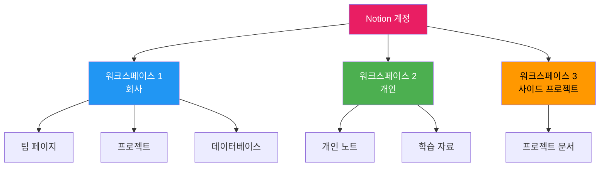

**워크스페이스 특징**:

1. **독립적 공간**: 각 워크스페이스는 완전히 분리되어 있음
2. **멤버 관리**: 워크스페이스별로 다른 사람들 초대 가능
3. **권한 설정**: 워크스페이스 전체 또는 개별 페이지별 권한 부여
4. **고유 설정**: 각 워크스페이스마다 아이콘, 이름, 설정 커스터마이즈

## 1.2 워크스페이스 유형

### 1.2.1 개인 워크스페이스

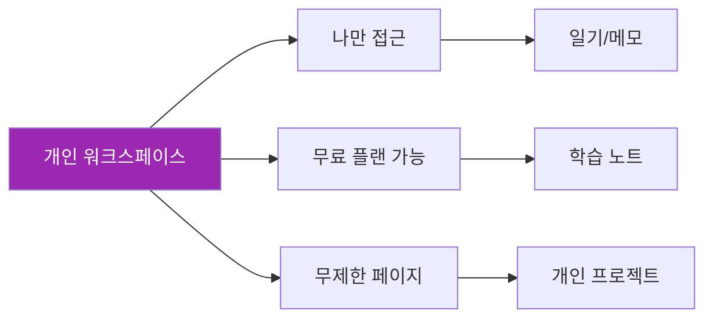

**활용 사례**:
- 개인 일기, 저널
- 독서 노트, 학습 자료
- 개인 작업 관리 (GTD, 할 일 목록)
- 아이디어 뱅크
- 개인 재무 관리

### 1.2.2 팀 워크스페이스

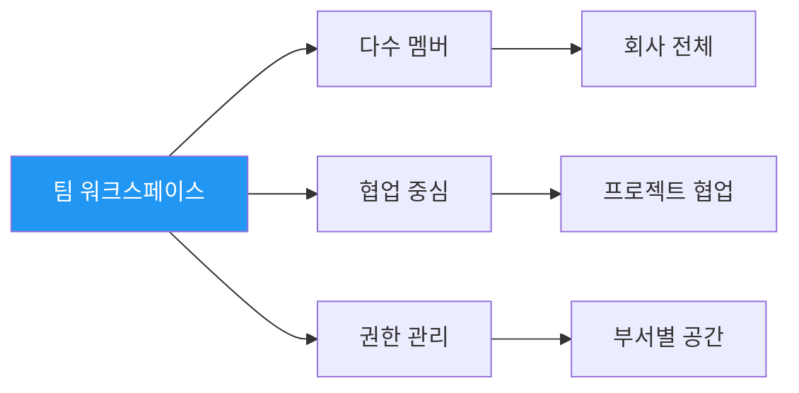

**활용 사례**:
- 회사 사내 위키
- 팀 프로젝트 관리
- 회의록 및 문서 공유
- 온보딩 자료
- 부서별 업무 공간

## 1.3 워크스페이스 생성 및 설정

### 1.3.1 워크스페이스 생성

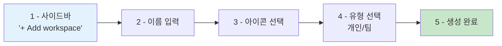

**단계별 가이드**:

1. **워크스페이스 추가**
   - 좌측 사이드바 하단 현재 워크스페이스 이름 클릭
   - "Join or create workspace" 선택
   - "Create a new workspace" 클릭

2. **기본 정보 입력**
   - 워크스페이스 이름: 회사명 또는 프로젝트명
   - 아이콘: 이모지 또는 커스텀 이미지 업로드
   - 용도 선택: "For me" 또는 "With my team"

3. **초기 설정**
   - 팀 멤버 초대 (선택사항)
   - 템플릿 선택 (빈 공간으로 시작 권장)

### 1.3.2 워크스페이스 설정

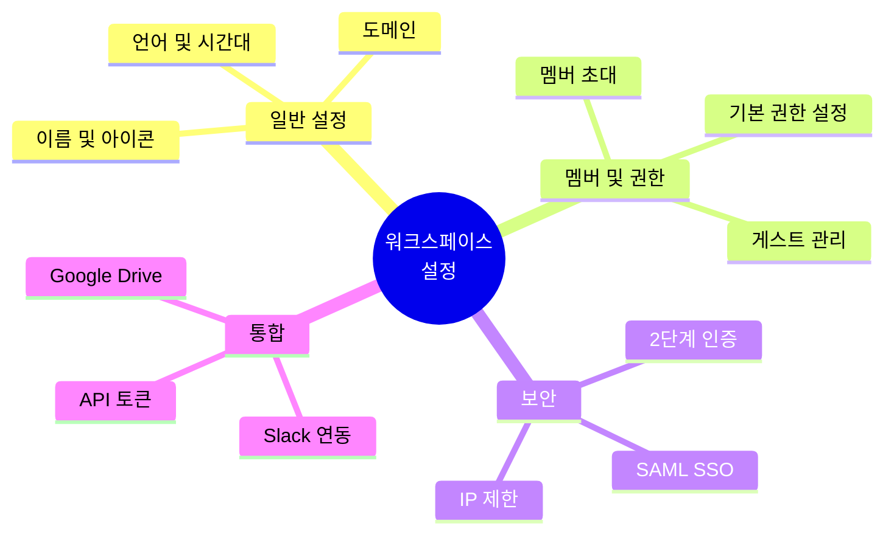

**주요 설정 항목**:

| 설정 | 설명 | 추천 값 |
|------|------|---------|
| **도메인** | `yourcompany.notion.site` | 회사명으로 설정 |
| **언어** | 인터페이스 언어 | 한국어 |
| **시간대** | 날짜/시간 표시 기준 | Asia/Seoul |
| **기본 페이지 권한** | 새 페이지 생성 시 기본 권한 | "Can view" 또는 "Can edit" |
| **게스트 허용** | 외부인 초대 가능 여부 | 필요 시에만 활성화 |

# 2. Notion 페이지 구조

## 2.1 페이지란?

**페이지(Page)**는 Notion의 기본 단위로, 문서, 데이터베이스, 위키 등 모든 콘텐츠를 담는 컨테이너입니다.

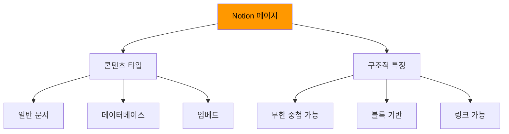

### 2.1.1 페이지의 핵심 특징

**1. 무한 중첩 (Nested Pages)**

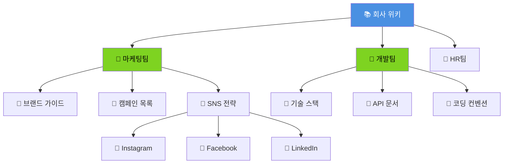

**장점**:
- 정보를 계층적으로 정리
- 복잡한 구조도 명확하게 표현
- 필요한 정보를 쉽게 찾음

**2. 블록 기반 (Block-based)**

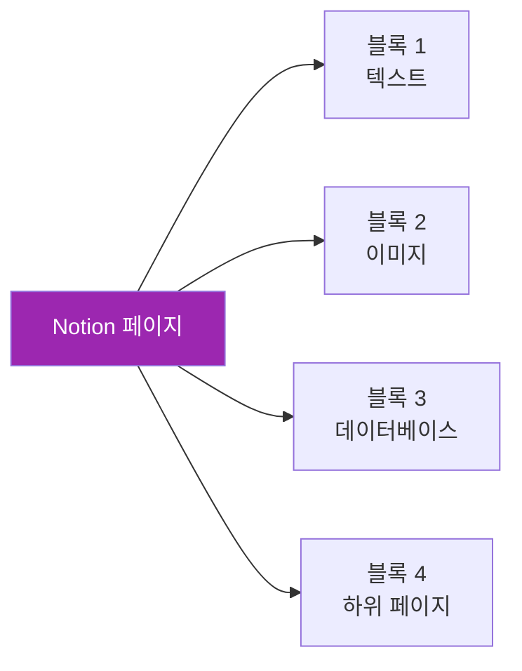

모든 콘텐츠는 "블록" 단위로 구성되며, 각 블록은:
- 독립적으로 이동, 복사, 삭제 가능
- 다양한 타입 (텍스트, 이미지, 코드, 데이터베이스 등)
- 드래그 앤 드롭으로 재배치

**3. 링크 및 관계 (Links & Relations)**

페이지 간 연결을 통해 지식 네트워크 구축:

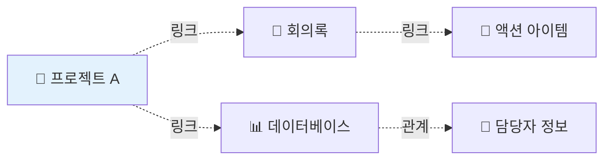

## 2.2 페이지 생성 및 구조화

### 2.2.1 페이지 생성 방법

**방법 1: 사이드바에서 생성**


**방법 2: 페이지 내부에서 생성 (하위 페이지)**

```
1. 기존 페이지를 열고
2. / 입력하여 블록 메뉴 열기
3. "Page" 선택
4. 제목 입력
```

**방법 3: 단축키**

| 단축키 | 기능 |
|--------|------|
| `Cmd/Ctrl + N` | 새 페이지 생성 (사이드바) |
| `/page` + Enter | 현재 페이지 내 하위 페이지 생성 |

### 2.2.2 페이지 구조 설계 원칙

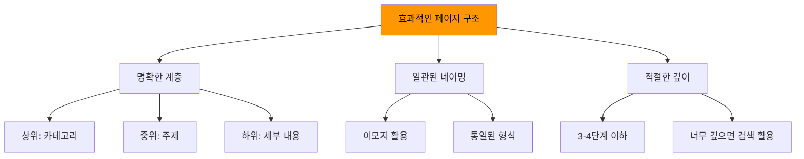

**권장 구조 예시**:

```
📚 회사 위키
├── 👋 시작하기
│   ├── 회사 소개
│   ├── 온보딩 가이드
│   └── 자주 묻는 질문
├── 📁 팀별 공간
│   ├── 🎨 마케팅팀
│   ├── 💻 개발팀
│   ├── 💼 영업팀
│   └── 👥 HR팀
├── 📝 공통 문서
│   ├── 회의록
│   ├── 프로젝트
│   └── 템플릿
└── 🔧 리소스
    ├── 도구 및 앱
    ├── 외부 링크
    └── 교육 자료
```

### 2.2.3 생성형 AI를 활용한 페이지 구조 설계

```
[역할]
너는 정보 아키텍처(IA) 전문가야.

[맥락]
우리 회사의 Notion 워크스페이스 페이지 구조를 설계하려고 해.

[회사 정보]
- 업종: [업종]
- 직원 수: [숫자]
- 부서: [부서 목록]
- 주요 업무: [설명]

[요청]
1. 최상위 페이지 구조 제안 (5-7개 카테고리)
2. 각 카테고리별 하위 페이지 구조 (2-3단계)
3. 네이밍 컨벤션 (이모지 포함)
4. 각 페이지의 목적 및 포함 콘텐츠
5. 정보 찾기 쉽게 하는 팁

[형식]
- 트리 구조로 시각화
- 이모지 활용
- Markdown 또는 Mermaid 다이어그램
```

## 2.3 페이지 유형 및 활용

### 2.3.1 문서형 페이지

**용도**: 일반 문서, 가이드, 메모


**구성 요소**:
- **제목**: 페이지 최상단 (H1)
- **아이콘**: 페이지 식별 (이모지 또는 이미지)
- **커버**: 시각적 매력 (이미지 또는 색상)
- **본문**: 다양한 블록 (텍스트, 리스트, 인용, 코드 등)
- **하위 페이지**: 관련 문서 연결

**활용 예시**:
- 회의록
- 프로젝트 계획서
- 온보딩 가이드
- 제품 요구사항 문서 (PRD)

### 2.3.2 데이터베이스 페이지

**용도**: 구조화된 정보 관리

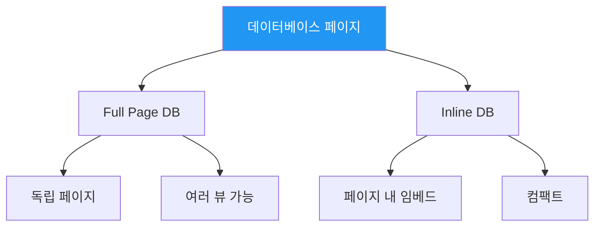

**데이터베이스 유형**:

| 유형 | 용도 | 예시 |
|------|------|------|
| **테이블** | 스프레드시트 형태 | 고객 관리, 재고 목록 |
| **보드** | 칸반 스타일 | 작업 관리, 파이프라인 |
| **캘린더** | 날짜 기반 | 콘텐츠 캘린더, 일정 |
| **갤러리** | 카드/썸네일 | 포트폴리오, 제품 카탈로그 |
| **리스트** | 간결한 목록 | 할 일, 북마크 |
| **타임라인** | 간트 차트 | 프로젝트 타임라인 |

### 2.3.3 대시보드 페이지

**용도**: 여러 정보를 한눈에 종합

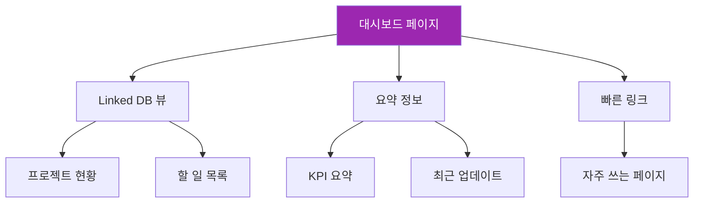

**대시보드 구성 예시**:

```
🏠 내 대시보드
├── 📊 오늘 할 일 (Linked DB - 필터: 오늘 마감)
├── 🚀 진행 중 프로젝트 (Linked DB - 보드 뷰)
├── 📅 이번 주 일정 (Linked DB - 캘린더 뷰)
├── 📝 최근 회의록 (Linked DB - 최근 3개)
└── 🔗 빠른 링크
    ├── 팀 위키
    ├── 템플릿
    └── 리소스
```

**생성형 AI 프롬프트 (대시보드 설계)**:

```
[역할]
너는 Notion 대시보드 디자이너야.

[맥락]
개인 생산성 대시보드를 Notion에 만들려고 해.

[요구사항]
- 매일 아침 확인할 정보 한눈에 보기
- 할 일, 프로젝트, 일정 통합
- 깔끔하고 직관적인 레이아웃

[요청]
1. 대시보드 레이아웃 제안 (섹션 구성)
2. 각 섹션에 들어갈 Linked Database 뷰 설계
   - 어떤 데이터베이스를 링크할지
   - 어떤 뷰 (테이블/보드/캘린더)를 사용할지
   - 어떤 필터를 적용할지
3. 위젯 또는 요약 정보 추천
4. 시각적 구성 (이모지, 색상 활용)

[형식]
Markdown으로 대시보드 구조를 작성하고, HTML 프로토타입도 제공해줘.
```

# 3. 페이지 조직 및 관리

## 3.1 사이드바 조직

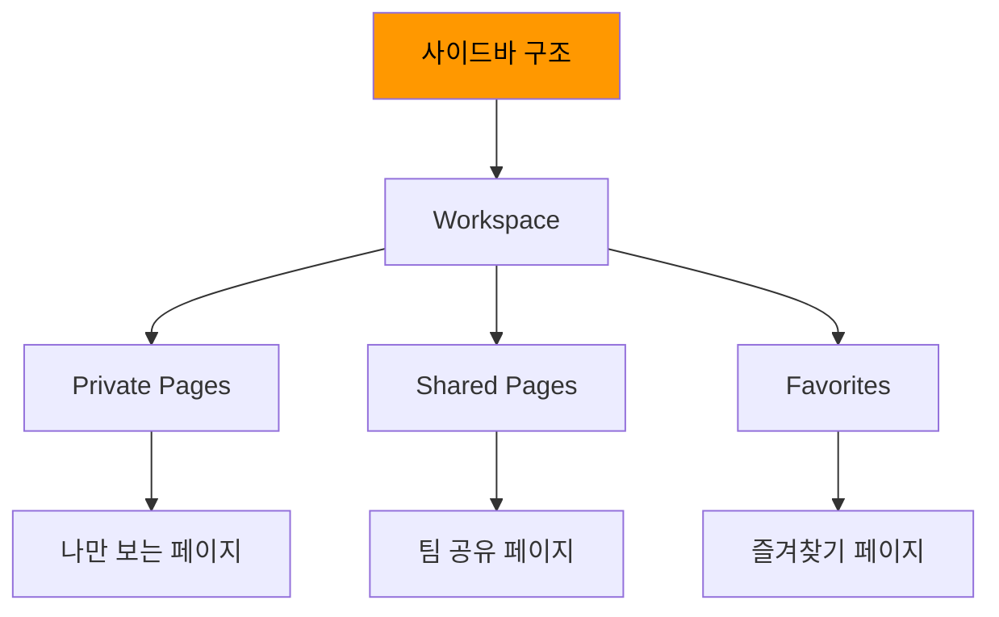

**사이드바 섹션**:

1. **Workspace**: 워크스페이스 전체 페이지
2. **Private**: 나만 접근 가능한 페이지
3. **Shared**: 다른 사람과 공유 중인 페이지
4. **Favorites**: ⭐로 표시한 즐겨찾기

**팁**:
- 자주 쓰는 페이지는 Favorites에 추가
- 드래그 앤 드롭으로 순서 변경
- 섹션 접기/펼치기로 정리

## 3.2 페이지 계층 관리

### 3.2.1 이동 및 재구조화

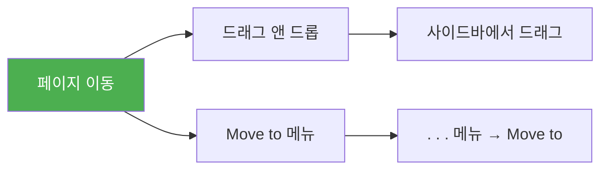

**방법 1: 드래그 앤 드롭**
- 사이드바에서 페이지를 드래그
- 원하는 위치에 드롭
- 들여쓰기로 하위 페이지 만들기

**방법 2: Move to 메뉴**
- 페이지 우측 상단 `···` 클릭
- "Move to" 선택
- 이동할 위치 선택

### 3.2.2 페이지 링크 및 멘션

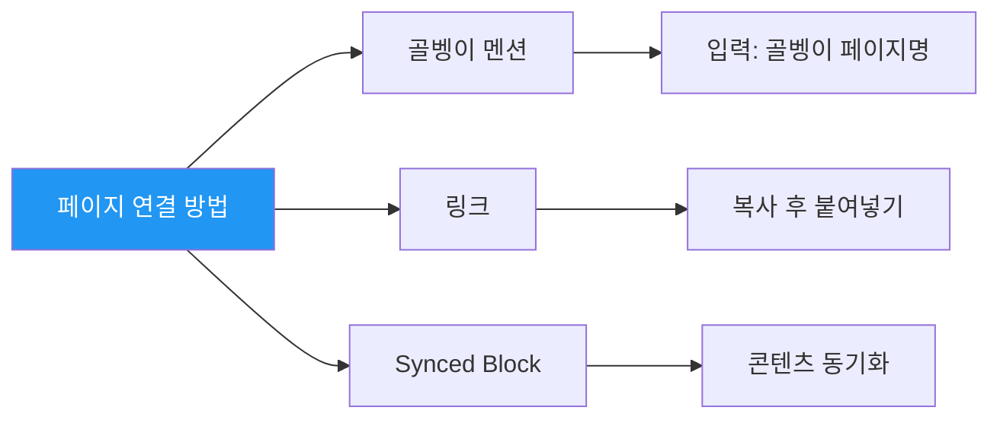

**1. @멘션으로 페이지 링크**

```
회의록은 @프로젝트 A 페이지를 참고하세요.
```

**2. 링크 복사/붙여넣기**

```
페이지 → 우측 상단 Share → Copy link
```

**3. Synced Block (동기화 블록)**

한 블록을 여러 페이지에서 동기화:
- 원본 블록 생성
- 다른 페이지에서 "Synced block" 추가
- 원본 선택 → 자동 동기화

## 3.3 페이지 템플릿 활용

### 3.3.1 템플릿이란?

**템플릿**(Template)은 반복적으로 사용하는 페이지 구조를 저장하여 빠르게 생성할 수 있게 하는 기능입니다.


### 3.3.2 템플릿 생성하기

**단계**:

1. **데이터베이스 내 템플릿 버튼 추가**
   - 데이터베이스 우측 상단 `New` 옆 `▾` 클릭
   - "+ New template" 선택

2. **템플릿 구조 설계**
   - 제목 형식: `[날짜] 회의록 - [주제]`
   - 기본 블록 추가: 제목, 날짜, 참석자, 안건, 액션 아이템 등
   - 프로퍼티 기본값 설정

3. **템플릿 사용**
   - 데이터베이스에서 `New` 클릭
   - 템플릿 선택
   - 자동으로 구조 생성됨

### 3.3.3 생성형 AI로 템플릿 생성

```
[역할]
너는 Notion 템플릿 전문가야.

[맥락]
회의록 템플릿을 Notion에 만들려고 해.

[요구사항]
- 회의 전 준비사항 체크리스트
- 회의 중 기록 항목 (참석자, 안건, 논의 내용, 결정 사항)
- 회의 후 액션 아이템 (담당자, 마감일)
- 다음 회의 일정

[요청]
1. Notion 페이지 구조를 Markdown으로 작성해줘
2. 필요한 프로퍼티 목록 (Select, Date, Person 등)
3. 자동화 제안 (예: 액션 아이템 자동으로 Task DB에 추가)
4. 사용 가이드

[형식]
Markdown 형식으로 템플릿 구조를 제공하고, 각 섹션의 용도를 설명해줘.
```

**출력 예시**:

```markdown
# 📅 [날짜] 회의록 - [회의 제목]

## 📋 회의 정보
- **날짜**: 2025-11-04
- **시간**: 14:00 - 15:00
- **참석자**: @홍길동, @김철수
- **장소**: 회의실 A / Zoom

## ✅ 회의 전 준비사항
- [ ] 안건 공유
- [ ] 관련 자료 업로드
- [ ] 참석자 확인

## 📝 안건
1. 프로젝트 A 진행 상황 리뷰
2. 마케팅 캠페인 전략 논의
3. Q4 목표 설정

## 💬 논의 내용

### 안건 1: 프로젝트 A 진행 상황
- 현재 진행률: 70%
- 이슈: ...
- 해결 방안: ...

### 안건 2: 마케팅 캠페인
...

## ✅ 결정 사항
1. ...
2. ...

## 🎯 액션 아이템

| 항목 | 담당자 | 마감일 | 상태 |
|------|--------|--------|------|
| ... | @홍길동 | 2025-11-10 | 진행 중 |

## 📅 다음 회의
- 날짜: 2025-11-11
- 주제: ...
```

# 4. 워크스페이스 네비게이션 및 검색

## 4.1 빠른 검색 (Quick Find)

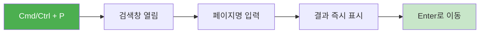

**검색 팁**:

| 검색 방법 | 설명 | 예시 |
|----------|------|------|
| **페이지 제목** | 페이지명으로 검색 | `회의록` |
| **콘텐츠 검색** | 페이지 내 텍스트 검색 | `프로젝트 A 마감` |
| **필터** | 생성자, 날짜 등으로 필터 | `Created by me` |
| **키워드 조합** | 여러 키워드 | `회의 마케팅 11월` |

## 4.2 고급 검색

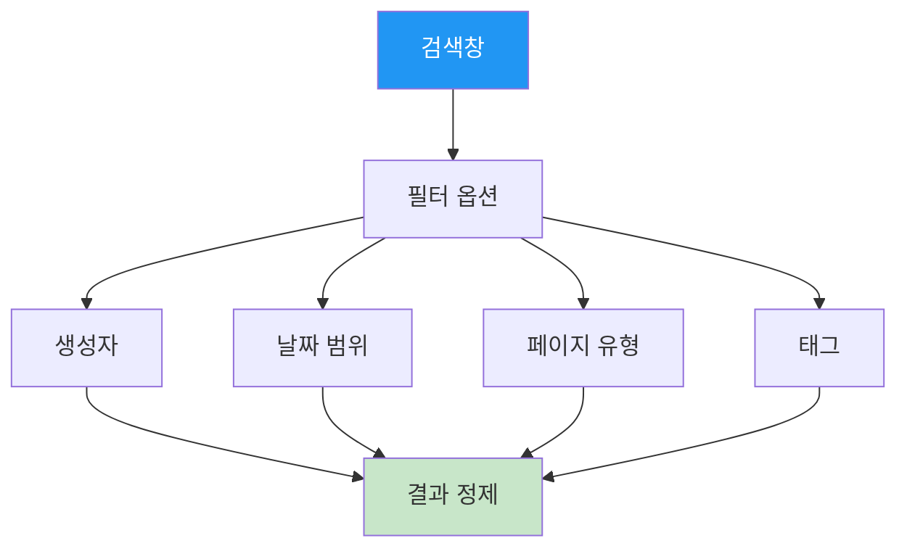

**필터 옵션**:

1. **Created by**: 특정 사람이 만든 페이지만
2. **Edited**: 특정 기간에 수정된 페이지
3. **In**: 특정 워크스페이스 또는 페이지 내에서만
4. **Type**: 페이지, 데이터베이스 등 유형별

## 4.3 백링크 (Backlinks)

```mermaid
graph TD
    A[현재 페이지] --> B[Backlinks 패널]

    C[페이지 X] -.링크.-> A
    D[페이지 Y] -.링크.-> A
    E[페이지 Z] -.링크.-> A

    C --> B
    D --> B
    E --> B

    style A fill:#9C27B0,color:#fff
    style B fill:#C8E6C9
```

**백링크 활용**:

- 페이지 우측 상단 `···` → "Backlinks" 클릭
- 현재 페이지를 링크한 모든 페이지 목록 표시
- 지식 네트워크 파악
- 관련 정보 빠르게 찾기

# 5. 워크스페이스 협업

## 5.1 멤버 초대 및 관리

```mermaid
sequenceDiagram
    participant A as 관리자
    participant N as Notion
    participant B as 초대받은 사용자

    A->>N: 멤버 초대 (이메일)
    N->>B: 초대 이메일 발송
    B->>N: 초대 수락
    N->>A: 멤버 추가 알림
    A->>N: 권한 설정
```

### 5.1.1 멤버 초대

**단계**:

1. **Settings & members** 열기
   - 좌측 사이드바 하단 "Settings & members"

2. **멤버 초대**
   - "Members" 탭 → "Invite" 버튼
   - 이메일 주소 입력
   - 권한 선택 (Full access / Can edit / Can comment / Can view)
   - "Invite" 클릭

### 5.1.2 권한 레벨

```mermaid
graph TD
    A[권한 레벨] --> B[Full access]
    A --> C[Can edit]
    A --> D[Can comment]
    A --> E[Can view]

    B --> B1[모든 작업 가능<br/>페이지 공유/삭제]
    C --> C1[편집 가능<br/>공유 불가]
    D --> D1[읽기 + 댓글만]
    E --> E1[읽기만 가능]

    style B fill:#F44336,color:#fff
    style C fill:#FF9800,color:#000
    style D fill:#FFC107,color:#000
    style E fill:#4CAF50,color:#fff
```

**권한 선택 가이드**:

| 역할 | 추천 권한 | 이유 |
|------|----------|------|
| **팀 멤버** | Full access | 모든 기능 사용 가능 |
| **협업자** | Can edit | 콘텐츠 편집만 허용 |
| **리뷰어** | Can comment | 피드백만 제공 |
| **외부인** | Can view | 읽기만 허용 |

## 5.2 페이지별 공유 설정

```mermaid
graph LR
    A[페이지 공유] --> B[Workspace 내 공유]
    A --> C[외부 링크 공유]

    B --> B1[특정 멤버]
    B --> B2[전체 워크스페이스]

    C --> C1[링크 가진 사람 누구나]
    C --> C2[검색 엔진 허용]

    style A fill:#2196F3,color:#fff
```

**공유 방법**:

1. **페이지 내 공유**
   - 페이지 우측 상단 "Share" 버튼
   - "Add people or emails" → 멤버 선택 또는 이메일 입력
   - 권한 설정 → "Invite"

2. **링크 공유**
   - "Share" → "Share to web" 토글 활성화
   - "Copy web link" → 링크 복사
   - 외부 사람도 접근 가능 (권한 설정 필요)

3. **공개 웹 페이지**
   - "Share to web" 활성화
   - "Allow search engines to index page" → SEO 허용
   - 누구나 Google 검색으로 찾을 수 있음

:::div{.callout}
**보안 주의**: 민감한 정보가 포함된 페이지는 "Share to web"를 절대 활성화하지 마세요!
:::

## 5.3 댓글 및 멘션

```mermaid
sequenceDiagram
    participant A as 팀원 A
    participant N as Notion
    participant B as 팀원 B

    A->>N: 텍스트 블록에 댓글 추가
    A->>N: @멘션 B
    N->>B: 이메일/푸시 알림
    B->>N: 댓글 확인
    B->>N: 답글 작성
    N->>A: 답글 알림
```

**댓글 기능**:

1. **블록 댓글**
   - 블록에 마우스 오버 → `💬` 아이콘 클릭
   - 댓글 작성
   - @멘션으로 특정 사람에게 알림

2. **페이지 댓글**
   - 페이지 전체에 대한 댓글
   - "Comments" 패널에서 확인

3. **댓글 해결**
   - 댓글 옆 `✓` 클릭 → "Resolve"
   - 해결된 댓글은 숨겨짐 (필요 시 다시 표시 가능)

# 6. 정리

## 6.1 핵심 요약

```mermaid
mindmap
  root((Notion<br/>워크스페이스와 페이지))
    워크스페이스
      팀 공간
      개인 공간
      설정 및 권한
    페이지 구조
      무한 중첩
      블록 기반
      다양한 유형
    조직 및 관리
      사이드바 구조
      템플릿 활용
      링크 및 관계
    협업
      멤버 관리
      권한 설정
      댓글 및 공유
```

**핵심 포인트**:

1. **워크스페이스는 최상위 컨테이너** - 팀별로 분리하여 관리
2. **페이지는 무한 중첩 가능** - 계층적 정보 구조화
3. **블록 기반으로 유연한 구성** - 다양한 콘텐츠 타입 조합
4. **템플릿으로 효율성 향상** - 반복 작업 제거
5. **세밀한 권한 관리** - 보안과 협업 균형

## 6.2 다음 단계

이제 Notion의 기본 구조를 이해했다면, 다음 장에서는 기업의 업무 시스템을 Notion으로 구현하는 방법을 배웁니다.

**다음 챕터 미리보기**:
- 기업 업무 시스템 이해
- Notion을 활용한 업무 프로세스 디지털화
- 부서별 활용 사례
- 실전 워크플로우 구축

:::div{.callout}
**실습 과제**:
1. 개인 워크스페이스를 생성하고 3단계 이상의 페이지 계층을 만들어보세요.
2. 템플릿 버튼을 활용하여 반복 사용할 페이지 템플릿을 1개 이상 만들어보세요.
3. 생성형 AI에게 귀사 조직 구조를 설명하고 최적의 Notion 페이지 구조를 제안받아보세요.
:::
