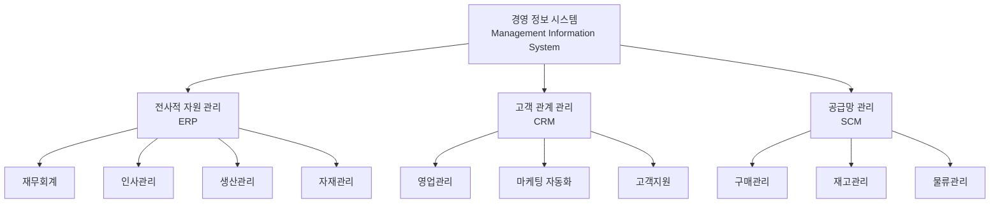
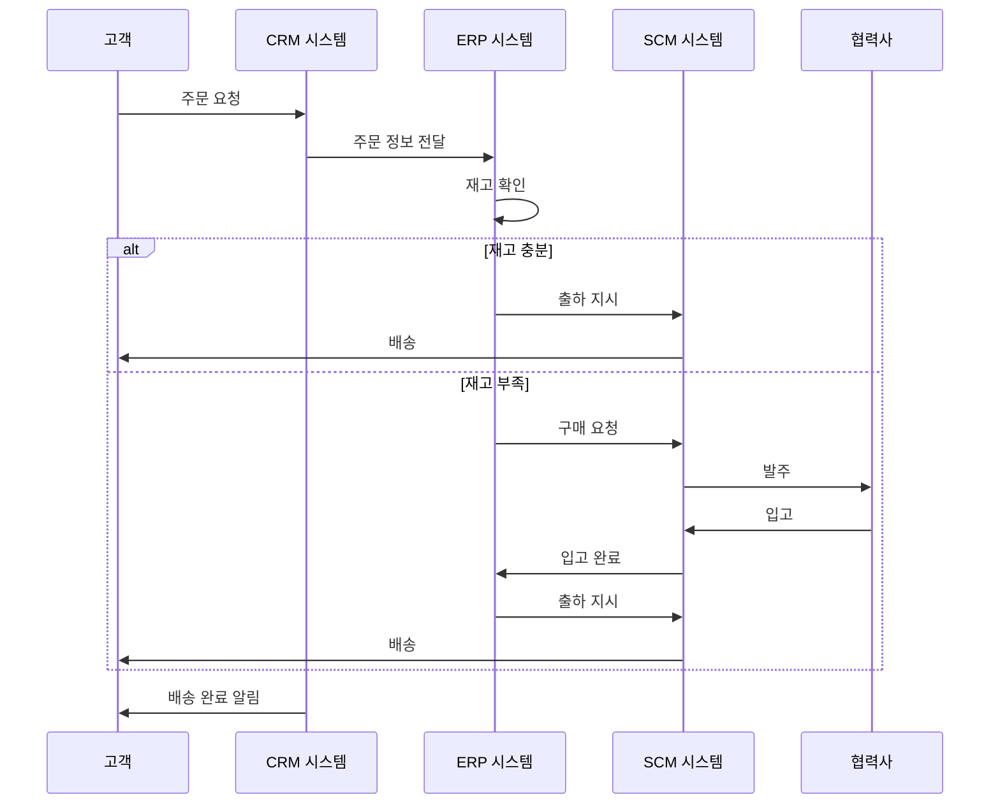
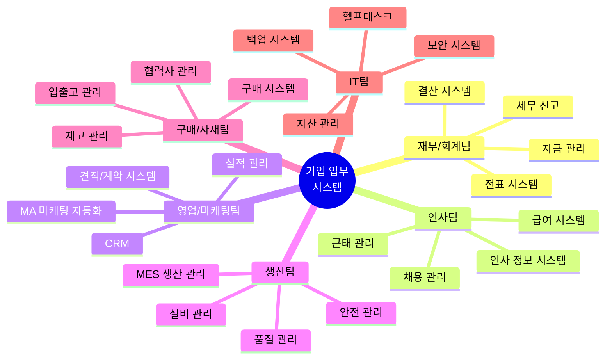
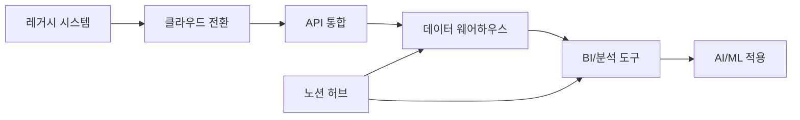
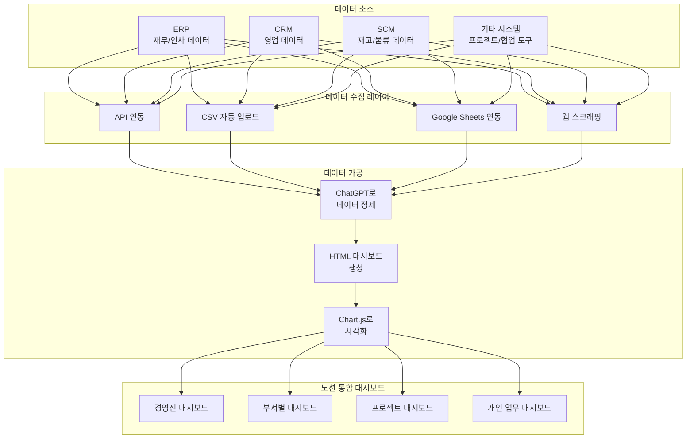

# 1. 기업의 업무 시스템 이해

이 장에서는 기업의 핵심 업무 시스템을 이해하고, 생성형 AI와 노션을 활용하여 이러한 시스템을 효율적으로 관리하는 방법을 알아봅니다. 현대 기업은 ERP, CRM, SCM 등 다양한 시스템으로 비즈니스를 운영하며, 이를 노션으로 통합 관리하면 강력한 협업 환경을 구축할 수 있습니다.

## 1.1 기업 업무 시스템의 구조

### 1.1.1 시스템 계층 구조

기업의 업무 시스템은 일반적으로 다음과 같은 계층 구조로 이루어져 있습니다.

### 1.1.2 ERP (Enterprise Resource Planning)

ERP는 기업의 핵심 업무 프로세스를 통합 관리하는 시스템입니다.

**주요 기능:**
- 재무/회계: 전표 처리, 결산, 자금 관리
- 인사: 급여, 근태, 인사평가, 채용
- 생산: 생산계획, 작업지시, 품질관리
- 자재: 구매, 재고, 입출고 관리

**대표 ERP 솔루션:**
- SAP ERP
- Oracle ERP Cloud
- Microsoft Dynamics 365
- 더존 iCUBE (국내)
- 영림원 K-System (국내)

### 1.1.3 CRM (Customer Relationship Management)

고객과의 관계를 체계적으로 관리하여 매출을 증대시키는 시스템입니다.

**주요 기능:**
- 영업 파이프라인 관리
- 고객 데이터베이스 구축
- 마케팅 캠페인 관리
- 고객 상담 이력 관리

**대표 CRM 솔루션:**
- Salesforce
- HubSpot CRM
- Zoho CRM
- Microsoft Dynamics CRM

### 1.1.4 SCM (Supply Chain Management)

공급망의 모든 과정을 최적화하는 시스템입니다.

**주요 기능:**
- 수요 예측 및 계획
- 구매 및 조달 관리
- 재고 최적화
- 배송 및 물류 추적

## 1.2 기업 업무 시스템의 데이터 흐름

이러한 데이터 흐름을 이해하면, 노션으로 통합 대시보드를 만들 때 어떤 데이터를 연결해야 하는지 명확해집니다.

## 1.3 부서별 주요 업무 시스템

## 1.4 생성형 AI로 업무 시스템 이해하기

기업의 복잡한 업무 시스템을 이해하기 위해 생성형 AI를 활용할 수 있습니다.

#### 업무 프로세스 분석 프롬프트

> **ChatGPT 프롬프트:**
>
> 당신은 기업의 업무 프로세스 컨설턴트입니다. 제조업체의 주문-생산-출하 프로세스를 분석하여 다음을 제공해주세요:
>
> 1. 전체 프로세스의 단계별 설명
> 2. 각 단계에서 사용되는 시스템과 데이터
> 3. 부서 간 협업 포인트
> 4. 병목 구간과 개선 방안
> 5. mermaid 형식의 프로세스 다이어그램
>
> 출력 형식: HTML 보고서 (mermaid 다이어그램 포함)

#### 시스템 통합 설계 프롬프트

> **ChatGPT 프롬프트:**
>
> 우리 회사는 ERP(SAP), CRM(Salesforce), 재고관리 시스템(자체 개발)을 각각 사용하고 있습니다. 이 세 시스템의 데이터를 노션으로 통합하여 경영진 대시보드를 만들고 싶습니다.
>
> 다음을 포함하는 통합 설계안을 작성해주세요:
>
> 1. 각 시스템에서 추출해야 할 핵심 데이터
> 2. 데이터 통합 방법 (API, CSV, DB 연동 등)
> 3. 대시보드에 표시할 핵심 KPI
> 4. 시스템 구성도 (mermaid 다이어그램)
> 5. 단계별 구현 계획
>
> 출력 형식: HTML 문서

#### 부서별 업무 시스템 매뉴얼 생성 프롬프트

> **ChatGPT 프롬프트:**
>
> 신입사원을 위한 "영업팀 업무 시스템 가이드"를 작성해주세요. 다음 시스템을 포함해야 합니다:
>
> - CRM 시스템 (Salesforce)
> - 견적/계약 시스템
> - 실적 관리 시스템
> - 고객 지원 시스템
>
> 각 시스템에 대해:
> 1. 시스템 목적과 중요성
> 2. 주요 기능과 사용법
> 3. 일일 업무 체크리스트
> 4. 주의사항 및 팁
> 5. 업무 흐름도 (mermaid)
>
> 출력 형식: HTML 매뉴얼 (목차와 북마크 포함)

## 1.5 업무 시스템의 디지털 트랜스포메이션

### 1.5.1 디지털 전환의 단계

| 단계 | 주요 활동 | 기간 | 핵심 성과 |
|------|----------|------|-----------|
| **1단계: 현황 분석** | - 현재 시스템 목록화 - 데이터 흐름 파악 - 문제점 도출 | 1-2개월 | 현황 보고서, 개선 계획 |
| **2단계: 클라우드 전환** | - 핵심 시스템 클라우드 이전 - API 개발 - 보안 강화 | 3-6개월 | 클라우드 인프라 구축 |
| **3단계: 데이터 통합** | - 데이터 웨어하우스 구축 - ETL 프로세스 자동화 - 데이터 품질 관리 | 2-4개월 | 통합 데이터베이스 |
| **4단계: 시각화/분석** | - BI 대시보드 구축 - 실시간 모니터링 - 예측 분석 도입 | 2-3개월 | 경영 대시보드 |
| **5단계: AI 활용** | - 생성형 AI 도입 - 업무 자동화 - 지능형 의사결정 | 지속적 | AI 기반 업무 혁신 |

### 1.5.2 노션을 허브로 활용하기

노션은 다양한 업무 시스템을 연결하는 중앙 허브 역할을 할 수 있습니다.

**노션 허브의 장점:**
1. ✅ **통합 접근성**: 한 곳에서 모든 정보 확인
2. ✅ **실시간 협업**: 팀원 간 즉각적인 정보 공유
3. ✅ **유연한 구조**: 부서/프로젝트별 맞춤 구성
4. ✅ **비용 효율성**: 별도 BI 도구 불필요
5. ✅ **쉬운 임베딩**: 대시보드, 차트 등 손쉽게 삽입

## 1.6 노션으로 업무 시스템 통합 대시보드 만들기

### 1.6.1 통합 대시보드 설계

#### 통합 대시보드 생성 프롬프트

> **ChatGPT 프롬프트:**
>
> 다음 데이터를 기반으로 경영진용 통합 대시보드 HTML을 생성해주세요:
>
> **데이터 소스:**
> - ERP: 월별 매출, 비용, 영업이익 (CSV 첨부)
> - CRM: 영업 파이프라인, 신규 고객, 전환율 (CSV 첨부)
> - HR: 재직 인원, 채용 현황, 이직률 (CSV 첨부)
> - 재고: 주요 품목 재고 현황, 회전율 (CSV 첨부)
>
> **대시보드 요구사항:**
> 1. 반응형 디자인 (PC, 태블릿, 모바일)
> 2. 4개 섹션: 재무, 영업, 인사, 운영
> 3. 각 섹션별 핵심 KPI 카드 (3-4개)
> 4. Chart.js로 트렌드 차트 (월별 추이)
> 5. 테이블로 상세 데이터 표시
> 6. 자동 새로고침 기능 (Google Sheets 연동)
> 7. 인쇄용 레이아웃
>
> **디자인:**
> - 색상: 파란색 계열 (기업용)
> - 폰트: 나눔고딕
> - 차트 스타일: 깔끔하고 전문적인 느낌
>
> 출력 형식: 완전한 HTML 파일 (CSS, JavaScript 포함)

#### 부서별 대시보드 예시 구조

**재무팀 대시보드:**
- 월별 손익계산서
- 현금 흐름 분석
- 예산 대비 실적
- 주요 비용 항목 분석

**영업팀 대시보드:**
- 영업 파이프라인 현황
- 팀/개인별 실적
- 고객별 매출 분석
- 전환율 및 성공률

**인사팀 대시보드:**
- 조직도 및 인원 현황
- 채용 진행 상황
- 교육 훈련 이력
- 근태 및 휴가 현황

**생산팀 대시보드:**
- 생산 계획 vs 실적
- 불량률 및 품질 지표
- 설비 가동률
- 원자재 소진율

## 1.7 실전 연습: 우리 회사 업무 시스템 매핑하기

다음 체크리스트를 활용하여 우리 회사의 업무 시스템을 정리해보세요.

### 업무 시스템 체크리스트

- [ ] **1단계: 현재 사용 중인 시스템 목록 작성**
  - ERP 시스템: _______________
  - CRM 시스템: _______________
  - 협업 도구: _______________
  - 기타 시스템: _______________

- [ ] **2단계: 각 시스템의 핵심 데이터 파악**
  - 어떤 데이터가 저장되는가?
  - 누가 입력하고 누가 조회하는가?
  - 얼마나 자주 업데이트되는가?

- [ ] **3단계: 시스템 간 데이터 흐름 분석**
  - 어떤 시스템끼리 연동되어야 하는가?
  - 현재 수동으로 처리하는 작업은?
  - 자동화 가능한 부분은?

- [ ] **4단계: 노션 통합 계획 수립**
  - 노션에 표시할 핵심 정보는?
  - 데이터 수집 방법은? (API/CSV/수동)
  - 대시보드 구조는?

- [ ] **5단계: ChatGPT로 대시보드 생성**
  - 데이터 준비 및 샘플 작성
  - 프롬프트 작성 및 실행
  - HTML 파일 생성 및 테스트

- [ ] **6단계: 노션에 임베딩**
  - CodePen 또는 GitHub Pages 업로드
  - 노션 페이지에 embed 블록 추가
  - 팀원과 공유 및 피드백

## 1.8 시스템 통합의 주의사항

> **보안 및 권한 관리**
>
> 업무 시스템 통합 시 다음 사항을 반드시 고려해야 합니다:
> - 🔒 **데이터 접근 권한**: 역할별로 다른 정보 제공
> - 🔒 **개인정보 보호**: 민감 정보는 마스킹 처리
> - 🔒 **API 키 관리**: 환경 변수로 안전하게 보관
> - 🔒 **감사 로그**: 누가 언제 어떤 데이터를 조회했는지 기록
> - 🔒 **정기 점검**: 연동 상태 및 데이터 정합성 확인

## 1.9 정리

<highlight>
기업 업무 시스템 핵심 포인트 
- 기업은 ERP, CRM, SCM 등 다양한 시스템으로 비즈니스 운영 
- 각 시스템의 데이터 흐름을 이해하는 것이 통합의 첫걸음 
- ChatGPT로 업무 프로세스를 분석하고 문서화 가능 
- 노션은 여러 시스템을 연결하는 통합 허브로 활용 가능 
- HTML 대시보드를 생성하여 노션에 임베딩하면 강력한 BI 도구 구축
</highlight>

| 시스템 | 주요 기능 | 노션 연동 활용 |
|--------|----------|---------------|
| ERP | 재무, 인사, 생산, 자재 통합 관리 | 경영진 대시보드 |
| CRM | 고객 관계 및 영업 파이프라인 관리 | 영업팀 실적 현황 |
| SCM | 공급망 및 물류 최적화 | 재고/배송 모니터링 |

다음 장에서는 노션의 템플릿 기능을 활용하여 반복 업무를 자동화하는 방법을 알아보겠습니다.
