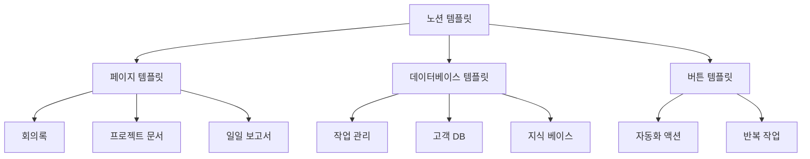
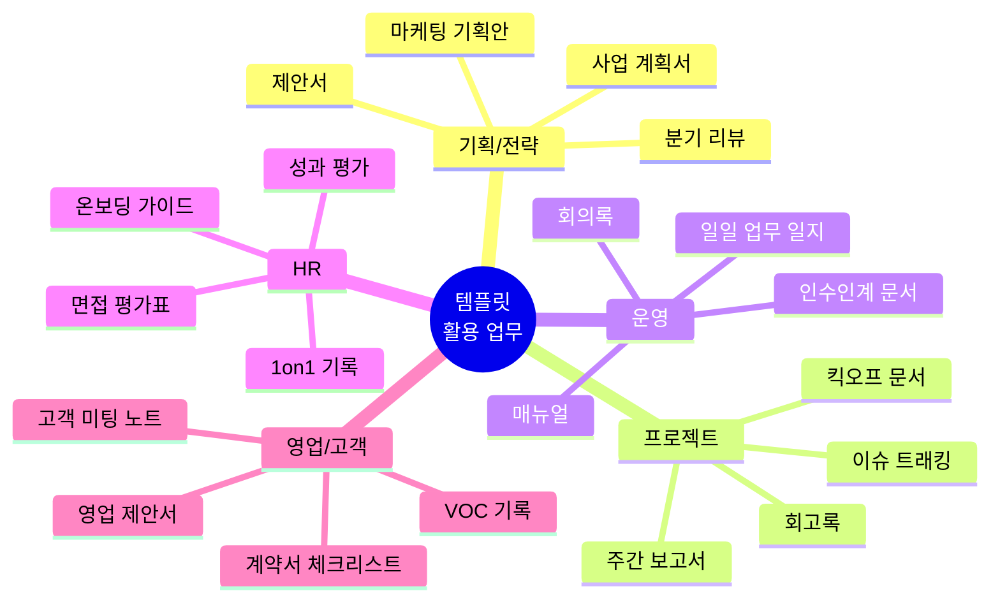
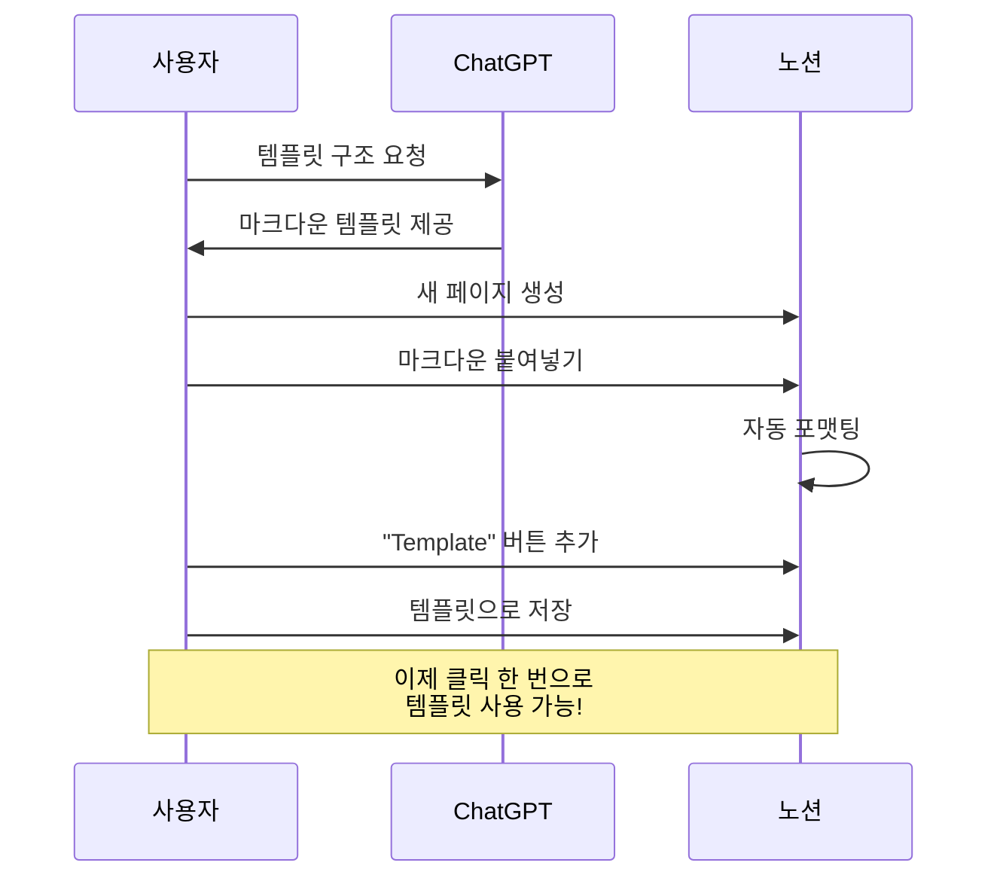
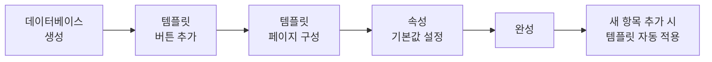
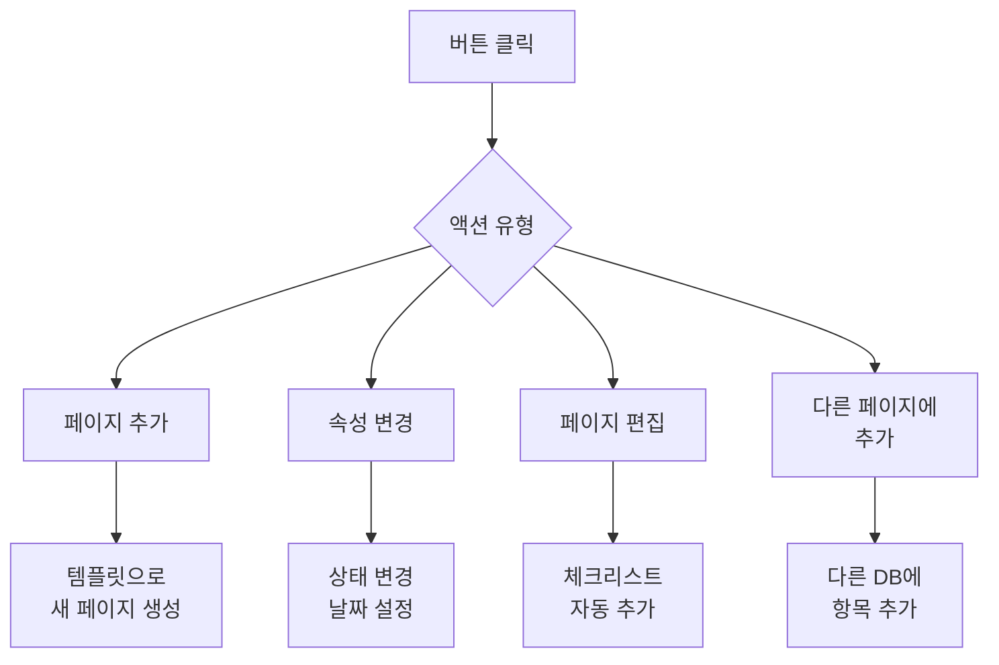
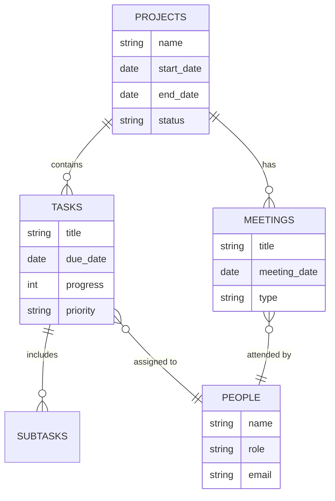
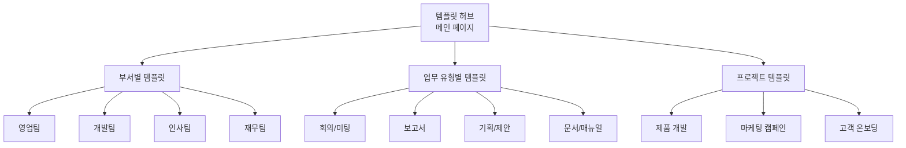
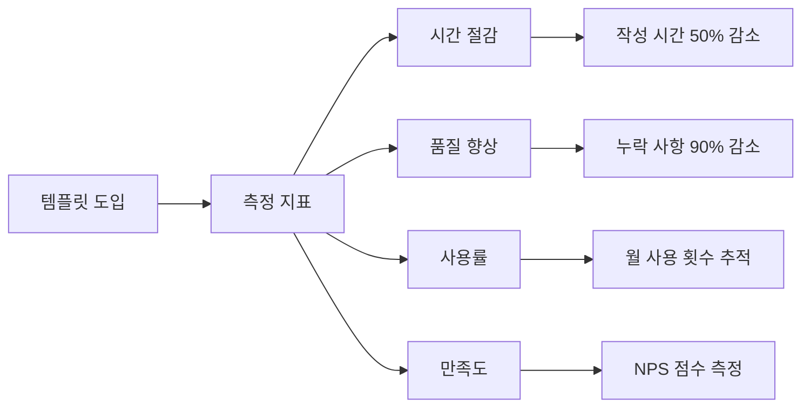
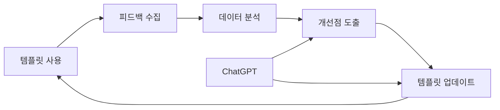

# 1. 문서 템플릿 제작 및 활용

이 장에서는 생성형 AI를 활용하여 효율적인 노션 템플릿을 만들고, 이를 업무에 활용하는 방법을 배웁니다. 템플릿을 통해 반복적인 업무를 자동화하고 일관성 있는 문서를 작성할 수 있습니다.

## 1.1 노션 템플릿의 이해

### 1.1.1 템플릿의 장점

**템플릿 사용 시 얻을 수 있는 효과:**

| 항목 | 수동 작성 | 템플릿 사용 |
|------|----------|------------|
| **작성 시간** | 30-60분 | 5-10분 |
| **일관성** | 낮음 (사람마다 다름) | 높음 (표준화) |
| **누락 위험** | 높음 | 낮음 (체크리스트) |
| **품질** | 불균일 | 균일 |
| **교육 시간** | 2-3일 | 1-2시간 |

### 1.1.2 템플릿이 필요한 업무

## 1.2 ChatGPT로 템플릿 구조 설계하기

생성형 AI를 활용하면 업무에 최적화된 템플릿 구조를 빠르게 설계할 수 있습니다.

### 1.2.1 회의록 템플릿 설계 프롬프트

> **ChatGPT 프롬프트:**
>
> 효율적인 회의록 노션 템플릿을 설계해주세요. 다음 요구사항을 포함해야 합니다:
>
> **목적:**
> - 회의 내용을 체계적으로 기록
> - 결정 사항과 액션 아이템 명확히 구분
> - 참석자들과 쉽게 공유
>
> **포함 항목:**
> 1. 기본 정보 (날짜, 시간, 참석자, 회의 유형)
> 2. 안건 및 목표
> 3. 논의 내용
> 4. 결정 사항
> 5. 액션 아이템 (담당자, 마감일)
> 6. 다음 회의 일정
>
> **출력 형식:**
> - 노션 마크다운 형식
> - 테이블, 체크박스, 토글 등 활용
> - 각 섹션별 사용 가이드 포함
>
> 템플릿의 마크다운 코드를 제공해주세요.

### 1.2.2 프로젝트 킥오프 문서 템플릿 프롬프트

> **ChatGPT 프롬프트:**
>
> IT 프로젝트 킥오프 문서 템플릿을 만들어주세요. 스타트업 환경에 적합한 형식이어야 합니다.
>
> **필수 섹션:**
> 1. 프로젝트 개요 (배경, 목적, 범위)
> 2. 주요 이해관계자 (역할과 책임)
> 3. 목표 및 성공 지표
> 4. 주요 마일스톤과 일정
> 5. 리스크 및 이슈
> 6. 커뮤니케이션 계획
> 7. 예산 및 리소스
>
> **템플릿 특징:**
> - mermaid 간트 차트로 일정 시각화
> - 체크리스트 형식의 준비 사항
> - 데이터베이스 연동 가능한 구조
>
> 출력: 노션에 바로 복사 가능한 마크다운 형식

### 1.2.3 주간 업무 보고서 템플릿 프롬프트

> **ChatGPT 프롬프트:**
>
> 팀원들이 쉽게 작성할 수 있는 주간 업무 보고서 템플릿을 설계해주세요.
>
> **구성:**
> 1. 이번 주 주요 성과 (3-5개)
> 2. 진행 중인 작업 (진행률 표시)
> 3. 다음 주 계획
> 4. 도움이 필요한 사항
> 5. 배운 점 / 개선 아이디어
>
> **요구사항:**
> - 작성 시간 10분 이내
> - 시각적 진행률 표시 (프로그레스 바)
> - 선택형 항목 많이 활용 (체크박스, 선택 메뉴)
> - 자동으로 날짜 범위 표시
>
> 출력: 노션 템플릿 마크다운 + 사용 가이드

## 1.3 노션 템플릿 제작 실습

### 1.3.1 페이지 템플릿 만들기

**단계별 가이드:**

1. **ChatGPT로 템플릿 설계 요청**
   - 위의 프롬프트 사용
   - 마크다운 형식으로 출력 요청

2. **노션에서 새 페이지 생성**
   - 워크스페이스에서 `+ New Page` 클릭
   - 제목 입력 (예: "회의록 템플릿")

3. **ChatGPT 결과를 노션에 붙여넣기**
   - 마크다운 전체 복사
   - 노션 페이지에 붙여넣기
   - 자동으로 포맷팅됨

4. **템플릿 버튼 추가**
   - 페이지 우측 상단 `⋯` 메뉴
   - "Turn into template" 선택
   - 아이콘과 설명 추가

5. **템플릿 사용**
   - 데이터베이스나 페이지에서
   - "Template" 버튼 클릭
   - 생성된 템플릿 선택

### 1.3.2 데이터베이스 템플릿 만들기

데이터베이스 템플릿은 새로운 항목을 추가할 때 자동으로 적용됩니다.

**예시: 작업 관리 데이터베이스 템플릿**

> **ChatGPT 프롬프트:**
>
> 작업 관리용 노션 데이터베이스 템플릿을 만들어주세요.
>
> **데이터베이스 속성:**
> - 제목 (Title)
> - 상태 (Status): 예정, 진행중, 완료, 보류
> - 우선순위 (Priority): 긴급, 높음, 보통, 낮음
> - 담당자 (Person)
> - 시작일 (Start Date)
> - 마감일 (Due Date)
> - 태그 (Tags)
> - 진행률 (Progress): 0-100%
>
> **템플릿 페이지 구조:**
> 1. 작업 개요
> 2. 상세 설명
> 3. 체크리스트 (하위 작업)
> 4. 참고 자료
> 5. 커뮤니케이션 로그
> 6. 완료 조건
>
> 출력: 데이터베이스 설정 가이드 + 템플릿 페이지 마크다운

## 1.4 생성형 AI로 템플릿 콘텐츠 자동 생성하기

템플릿의 구조뿐만 아니라, 내용도 AI가 도와줄 수 있습니다.

### 1.4.1 회의록 자동 작성

> **ChatGPT 프롬프트:**
>
> 다음 회의 녹취록을 바탕으로 회의록을 작성해주세요:
>
> [녹취록 또는 메모 붙여넣기]
>
> **출력 형식:**
> 위에서 만든 회의록 템플릿 구조에 맞춰서 작성해주세요:
> - 회의 기본 정보
> - 주요 논의 사항 (불릿 포인트)
> - 결정 사항 (번호 목록)
> - 액션 아이템 (테이블: 항목, 담당자, 마감일)
> - 다음 회의 안건
>
> HTML 테이블 형식으로 출력해주시고, 노션에 바로 붙여넣을 수 있게 해주세요.

### 1.4.2 프로젝트 문서 초안 생성

> **ChatGPT 프롬프트:**
>
> 다음 프로젝트에 대한 킥오프 문서를 작성해주세요:
>
> **프로젝트 정보:**
> - 프로젝트명: [이름]
> - 목적: [목적]
> - 기간: [시작일] ~ [종료일]
> - 팀 구성: [팀원 정보]
>
> **요구사항:**
> 1. 프로젝트 배경과 목적 (300-500자)
> 2. 구체적인 목표 3-5개 (SMART 원칙 적용)
> 3. 주요 마일스톤과 일정 (mermaid 간트 차트)
> 4. 예상 리스크 5개와 대응 방안 (테이블)
> 5. 성공 지표 (측정 가능한 KPI)
>
> 출력: HTML 형식 (노션 임베딩 가능)

### 1.4.3 업무 매뉴얼 자동 생성

> **ChatGPT 프롬프트:**
>
> 다음 업무 프로세스에 대한 상세 매뉴얼을 작성해주세요:
>
> **업무명:** [업무 이름]
> **담당 부서:** [부서명]
> **개요:** [간단한 설명]
>
> **매뉴얼 구성:**
> 1. 업무 목적 및 중요성
> 2. 사전 준비 사항 (체크리스트)
> 3. 단계별 수행 절차 (번호 목록 + 스크린샷 위치 표시)
> 4. 각 단계별 주의사항
> 5. 문제 발생 시 대응 방법 (FAQ 형식)
> 6. 관련 문서 및 시스템 링크
> 7. 업무 흐름도 (mermaid 다이어그램)
>
> 출력: 노션 마크다운 형식 + mermaid 다이어그램

## 1.5 고급 템플릿 기능 활용

### 1.5.1 버튼과 자동화

노션의 버튼 기능을 활용하면 템플릿을 더욱 강력하게 만들 수 있습니다.

**버튼 활용 예시:**

1. **"주간 보고서 생성" 버튼**
   - 클릭 시 현재 주의 보고서 페이지 자동 생성
   - 날짜 자동 입력
   - 지난주 보고서 링크 자동 추가

2. **"회의 종료" 버튼**
   - 회의 상태를 "완료"로 변경
   - 액션 아이템을 작업 DB에 자동 추가
   - 참석자에게 알림 전송

3. **"프로젝트 완료" 버튼**
   - 모든 작업의 상태 확인
   - 완료율 계산
   - 회고 페이지 자동 생성

### 1.5.2 관계형 데이터베이스 연동

**관계형 템플릿 설계:**

- 프로젝트 DB ↔ 작업 DB ↔ 하위 작업 DB
- 담당자 DB ↔ 모든 업무 DB
- 회의 DB ↔ 액션 아이템 DB

## 1.6 템플릿 라이브러리 구축

### 1.6.1 조직의 템플릿 허브 만들기

**템플릿 허브 구조 생성 프롬프트:**

> **ChatGPT 프롬프트:**
>
> 회사 전체가 사용할 "노션 템플릿 허브" 페이지를 설계해주세요.
>
> **요구사항:**
> 1. 직관적인 카테고리 분류
> 2. 각 템플릿에 대한 설명과 사용 시기
> 3. 템플릿 사용법 가이드
> 4. 템플릿 요청/개선 제안 기능
> 5. 인기 템플릿 TOP 10
>
> **구조:**
> - 메인 페이지: 카테고리 버튼들
> - 카테고리 페이지: 템플릿 갤러리
> - 템플릿 상세: 설명, 사용법, 예시
>
> 출력: 노션 페이지 구조 (마크다운) + 시각적 레이아웃 설명

### 1.6.2 템플릿 사용 가이드라인

**템플릿 관리 모범 사례:**

| 구분 | 권장 사항 |
|------|----------|
| **작성 시** | - 목적과 사용 시기 명확히 기재 - 각 섹션에 간단한 가이드 추가 - 예시 데이터 포함 |
| **관리 시** | - 정기적 리뷰 (분기별) - 사용 빈도 추적 - 피드백 수집 및 반영 |
| **공유 시** | - 신규 입사자 온보딩에 포함 - 템플릿 사용법 교육 - 우수 사용 사례 공유 |
| **업데이트 시** | - 버전 관리 (v1.0, v1.1 등) - 변경 이력 기록 - 기존 사용자에게 공지 |

## 1.7 실전 예제: 다양한 템플릿 제작

### 1.7.1 영업 제안서 템플릿

> **ChatGPT 프롬프트:**
>
> B2B 영업 제안서 노션 템플릿을 만들어주세요.
>
> **구성:**
> 1. 표지 (회사 로고, 제안서 제목, 날짜)
> 2. 고객사 분석 (Pain Points, Needs)
> 3. 솔루션 제안 (3-5가지 핵심 가치)
> 4. 구현 계획 (mermaid 타임라인)
> 5. 가격 및 패키지 (테이블)
> 6. 성공 사례 (Before/After)
> 7. 계약 조건
> 8. 부록 (FAQ, 팀 소개)
>
> **디자인 요구사항:**
> - 전문적이고 깔끔한 레이아웃
> - 시각적 요소 (아이콘, 컬러 블록)
> - 인쇄 가능한 구조
>
> 출력: HTML 형식 (CSS 포함, 노션 임베딩 가능)

### 1.7.2 고객 VOC 기록 템플릿

> **ChatGPT 프롬프트:**
>
> 고객 피드백(VOC)을 체계적으로 기록하고 분석하기 위한 노션 템플릿을 설계해주세요.
>
> **데이터베이스 속성:**
> - 접수일시, 고객명, 연락처
> - 피드백 유형 (불만, 제안, 문의, 칭찬)
> - 긴급도, 우선순위
> - 관련 제품/서비스
> - 담당자, 상태
>
> **템플릿 페이지:**
> 1. VOC 상세 내용
> 2. 원인 분석
> 3. 조치 사항
> 4. 고객 응대 이력
> 5. 후속 조치 계획
>
> **자동화:**
> - 긴급 VOC는 담당자에게 자동 알림
> - 7일 이상 미처리 시 에스컬레이션
>
> 출력: 데이터베이스 설정 + 템플릿 마크다운

### 1.7.3 인수인계 문서 템플릿

> **ChatGPT 프롬프트:**
>
> 업무 인수인계를 위한 완벽한 노션 템플릿을 만들어주세요.
>
> **구성:**
> 1. 인수인계 기본 정보
>    - 인계자, 인수자 정보
>    - 인수인계 기간
>    - 업무 범위
>
> 2. 업무 개요
>    - 주요 업무 목록
>    - 업무별 중요도 및 빈도
>    - 연간 일정 (반복 업무)
>
> 3. 상세 업무 가이드
>    - 업무별 수행 절차
>    - 사용 시스템 및 권한
>    - 주의사항
>
> 4. 주요 연락처
>    - 내부 담당자
>    - 외부 협력사
>    - 긴급 연락망
>
> 5. 문서 및 자료 위치
>    - 공유 폴더 링크
>    - 중요 문서 목록
>    - 템플릿 모음
>
> 6. 인수인계 체크리스트
>    - 단계별 확인 사항
>    - 서명란
>
> **추가 기능:**
> - 진행률 자동 계산
> - 미완료 항목 하이라이트
>
> 출력: 노션 마크다운 + 체크리스트

## 1.8 템플릿 성과 측정

### 1.8.1 템플릿 효과 측정 지표

**측정 대시보드 생성 프롬프트:**

> **ChatGPT 프롬프트:**
>
> 노션 템플릿 사용 현황을 모니터링하는 대시보드 HTML을 생성해주세요.
>
> **포함 항목:**
> 1. 템플릿별 사용 횟수 (월별 트렌드 차트)
> 2. 인기 템플릿 TOP 10
> 3. 부서별 사용 현황
> 4. 평균 작성 시간 비교 (템플릿 사용 전후)
> 5. 사용자 피드백 점수
>
> **데이터 소스:**
> Google Sheets에서 실시간으로 데이터를 가져옵니다.
> (템플릿명, 사용일시, 사용자, 부서, 작성시간, 만족도)
>
> **디자인:**
> - Chart.js로 시각화
> - 반응형 레이아웃
> - 자동 새로고침 (5분마다)
>
> 출력: 완전한 HTML 파일 (CSS, JS 포함)

### 1.8.2 지속적 개선 프로세스

## 1.9 실전 연습: 우리 팀 템플릿 만들기

다음 체크리스트를 따라 우리 팀에 필요한 템플릿을 만들어보세요.

### 템플릿 제작 체크리스트

- [ ] **1단계: 템플릿 필요 업무 파악**
  - 반복적으로 작성하는 문서는?
  - 작성 시간이 오래 걸리는 문서는?
  - 신규 입사자가 어려워하는 문서는?

- [ ] **2단계: 우선순위 결정**
  - 가장 자주 사용하는 문서 3개 선정
  - 표준화가 필요한 문서 파악

- [ ] **3단계: ChatGPT로 템플릿 설계**
  - 위의 프롬프트 참고하여 요청
  - 구조와 내용 검토

- [ ] **4단계: 노션에서 템플릿 생성**
  - 마크다운 붙여넣기
  - 속성 및 레이아웃 조정
  - 예시 데이터 입력

- [ ] **5단계: 파일럿 테스트**
  - 팀원 3-5명에게 시범 사용 요청
  - 피드백 수집 (어려운 점, 개선 사항)

- [ ] **6단계: 수정 및 배포**
  - 피드백 반영하여 수정
  - 사용 가이드 작성
  - 팀 전체 공유 및 교육

- [ ] **7단계: 모니터링**
  - 사용률 추적
  - 정기적 피드백 수집 (월 1회)
  - 분기별 템플릿 리뷰 및 업데이트

## 1.10 정리

이번 장에서는 노션 템플릿의 개념부터 실전 활용까지 배웠습니다.

<highlight>
문서 템플릿 제작 및 활용 핵심 포인트 
- 템플릿으로 반복 업무 50% 이상 단축 가능 
- ChatGPT로 회의록, 프로젝트 문서, 보고서 등 업무 최적화 템플릿 설계 
- 페이지 템플릿, 데이터베이스 템플릿, 버튼 자동화 조합으로 강력한 시스템 구축 
- 조직 전체가 사용하는 템플릿 허브로 생산성 향상 
- 지속적인 피드백과 개선으로 템플릿 품질 유지
</highlight>
