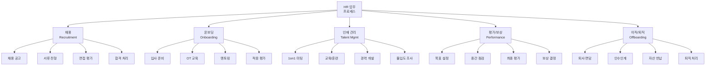
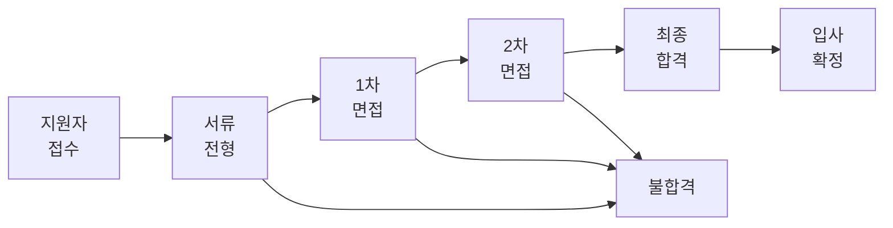
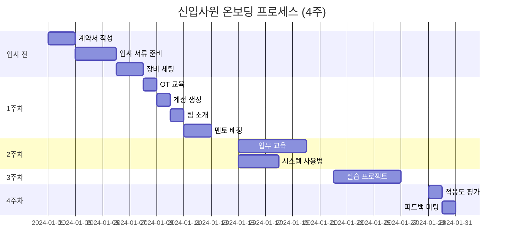
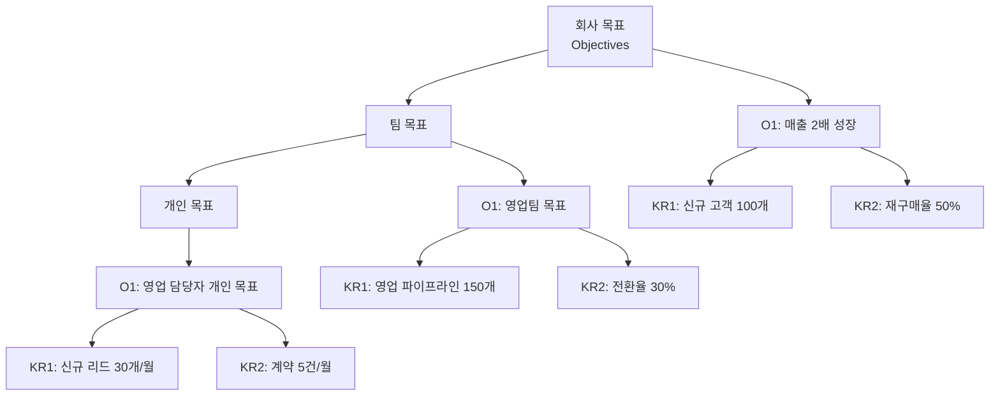
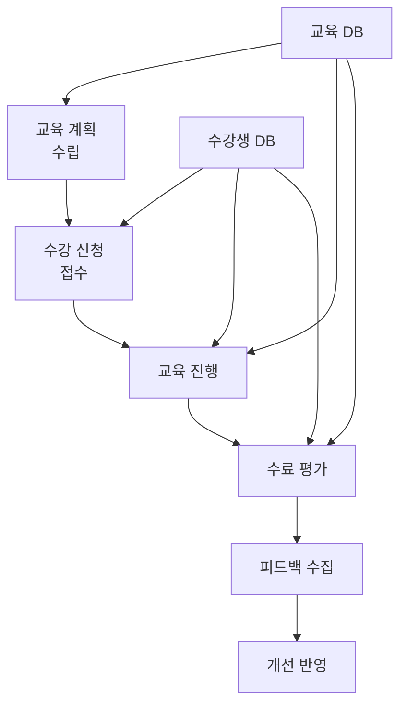
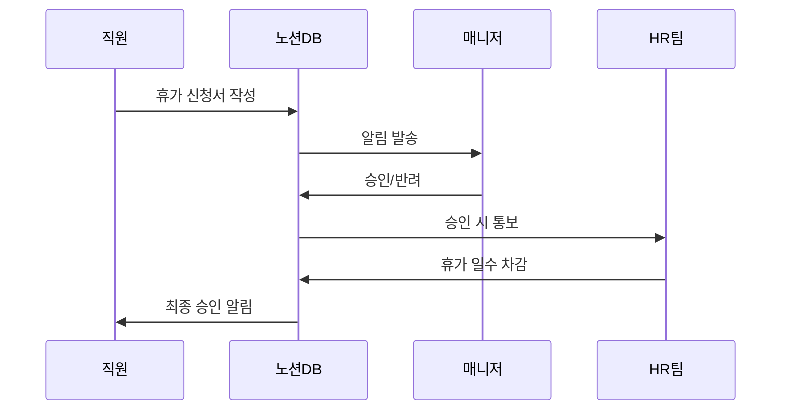
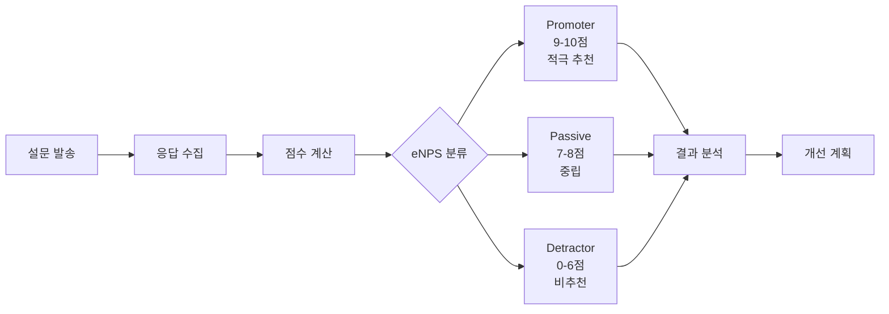
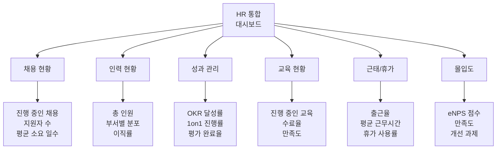

# 2. HR 템플릿 제작 및 활용

이 장에서는 채용, 온보딩, 평가, 교육 등 인사(HR) 업무에 특화된 노션 템플릿을 배웁니다. 노션과 생성형 AI를 활용하여 HR 업무를 자동화하고 효율화하는 방법을 실습합니다.

## 2.1 HR 업무 프로세스 이해

## 2.2 채용 관리 템플릿

### 2.2.1 채용 파이프라인 데이터베이스

채용 프로세스 전체를 관리하는 통합 데이터베이스를 설계합니다.

**데이터베이스 속성 설계 프롬프트:**

> **ChatGPT 프롬프트:**
>
> 채용 관리를 위한 노션 데이터베이스를 설계해주세요.
>
> **데이터베이스 속성:**
> - 지원자명 (Title)
> - 지원 직무 (Select)
> - 지원일 (Date)
> - 현재 단계 (Status): 서류검토, 1차면접, 2차면접, 최종면접, 합격, 불합격
> - 평가 점수 (Number): 0-100점
> - 면접관 (Person: Multi-select)
> - 합격 여부 (Checkbox)
> - 연락처 (Phone, Email)
> - 이력서 파일 (Files)
> - 메모 (Text)
>
> **템플릿 페이지 구조:**
> 1. 지원자 기본 정보
> 2. 경력 요약
> 3. 면접 평가 기록 (각 단계별)
> 4. 강점/약점 분석
> 5. 채용 결정 사유
> 6. 다음 액션 아이템
>
> 출력: 데이터베이스 구조 설명 + 템플릿 페이지 마크다운

### 2.2.2 면접 평가표 템플릿

> **ChatGPT 프롬프트:**
>
> 구조화된 면접을 위한 평가표 노션 템플릿을 만들어주세요.
>
> **평가 항목:**
> 1. 직무 역량 (40점)
>    - 전문 지식
>    - 실무 경험
>    - 문제 해결 능력
>    - 기술 스택 적합도
>
> 2. 소프트 스킬 (30점)
>    - 커뮤니케이션
>    - 협업 능력
>    - 학습 의지
>    - 적응력
>
> 3. 문화 적합성 (20점)
>    - 가치관 부합도
>    - 조직 몰입도
>    - 팀워크
>
> 4. 성장 가능성 (10점)
>    - 발전 잠재력
>    - 자기 개발 노력
>
> **템플릿 구성:**
> - 각 항목별 평가 척도 (1-5점)
> - 구체적 질문 예시
> - 관찰 내용 기록란
> - 최종 의견 및 추천 여부
> - 자동 점수 계산 (총점 100점)
>
> **출력 형식:**
> HTML 평가표 (테이블 형식, 인쇄 가능, 노션 임베딩)

### 2.2.3 채용 현황 대시보드 생성

> **ChatGPT 프롬프트:**
>
> 채용 현황을 실시간으로 모니터링하는 대시보드 HTML을 생성해주세요.
>
> **데이터 소스:**
> Google Sheets에서 채용 데이터를 가져옵니다.
> (포지션, 지원자수, 단계별 인원, 전환율, 소요일수)
>
> **대시보드 구성:**
> 1. 주요 지표 카드
>    - 총 지원자 수
>    - 진행 중인 채용 건수
>    - 평균 채용 소요 일수
>    - 전체 전환율
>
> 2. 포지션별 현황 (테이블)
>    - 직무명, 지원자, 면접 진행, 합격, 전환율
>
> 3. 채용 퍼널 차트
>    - 단계별 지원자 수 (깔때기 차트)
>    - 단계별 탈락률
>
> 4. 월별 채용 트렌드
>    - 지원자 수 추이 (라인 차트)
>    - 합격자 수 추이
>
> 5. 채용 소스 분석
>    - 채널별 지원자 비율 (파이 차트)
>
> **디자인:**
> - Chart.js 활용
> - 반응형 레이아웃
> - 5분마다 자동 새로고침
>
> 출력: 완전한 HTML 파일 (CSS, JS 포함)

## 2.3 온보딩 템플릿

### 2.3.1 신입사원 온보딩 체크리스트

**온보딩 템플릿 생성 프롬프트:**

> **ChatGPT 프롬프트:**
>
> 신입사원이 성공적으로 적응할 수 있도록 돕는 온보딩 노션 템플릿을 만들어주세요.
>
> **구성:**
> 1. 환영 메시지
>    - 회사 소개
>    - 팀 소개
>    - 첫 주 일정
>
> 2. 입사 전 체크리스트
>    - [ ] 계약서 작성
>    - [ ] 신원 조회 서류 제출
>    - [ ] 계좌 정보 제공
>    - [ ] 입사일 확인
>
> 3. 첫 주 가이드
>    - Day 1: OT 교육, 장비 수령, 사무실 투어
>    - Day 2: 시스템 계정 생성, 이메일 설정
>    - Day 3: 팀 미팅, 멘토 소개
>    - Day 4-5: 업무 교육
>
> 4. 30-60-90일 목표
>    - 30일: 시스템 숙지, 기본 업무 수행
>    - 60일: 독립적 업무 수행
>    - 90일: 프로젝트 기여
>
> 5. 필수 학습 자료
>    - 회사 규정
>    - 제품/서비스 이해
>    - 업무 프로세스
>    - 주요 연락처
>
> 6. FAQ
>    - 급여, 복지, 근태 등
>
> 7. 피드백 섹션
>    - 주차별 회고
>    - 어려운 점
>    - 도움이 필요한 부분
>
> **추가 기능:**
> - 진행률 프로그레스 바
> - 자동 날짜 계산
> - 담당자별 태스크 할당
>
> 출력: 노션 마크다운 형식 + mermaid 타임라인

### 2.3.2 멘토링 가이드 템플릿

> **ChatGPT 프롬프트:**
>
> 신입사원 멘토를 위한 가이드 템플릿을 작성해주세요.
>
> **구성:**
> 1. 멘토의 역할과 책임
> 2. 주차별 멘토링 계획
>    - 1주: 환경 적응 지원
>    - 2주: 업무 이해 돕기
>    - 3주: 실습 프로젝트 가이드
>    - 4주: 피드백 및 평가
>
> 3. 1on1 미팅 템플릿
>    - 미팅 목적
>    - 논의 주제
>    - 신입사원 질문 사항
>    - 다음 액션 아이템
>
> 4. 체크포인트 질문 리스트
>    - 업무 이해도 확인 질문
>    - 적응 상태 점검 질문
>    - 도움이 필요한 부분 파악
>
> 5. 멘토링 팁
>    - 효과적인 커뮤니케이션 방법
>    - 주의사항
>    - 리소스 공유
>
> 출력: 노션 마크다운 + 체크리스트

## 2.4 성과 관리 템플릿

### 2.4.1 목표 설정 (OKR) 템플릿

**OKR 템플릿 생성 프롬프트:**

> **ChatGPT 프롬프트:**
>
> OKR(Objectives and Key Results) 관리를 위한 노션 템플릿을 만들어주세요.
>
> **데이터베이스 속성:**
> - 목표명 (Title)
> - 유형 (Select): Objective / Key Result
> - 소유자 (Person)
> - 분기 (Select): Q1, Q2, Q3, Q4
> - 상위 목표 (Relation)
> - 진행률 (Progress): 0-100%
> - 상태 (Status): 진행 전, 진행 중, 완료, 위험
> - 달성 기한 (Date)
> - 측정 지표 (Formula)
>
> **템플릿 페이지:**
> 1. 목표 개요
>    - 왜 이 목표가 중요한가?
>    - 성공 정의
>
> 2. 핵심 결과 (Key Results)
>    - KR 1: [측정 가능한 결과]
>    - KR 2: [측정 가능한 결과]
>    - KR 3: [측정 가능한 결과]
>
> 3. 액션 플랜
>    - 주요 마일스톤
>    - 담당자 및 일정
>
> 4. 주간 업데이트
>    - 이번 주 진행 사항
>    - 다음 주 계획
>    - 블로커
>
> 5. 회고
>    - 배운 점
>    - 개선 사항
>
> **시각화:**
> - mermaid로 목표 계층 구조 표시
> - 진행률 차트
>
> 출력: 노션 마크다운 + mermaid 다이어그램

### 2.4.2 1on1 미팅 템플릿

> **ChatGPT 프롬프트:**
>
> 효과적인 1on1 미팅을 위한 노션 템플릿을 작성해주세요.
>
> **템플릿 구성:**
> 1. 미팅 기본 정보
>    - 날짜 및 시간
>    - 참석자 (매니저 + 팀원)
>    - 미팅 유형 (정기, 임시)
>
> 2. 사전 준비 (팀원 작성)
>    - 지난 미팅 이후 주요 성과
>    - 현재 진행 중인 업무
>    - 논의하고 싶은 주제
>    - 도움이 필요한 부분
>
> 3. 미팅 노트
>    - 논의 내용
>    - 피드백
>    - 결정 사항
>
> 4. 액션 아이템
>    - 팀원 액션
>    - 매니저 액션
>    - 마감일
>
> 5. 경력 개발 논의
>    - 장단기 목표
>    - 스킬 개발 계획
>    - 커리어 패스
>
> 6. 웰빙 체크
>    - 업무 만족도 (1-5점)
>    - 스트레스 레벨
>    - 워라밸
>
> 7. 다음 미팅
>    - 일정
>    - 사전 안건
>
> **추가 기능:**
> - 이전 1on1 미팅 기록 자동 링크
> - 액션 아이템 자동 작업 DB에 추가
>
> 출력: 노션 마크다운 형식

### 2.4.3 성과 평가 대시보드

> **ChatGPT 프롬프트:**
>
> 팀원들의 성과를 한눈에 볼 수 있는 대시보드 HTML을 생성해주세요.
>
> **데이터 소스:**
> Google Sheets에서 다음 데이터를 가져옵니다:
> - 팀원명, 직급, 부서
> - OKR 진행률 (%)
> - 분기 목표 달성률 (%)
> - 1on1 참여율
> - 교육 이수 시간
> - 동료 피드백 점수
>
> **대시보드 구성:**
> 1. 팀 전체 성과 요약
>    - 평균 OKR 달성률
>    - 목표 달성자 비율
>    - 우수 성과자 (TOP 3)
>
> 2. 개인별 성과 카드
>    - 이름, 사진
>    - OKR 진행률 (프로그레스 바)
>    - 주요 성과
>    - 개선 필요 영역
>
> 3. 목표 달성률 분포 (히스토그램)
>    - 0-60%, 60-80%, 80-100%
>
> 4. 부서별 비교 (막대 차트)
>    - 부서별 평균 달성률
>
> 5. 트렌드 분석 (라인 차트)
>    - 분기별 성과 추이
>
> **디자인:**
> - Chart.js로 시각화
> - 반응형 레이아웃
> - 색상 코딩 (녹색: 우수, 노란색: 보통, 빨간색: 개선 필요)
>
> 출력: 완전한 HTML 파일 (CSS, JS 포함)

## 2.5 교육 관리 템플릿

### 2.5.1 교육 프로그램 데이터베이스

**교육 관리 템플릿 프롬프트:**

> **ChatGPT 프롬프트:**
>
> 사내 교육 프로그램을 관리하는 노션 시스템을 설계해주세요.
>
> **교육 프로그램 DB 속성:**
> - 프로그램명 (Title)
> - 카테고리 (Select): 직무, 리더십, IT, 어학, 소프트스킬
> - 교육 일정 (Date Range)
> - 강사 (Person)
> - 대상 (Multi-select): 신입, 주니어, 시니어, 리더
> - 정원 (Number)
> - 신청자 수 (Rollup)
> - 수료 기준 (Text)
> - 상태 (Status): 계획, 모집중, 진행중, 완료
>
> **수강생 관리 DB 속성:**
> - 수강생명 (Title)
> - 프로그램 (Relation)
> - 출석률 (Number)
> - 과제 제출 (Checkbox)
> - 수료 여부 (Formula)
> - 만족도 (Number: 1-5)
> - 피드백 (Text)
>
> **교육 페이지 템플릿:**
> 1. 교육 개요
> 2. 학습 목표
> 3. 커리큘럼 (주차별)
> 4. 교육 자료 링크
> 5. 과제 안내
> 6. Q&A 섹션
>
> 출력: 데이터베이스 구조 + 템플릿 마크다운

### 2.5.2 개인 학습 계획 템플릿

> **ChatGPT 프롬프트:**
>
> 직원들이 자기 주도적으로 학습할 수 있도록 돕는 개인 학습 계획 템플릿을 만들어주세요.
>
> **구성:**
> 1. 학습 목표
>    - 올해 배우고 싶은 스킬 3가지
>    - 목표 수준 (초급, 중급, 고급)
>    - 학습 동기
>
> 2. 학습 계획
>    - 월별 학습 주제
>    - 학습 자료 (책, 강의, 프로젝트)
>    - 주당 학습 시간 목표
>
> 3. 학습 기록
>    - 날짜, 주제, 학습 시간
>    - 배운 내용 요약
>    - 실습 프로젝트
>
> 4. 진행 상황
>    - 목표 대비 달성률
>    - 총 학습 시간
>    - 완료한 강의/책
>
> 5. 회고
>    - 잘한 점
>    - 어려웠던 점
>    - 다음 계획
>
> **시각화:**
> - mermaid 로드맵
> - 월별 학습 시간 차트
>
> 출력: 노션 마크다운 + mermaid 다이어그램

## 2.6 근태 및 휴가 관리 템플릿

### 2.6.1 휴가 신청 시스템

**휴가 관리 템플릿 프롬프트:**

> **ChatGPT 프롬프트:**
>
> 휴가 신청 및 관리를 위한 노션 시스템을 설계해주세요.
>
> **휴가 신청 DB 속성:**
> - 신청자 (Person)
> - 휴가 유형 (Select): 연차, 반차, 병가, 경조사, 기타
> - 시작일 (Date)
> - 종료일 (Date)
> - 일수 (Formula)
> - 사유 (Text)
> - 상태 (Status): 대기, 승인, 반려
> - 승인자 (Person)
> - 승인일 (Date)
> - 인계자 (Person)
>
> **개인별 휴가 현황 페이지:**
> 1. 휴가 잔여 일수
>    - 전체 연차: 15일
>    - 사용: 7일
>    - 잔여: 8일
>
> 2. 휴가 사용 내역 (테이블)
>    - 날짜, 유형, 일수
>
> 3. 월별 휴가 계획
>    - mermaid 타임라인
>
> 4. 팀 휴가 캘린더
>    - 팀원들의 휴가 일정 한눈에 보기
>
> **자동화:**
> - 승인 시 HR DB에 자동 기록
> - 잔여 일수 자동 계산
> - 휴가 종료 전날 알림
>
> 출력: 데이터베이스 구조 + 템플릿 마크다운 + mermaid 다이어그램

### 2.6.2 근태 관리 대시보드

> **ChatGPT 프롬프트:**
>
> 팀의 근태 현황을 모니터링하는 대시보드 HTML을 생성해주세요.
>
> **데이터 소스:**
> Google Sheets에서 근태 데이터를 가져옵니다.
> (직원명, 출근시간, 퇴근시간, 근무시간, 지각여부, 조퇴여부)
>
> **대시보드 구성:**
> 1. 이번 달 통계
>    - 평균 출근 시간
>    - 평균 퇴근 시간
>    - 평균 근무 시간
>    - 지각/조퇴 건수
>
> 2. 개인별 근태 현황 (테이블)
>    - 이름, 출근율, 평균 근무시간, 지각 횟수
>
> 3. 월별 출근율 트렌드 (라인 차트)
>    - 월별 출근율 변화
>
> 4. 부서별 근무 시간 비교 (막대 차트)
>    - 부서별 평균 근무 시간
>
> 5. 주간 출퇴근 패턴 (히트맵)
>    - 요일별 출근/퇴근 시간 분포
>
> **디자인:**
> - Chart.js 활용
> - 색상 코딩 (녹색: 정상, 빨간색: 지각/조퇴)
> - 반응형 레이아웃
>
> 출력: 완전한 HTML 파일 (CSS, JS 포함)

## 2.7 직원 몰입도 조사 템플릿

### 2.7.1 eNPS (Employee Net Promoter Score) 설문

**몰입도 조사 템플릿 프롬프트:**

> **ChatGPT 프롬프트:**
>
> 직원 몰입도(Employee Engagement)를 측정하고 개선하기 위한 노션 시스템을 설계해주세요.
>
> **설문 항목:**
> 1. eNPS 질문
>    - "우리 회사를 친구/동료에게 추천할 의향이 얼마나 되십니까?" (0-10점)
>
> 2. 만족도 영역별 질문 (각 1-5점)
>    - 업무 자율성
>    - 성장 기회
>    - 리더십/매니지먼트
>    - 팀워크/동료 관계
>    - 워라밸
>    - 보상/복지
>    - 업무 환경
>    - 회사 비전/가치
>
> 3. 개방형 질문
>    - 가장 만족스러운 점
>    - 가장 개선이 필요한 점
>    - 제안 사항
>
> **결과 분석 페이지:**
> 1. eNPS 점수 및 분포
> 2. 영역별 평균 점수 (레이더 차트)
> 3. 긍정/부정 피드백 워드클라우드
> 4. 부서별/직급별 비교
> 5. 전년 대비 변화
>
> **액션 플랜:**
> - 개선 우선순위 도출
> - 액션 아이템 정의
> - 담당자 및 일정
> - 후속 조치 추적
>
> 출력: 설문 템플릿 마크다운 + HTML 결과 대시보드

## 2.8 HR 통합 대시보드

모든 HR 데이터를 한눈에 볼 수 있는 통합 대시보드를 만듭니다.

**HR 통합 대시보드 프롬프트:**

> **ChatGPT 프롬프트:**
>
> HR 팀을 위한 통합 대시보드 HTML을 생성해주세요.
>
> **데이터 소스:**
> 여러 Google Sheets에서 데이터를 통합합니다:
> - 채용 데이터
> - 인력 현황 데이터
> - 성과 데이터
> - 교육 데이터
> - 근태 데이터
> - 몰입도 조사 데이터
>
> **대시보드 구성:**
>
> **1. 개요 섹션**
> - 주요 지표 카드 (6개)
>   - 총 인원
>   - 채용 진행 건
>   - 평균 OKR 달성률
>   - eNPS 점수
>   - 이번 달 이직자
>   - 교육 수료율
>
> **2. 채용 현황**
> - 포지션별 진행 상황 (퍼널 차트)
> - 채용 소요 일수 트렌드
>
> **3. 인력 분석**
> - 부서별 인원 분포 (파이 차트)
> - 직급별 분포
> - 재직 기간 분포
> - 이직률 추이 (라인 차트)
>
> **4. 성과 현황**
> - OKR 달성률 분포 (히스토그램)
> - 부서별 성과 비교
> - 1on1 진행 현황
>
> **5. 교육 현황**
> - 진행 중인 교육 프로그램
> - 카테고리별 수강 현황
> - 교육 만족도 평균
>
> **6. 근태 및 몰입도**
> - 월별 출근율
> - 휴가 사용률
> - 몰입도 점수 트렌드
>
> **7. 알림 및 액션 아이템**
> - 이번 주 입사자/퇴사자
> - 승인 대기 휴가
> - 진행 중인 채용
> - 평가 마감 임박자
>
> **디자인:**
> - Chart.js로 시각화
> - 탭/섹션으로 구분
> - 반응형 레이아웃
> - 실시간 자동 새로고침
> - 인쇄 기능
>
> 출력: 완전한 HTML 파일 (CSS, JS 포함)

## 2.9 실전 연습: HR 시스템 구축하기

### HR 시스템 구축 체크리스트

- [ ] **1단계: 현황 파악**
  - 현재 HR 프로세스 목록 작성
  - 사용 중인 시스템/도구 파악
  - 주요 pain point 도출

- [ ] **2단계: 우선순위 결정**
  - 가장 시급한 영역 3가지 선정
  - (예: 채용, 성과 관리, 온보딩)

- [ ] **3단계: 데이터베이스 설계**
  - ChatGPT로 DB 구조 설계 요청
  - 노션에서 DB 생성
  - 샘플 데이터 입력

- [ ] **4단계: 템플릿 제작**
  - 각 프로세스별 템플릿 생성
  - 팀원 피드백 수집
  - 수정 및 보완

- [ ] **5단계: 대시보드 생성**
  - Google Sheets 연동
  - ChatGPT로 HTML 대시보드 생성
  - 노션에 임베딩

- [ ] **6단계: 파일럿 운영**
  - 한 팀/부서에서 시범 운영
  - 사용성 테스트
  - 개선 사항 반영

- [ ] **7단계: 전사 확대**
  - 사용 가이드 작성
  - 교육 실시
  - 지속적 모니터링

## 2.10 정리

이번 장에서는 HR 업무 전반을 노션과 생성형 AI로 효율화하는 방법을 배웠습니다.

<highlight>
HR 템플릿 제작 및 활용 핵심 포인트 
- 채용, 온보딩, 성과, 교육 등 HR 프로세스를 노션 템플릿으로 표준화 
- ChatGPT로 면접 평가표, OKR 관리, 1on1 미팅 등 실무 최적화 템플릿 생성 
- 관계형 데이터베이스로 채용-온보딩-성과-교육 통합 관리 
- HTML 대시보드로 채용 현황, 성과 평가, 근태 등 HR 지표 실시간 모니터링 
- 데이터 기반 의사결정으로 HR 업무 품질과 효율성 향상
</highlight>
