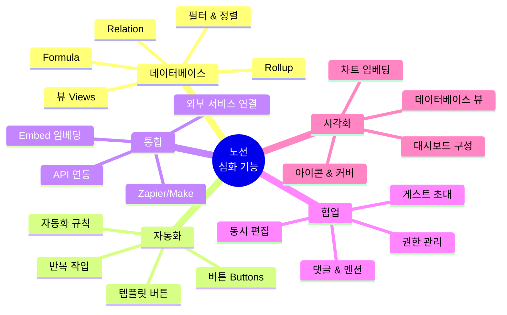
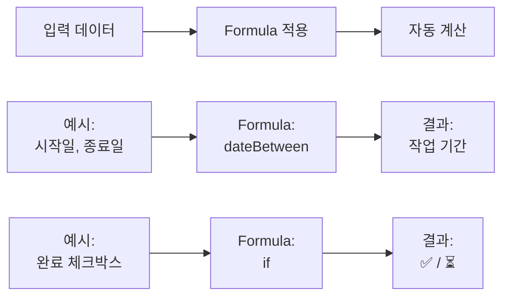
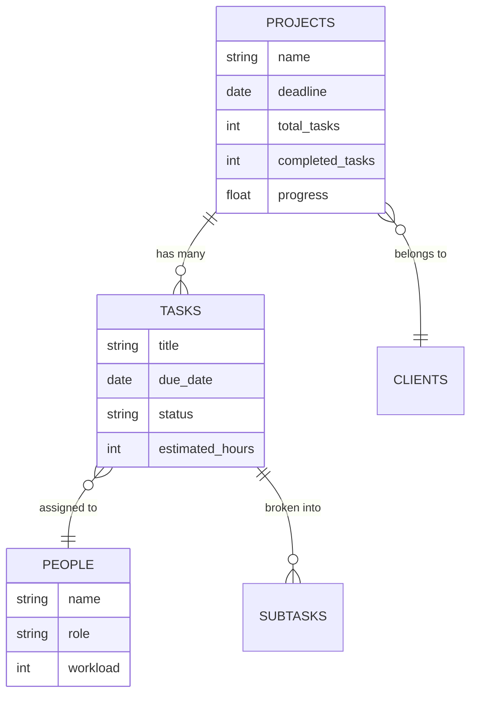
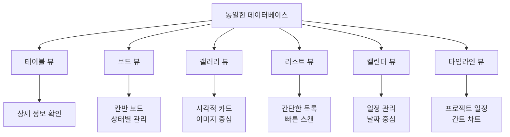
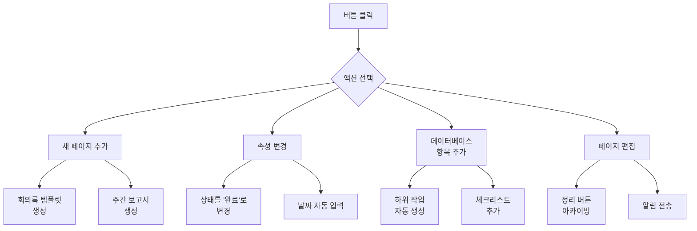
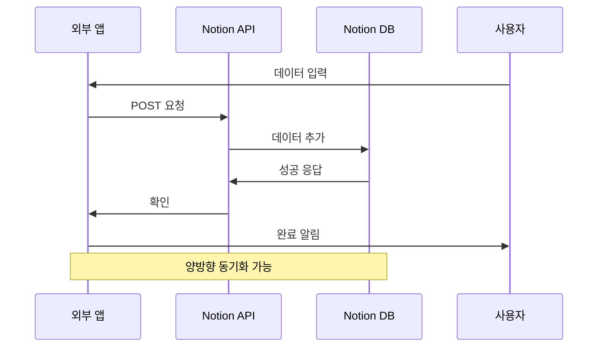
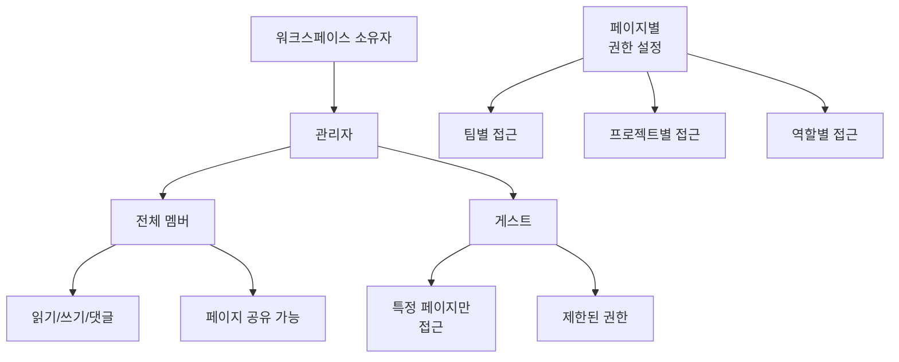
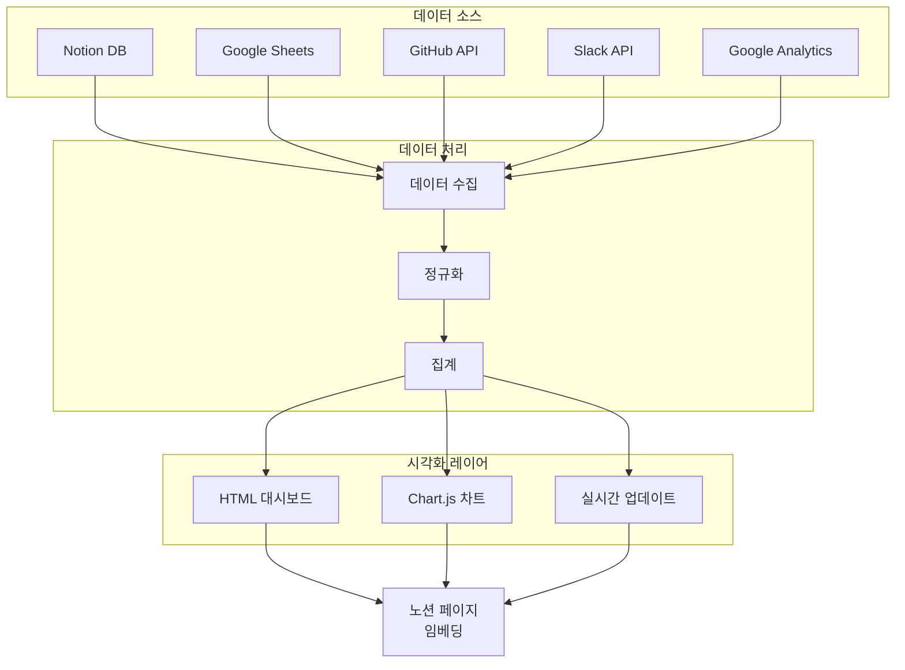
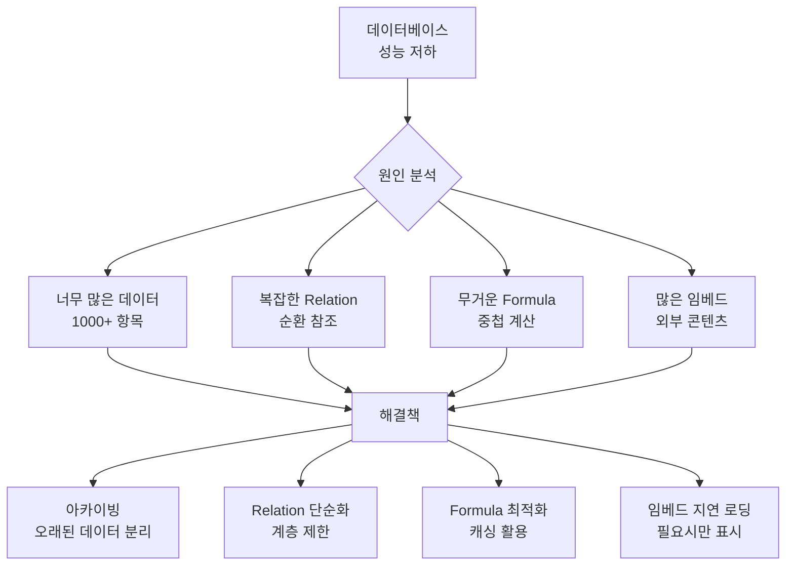
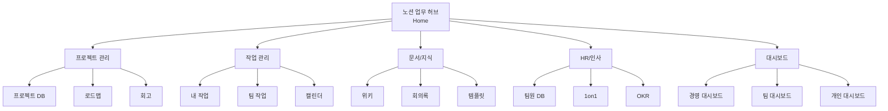

# 3. 노션 심화 기능 활용

이 장에서는 노션의 고급 기능과 생성형 AI를 결합하여 강력한 업무 시스템을 구축하는 방법을 배웁니다. Formula, Rollup, Relation, 버튼 자동화, 외부 서비스 통합 등 심화 기능을 마스터합니다.

## 3.1 노션 심화 기능 맵



## 3.2 고급 데이터베이스 기능

### 3.2.1 Formula (수식) 활용

노션의 Formula는 스프레드시트처럼 계산과 데이터 처리를 자동화합니다.



**유용한 Formula 예제:**

**1. 프로젝트 상태 자동 표시**

> **ChatGPT 프롬프트:**
>
> 노션 데이터베이스의 Formula 속성에 사용할 수식을 작성해주세요.
>
> **요구사항:**
> - 마감일(Due Date)을 기준으로 프로젝트 상태 자동 표시
> - 마감일이 지났으면: "🔴 지연"
> - 마감일이 3일 이내면: "🟡 급함"
> - 완료 체크박스가 체크되어 있으면: "✅ 완료"
> - 그 외: "🟢 정상"
>
> 출력: 노션 Formula 수식 + 설명

**예시 Formula:**
```
if(prop("완료"), "✅ 완료",
  if(dateBetween(prop("마감일"), now(), "days") < 0, "🔴 지연",
    if(dateBetween(prop("마감일"), now(), "days") <= 3, "🟡 급함",
      "🟢 정상")))
```

**2. 작업 우선순위 점수 계산**

> **ChatGPT 프롬프트:**
>
> 작업의 우선순위를 자동으로 계산하는 Formula를 만들어주세요.
>
> **입력 데이터:**
> - 중요도 (Select): 높음(3점), 보통(2점), 낮음(1점)
> - 긴급도 (Select): 긴급(3점), 보통(2점), 여유(1점)
> - 난이도 (Select): 어려움(3점), 보통(2점), 쉬움(1점)
>
> **계산 방식:**
> 우선순위 점수 = (중요도 × 2) + (긴급도 × 1.5) + (난이도 × 0.5)
>
> **출력:**
> - 점수가 10 이상: "🔴 최우선"
> - 점수가 7-9: "🟡 높음"
> - 점수가 5-6: "🟢 보통"
> - 점수가 5 미만: "⚪ 낮음"
>
> 출력: 노션 Formula 수식 + 사용 가이드

**3. 프로젝트 진행률 자동 계산**

> **ChatGPT 프롬프트:**
>
> 프로젝트의 진행률을 시각적으로 표시하는 Formula를 작성해주세요.
>
> **입력:**
> - 전체 작업 수 (Rollup)
> - 완료된 작업 수 (Rollup)
>
> **출력:**
> - 진행률 퍼센트 (%) 계산
> - 프로그레스 바 표시 (▓▓▓▓▓░░░░░ 형태)
>
> 출력: 노션 Formula 수식

### 3.2.2 Rollup과 Relation 마스터하기

관계형 데이터베이스의 핵심 기능입니다.



**Rollup 활용 예제:**

> **ChatGPT 프롬프트:**
>
> 프로젝트 관리 시스템에서 Rollup을 활용하는 방법을 설명해주세요.
>
> **데이터베이스 구조:**
> - 프로젝트 DB: 여러 개의 작업을 포함
> - 작업 DB: 각 작업은 하나의 프로젝트에 속함
>
> **Rollup으로 계산할 항목:**
> 1. 프로젝트의 총 작업 수
> 2. 완료된 작업 수
> 3. 진행 중인 작업 수
> 4. 전체 예상 시간 합계
> 5. 평균 작업 진행률
>
> **출력:**
> - 각 Rollup 설정 방법
> - mermaid 다이어그램으로 데이터 흐름 시각화
> - 실제 적용 예시

### 3.2.3 다양한 데이터베이스 뷰 활용



**뷰 활용 전략 프롬프트:**

> **ChatGPT 프롬프트:**
>
> 작업 관리 데이터베이스에 대한 최적의 뷰 전략을 설계해주세요.
>
> **사용자별 니즈:**
> 1. 팀 리더: 전체 작업 현황 파악
> 2. 개인: 내가 할 일만 보기
> 3. PM: 프로젝트별 진행 상황
> 4. 경영진: 주요 지표만 요약
>
> **각 사용자를 위한:**
> - 어떤 뷰 타입을 사용할지
> - 어떤 필터/정렬을 적용할지
> - 어떤 속성을 표시/숨김할지
>
> **추가:**
> - 각 뷰의 사용 시나리오
> - mermaid로 뷰 구조 시각화
>
> 출력: 뷰 설계 가이드 (마크다운)

## 3.3 버튼과 자동화

### 3.3.1 버튼 활용 시나리오

노션 버튼은 반복 작업을 자동화하는 강력한 도구입니다.



**고급 버튼 설정 프롬프트:**

> **ChatGPT 프롬프트:**
>
> 프로젝트 관리 시스템에서 사용할 유용한 노션 버튼들을 설계해주세요.
>
> **버튼 목록:**
> 1. "프로젝트 시작" 버튼
>    - 프로젝트 상태를 '진행 중'으로 변경
>    - 시작일을 오늘로 설정
>    - 킥오프 미팅 페이지 자동 생성
>    - 필수 작업 템플릿 5개 자동 추가
>
> 2. "스프린트 종료" 버튼
>    - 완료된 작업을 '아카이브' 보드로 이동
>    - 미완료 작업을 다음 스프린트로 이동
>    - 스프린트 회고 페이지 생성
>    - 팀원들에게 알림
>
> 3. "긴급 작업 생성" 버튼
>    - 우선순위 '긴급'으로 작업 생성
>    - 담당자 자동 할당 (로드밸런싱)
>    - 마감일 = 오늘 + 2일
>    - 관리자에게 알림
>
> 4. "월간 보고서 생성" 버튼
>    - 이번 달 보고서 페이지 생성
>    - 프로젝트별 진행 현황 데이터 자동 연결
>    - 완료/진행/지연 작업 통계 표시
>    - 지난 달 보고서 링크 추가
>
> **각 버튼에 대해:**
> - 구체적인 액션 단계
> - 설정 방법
> - 사용 시나리오
>
> 출력: 버튼 설정 가이드 (마크다운 + 스크린샷 위치 표시)

### 3.3.2 조건부 자동화

> **ChatGPT 프롬프트:**
>
> 노션에서 조건부 자동화를 구현하는 방법을 설명해주세요.
>
> **시나리오:**
> 1. 작업이 '완료'로 변경되면
>    - 완료일 자동 기록
>    - 다음 작업의 상태를 '대기'에서 '진행 중'으로 변경
>    - 담당자에게 완료 알림
>
> 2. 마감일이 3일 이내로 다가오면
>    - 상태가 '완료'가 아닌 경우
>    - 우선순위를 '긴급'으로 변경
>    - 담당자와 관리자에게 알림
>
> 3. 작업에 댓글이 달리면
>    - 담당자에게 알림
>    - '피드백 대기' 상태로 변경
>
> **출력:**
> - 노션 네이티브 기능으로 구현 가능한 것
> - 외부 자동화 도구(Zapier, Make) 필요한 것
> - 각 시나리오의 설정 방법
> - 대안 워크플로우
>
> 출력: 자동화 설정 가이드 + flowchart 다이어그램

## 3.4 외부 서비스 통합

### 3.4.1 노션 API 활용



**API 활용 시나리오 프롬프트:**

> **ChatGPT 프롬프트:**
>
> 노션 API를 활용한 실용적인 자동화 시나리오를 설계해주세요.
>
> **시나리오:**
> 1. Google Forms → Notion
>    - 고객 문의 폼 제출 시 자동으로 Notion DB에 추가
>    - 담당자 자동 배정
>    - 상태: '신규'로 설정
>
> 2. Slack → Notion
>    - 특정 채널의 중요 메시지를 Notion에 자동 저장
>    - 해시태그 기반 자동 분류
>
> 3. GitHub → Notion
>    - 새로운 이슈 생성 시 Notion 작업 DB에 추가
>    - PR 머지 시 관련 작업 '완료' 처리
>
> 4. Notion → Google Sheets
>    - 노션 데이터베이스 변경 시 Google Sheets 자동 업데이트
>    - 실시간 대시보드 데이터 소스
>
> **각 시나리오별:**
> - 구현 방법 (Zapier/Make/직접 코딩)
> - 필요한 설정
> - 샘플 코드 (Python/JavaScript)
> - 비용 및 제약사항
>
> 출력: 통합 가이드 (마크다운) + 샘플 코드

### 3.4.2 Embed 고급 활용

노션에서 외부 콘텐츠를 임베딩하여 통합 워크스페이스를 만듭니다.

**임베딩 가능한 콘텐츠:**

| 유형 | 서비스 | 활용 사례 |
|------|--------|-----------|
| **대시보드** | Google Data Studio, Tableau | 실시간 비즈니스 지표 모니터링 |
| **차트/그래프** | Chart.js, D3.js (HTML) | 커스텀 데이터 시각화 |
| **프로젝트 관리** | Trello, Asana, Jira | 외부 작업 보드 통합 |
| **문서/스프레드시트** | Google Docs/Sheets | 실시간 협업 문서 |
| **미디어** | YouTube, Vimeo, Loom | 교육 영상, 데모 |
| **디자인** | Figma, Miro, Whimsical | 디자인 목업, 화이트보드 |
| **코드** | CodePen, JSFiddle, GitHub Gist | 코드 샘플, 인터랙티브 예제 |
| **설문/폼** | Google Forms, Typeform | 피드백 수집 |

**고급 Embed 활용 프롬프트:**

> **ChatGPT 프롬프트:**
>
> 노션 페이지에 임베딩할 대시보드 HTML을 생성해주세요.
>
> **요구사항:**
> 프로젝트 관리 대시보드로, 다음 기능이 필요합니다:
>
> **1. 실시간 데이터 연동**
> - Google Sheets에서 데이터 가져오기
> - 5분마다 자동 새로고침
> - 마지막 업데이트 시간 표시
>
> **2. 인터랙티브 차트 (Chart.js)**
> - 프로젝트별 진행률 (도넛 차트)
> - 주간 완료 작업 추이 (라인 차트)
> - 팀원별 작업 분포 (막대 차트)
>
> **3. 필터 기능**
> - 프로젝트 선택 드롭다운
> - 기간 선택 (이번 주, 이번 달, 분기)
> - 팀원 선택
>
> **4. 반응형 디자인**
> - PC, 태블릿, 모바일 대응
> - 노션 다크모드 호환
>
> **5. 퍼포먼스 최적화**
> - 로딩 인디케이터
> - 데이터 캐싱
> - 에러 핸들링
>
> **디자인:**
> - 깔끔하고 모던한 스타일
> - 노션과 조화로운 색상
> - 애니메이션 효과
>
> 출력: 완전한 HTML 파일 (CSS, JS 포함) + 설치 가이드

## 3.5 고급 협업 기능

### 3.5.1 권한 관리 전략



**권한 관리 가이드 프롬프트:**

> **ChatGPT 프롬프트:**
>
> 50명 규모 스타트업의 노션 워크스페이스 권한 관리 전략을 수립해주세요.
>
> **조직 구조:**
> - 경영진 (5명)
> - 개발팀 (15명)
> - 영업/마케팅팀 (10명)
> - 디자인팀 (5명)
> - HR/운영팀 (5명)
> - 외부 협력사 (10명)
>
> **페이지 카테고리:**
> - 전사 공지/규정
> - 부서별 업무 페이지
> - 프로젝트별 페이지
> - 개인 작업 페이지
> - 기밀 정보 (재무, 인사)
>
> **요구사항:**
> 1. 각 그룹별 적절한 권한 수준
> 2. 페이지별 공개 범위 설정
> 3. 외부 협력사 접근 관리
> 4. 보안 가이드라인
> 5. 권한 변경 프로세스
>
> **출력:**
> - 권한 매트릭스 (테이블)
> - 페이지 구조 (mermaid 다이어그램)
> - 권한 관리 체크리스트
> - 보안 모범 사례
>
> 출력: 권한 관리 가이드 (마크다운)

### 3.5.2 효과적인 협업 워크플로우

> **ChatGPT 프롬프트:**
>
> 노션을 활용한 애자일 개발팀의 협업 워크플로우를 설계해주세요.
>
> **시나리오:**
> 10명 규모 개발팀이 2주 스프린트로 일합니다.
>
> **필요한 프로세스:**
> 1. 스프린트 계획
>    - 백로그에서 작업 선정
>    - 작업 분배 및 예상 시간 설정
>    - 스프린트 목표 설정
>
> 2. 일일 스탠드업
>    - 어제 한 일, 오늘 할 일, 블로커 기록
>    - 팀원들에게 공유
>
> 3. 코드 리뷰 프로세스
>    - PR 생성 시 노션에 기록
>    - 리뷰어 할당
>    - 피드백 및 승인 추적
>
> 4. 스프린트 회고
>    - KPT (Keep, Problem, Try) 작성
>    - 액션 아이템 도출
>    - 다음 스프린트에 반영
>
> **각 프로세스별:**
> - 노션 페이지/DB 구조
> - 자동화 설정
> - 팀원 역할과 책임
> - 예제 템플릿
>
> **시각화:**
> - 워크플로우 다이어그램 (mermaid)
> - 페이지 계층 구조
>
> 출력: 협업 워크플로우 가이드 (마크다운)

## 3.6 대시보드 고도화

### 3.6.1 멀티 소스 통합 대시보드

여러 데이터 소스를 하나의 대시보드로 통합합니다.



**통합 대시보드 생성 프롬프트:**

> **ChatGPT 프롬프트:**
>
> 여러 데이터 소스를 통합한 경영진 대시보드 HTML을 생성해주세요.
>
> **데이터 소스:**
> 1. Notion 작업 DB (프로젝트 진행 현황)
> 2. Google Sheets (재무 데이터)
> 3. GitHub API (개발 현황: 커밋, PR, 이슈)
> 4. Google Analytics (웹사이트 트래픽)
> 5. 외부 CRM API (영업 파이프라인)
>
> **대시보드 섹션:**
>
> **1. 전사 KPI (상단)**
> - 6개 핵심 지표 카드
>   - 월 매출 (목표 대비 %)
>   - 신규 고객 수
>   - 진행 중인 프로젝트
>   - 개발 속도 (주당 커밋)
>   - 웹사이트 방문자
>   - 직원 만족도
>
> **2. 재무 현황 (왼쪽)**
> - 월별 매출/비용 트렌드 (라인 차트)
> - 부서별 예산 집행률 (막대 차트)
> - 주요 비용 항목 (도넛 차트)
>
> **3. 프로젝트 현황 (중앙)**
> - 프로젝트별 진행률 (프로그레스 바)
> - 마일스톤 타임라인 (간트 차트)
> - 리스크 항목 (테이블)
>
> **4. 개발 현황 (오른쪽)**
> - 주간 커밋 추이
> - PR 머지율
> - 오픈 이슈 추이
>
> **5. 영업/마케팅 (하단)**
> - 영업 파이프라인 퍼널
> - 전환율 추이
> - 웹사이트 트래픽 소스
>
> **기술 요구사항:**
> - 각 데이터 소스별로 별도 함수로 fetch
> - 에러 발생 시 해당 섹션만 "데이터 로드 실패" 표시
> - 전체 새로고침 5분마다 자동 실행
> - 수동 새로고침 버튼
> - 로딩 스피너
> - 반응형 레이아웃 (Grid)
> - 인쇄용 CSS
>
> **디자인:**
> - 프로페셔널한 비즈니스 스타일
> - 다크모드 지원
> - 애니메이션 효과 (부드러운 전환)
> - 색상 코딩 (목표 달성: 녹색, 미달: 빨간색)
>
> 출력: 완전한 HTML 파일 (CSS, JS 포함) + API 연동 가이드

### 3.6.2 실시간 협업 대시보드

> **ChatGPT 프롬프트:**
>
> 팀이 실시간으로 함께 모니터링할 수 있는 협업 대시보드 HTML을 만들어주세요.
>
> **용도:**
> 스프린트 진행 중 TV 모니터에 띄워두고 팀원들이 실시간으로 확인
>
> **표시 항목:**
> 1. 현재 스프린트 정보
>    - 스프린트 이름
>    - 남은 일수 (카운트다운)
>    - 전체 진행률
>
> 2. 팀 작업 현황
>    - 각 팀원별 오늘 작업 (카드)
>    - 실시간 상태 (진행 중, 리뷰 대기, 완료)
>    - 블로커 표시
>
> 3. 번다운 차트
>    - 이상적인 번다운 라인
>    - 실제 번다운 라인
>    - 예상 완료일
>
> 4. 최근 활동 피드
>    - 작업 완료 알림
>    - 코드 리뷰 요청
>    - 긴급 이슈 등록
>
> 5. 팀 기분 체크
>    - 오늘의 팀 분위기 (이모지)
>    - 에너지 레벨 (0-100%)
>
> **특수 기능:**
> - 30초마다 자동 새로고침
> - 새로운 활동 시 깜빡임 효과
> - 음성 알림 (선택 가능)
> - 풀스크린 모드
> - QR 코드 (모바일 접속용)
>
> **디자인:**
> - 대형 화면 최적화 (1920x1080)
> - 가독성 높은 큰 폰트
> - 명확한 색상 구분
> - 미니멀 디자인
>
> 출력: 완전한 HTML 파일 (CSS, JS 포함)

## 3.7 노션 성능 최적화

### 3.7.1 대용량 데이터베이스 관리



**최적화 가이드 프롬프트:**

> **ChatGPT 프롬프트:**
>
> 노션 워크스페이스 성능 최적화 가이드를 작성해주세요.
>
> **현재 상황:**
> - 프로젝트 DB: 2000개 항목
> - 작업 DB: 5000개 항목
> - 페이지 로딩이 느려짐
> - Formula 계산이 지연됨
>
> **최적화 전략:**
> 1. 데이터 아카이빙
>    - 언제 아카이브할지
>    - 어떻게 분리할지
>    - 검색 가능성 유지 방법
>
> 2. 데이터베이스 구조 개선
>    - Relation 단순화
>    - Rollup 최적화
>    - Formula 리팩토링
>
> 3. 뷰 최적화
>    - 필터 성능 개선
>    - 표시 속성 최소화
>    - 페이지네이션
>
> 4. 콘텐츠 최적화
>    - 이미지 크기 최적화
>    - 임베드 최소화
>    - 불필요한 블록 제거
>
> **각 전략별:**
> - 구체적인 실행 방법
> - 예상 효과
> - 주의사항
> - 체크리스트
>
> 출력: 최적화 가이드 (마크다운)

### 3.7.2 백업 및 복구 전략

> **ChatGPT 프롬프트:**
>
> 노션 워크스페이스의 백업 및 재해 복구 계획을 수립해주세요.
>
> **백업 전략:**
> 1. 자동 백업
>    - 노션 공식 export 기능 활용
>    - API를 통한 정기 백업
>    - 버전별 보관 정책
>
> 2. 백업 범위
>    - 전체 워크스페이스
>    - 중요 페이지만
>    - 데이터베이스 데이터
>
> 3. 백업 빈도
>    - 일간 백업 대상
>    - 주간 백업 대상
>    - 월간 백업 대상
>
> **복구 시나리오:**
> 1. 페이지 삭제 복구
> 2. 데이터베이스 손상 복구
> 3. 전체 워크스페이스 복구
> 4. 특정 시점으로 롤백
>
> **도구 및 자동화:**
> - Python 스크립트로 자동 백업
> - GitHub에 버전 관리
> - 클라우드 스토리지 연동
>
> **출력:**
> - 백업 프로세스 플로우 (mermaid)
> - 백업 스크립트 (Python)
> - 복구 절차 문서
> - 체크리스트
>
> 출력: 백업/복구 가이드 (마크다운) + 스크립트

## 3.8 실전 프로젝트: 올인원 업무 허브 구축

지금까지 배운 모든 기능을 종합하여 완벽한 노션 업무 허브를 만들어봅니다.

### 3.8.1 프로젝트 구조



**올인원 허브 구축 가이드:**

> **ChatGPT 프롬프트:**
>
> 30인 규모 스타트업을 위한 노션 올인원 업무 허브를 설계해주세요.
>
> **목표:**
> - 모든 업무가 노션에서 이루어지도록
> - 외부 도구 최소화
> - 신입사원도 쉽게 사용 가능
>
> **주요 구성 요소:**
> 1. 홈페이지
>    - 개인화된 대시보드
>    - 빠른 액세스 링크
>    - 오늘의 할 일
>    - 최근 업데이트
>
> 2. 프로젝트 관리 시스템
>    - 프로젝트 DB
>    - 작업 DB (Relation)
>    - 로드맵 뷰
>    - 스프린트 보드
>
> 3. 지식 관리 시스템
>    - 회사 위키
>    - 제품 문서
>    - 온보딩 가이드
>    - 템플릿 라이브러리
>
> 4. HR 시스템
>    - 팀원 디렉토리
>    - OKR 관리
>    - 1on1 기록
>    - 휴가 관리
>
> 5. 통합 대시보드
>    - 실시간 KPI
>    - 팀 현황
>    - 프로젝트 진행률
>
> **각 구성 요소별:**
> - 상세 구조 (페이지 계층)
> - 필요한 DB와 속성
> - 자동화 설정
> - 권한 관리
> - 사용 가이드
>
> **추가:**
> - 전체 정보 구조 (mermaid)
> - 데이터베이스 관계도 (ERD)
> - 사용자 여정 맵
> - 구축 로드맵 (단계별)
>
> 출력: 완벽한 구축 가이드 (마크다운, 50+ 페이지)

## 3.9 실전 연습: 심화 기능 마스터하기

### 심화 기능 마스터 체크리스트

- [ ] **1단계: Formula 마스터**
  - 10개 이상의 유용한 Formula 작성
  - 조건부 로직 (if, and, or) 활용
  - 날짜 계산 함수 활용
  - 텍스트 처리 함수 활용

- [ ] **2단계: Relation & Rollup**
  - 3개 이상의 DB를 Relation으로 연결
  - Rollup으로 집계 데이터 계산
  - 순환 참조 없이 설계

- [ ] **3단계: 버튼 자동화**
  - 5개 이상의 유용한 버튼 생성
  - 복잡한 액션 체인 구성
  - 템플릿과 버튼 조합

- [ ] **4단계: 외부 통합**
  - 최소 2개 외부 서비스 연동
  - API 활용 (직접 또는 Zapier)
  - 양방향 동기화 구현

- [ ] **5단계: 대시보드 구축**
  - HTML 대시보드 3개 이상 제작
  - Google Sheets 연동
  - 실시간 데이터 시각화

- [ ] **6단계: 성능 최적화**
  - 느린 페이지 개선
  - 불필요한 데이터 아카이빙
  - Formula 최적화

- [ ] **7단계: 백업 자동화**
  - 정기 백업 스크립트 작성
  - 클라우드 저장소 연동
  - 복구 테스트 완료

## 3.10 정리

이번 장에서는 노션의 심화 기능을 마스터했습니다.

<highlight>
노션 심화 기능 활용 핵심 포인트<br/>
- Formula, Rollup, Relation으로 강력한 관계형 데이터베이스 구축<br/>
- 버튼과 자동화로 반복 작업 획기적 감소<br/>
- 노션 API, Zapier/Make로 외부 서비스 통합하여 업무 허브화<br/>
- HTML 대시보드 임베딩으로 전문적인 BI 시스템 구현<br/>
- 성능 최적화(아카이빙, 뷰 최적화)와 백업으로 안정적 운영
</highlight>

**이 책의 여정을 마무리하며:**

축하합니다! 이제 여러분은 생성형 AI와 노션을 활용하여 업무를 혁신할 수 있는 모든 능력을 갖추었습니다.

- 공공 데이터와 회사 데이터를 분석하고
- 보고서와 대시보드를 자동으로 생성하며
- 노션으로 모든 업무를 통합 관리하고
- 랜딩 페이지와 대시보드를 만들어 공유할 수 있습니다

이제 여러분의 차례입니다. 배운 내용을 실제 업무에 적용하고, 지속적으로 개선해나가세요.

AX(Automation Experience)와 DX(Digital Transformation)의 여정에서 성공하시기를 바랍니다!
