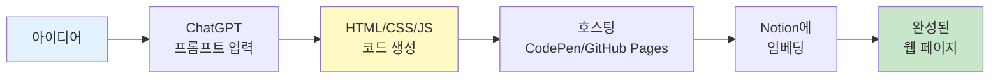
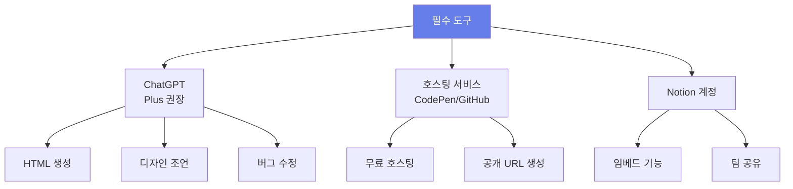
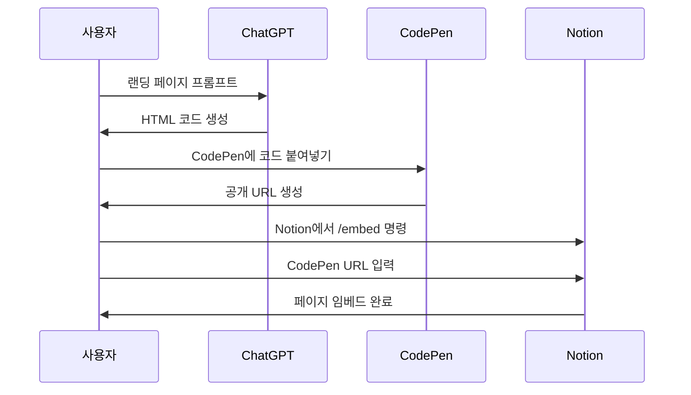
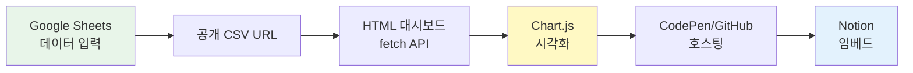
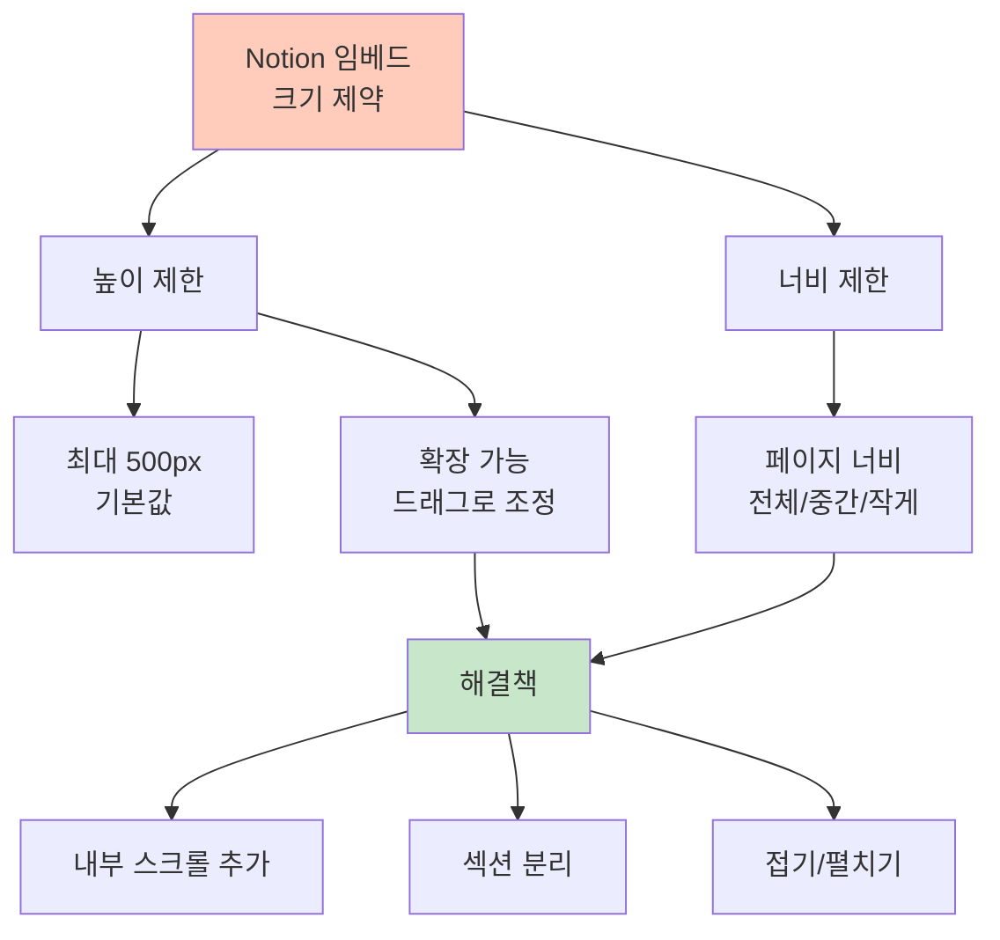
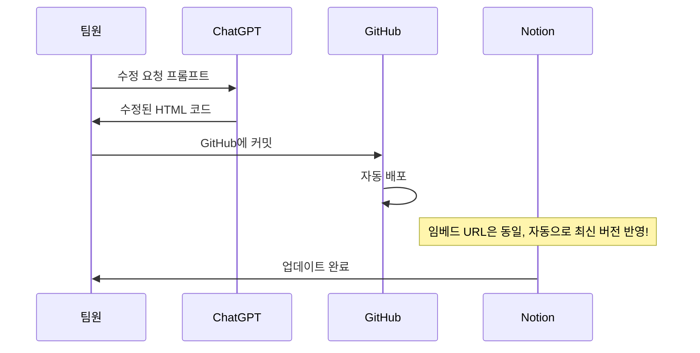

# 1. ChatGPT와 노션을 활용한 웹 페이지 제작

이번 챕터에서는 ChatGPT로 HTML 웹 페이지를 생성하고, 이를 노션에 임베딩하여 회사 랜딩 페이지나 대시보드를 만드는 방법을 배웁니다.

**코딩 없이** 전문적인 웹 페이지를 만들 수 있으며, 노션을 통해 팀원들과 쉽게 공유할 수 있습니다.



## 1.1 왜 HTML 페이지를 노션에 임베드할까?

**장점**:
- ✅ **인터랙티브**: 클릭, 호버, 애니메이션 등 동적 요소
- ✅ **전문성**: 브랜드 컬러, 로고, 맞춤 디자인
- ✅ **재사용성**: 한 번 만들면 여러 페이지에 활용
- ✅ **자동 업데이트**: Google Sheets 연동 시 실시간 데이터 반영
- ✅ **저비용**: 무료 호스팅 + 노션 = 완전 무료 가능

**활용 사례**:
- 회사 소개 랜딩 페이지
- 실시간 대시보드
- 인터랙티브 조직도
- 제품 카탈로그
- 이벤트/프로모션 페이지

## 1.2 필요한 도구



# 2. 회사 랜딩 페이지 만들기

## 2.1 프롬프트로 랜딩 페이지 생성하기

### 2.1.1 기본 랜딩 페이지 프롬프트

```
[역할]
너는 프론트엔드 개발자이자 디자이너야.

[맥락]
- 회사명: [회사명]
- 업종: [SaaS/제조/서비스 등]
- 타겟: [B2B/B2C]
- 브랜드 컬러: [#색상코드]

[작업]
회사 랜딩 페이지를 하나의 HTML 파일로 만들어줘.

[포함 섹션]
1. 히어로 섹션
   - 회사 로고
   - 캐치프레이즈
   - CTA 버튼 ("무료 체험" / "문의하기")
   - 배경: 그라데이션 또는 이미지

2. 제품/서비스 소개 (3가지)
   - 아이콘
   - 제목
   - 간단한 설명

3. 주요 기능 (4-6개)
   - 카드 형태
   - 호버 효과

4. 고객 후기 (3개)
   - 별점
   - 후기 내용
   - 고객 이름/회사

5. 가격 플랜 (3단계)
   - Basic / Professional / Enterprise
   - 가격
   - 포함 기능 목록
   - "선택하기" 버튼

6. FAQ (5개)
   - 아코디언 형태

7. 푸터
   - 회사 정보
   - 소셜 미디어 링크
   - 저작권

[기술 요구사항]
- 단일 HTML 파일 (외부 파일 의존성 없음)
- 반응형 디자인 (모바일/태블릿/데스크톱)
- 부드러운 스크롤 애니메이션
- 섹션 간 스크롤 시 Fade-in 효과
- 모던하고 미니멀한 디자인
- CDN만 사용 (외부 라이브러리 최소화)

[색상]
- 메인 컬러: [#색상]
- 포인트 컬러: [#색상]
- 배경: 화이트 & 라이트 그레이
```

### 2.1.2 실전 예시 프롬프트

```
[역할]
너는 프론트엔드 개발자이자 디자이너야.

[맥락]
- 회사명: 클라우드플로우
- 업종: B2B SaaS (업무 자동화 플랫폼)
- 타겟: 중소기업 (10-100명)
- 브랜드 컬러: #667EEA (보라), #764BA2 (진한 보라)

[작업]
회사 랜딩 페이지를 만들어줘. 아래 내용을 포함해:

히어로:
- 캐치프레이즈: "업무 자동화, 이제는 쉽습니다"
- 서브 카피: "코드 없이 5분 만에 워크플로우 구축"
- CTA: "무료로 시작하기"

주요 기능 (3가지):
1. 노코드 워크플로우 빌더
2. 100+ 앱 연동
3. 실시간 협업

가격:
- Starter: 무료
- Pro: $29/월
- Enterprise: 문의

기술 요구사항:
- 그라데이션 배경 (보라 계열)
- 매끄러운 스크롤 애니메이션
- 호버 시 카드 확대 효과
- 모바일 반응형

완성된 HTML 파일 하나로 제공해줘.
```

### 2.1.3 ChatGPT가 생성한 결과 (일부)

ChatGPT는 다음과 같은 구조의 HTML을 생성합니다:

```html
<!DOCTYPE html>
<html lang="ko">
<head>
    <meta charset="UTF-8">
    <meta name="viewport" content="width=device-width, initial-scale=1.0">
    <title>클라우드플로우 - 업무 자동화 플랫폼</title>
    <style>
        /* 글로벌 스타일 */
        * {
            margin: 0;
            padding: 0;
            box-sizing: border-box;
        }

        body {
            font-family: 'Segoe UI', Tahoma, Geneva, Verdana, sans-serif;
            line-height: 1.6;
            color: #333;
        }

        /* 히어로 섹션 */
        .hero {
            background: linear-gradient(135deg, #667eea 0%, #764ba2 100%);
            color: white;
            text-align: center;
            padding: 100px 20px;
            min-height: 100vh;
            display: flex;
            flex-direction: column;
            justify-content: center;
        }

        .hero h1 {
            font-size: 48px;
            margin-bottom: 20px;
            animation: fadeInUp 1s;
        }

        /* ... 더 많은 스타일 ... */
    </style>
</head>
<body>
    <!-- 히어로 섹션 -->
    <section class="hero">
        <h1>업무 자동화, 이제는 쉽습니다</h1>
        <p>코드 없이 5분 만에 워크플로우 구축</p>
        <button class="cta-button">무료로 시작하기</button>
    </section>

    <!-- 기능 섹션 -->
    <!-- 가격 섹션 -->
    <!-- ... -->
</body>
</html>
```

## 2.2 호스팅 및 노션 임베딩

### 2.2.1 CodePen 활용 (가장 쉬운 방법)



**단계별 가이드**:

1. **CodePen 접속**
   - https://codepen.io 방문
   - 계정 생성 (무료)

2. **새 Pen 생성**
   - "Create" > "Pen" 클릭
   - HTML 영역에 ChatGPT가 생성한 코드 붙여넣기

3. **저장 및 공개**
   - "Save" 클릭
   - 제목 설정
   - 공개 설정 (Public)

4. **Embed 링크 복사**
   - 우측 상단 "···" 메뉴
   - "Embed" 선택
   - "HTML (Recommended)" 탭의 iframe 코드 또는 URL 복사

5. **Notion에 임베드**
   - Notion 페이지에서 `/embed` 입력
   - CodePen URL 붙여넣기
   - 크기 조정

### 2.2.2 GitHub Pages 활용 (추천)

더 전문적이고 안정적인 방법입니다.

**준비물**: GitHub 계정

**단계**:

1. **GitHub 레포지토리 생성**
   ```
   - 레포지토리 이름: company-landing-page
   - Public으로 설정
   - README 추가
   ```

2. **HTML 파일 업로드**
   ```
   - "Add file" > "Upload files"
   - 파일명: index.html (필수!)
   - ChatGPT가 생성한 HTML 파일 업로드
   - Commit
   ```

3. **GitHub Pages 활성화**
   ```
   - Settings 탭
   - 좌측 "Pages" 메뉴
   - Source: "Deploy from a branch"
   - Branch: main, /root
   - Save
   ```

4. **URL 확인**
   ```
   - 몇 분 후 생성됨
   - 형식: https://사용자명.github.io/레포지토리명/
   - 예: https://johndoe.github.io/company-landing-page/
   ```

5. **Notion 임베드**
   ```
   - Notion에서 /embed
   - GitHub Pages URL 입력
   ```

### 2.2.3 임베드 최적화 팁

```
[ChatGPT 프롬프트]

위의 HTML 파일을 Notion 임베드에 최적화해줘.

요구사항:
1. viewport 크기: 최소 800px 너비로 디자인
2. 고정 높이: 2000px-3000px 범위 (스크롤 가능)
3. 배경: 투명 또는 화이트
4. 폰트: 시스템 폰트 우선 (로딩 빠르게)
5. 이미지: 최적화 또는 placeholder
6. 외부 리소스: CDN만 사용 (최소화)

Notion 임베드 iframe 특성상 높이 제한이 있으니,
콘텐츠를 한 화면에 잘 배치해줘.
```

# 3. 실시간 대시보드 만들기

## 3.1 Google Sheets 연동 대시보드



### 3.1.1 Google Sheets 데이터 준비

1. **Google Sheets 생성**
   ```
   예시 데이터 (매출 대시보드):

   월 | 매출 | 목표 | 달성률
   1월 | 1500 | 2000 | 75%
   2월 | 1800 | 2000 | 90%
   3월 | 2200 | 2000 | 110%
   ...
   ```

2. **공개 설정**
   ```
   - 파일 > 공유 > "링크가 있는 모든 사용자"
   - 권한: "뷰어"
   - URL 복사
   ```

3. **CSV로 내보내기 URL 생성**
   ```
   기존 URL:
   https://docs.google.com/spreadsheets/d/SHEET_ID/edit#gid=0

   CSV URL로 변환:
   https://docs.google.com/spreadsheets/d/SHEET_ID/export?format=csv&gid=0
   ```

### 3.1.2 대시보드 생성 프롬프트

```
[역할]
너는 데이터 시각화 전문가이자 프론트엔드 개발자야.

[맥락]
- 대시보드 목적: 실시간 매출 현황 모니터링
- 사용자: 경영진 및 영업팀
- 데이터 소스: Google Sheets (CSV)
- 업데이트 주기: 페이지 로드 시마다

[작업]
Google Sheets 데이터를 불러와서 실시간 대시보드를 만들어줘.

[데이터 구조]
Google Sheets CSV URL: [URL]
컬럼: 월, 매출, 목표, 달성률

[포함 요소]
1. 헤더
   - 제목: "2024년 매출 대시보드"
   - 마지막 업데이트 시간
   - "새로고침" 버튼

2. KPI 카드 (4개, 상단)
   - 연간 총 매출
   - 평균 달성률
   - 최고 매출 월
   - 목표 대비 실적

3. 차트 (3개)
   - 월별 매출 vs 목표 (라인 차트)
   - 달성률 (막대 차트)
   - 누적 매출 (영역 차트)

4. 데이터 테이블
   - 정렬 기능
   - 검색 기능

[기술 요구사항]
- fetch API로 Google Sheets CSV 불러오기
- Papa Parse 라이브러리로 CSV 파싱
- Chart.js로 차트 생성
- 반응형 디자인
- 로딩 스피너 표시
- 에러 처리 (데이터 로드 실패 시)
- 자동 새로고침 (30초마다, 옵션)

[색상]
- 주 색상: #4A90E2 (파랑)
- 보조 색상: #7ED321 (초록)
- 경고 색상: #F5A623 (주황)

완성된 HTML 파일로 제공해줘.
```

### 3.1.3 생성된 대시보드 예시 (핵심 부분)

```javascript
// Google Sheets 데이터 fetch
async function loadData() {
    const SHEET_URL = 'https://docs.google.com/spreadsheets/d/YOUR_SHEET_ID/export?format=csv&gid=0';

    try {
        showLoader();
        const response = await fetch(SHEET_URL);
        const csvText = await response.text();

        // Papa Parse로 CSV 파싱
        const data = Papa.parse(csvText, {
            header: true,
            dynamicTyping: true
        }).data;

        // 대시보드 업데이트
        updateKPIs(data);
        updateCharts(data);
        updateTable(data);

        hideLoader();
        updateTimestamp();
    } catch (error) {
        showError('데이터를 불러오는데 실패했습니다.');
    }
}

// 페이지 로드 시 실행
document.addEventListener('DOMContentLoaded', loadData);

// 30초마다 자동 새로고침
setInterval(loadData, 30000);
```

## 3.2 인터랙티브 조직도

### 3.2.1 조직도 생성 프롬프트

```
[역할]
너는 조직 시각화 전문가야.

[작업]
회사 조직도를 인터랙티브 HTML로 만들어줘.

[조직 구조]
CEO
├── CTO
│   ├── 개발팀 (5명)
│   └── 인프라팀 (3명)
├── CMO
│   ├── 마케팅팀 (4명)
│   └── 디자인팀 (3명)
└── CFO
    ├── 재무팀 (2명)
    └── 인사팀 (2명)

[기능 요구사항]
1. 계층형 트리 구조
2. 각 노드 클릭 시 상세 정보 표시 (모달)
   - 이름
   - 직책
   - 이메일
   - 사진 (placeholder)
   - 담당 업무
3. 줌 인/아웃 기능
4. 검색 기능 (이름으로 하이라이트)
5. 부서별 색상 구분
6. 모바일 반응형

[디자인]
- 깔끔하고 모던한 스타일
- 애니메이션 효과
- 노드 간 연결선

[라이브러리]
- D3.js 또는 OrgChart.js 사용

완성된 HTML 파일로 제공해줘.
```

# 4. 프로모션/이벤트 페이지

## 4.1 이벤트 랜딩 페이지 프롬프트

```
[역할]
너는 이벤트 페이지 디자이너야.

[맥락]
- 이벤트명: "신제품 출시 기념 프로모션"
- 기간: 2024년 12월 1일 ~ 12월 31일
- 혜택: 첫 달 50% 할인
- 타겟: 신규 가입자

[작업]
이벤트 랜딩 페이지를 만들어줘.

[포함 요소]
1. 헤더
   - 이벤트 제목 (큰 글씨)
   - 카운트다운 타이머 (마감까지)
   - 긴급성 강조

2. 혜택 설명
   - 할인율
   - 추가 혜택 (무료 기능 등)
   - 비교표 (일반 vs 프로모션 가격)

3. 신청 폼
   - 이름
   - 이메일
   - 회사명
   - "신청하기" 버튼

4. FAQ
   - 자주 묻는 질문 5개

5. 푸터
   - 이용약관 링크
   - 문의처

[디자인]
- 화려하고 눈에 띄는 디자인
- 주황/빨강 계열 (긴급성)
- 애니메이션: 펄스 효과, Fade-in
- CTA 버튼 강조 (크고 밝은 색)

[기능]
- 폼 제출 시 Google Forms로 연동
- 카운트다운 타이머 (실시간 업데이트)
- 스크롤 시 Sticky CTA 버튼

완성된 HTML 파일로 제공해줘.
```

# 5. 노션 임베드 고급 팁

## 5.1 임베드 크기 최적화



**최적화 프롬프트**:

```
[ChatGPT에게]

위의 HTML 파일을 다음과 같이 수정해줘:

1. 전체 높이: 800px로 제한
2. 내부 콘텐츠: 스크롤 가능하게
3. 섹션별 앵커 링크 추가 (상단 네비게이션)
4. "맨 위로" 버튼 (우측 하단 고정)

이렇게 하면 Notion 임베드에서 보기 편해져.
```

## 5.2 다중 페이지 관리

하나의 Notion 페이지에 여러 HTML을 임베드할 때:

```
Notion 페이지 구조:

# 회사 소개
[랜딩 페이지 임베드]

---

# 실시간 대시보드
[대시보드 임베드]

---

# 조직도
[조직도 임베드]

---

# 이벤트
[프로모션 페이지 임베드]
```

## 5.3 업데이트 워크플로우



**장점**: 노션 임베드를 수정할 필요 없이, GitHub만 업데이트하면 자동 반영

# 6. 실전 프로젝트: 올인원 회사 홈 구축

## 6.1 프로젝트 구조

```
Notion 워크스페이스: "ABC 회사"
└── 📄 회사 홈
    ├── 🏠 랜딩 페이지 (임베드)
    ├── 📊 실시간 대시보드 (임베드)
    ├── 👥 조직도 (임베드)
    ├── 📝 사내 위키 (Notion 네이티브)
    ├── 📅 회의록 (Notion 데이터베이스)
    └── 🎉 이벤트 (임베드)
```

## 6.2 종합 프롬프트

```
[ChatGPT 프롬프트]

우리 회사의 올인원 홈을 만들고 싶어.
Notion에 임베드할 3개의 HTML 페이지를 만들어줘.

**회사 정보:**
- 회사명: 테크스타
- 업종: AI 기반 마케팅 자동화 SaaS
- 직원: 25명
- 주 색상: #6366F1 (인디고)

**페이지 1: 회사 소개 랜딩 페이지**
- 히어로 섹션: "AI로 마케팅을 자동화하세요"
- 주요 기능 3가지
- 고객 후기
- CTA: "무료 데모 신청"

**페이지 2: 실시간 팀 대시보드**
- Google Sheets 연동 (매출, 프로젝트 진행률, 고객 수)
- KPI 카드 4개
- 월별 트렌드 차트
- 프로젝트 현황 테이블

**페이지 3: 인터랙티브 조직도**
- 3계층 구조 (CEO - 팀장 - 팀원)
- 클릭 시 세부 정보
- 부서별 색상 구분

**공통 요구사항:**
- 반응형 디자인
- 일관된 색상 팔레트
- 부드러운 애니메이션
- 로딩 스피너
- 각각 독립적인 HTML 파일

3개 파일 모두 생성해줘.
```

# 7. 트러블슈팅

## 7.1 자주 발생하는 문제

| 문제 | 원인 | 해결 방법 |
|------|------|----------|
| **임베드가 안 보임** | URL 접근 불가 | HTTPS 확인, 공개 설정 확인 |
| **높이가 잘림** | 고정 높이 초과 | 내부 스크롤 추가 또는 섹션 분리 |
| **로딩이 느림** | 외부 리소스 많음 | 이미지 최적화, CDN 사용 |
| **모바일에서 깨짐** | 반응형 미적용 | 미디어 쿼리 추가 |
| **Google Sheets 로드 실패** | CORS 오류 | 공개 설정 확인, CSV 형식 사용 |

## 7.2 디버깅 프롬프트

```
[ChatGPT에게]

위의 HTML 파일에 다음 문제가 있어:
[문제 설명]

디버깅해서 수정해줘. 그리고 문제의 원인도 설명해줘.
```

# 8. 정리

ChatGPT와 노션을 결합하면 **코딩 없이도 전문적인 웹 페이지**를 만들 수 있습니다.

**핵심 워크플로우**:
1. ChatGPT에 프롬프트 입력 → HTML 생성
2. CodePen 또는 GitHub Pages로 호스팅
3. Notion에 `/embed` 로 임베딩
4. 팀과 공유 및 협업

**활용 분야**:
- ✅ 회사 랜딩 페이지
- ✅ 실시간 대시보드
- ✅ 인터랙티브 조직도
- ✅ 이벤트/프로모션 페이지
- ✅ 제품 카탈로그
- ✅ 교육/온보딩 자료

**다음 단계**:
- Notion API로 더 고급 통합
- Zapier/Make로 자동화 연결
- 실제 프로젝트에 적용

:::div{.callout}
**최종 과제**: 이번 챕터에서 배운 내용을 바탕으로, 여러분 회사(또는 가상 회사)의 랜딩 페이지를 ChatGPT와 Notion으로 만들어보세요. 완성된 페이지를 팀원들과 공유하고 피드백을 받아보세요!
:::