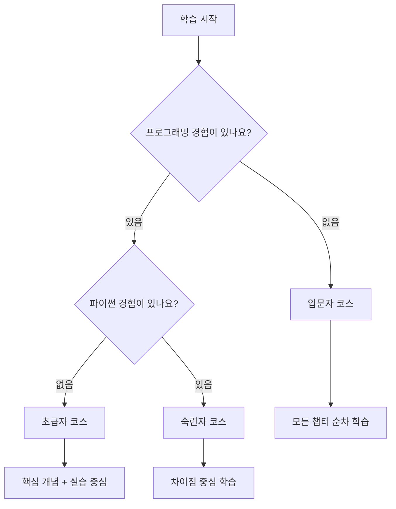

:::div{.box}
이 책은 챕터의 주제에 대해 깊고 다양하게 다루는 책이며, 요약하는 책은 아닙니다. 요약서라면 건너뛸 수 있는 부분도 실무에서 만날 수 있는 내용이라면 다양한 예제를 통해 다채롭게 조명합니다. 업무하며 만나는 코드를 중점적으로 다루려 노력했으며, 우선순위에 따라 자주 다루지 않는 내용은 부록으로 포함했습니다. 또한, 어떤 코드가 효율적이며 대부분의 회사에서 어떤 규칙을 가지고 코드를 작성하는지도 함께 다룹니다.

**이 책의 목표는 한 학기 동안 파이썬 과목을 수강한 컴퓨터공학 학부생만큼의 실력을 배양하는 데** 있습니다.

이 책은 '**파이썬을 제대로 배워보고자 하는 분**과 **다른 언어에 숙련된 프로그래머**'를 대상으로 하고 있습니다. 가볍게 경험해보고 싶은 분에게는 더 얇은 책이 필요할 수 있습니다.
:::

# 1. 독자 수준별 학습 가이드

이 책은 다양한 수준의 독자를 고려하여 작성되었습니다. 자신의 수준에 맞는 학습 방법을 선택하세요.



## 1.1 입문자와 초급자

이 책에 있는 모든 예제를 이해하는 것은 쉽지 않고 그럴 필요도 없습니다. 강조하는 부분과 필수 개념에 대해서 학습하시고, 빠르게 훑어 실전으로 나아가시는 것을 권합니다. 그리고 실전에서 만나는 문제에 있어 필요한 개념이 있다면 다시 돌아와 읽어보시는 것을 권합니다.

**입문자를 위한 학습 팁:**

1. 코드를 직접 타이핑하며 학습하세요. 복사-붙여넣기보다 직접 입력하는 것이 학습 효과가 높습니다.
2. 에러가 발생해도 당황하지 마세요. 에러 메시지는 문제 해결의 중요한 단서입니다.
3. 한 번에 모든 것을 이해하려 하지 마세요. 반복 학습이 핵심입니다.

## 1.2 다른 언어에 숙련된 프로그래머

필수 개념들은 입력과 출력 결과를 실행해보고, 기타 예제는 출력 결과를 보며 기존에 알고 있던 내용과 다른 부분을 찾아보시는 것을 권합니다.

<highlight>
파이썬은 다른 언어와 비슷해 보이지만 미묘한 차이가 있습니다. 특히 부동소수점 연산, 정수 나눗셈, 논리 연산의 단축 평가 등에서 차이가 발생합니다.
</highlight>

아래와 같이 쉬운 예제에서도 제대로 된 정답을 이야기하지 못하는 경우도 많습니다. 따라서 쉬운 챕터라도 건너뛰지 말고 출력 결과를 확인하여 내가 알고 있는 개념이 파이썬에서도 동일한지 확인해보세요. 왼쪽 상단에 있는 실행 버튼을 눌러 실행해보세요.

```python-exec
print(0.1 + 0.2)      # 부동소수점 연산의 특성
print(-5 // 2)        # 음수의 정수 나눗셈
print(10 % 3.3)       # 나머지 연산
print('helloworld.jpeg'[-4:])  # 문자열 슬라이싱
print(10 or 1/0)      # 단축 평가 (short-circuit evaluation)
```

위 코드의 실행 결과를 예측해보세요. 각 줄의 출력이 예상과 다르다면 해당 개념을 다시 학습할 필요가 있습니다.

| 코드 | 예상 출력 | 실제 출력 | 설명 |
|------|----------|----------|------|
| `0.1 + 0.2` | 0.3 | 0.30000000000000004 | IEEE 754 부동소수점 표현 |
| `-5 // 2` | -2 | -3 | 내림 나눗셈(floor division) |
| `10 % 3.3` | 0.1 | 0.09999999999999964 | 부동소수점 나머지 연산 |
| `'helloworld.jpeg'[-4:]` | jpeg | jpeg | 음수 인덱스 슬라이싱 |
| `10 or 1/0` | True | 10 | 단축 평가로 우항 미실행 |

몇몇 챕터는 숙련된 프로그래머에게도 힘들 것입니다. 이러한 챕터에서 길을 잃지 않고 나에게 필요한 지식이 무엇인지 체크해놓고 반복적으로 학습하세요.

## 1.3 학습 체크리스트

자신의 학습 상태를 점검하기 위해 아래 체크리스트를 활용하세요.

**기초 단계 체크리스트:**
- [ ] 변수 선언과 데이터 타입을 이해한다
- [ ] 조건문과 반복문을 작성할 수 있다
- [ ] 함수를 정의하고 호출할 수 있다
- [ ] 리스트, 딕셔너리 등 자료구조를 활용할 수 있다

**중급 단계 체크리스트:**
- [ ] 클래스와 객체지향 프로그래밍을 이해한다
- [ ] 예외 처리를 적절히 활용할 수 있다
- [ ] 파일 입출력을 수행할 수 있다
- [ ] 모듈과 패키지를 만들고 사용할 수 있다

**고급 단계 체크리스트:**
- [ ] 데코레이터와 제너레이터를 활용할 수 있다
- [ ] 멀티스레딩과 비동기 프로그래밍을 이해한다
- [ ] 메타클래스와 디스크립터를 활용할 수 있다
- [ ] 성능 최적화 기법을 적용할 수 있다
