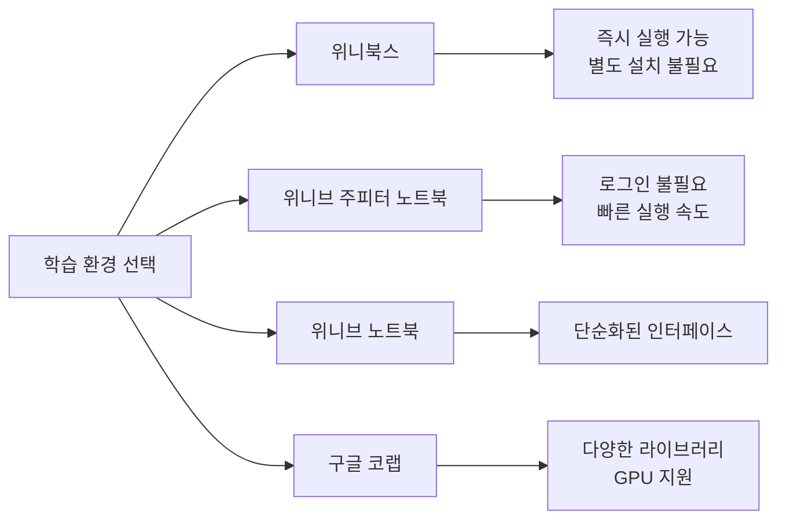

# 1. 환경 구축 없는 실행 환경

초급자에게 가장 큰 허들은 환경 설정입니다. 가장 빠르게 구축할 수 있는 방법을 찾아 학습하세요.

이 책의 실행 환경인 [위니북스](https://www.books.weniv.co.kr/python), 로그인 없이 실행할 수 있는 [위니브 주피터 노트북](https://jupyter.weniv.co.kr/), [위니브 노트북](https://notebook.weniv.co.kr/)이 준비되어 있습니다. 구글에서 제공하는 [구글 코랩](https://colab.research.google.com/?hl=ko)도 좋은 선택입니다. 추천 순서대로 소개해드립니다.



## 1.1 위니북스

이 서비스 내에 왼쪽 상단에 있는 실행 버튼을 누르며 코드를 실행해가며 학습하세요. 값도 바꾸어 보며 어떻게 변하는지 확인해보세요.

```python-exec
x = 10
y = 20
x + y
```

위 코드에서 `x`와 `y`의 값을 바꾸어 보세요. 그리고 `+`를 `-`, `*`, `/`로 바꾸어 보고 실행해보세요.

<highlight>
코드를 직접 수정하고 실행하는 것이 가장 효과적인 학습 방법입니다. 단순히 읽기만 하지 말고, 반드시 직접 실행해보세요.
</highlight>

## 1.2 위니브 주피터 노트북

주피터 노트북에서 만든 오픈소스입니다. [위니브 주피터 노트북](https://jupyter.weniv.co.kr/)은 로그인 없이 사용할 수 있습니다. 또한 시스템 메모리를 사용하기 때문에 코랩보다 빠르게 실습을 해볼 수 있습니다. 파일은 브라우저의 'IndexedDB'에 저장합니다. 다만 코랩보다는 라이브러리와 기능이 적습니다.

**위니브 주피터 노트북의 장점:**
- 로그인 불필요
- 빠른 실행 속도(로컬 메모리 사용)
- 브라우저 내 파일 저장


## 1.3 구글 코랩

[구글 코랩](https://colab.research.google.com/?hl=ko)을 통해 설치 없이 바로 학습하세요. 구글 코랩은 파이썬의 기본 설정과 다양한 라이브러리를 포함합니다. 실무에서도 자주 사용할 만큼 완성도가 높습니다. 다만 구글 코랩을 이용하기 위해서는 성인 인증이 된 구글 아이디가 있어야 합니다. 또한 파일이 구글 드라이브에 자동 저장되기 때문에 드라이브가 다 차 있는 경우 코랩이 열리지 않습니다. 무료로 이용이 가능하고 좀 더 무거운 작업을 하고 싶다면 유료로 성능을 올릴 수도 있습니다.

**구글 코랩의 특징:**

| 항목 | 무료 버전 | 유료 버전(Pro) |
|------|----------|---------------|
| GPU | 제한적 사용 | 우선 할당 |
| 메모리 | 12.7GB | 최대 51GB |
| 실행 시간 | 12시간 제한 | 24시간 제한 |
| 세션 유지 | 90분 유휴 시 종료 | 더 긴 유휴 시간 허용 |


## 1.4 위니브 노트북

위니브 주피터 노트북에 너무 많은 단축키가 있어 혼란스럽다면 이 노트북을 사용하셔도 됩니다. 로그인 없이 사용할 수 있는 노트북 서비스로 간소화된 서비스입니다.


## 1.5 로컬 환경 설정(선택 사항)

온라인 환경에 익숙해졌다면 로컬 환경을 구축하는 것도 좋습니다. 실무에서는 대부분 로컬 환경에서 개발하기 때문입니다.

**로컬 환경 구축 순서:**

1. [python.org](https://www.python.org/downloads/)에서 파이썬 설치
2. 터미널/명령 프롬프트에서 `python --version` 으로 설치 확인
3. 코드 에디터 설치(VS Code 권장)
4. 가상환경 생성 및 활성화

```python-exec
# 가상환경 생성 (터미널에서 실행)
# python -m venv myenv

# 가상환경 활성화
# Windows: myenv\Scripts\activate
# macOS/Linux: source myenv/bin/activate

# 설치된 파이썬 버전 확인
import sys
print(f"Python 버전: {sys.version}")
```

# 2. 연습문제로 복습

개념을 알았다고 해서 파이썬을 잘할 수 있는 것은 아닙니다. 반복된 연습과 훈련을 통해 파이썬을 숙련되게 사용할 수 있어야 합니다. 제가 강의마다 자주 하는 비유가 있습니다.

> _파이썬의 개념을 아는 것은 음악학원에서 음표 보는 법을 배운 것과 같습니다. 음표만 볼 줄 안다고 해서 음악을 한다고 하지 않습니다. 우리는 음표를 보고 연주할 수 있어야 합니다. 연주를 하기 위해서는 반복적인 훈련이 필요합니다._


알고리즘 서비스를 2개 제공합니다. **Basic 100**과 **Best 20**입니다. 공부한 것을 적용하여 문제를 풀이할 수 있는지 수업 중간중간 Basic 100을 꼭 풀어보세요. 가장 기본적인 문제 100문제가 충분히 훈련되었다면 조금 더 난이도가 있는 Best 20으로 넘어가세요. 입사 문제(코딩 테스트)로 자주 나오는 문제 20문제를 출제하였습니다.

| 서비스 | 난이도 | 문제 수 | 대상 |
|--------|--------|---------|------|
| Basic 100 | 기초 | 100문제 | 파이썬 입문자 |
| Best 20 | 중급 | 20문제 | 코딩 테스트 준비생 |

::a[Python Algorithm Basic100 | WENIV]{class='btn-link' href="https://100.pyalgo.co.kr/" target="\_blank"}

::a[Python Algorithm Best20 | WENIV]{class='btn-link' href="https://pyalgo.co.kr/" target="\_blank"}

# 3. 강의 요약 노트

해당 강의자료로 강의한 [강의 요약 노트](https://github.com/weniv/weniv_python_bootcamp)를 제공합니다. 해당 노트는 모든 강의자료를 담고 있지는 않습니다.

::a[GitHub: 위니브 파이썬 방학 부트캠프 4일]{class='btn-link' href="https://github.com/weniv/weniv_python_bootcamp" target="\_blank"}

# 4. 효과적인 학습 전략

파이썬을 효과적으로 학습하기 위한 몇 가지 전략을 소개합니다.

## 4.1 능동적 학습

단순히 코드를 읽는 것보다 직접 타이핑하고, 수정하고, 실행하는 것이 훨씬 효과적입니다.

**실천 방법:**
- 예제 코드를 보지 않고 먼저 직접 작성해보기
- 작동하는 코드를 의도적으로 변경하여 에러 발생시켜 보기
- 같은 결과를 다른 방법으로 구현해보기

## 4.2 에러를 두려워하지 마세요

에러는 학습의 일부입니다. 에러 메시지를 읽고 이해하는 능력은 프로그래머의 핵심 역량입니다.

```python-exec
# 의도적으로 에러를 발생시켜 보세요
# 아래 코드의 주석을 해제하고 실행해보세요

# print(undefined_variable)  # NameError
# print(1 / 0)               # ZeroDivisionError
# print("hello"[100])        # IndexError
```

## 4.3 작은 프로젝트 만들기

배운 내용을 활용하여 작은 프로젝트를 만들어보세요. 직접 문제를 해결하며 배우는 것이 가장 효과적입니다.

**입문자를 위한 프로젝트 아이디어:**
- 간단한 계산기
- 숫자 맞추기 게임
- 할 일 목록(To-Do List)
- 간단한 퀴즈 프로그램
