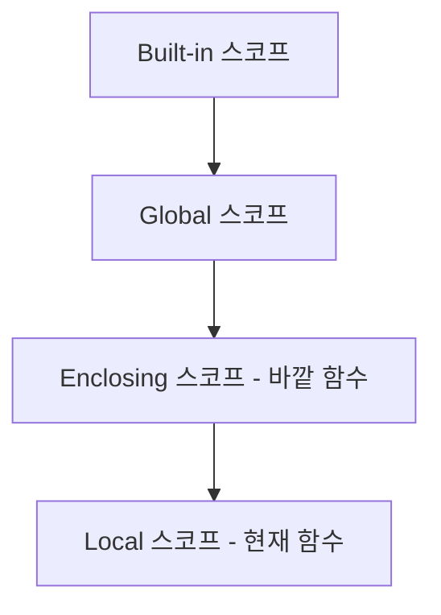

<highlight>
`nonlocal`은 중첩 함수에서 바깥 함수(Enclosing)의 변수를 참조·수정할 때 사용합니다. 전역 변수는 `global`, 바깥 함수 변수는 `nonlocal`을 사용합니다.
</highlight>

# 14. nonlocal

## 14.1 nonlocal이란?

`nonlocal`은 파이썬의 키워드 중 하나로, 중첩 함수 내부에서 바깥 함수의 변수를 참조하고 수정할 수 있게 합니다. `nonlocal`은 주로 클로저(closure)에서 변수의 값을 변경하고자 할 때 사용합니다.

파이썬에서 변수의 스코프는 LEGB(Local, Enclosing, Global, Built-in) 규칙을 따릅니다. `nonlocal` 키워드는 이 중 Enclosing 스코프의 변수를 수정할 수 있게 해줍니다.



## 14.2 nonlocal 사용 예시

아래 코드는 함수가 3개 중첩되어 있습니다. `fff` 함수에서 만약 전역 변수 `a`를 참조하고 싶다면 `global a`를, 자신을 감싸고 있는 바로 위의 함수를 참조하고 싶다면 `nonlocal a`를 사용합니다.

```python-exec
# nonlocal
a = 10
def f():
    a = 100
    print(f'f a: {a}')
    def ff():
        a = 1000
        print(f'ff a: {a}')
        def fff():
            nonlocal a # global a로 변경해보세요.
            a = 100
            print(f'fff a: {a}')
        fff()
        print(f'ff a: {a}')
    ff()
f()
print(f'global a: {a}')
```

## 14.3 global과 nonlocal의 차이

`global`과 `nonlocal`은 모두 변수의 스코프를 확장하는 키워드이지만, 그 대상이 다릅니다.

| 키워드 | 대상 스코프 | 사용 상황 |
|--------|------------|-----------|
| `global` | 전역 스코프 | 함수 내에서 전역 변수를 수정할 때 |
| `nonlocal` | Enclosing 스코프 | 중첩 함수에서 바깥 함수의 변수를 수정할 때 |

```python-exec
counter = 0  # 전역 변수

def outer():
    count = 0  # 바깥 함수의 지역 변수

    def inner():
        nonlocal count  # 바깥 함수의 count를 참조
        count += 1
        return count

    return inner

counter_func = outer()
print(counter_func())  # 1
print(counter_func())  # 2
print(counter_func())  # 3
```

## 14.4 클로저에서의 활용

`nonlocal`은 클로저를 사용할 때 특히 유용합니다. 클로저는 함수가 정의될 때의 환경을 기억하는 함수로, 상태를 유지해야 할 때 사용됩니다.

```python-exec
def make_multiplier(factor):
    total = 0

    def multiplier(value):
        nonlocal total
        result = value * factor
        total += result
        return result, total

    return multiplier

double = make_multiplier(2)
print(double(5))   # (10, 10)
print(double(10))  # (20, 30)
print(double(3))   # (6, 36)
```

## 14.5 주의사항

`nonlocal`을 사용할 때 참조하는 변수가 실제로 바깥 함수에 존재하는지 반드시 확인해야 합니다. 그렇지 않으면 `SyntaxError`가 발생합니다.

```python
def outer():
    def inner():
        nonlocal x  # SyntaxError: no binding for nonlocal 'x' found
        x = 10
    inner()
```

또한 `nonlocal`은 전역 변수에는 사용할 수 없습니다. 전역 변수를 수정하려면 `global` 키워드를 사용해야 합니다.
