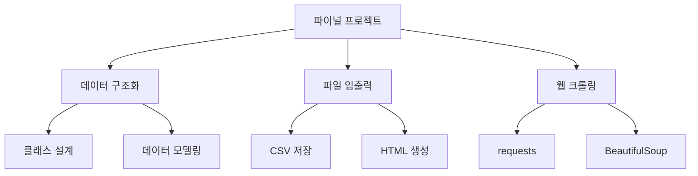
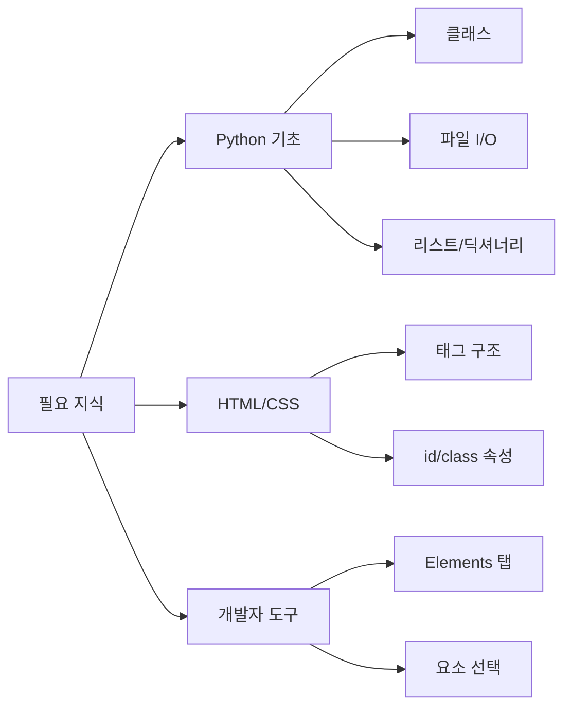
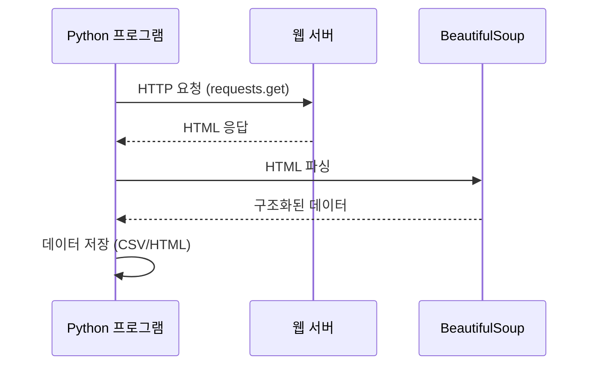
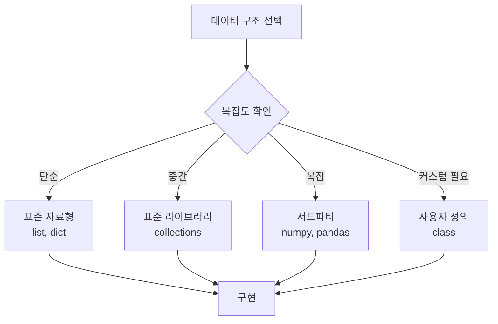
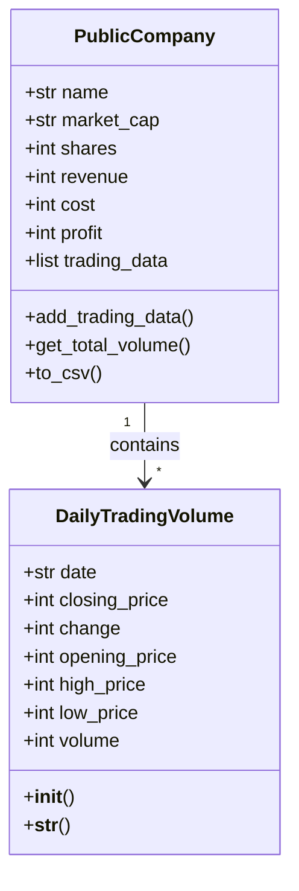
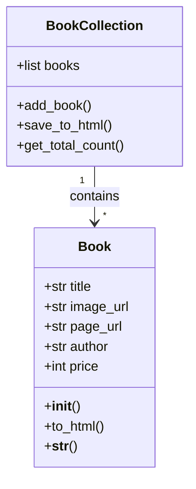

<highlight>
파이널 프로젝트에서는 실제 사용될만한 프로젝트를 통해 데이터 구조화, 파일 입출력, 웹 크롤링을 종합적으로 학습합니다. BeautifulSoup과 requests 라이브러리를 활용하여 웹 데이터를 수집하고 클래스로 구조화하여 저장합니다.
</highlight>

# 15. 파이널 프로젝트

## 15.1 최종 프로젝트 의도와 필요 지식

### 15.1.1 의도

프로그래밍 언어는 결국 무엇을 만드는 도구입니다. 목적을 가지고 실제 사용될만한 프로젝트를 해볼 필요가 있습니다. 이러한 프로젝트를 할 때에는 반드시 기본 문법 외에 다른 라이브러리를 사용하게 됩니다. 파이썬의 강점 중 하나가 `큰 생태계`임을 기억해주세요.



이 프로젝트를 통해 데이터 구조화, 파일 입출력, HTML 구조, 웹 통신의 구조 등을 다양하게 학습하기를 기대하며 프로젝트 문제를 출제하였습니다.

| 학습 영역 | 핵심 개념 | 사용 기술 |
|----------|----------|----------|
| 데이터 구조화 | 클래스, 인스턴스 | Python OOP |
| 파일 입출력 | 읽기/쓰기, 인코딩 | open(), csv 모듈 |
| 웹 크롤링 | HTTP 요청, HTML 파싱 | requests, BeautifulSoup |
| 데이터 저장 | 파일 포맷, 구조화 | CSV, HTML |

### 15.1.2 필요 지식

이 프로젝트를 위해 Python에 대한 공부가 필수적이며 특히 HTML, CSS, 개발자 도구에 대한 기초 지식이 필요합니다. 이 지식은 제주코딩베이스캠프 30분 요약 강좌를 참고해주세요. 영상을 보지 않고 프로젝트를 바로 시작하고 모르는 부분을 ChatGPT에게 물어가며 학습하는 것도 훌륭한 방법입니다.



**필수 라이브러리 설치:**

```python
# 터미널에서 실행
pip install requests beautifulsoup4
```

| 라이브러리 | 용도 | 설치 명령어 |
|-----------|------|------------|
| requests | HTTP 요청 | `pip install requests` |
| beautifulsoup4 | HTML 파싱 | `pip install beautifulsoup4` |
| lxml (선택) | 빠른 파싱 | `pip install lxml` |

::a[(신) 올 뉴 30분 요약강좌(HTML) - 2022년까지 업데이트]{class='btn-link' href="https://www.youtube.com/watch?v=PQymWXKehlk&list=PLkfUwwo13dlUhRuBra9j6YCypYRdifd2O" target="\_blank"}

**개발자 도구 사용법**

1. 크롤링 대상 페이지를 열고 개발자 도구를 엽니다. 대부분의 웹 브라우저에서 개발자 도구는 `Ctrl + Shift + I` (Windows/Linux) 또는 `Cmd + Opt + I` (Mac)를 누르거나, 마우스 오른쪽 버튼을 클릭하여 "검사(Inspect)"를 선택함으로써 열 수 있습니다.
2. 개발자 도구가 열리면, 페이지의 구조를 볼 수 있는 "Elements" 탭이 보일 것입니다. 이곳에서 HTML 소스 코드를 볼 수 있으며, 웹 페이지의 각 요소들이 어떻게 구성되어 있는지 확인할 수 있습니다.
3. 특정 요소의 id와 class를 찾기 위해, 개발자 도구 상단에 있는 마우스 포인터 모양의 아이콘(요소 선택 도구)을 클릭합니다. 이후, 웹 페이지에서 조사하고 싶은 요소를 클릭하면 개발자 도구의 Elements 탭에서 해당 HTML 코드로 직접 이동합니다.
4. 선택한 요소의 HTML 태그를 확인하여 `id`와 `class` 속성을 찾습니다. 예를 들어, `<em id="_market_sum" class="one two three">349조 2,323</em>`와 같이 표시됩니다. `id`는 페이지 내에서 유일한 식별자이며, `class`는 스타일링을 위해 같은 스타일을 공유하는 여러 요소에 적용됩니다. class는 여러 개가 들어있을 수 있습니다. 샘플로 one, two, three 3개를 넣어보았습니다.

   

5. id나 class를 사용하여 크롤링 코드에서 특정 요소를 식별하고 데이터를 추출할 수 있습니다. 예를 들어, Python의 `BeautifulSoup` 라이브러리를 사용하면 select 메서드를 통해 특정 id나 class를 가진 요소를 쉽게 찾을 수 있습니다.

   ```python
   soup.select('#_market_sum') # 아이디 _market_sum 입니다.
   soup.select('.one') # 클래스 one 입니다.
   ```

### 15.1.3 웹 크롤링의 기본 원리

웹 크롤링은 웹 페이지에서 필요한 데이터를 자동으로 수집하는 기술입니다. 기본적인 동작 원리를 이해하면 더 효과적으로 크롤링할 수 있습니다.



**requests 라이브러리 기본 사용법:**

```python
import requests

# GET 요청 보내기
response = requests.get('https://example.com')

# 응답 상태 확인
print(response.status_code)  # 200이면 성공

# HTML 내용 가져오기
html = response.text
```

**BeautifulSoup 기본 사용법:**

```python
from bs4 import BeautifulSoup

# HTML 파싱
soup = BeautifulSoup(html, 'html.parser')

# 다양한 선택 방법
soup.select('태그명')           # 태그로 선택
soup.select('#아이디')          # id로 선택
soup.select('.클래스명')        # class로 선택
soup.select('부모 > 자식')      # 자식 선택자
soup.select('태그[속성=값]')    # 속성으로 선택
```

| 선택자 | 설명 | 예시 |
|--------|------|------|
| `태그` | 태그명으로 선택 | `soup.select('div')` |
| `#id` | id 속성으로 선택 | `soup.select('#header')` |
| `.class` | class 속성으로 선택 | `soup.select('.content')` |
| `태그.class` | 특정 태그의 class | `soup.select('div.box')` |
| `부모 자손` | 자손 선택자 | `soup.select('div span')` |
| `부모 > 자식` | 직계 자식 선택자 | `soup.select('ul > li')` |

## 15.2 주가 크롤링하여 저장하기

:::div{.callout}

**_나쁜 프로그래머와 좋은 프로그래머의 차이는 코드보다 데이터 구조를 더 중요하게 여기는지에 달려 있다고 봅니다. - 리누스 토르발즈(리눅스 창시자)_**

:::

코드를 짤 때 데이터 구조를 어떻게 구성할지 고민하는 것은 매우 중요합니다. 이번 프로젝트에서는 데이터를 크롤링하여 저장하는 프로젝트를 진행합니다. 이를 위해 데이터 구조를 어떻게 구성할지 고민하고, 이를 코드로 구현하는 것이 목표입니다.

보통 프로젝트에서 표준 데이터 구조(list, dict 등) > 표준 라이브러리 데이터 구조(collections 등) > 3자 라이브러리(numpy, pandas 등) > 사용자 정의 데이터 구조 순으로 고민하게 됩니다.



### 15.2.1 과제 설명

- **목표**: `https://www.paullab.co.kr/stock.html` 페이지에서 '제주코딩베이스캠프'의 2019년 10월 총 거래량 데이터를 크롤링하여 저장합니다.
- **요구 사항**:
  1. **DailyTradingVolume 클래스**:
     - 클래스는 날짜, 종가, 전일비, 시가, 고가, 저가, 거래량 데이터를 속성으로 가져야 합니다.
     - 매일의 거래 데이터를 해당 클래스 인스턴스로 생성하고 이를 리스트로 관리합니다.
  2. **PublicCompany 클래스**:
     - 회사명, 시가총액, 상장주식수, 매출, 비용, 순익을 속성으로 가져야 합니다.
     - DailyTradingVolume 인스턴스의 리스트를 포함하여, 해당 회사의 일일 거래 데이터에 접근할 수 있어야 합니다.
  3. 2019년 10월의 데이터만을 대상, 해당 월의 총 거래량을 계산할 수 있어야 합니다.
  4. 결과는 csv 파일로 저장할 수 있어야 합니다.

### 15.2.2 추가 지침

- 샘플 코드를 참조하여 시작하되, 필요에 따라 코드를 수정하고 확장합니다.

  ```python
  import requests
  from bs4 import BeautifulSoup

  response = requests.get('http://www.paullab.co.kr/stock.html')
  # response.encoding = 'utf-8'
  html = response.text

  soup = BeautifulSoup(html, 'html.parser') # 원하는 문자열로 잘라줌
  soup.select('#update') # 원하는 데이터 id, class, HTML의 id와 class입니다.
  ```

- 필요에 따라 BeautifulSoup 및 requests 라이브러리의 사용법을 숙지하세요. 무료 영상이 녹화되어 있으니 참고바랍니다.

::a[[Summary 시리즈 2] 30분 Crawling 요약 1]{class='btn-link' href="https://youtu.be/l_pjQWtJf3Y" target="\_blank"}

::a[[Summary 시리즈 2] 30분 Crawling 요약 2]{class='btn-link' href="https://youtu.be/aJzuPAAnCm8" target="\_blank"}

### 15.2.3 클래스 설계 가이드

프로젝트에서 사용할 클래스의 구조를 미리 설계하면 코드 작성이 훨씬 수월해집니다.



**클래스 구현 예시:**

```python
class DailyTradingVolume:
    """일일 거래량 데이터를 저장하는 클래스"""

    def __init__(self, date, closing, change, opening, high, low, volume):
        self.date = date
        self.closing_price = closing
        self.change = change
        self.opening_price = opening
        self.high_price = high
        self.low_price = low
        self.volume = volume

    def __str__(self):
        return f"{self.date}: 거래량 {self.volume:,}"

class PublicCompany:
    """상장 회사 정보를 저장하는 클래스"""

    def __init__(self, name, market_cap, shares, revenue, cost, profit):
        self.name = name
        self.market_cap = market_cap
        self.shares = shares
        self.revenue = revenue
        self.cost = cost
        self.profit = profit
        self.trading_data = []  # DailyTradingVolume 리스트

    def add_trading_data(self, daily_data):
        """일일 거래 데이터 추가"""
        self.trading_data.append(daily_data)

    def get_total_volume(self):
        """총 거래량 계산"""
        return sum(data.volume for data in self.trading_data)
```

### 15.2.4 CSV 저장 방법

크롤링한 데이터를 CSV 파일로 저장하는 방법입니다.

```python
import csv

def save_to_csv(company, filename):
    """회사의 거래 데이터를 CSV로 저장"""
    with open(filename, 'w', newline='', encoding='utf-8') as f:
        writer = csv.writer(f)

        # 헤더 작성
        writer.writerow(['날짜', '종가', '전일비', '시가', '고가', '저가', '거래량'])

        # 데이터 작성
        for data in company.trading_data:
            writer.writerow([
                data.date,
                data.closing_price,
                data.change,
                data.opening_price,
                data.high_price,
                data.low_price,
                data.volume
            ])

    print(f"{filename} 저장 완료!")
```

## 15.3 북 크롤링하여 저장하기

### 15.3.1 과제 설명

- **목표**: `https://paullab.co.kr/bookservice/` 페이지에서 '위니브' 출판사가 출간한 책의 데이터를 크롤링하여 HTML 파일로 저장합니다.
- **요구 사항**
  1. **Book 클래스**
     - 제목, 이미지 링크, 페이지 링크, 저자, 가격을 속성으로 가져야 합니다.
     - 이 클래스를 사용하여 크롤링된 책의 데이터를 인스턴스로 관리합니다.
  2. 출력 파일은 `.html` 형식이어야 합니다.
  3. HTML 파일에는 책 제목이 `<h2>` 태그로, 이미지는 직접적으로 보여야 하며, 저자와 가격 정보가 포함되어야 합니다.
  4. 책 링크는 클릭 가능해야 합니다.

### 15.3.2 추가 지침

- 책 정보를 크롤링하여 클래스 인스턴스를 만들고, 이를 HTML 파일로 변환하는 과정을 구현합니다.
- 이미지를 직접 보여주기 위해 `` 태그의 사용법을 숙지하세요.
- 책의 제목을 클릭하면 해당 책의 상세 페이지로 이동할 수 있도록 `<a>` 태그를 활용합니다.

### 15.3.3 Book 클래스 설계



**Book 클래스 구현 예시:**

```python
class Book:
    """책 정보를 저장하는 클래스"""

    def __init__(self, title, image_url, page_url, author, price):
        self.title = title
        self.image_url = image_url
        self.page_url = page_url
        self.author = author
        self.price = price

    def to_html(self):
        """책 정보를 HTML 형식으로 변환"""
        return f'''
        <div class="book">
            <a href="{self.page_url}">
                
                <h2>{self.title}</h2>
            </a>
            <p>저자: {self.author}</p>
            <p>가격: {self.price:,}원</p>
        </div>
        '''

    def __str__(self):
        return f"{self.title} by {self.author}"
```

### 15.3.4 HTML 파일 생성

크롤링한 책 데이터를 HTML 파일로 저장하는 방법입니다.

```python
def save_books_to_html(books, filename):
    """책 목록을 HTML 파일로 저장"""
    html_content = '''
<!DOCTYPE html>
<html lang="ko">
<head>
    <meta charset="UTF-8">
    <meta name="viewport" content="width=device-width, initial-scale=1.0">
    <title>위니브 도서 목록</title>
    <style>
        body { font-family: Arial, sans-serif; margin: 20px; }
        .book-container { display: flex; flex-wrap: wrap; gap: 20px; }
        .book { border: 1px solid #ddd; padding: 15px; width: 200px; }
        .book img { width: 100%; height: auto; }
        .book h2 { font-size: 16px; margin: 10px 0; }
        .book a { text-decoration: none; color: inherit; }
    </style>
</head>
<body>
    <h1>위니브 출판 도서 목록</h1>
    <div class="book-container">
'''

    for book in books:
        html_content += book.to_html()

    html_content += '''
    </div>
</body>
</html>
'''

    with open(filename, 'w', encoding='utf-8') as f:
        f.write(html_content)

    print(f"{filename} 저장 완료! 총 {len(books)}권의 책이 저장되었습니다.")
```

## 15.4 프로젝트 진행 팁

### 15.4.1 단계별 접근법

프로젝트를 진행할 때는 한 번에 모든 것을 구현하려 하지 말고, 작은 단위로 나누어 진행하는 것이 좋습니다.


**단계별 체크리스트:**

| 단계 | 작업 내용 | 확인 |
|------|----------|------|
| 1 | requests로 페이지 요청 성공 | ☐ |
| 2 | BeautifulSoup으로 HTML 파싱 | ☐ |
| 3 | 원하는 데이터 선택자 확인 | ☐ |
| 4 | 데이터를 클래스 인스턴스로 변환 | ☐ |
| 5 | 파일(CSV/HTML)로 저장 | ☐ |

### 15.4.2 디버깅 팁

크롤링 과정에서 문제가 발생하면 다음 사항을 확인해보세요.

1. **응답 상태 코드 확인**: `response.status_code`가 200인지 확인
2. **인코딩 문제**: `response.encoding = 'utf-8'` 설정
3. **선택자 확인**: 개발자 도구에서 선택자가 올바른지 확인
4. **데이터 타입 확인**: 추출된 데이터의 타입을 `print(type(data))`로 확인

```python
# 디버깅을 위한 코드 예시
import requests
from bs4 import BeautifulSoup

response = requests.get('https://example.com')
print(f"상태 코드: {response.status_code}")
print(f"인코딩: {response.encoding}")

soup = BeautifulSoup(response.text, 'html.parser')
elements = soup.select('.target-class')
print(f"찾은 요소 개수: {len(elements)}")

for i, elem in enumerate(elements[:3]):  # 처음 3개만 확인
    print(f"[{i}] {elem.text[:50]}...")
```

### 15.4.3 크롤링 윤리와 주의사항

웹 크롤링을 할 때는 다음 사항을 반드시 지켜야 합니다.

<highlight>
크롤링은 강력한 도구이지만, 웹사이트의 이용약관과 robots.txt를 반드시 확인하고 준수해야 합니다. 과도한 요청은 서버에 부담을 줄 수 있으므로 적절한 딜레이를 두는 것이 좋습니다.
</highlight>

| 주의사항 | 설명 |
|---------|------|
| robots.txt 확인 | 크롤링 허용 여부 확인 |
| 요청 간격 조절 | `time.sleep()` 사용 |
| 이용약관 준수 | 상업적 이용 시 주의 |
| 저작권 존중 | 수집 데이터 사용 범위 확인 |

```python
import time

# 요청 간 1초 대기
for url in urls:
    response = requests.get(url)
    # 데이터 처리
    time.sleep(1)  # 서버 부담 줄이기
```
