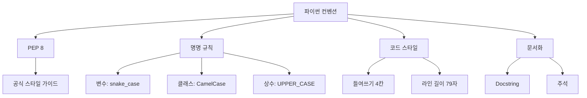
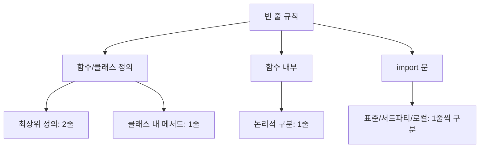
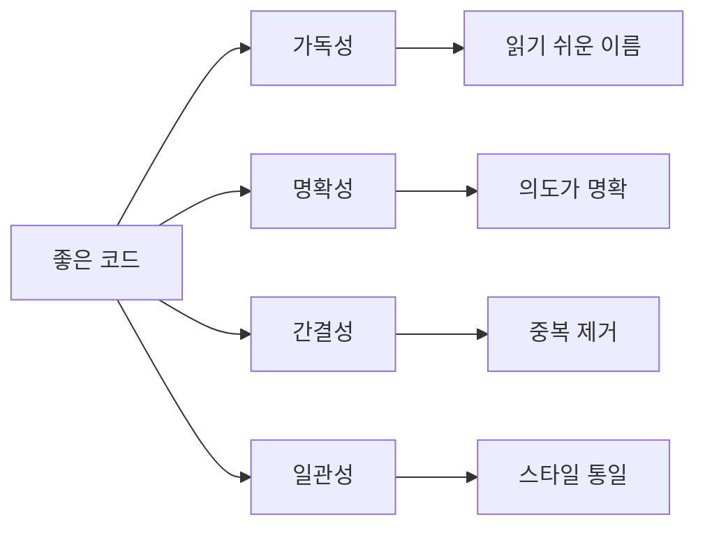
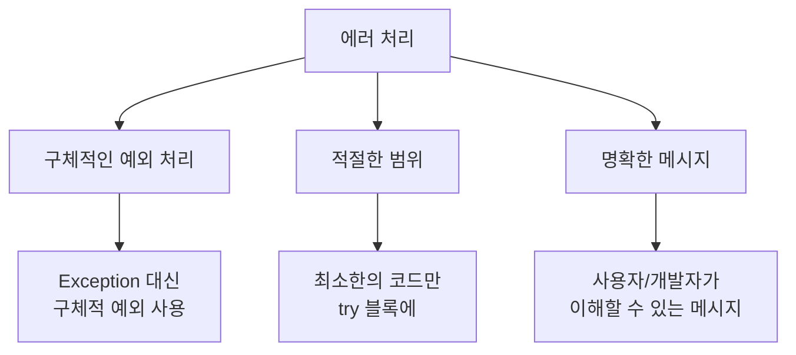

<highlight>
PEP 8은 파이썬 공식 스타일 가이드입니다. 변수명은 `snake_case`, 클래스명은 `CamelCase`, 상수는 `UPPER_CASE`로 작성합니다. 들여쓰기 4칸, 한 줄 최대 79자를 권장하며, `Black` 포매터로 일관된 스타일을 유지합니다.
</highlight>

# 16. 자주 사용하는 파이썬 컨벤션

파이썬 컨벤션은 코드를 더 읽기 쉽고 유지보수하기 쉽게 만드는 권장 사항입니다. 이러한 컨벤션을 따르면 코드의 일관성을 유지하고, 다른 개발자와의 협업을 용이하게 할 수 있습니다.



아래와 같은 글로벌 기업의 스타일 가이드를 읽는 것도 큰 도움이 됩니다.

::a[styleguide]{class='btn-link' href="https://google.github.io/styleguide/pyguide.html" target="\_blank"}

구글의 스타일 가이드는 영상으로 찍어두었으니 후에 확인해보세요.

::a[[Google Coding 컨벤션] #1 Python 코딩 컨벤션]{class='btn-link' href="https://youtu.be/5lr9Z9oqoYk" target="\_blank"}

## 16.1 PEP 8 스타일 가이드

PEP 8은 파이썬 코드를 작성할 때 따르는 스타일 가이드입니다. 여기에는 변수명, 함수명, 클래스명 작성법, 들여쓰기, 라인 길이, 공백 사용 등에 대한 권장 사항이 포함되어 있습니다.

::a[PEP 8 공식 문서]{class='btn-link' href="https://peps.python.org/pep-0008/" target="\_blank"}

### 16.1.1 명명 규칙

| 대상 | 표기법 | 예시 | 설명 |
|------|--------|------|------|
| 변수 | snake_case | `user_name`, `total_count` | 소문자, 언더스코어 구분 |
| 함수 | snake_case | `calculate_total()`, `get_user()` | 동사로 시작 권장 |
| 클래스 | CamelCase | `UserProfile`, `DataManager` | 대문자로 시작 |
| 상수 | UPPER_CASE | `MAX_SIZE`, `DEFAULT_COLOR` | 대문자, 언더스코어 구분 |
| 모듈 | snake_case | `my_module.py` | 짧고 소문자 |
| 패키지 | lowercase | `mypackage` | 짧고 소문자, 언더스코어 비권장 |

```python
# 좋은 예시
user_name = "홍길동"
total_count = 100
MAX_CONNECTIONS = 50

def calculate_total(items):
    pass

class UserProfile:
    pass

# 나쁜 예시
userName = "홍길동"      # camelCase는 변수에 사용하지 않음
TotalCount = 100         # PascalCase는 클래스에만 사용
max_connections = 50     # 상수는 대문자로
```

### 16.1.2 들여쓰기와 공백

- **들여쓰기**: 공백 4개를 사용합니다. 일부 에디터에서 Tab을 Space 4개로 변환해주지 않는 경우도 있으니 확인이 필요합니다. 또한 colab에 기본 들여쓰기 설정은 Space 2개입니다. 2개여도 작동하는데 문제가 생기진 않습니다.
- **라인 길이**: 한 줄은 최대 79자를 넘지 않도록 합니다. 한글이면 한 줄에 32자가 적당합니다.
- **공백**: 괄호, 콤마, 콜론 앞에는 공백을 넣지 않습니다.

```python
# 좋은 예시
def function(arg1, arg2):
    result = arg1 + arg2
    return result

my_list = [1, 2, 3]
my_dict = {'key': 'value'}

if x == 4:
    print(x)

# 나쁜 예시
def function( arg1 , arg2 ):  # 괄호 안쪽 공백
    result=arg1+arg2          # 연산자 주변 공백 없음
    return result

my_list = [ 1,2,3 ]           # 일관성 없는 공백
my_dict = { 'key' : 'value' } # 불필요한 공백
```

### 16.1.3 빈 줄 규칙



```python
# 좋은 예시
import os
import sys

import requests
import numpy as np

from my_module import my_function


class MyClass:
    """클래스 설명"""

    def method_one(self):
        pass

    def method_two(self):
        pass


def standalone_function():
    pass
```

## 16.2 명확한 코드 작성

코드는 가능한 명확하고 간결하게 작성해야 합니다. 파이썬의 철학인 "명료함이 난해함보다 낫다"를 기억하세요.

```python-exec
# 파이썬의 철학 확인하기
import this
```

### 16.2.1 좋은 코드의 원칙



| 원칙 | 설명 | 예시 |
|------|------|------|
| 가독성 | 다른 사람이 읽기 쉬운 코드 | 명확한 변수명, 적절한 공백 |
| 명확성 | 코드의 의도가 분명함 | 주석 없이도 이해 가능 |
| 간결성 | 불필요한 코드 제거 | DRY 원칙 준수 |
| 일관성 | 전체 프로젝트에서 동일한 스타일 | 컨벤션 준수 |

### 16.2.2 불필요한 주석 피하기

코드 자체로 의도가 명확하게 전달되도록 작성합니다.

```python
# 나쁜 주석 - 코드가 이미 설명하고 있는 내용
x = x + 1  # x에 1을 더한다

# 좋은 주석 - 왜 이 코드가 필요한지 설명
x = x + 1  # 0-based 인덱스를 1-based로 변환 (사용자 표시용)

# 나쁜 주석 - 명백한 내용
def get_user(user_id):
    # 사용자를 가져온다
    return db.query(User).get(user_id)

# 좋은 주석 - 비즈니스 로직 설명
def get_user(user_id):
    # 탈퇴 회원도 포함하여 조회 (관리자 기능)
    return db.query(User).get(user_id)
```

### 16.2.3 주석의 위치와 내용

1. 함수나 클래스에 주석은 Doc String을 사용해야 합니다. 위나 옆에 주석을 달지 않도록 해주세요. 또한 주석을 너무 상세하게 달아 가독성을 해치지 말아주세요. 코드를 읽는 사람이 기본적인 문법을 모른다고 생각하고 주석을 달아서는 안됩니다. 주석은 회사 컨벤션으로 정하는 것을 권합니다. 보통 함수 기능 설명, 파라미터 설명, 반환값 설명, 사용 예시를 넣습니다.

```python
def calculate_area(radius):
    """
    원의 면적을 계산하는 함수.

    파라미터:
        radius (float): 원의 반지름

    반환값:
        float: 원의 면적

    예시:
        >>> calculate_area(5)
        78.53981633974483
    """
    return 3.14159 * radius * radius

# 함수 사용 예시
area = calculate_area(5)
print("Area:", area)
```

2. 저작권을 담은 주석은 파일의 맨 위에 작성합니다. 파일의 맨 위에는 파일의 제목, 작성자, 작성일, 수정일, 저작권 정보 등을 작성합니다. 너무 긴 텍스트는 외부의 파일을 참고하도록 합니다.

   ```python
   """이 코드의 저작권은 위니브에 있습니다. 2024년 1월 30일에 작성되었습니다. 저작권의 상세 내용은 회사 코드 라이센스 문서를 참고하세요."""
   def calculate_area(radius):
       return 3.14159 * radius * radius
   ```

3. 코드 태그는 TODO만 사용하고 나머지 태그는 되도록 사용하지 않는 것을 권합니다. 예를 들어 FIXME와 같은 코드태그는 기타 이슈 추적 도구를 사용하는 편을 권합니다. TODO와 같은 코드 태그를 사용하면 VSC의 익스텐션을 사용하여 태그가 달린 코드를 쉽게 검색하고 관리할 수 있습니다.

   ```python
   def calculate_area(radius):
       return 3.14159 * radius * radius  # TODO: 최적화 필요
   ```

4. 매직 주석은 코드의 실행 환경을 나타냅니다. 단, 3.x 버전에서는 더 이상 사용되지 않습니다. 특수한 경우 사용해주세요.

   ```python
   # -*- coding: utf-8 -*-
   ```

### 16.2.4 매직 넘버 피하기

매직 넘버(Magic Number)는 소스 코드 내에서 직접적으로 표현된 숫자값을 의미합니다. 이런 숫자들은 일반적으로 코드의 의미를 직관적으로 이해하기 어렵게 만들고, 유지보수를 더 복잡하게 할 수 있습니다.

```python
# 나쁜 예시 - 매직 넘버 사용
if user.age >= 19:
    allow_adult_content()

if retry_count > 3:
    raise MaxRetryError()

discount = price * 0.15

# 좋은 예시 - 의미 있는 상수 사용
ADULT_AGE = 19
MAX_RETRY_COUNT = 3
DISCOUNT_RATE = 0.15

if user.age >= ADULT_AGE:
    allow_adult_content()

if retry_count > MAX_RETRY_COUNT:
    raise MaxRetryError()

discount = price * DISCOUNT_RATE
```

### 16.2.5 따옴표 사용

일관된 따옴표 사용을 유지합니다. 파이썬에서는 단일 따옴표(`'`)와 이중 따옴표(`"`)를 모두 사용할 수 있지만, 일관성을 위해 하나를 선택하여 일관되게 사용하는 것이 좋습니다.

| 스타일 | 사용처 | 예시 |
|--------|--------|------|
| 홑따옴표 `'` | 일부 회사 컨벤션 | `name = 'hello'` |
| 쌍따옴표 `"` | Black 포매터 기본값 | `name = "hello"` |
| 삼중 따옴표 `"""` | Docstring | `"""설명"""` |

```python
# 일관성 있는 따옴표 사용 (홑따옴표 스타일)
name = 'hello'
message = 'world'

# 일관성 있는 따옴표 사용 (쌍따옴표 스타일)
name = "hello"
message = "world"

# 문자열 안에 따옴표가 있는 경우
message = "It's a beautiful day"  # 내부에 홑따옴표
html = '<div class="container">'  # 내부에 쌍따옴표
```

## 16.3 에러 처리

예외 처리를 통해 예상치 못한 에러에 대비합니다. `try-except` 블록을 사용하여 오류 상황을 적절히 처리하고, 필요한 경우 사용자에게 명확한 메시지를 제공합니다.

### 16.3.1 에러 처리 원칙



| 원칙 | 설명 | 예시 |
|------|------|------|
| 구체적 예외 | 일반 Exception 대신 구체적 예외 사용 | `except ValueError` |
| 최소 범위 | 에러 발생 가능한 코드만 try 블록에 | 파일 열기 부분만 감싸기 |
| 명확한 메시지 | 에러 원인을 파악할 수 있는 메시지 | `f"파일을 찾을 수 없음: {filename}"` |
| 로깅 | 에러 정보 기록 | `logging.error(e)` |

```python
# 나쁜 예시 - 너무 넓은 범위와 일반적인 예외
try:
    data = load_data()
    processed = process_data(data)
    result = calculate(processed)
    save_result(result)
except Exception as e:
    print("에러 발생")

# 좋은 예시 - 적절한 범위와 구체적인 예외
try:
    data = load_data()
except FileNotFoundError as e:
    logging.error(f"데이터 파일을 찾을 수 없습니다: {e}")
    raise

try:
    result = calculate(data)
except ValueError as e:
    logging.error(f"계산 중 오류 발생: {e}")
    raise

# 사용자 정의 예외 사용
class DataValidationError(Exception):
    """데이터 검증 실패 예외"""
    pass

def validate_data(data):
    if not data:
        raise DataValidationError("데이터가 비어있습니다")
```

## 16.4 코드 포매팅 도구 사용

코드 포매팅 도구를 사용하여 코드 스타일을 일관되게 유지할 수 있습니다.

### 16.4.1 주요 도구 비교

| 도구 | 용도 | 특징 | 설치 |
|------|------|------|------|
| Black | 코드 포매팅 | 의견이 강함, 일관성 높음 | `pip install black` |
| isort | import 정렬 | import 문 자동 정렬 | `pip install isort` |
| flake8 | 린터 | 스타일 검사, PEP 8 준수 확인 | `pip install flake8` |
| pylint | 린터 | 종합적인 코드 분석 | `pip install pylint` |
| mypy | 타입 검사 | 정적 타입 검사 | `pip install mypy` |


### 16.4.2 Black 사용법

Black은 "uncompromising" 포매터로, 설정 옵션이 거의 없어 일관된 스타일을 강제합니다.

```bash
# 설치
pip install black

# 파일 포매팅
black my_file.py

# 디렉토리 전체 포매팅
black my_project/

# 변경 사항 미리보기 (실제 변경 없음)
black --diff my_file.py

# 검사만 수행 (CI/CD용)
black --check my_project/
```

### 16.4.3 flake8 사용법

flake8은 PEP 8 준수 여부를 검사합니다.

```bash
# 설치
pip install flake8

# 검사 실행
flake8 my_file.py

# 특정 규칙 무시
flake8 --ignore=E501 my_file.py

# 최대 라인 길이 설정
flake8 --max-line-length=100 my_file.py
```

### 16.4.4 설정 파일 사용

프로젝트 루트에 설정 파일을 두어 팀 전체에서 동일한 설정을 사용할 수 있습니다.

**pyproject.toml (권장)**

```toml
[tool.black]
line-length = 88
target-version = ['py39']
include = '\.pyi?$'
exclude = '''
/(
    \.git
    | \.venv
    | build
    | dist
)/
'''

[tool.isort]
profile = "black"
line_length = 88

[tool.mypy]
python_version = "3.9"
warn_return_any = true
warn_unused_configs = true
```

**.flake8**

```ini
[flake8]
max-line-length = 88
extend-ignore = E203, W503
exclude = .git,__pycache__,build,dist
```

## 16.5 타입 힌트

Python 3.5부터 타입 힌트를 지원합니다. 타입 힌트는 코드의 가독성을 높이고, IDE의 자동완성 기능을 향상시킵니다.

### 16.5.1 기본 타입 힌트

```python
# 변수 타입 힌트
name: str = "홍길동"
age: int = 25
is_active: bool = True
score: float = 95.5

# 함수 타입 힌트
def greet(name: str) -> str:
    return f"안녕하세요, {name}님!"

def add(a: int, b: int) -> int:
    return a + b

# 선택적 매개변수
from typing import Optional

def get_user(user_id: int, include_deleted: bool = False) -> Optional[dict]:
    # user를 찾지 못하면 None 반환
    pass
```

### 16.5.2 복잡한 타입 힌트

```python
from typing import List, Dict, Tuple, Union, Callable

# 리스트
numbers: List[int] = [1, 2, 3]
names: List[str] = ["Alice", "Bob"]

# 딕셔너리
user: Dict[str, str] = {"name": "홍길동", "email": "hong@example.com"}
scores: Dict[str, int] = {"math": 100, "english": 95}

# 튜플
point: Tuple[int, int] = (10, 20)
record: Tuple[str, int, bool] = ("Alice", 25, True)

# Union (여러 타입 중 하나)
value: Union[int, str] = 42  # int 또는 str

# Python 3.10+ 에서는 | 사용 가능
value: int | str = 42

# Callable (함수 타입)
def apply(func: Callable[[int, int], int], a: int, b: int) -> int:
    return func(a, b)
```

<highlight>
타입 힌트는 선택 사항이지만, 대규모 프로젝트나 팀 협업에서는 코드의 이해도와 유지보수성을 크게 향상시킵니다. mypy와 같은 도구로 정적 타입 검사를 수행할 수 있습니다.
</highlight>

## 16.6 컨벤션 체크리스트

프로젝트를 시작하거나 코드 리뷰를 할 때 확인할 체크리스트입니다.

| 항목 | 확인 사항 |
|------|----------|
| 명명 규칙 | 변수/함수는 snake_case, 클래스는 CamelCase |
| 들여쓰기 | 공백 4칸 사용 |
| 라인 길이 | 79자 또는 팀 컨벤션 준수 |
| import 순서 | 표준 → 서드파티 → 로컬 |
| Docstring | 모든 공개 함수/클래스에 작성 |
| 타입 힌트 | 함수 시그니처에 타입 명시 |
| 에러 처리 | 구체적인 예외 사용 |
| 포매터 | Black 또는 팀 포매터 적용 |

:::div{.callout}
**컨벤션은 팀의 약속입니다**

컨벤션의 목적은 코드의 일관성을 유지하고 팀원 간의 원활한 협업을 돕는 것입니다. 어떤 스타일이 "올바른" 것인지보다, 팀 전체가 동일한 스타일을 따르는 것이 더 중요합니다. 새로운 프로젝트를 시작할 때 팀원들과 함께 컨벤션을 정하고, 이를 문서화하세요.
:::
