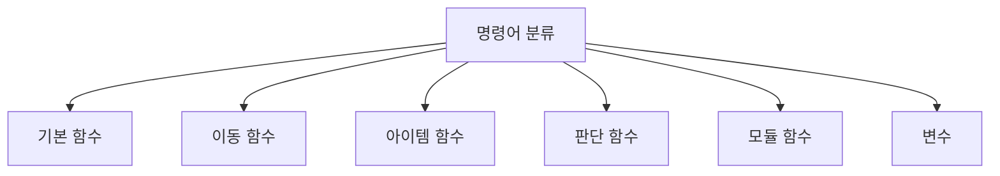

# 1. 명령어 사전

위니브월드에서 사용할 수 있는 모든 명령어를 정리한 사전입니다.

<highlight>명령어 사전을 참고하여 다양한 함수와 변수를 활용해 보세요.</highlight>

---

## 1.1 기본 함수

미션 수행과 출력에 필요한 기본 함수들입니다.

| 함수 | 설명 | 예시 |
| --- | --- | --- |
| `mission_start()` | 임무 시작 | `mission_start()` |
| `mission_end()` | 임무 끝 | `mission_end()` |
| `print()` | 터미널에 결과물 출력 | `print('hello')` |
| `say()` | 캐릭터 말풍선에 출력 | `say('안녕!')` |
| `repeat(count, function)` | 함수를 count 횟수만큼 반복 | `repeat(3, move)` |

---

## 1.2 이동 함수

캐릭터의 이동과 방향 전환에 사용되는 함수들입니다.

| 함수 | 설명 | 예시 |
| --- | --- | --- |
| `move()` | 바라보는 방향으로 한 칸 이동 | `move()` |
| `turn_left()` | 왼쪽(반시계 방향)으로 회전 | `turn_left()` |
| `open_door()` | 이동 방향의 door 벽을 삭제 | `open_door()` |
| `directions()` | 캐릭터의 방향을 반환 | `directions()` |

---

## 1.3 아이템 함수

아이템 획득, 배치, 확인에 사용되는 함수들입니다.

| 함수 | 설명 | 예시 |
| --- | --- | --- |
| `pick()` | 발 아래 아이템 획득 | `pick()` |
| `put(item)` | 아이템을 발 아래에 배치 | `put('fish-1')` |
| `item()` | 가진 아이템 반환 | `item()['fish-1']` |
| `on_item()` | 발 아래 아이템 여부 반환 | `on_item()` |
| `set_item(x, y, item, count)` | 맵 좌표에 아이템 생성 | `set_item(1, 1, 'fish-1', 3)` |

### 아이템 종류

| 아이템 | 설명 |
| --- | --- |
| `fish-1` | 물고기 1 |
| `fish-2` | 물고기 2 |
| `fish-3` | 물고기 3 |
| `diamond` | 다이아몬드 |
| `apple` | 사과 |
| `goldbar` | 골드바 |

---

## 1.4 판단 함수

조건 판단에 사용되는 함수들입니다. True 또는 False를 반환합니다.

| 함수 | 설명 | 반환값 |
| --- | --- | --- |
| `front_is_clear()` | 앞에 벽이 없는지 판단 | True/False |
| `left_is_clear()` | 왼쪽에 벽이 없는지 판단 | True/False |
| `right_is_clear()` | 오른쪽에 벽이 없는지 판단 | True/False |
| `back_is_clear()` | 뒤에 벽이 없는지 판단 | True/False |
| `typeof_wall()` | 이동 방향의 벽 타입 반환 | 벽 타입 문자열 |

---

## 1.5 모듈 함수

modules에서 import하여 사용하는 확장 함수들입니다.

| 함수 | import 문 | 설명 |
| --- | --- | --- |
| `turn_right()` | `from modules import turn_right` | 오른쪽으로 회전 |
| `turn_around()` | `from modules import turn_around` | 뒤로 회전 |
| `move_to_wall()` | `from modules import move_to_wall` | 장애물 전까지 이동 |
| `turn_left_until_clear()` | `from modules import turn_left_until_clear` | 왼쪽이 비어있을 때까지 회전 |
| `jump()` | `from modules import jump` | 장애물 한 칸 뛰어넘음 |

---

## 1.6 변수

위니브월드의 데이터에 접근하는 변수들입니다.

| 변수 | 설명 |
| --- | --- |
| `character_data` | 캐릭터 데이터 |
| `map_data` | 지도 데이터 |
| `item_data` | 아이템 데이터 |
| `wall_data['world']` | 맵 데이터 |
