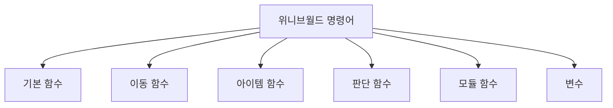

# 1. 명령어 사전

위니브월드에서 사용할 수 있는 모든 함수와 변수를 정리한 사전입니다.

## 1.1 함수 리스트

### 1.1.1 기본 함수

| 함수 | 설명 |
| --- | --- |
| `mission_start()` | 임무 시작 |
| `mission_end()` | 임무 끝 |
| `print()` | 터미널에 결과물 출력 |
| `say()` | 캐릭터 말풍선에 출력 |

### 1.1.2 이동 함수

| 함수 | 설명 |
| --- | --- |
| `move()` | 캐릭터가 바라보는 방향으로 한 칸 이동 |
| `turn_left()` | 왼쪽(반시계 방향)으로 회전 |
| `repeat(count, function)` | 함수를 count 횟수만큼 반복 |

### 1.1.3 아이템 함수

| 함수 | 설명 |
| --- | --- |
| `item()` | 캐릭터가 가진 아이템 반환 |
| `on_item()` | 캐릭터 아래 아이템 여부 반환 |
| `pick()` | 캐릭터 위치에 아이템이 있으면 해당 아이템 획득 |
| `put(item)` | 캐릭터가 해당 아이템을 가지고 있다면 발아래에 추가 |
| `set_item(x, y, item, count)` | 맵 x,y 좌표에 item을 count 개수만큼 생성 |

**아이템 종류**: `fish-1`, `fish-2`, `fish-3`, `diamond`, `apple`, `goldbar`

### 1.1.4 판단 함수

| 함수 | 설명 |
| --- | --- |
| `front_is_clear()` | 캐릭터의 앞에 벽이 있는지 판단 |
| `left_is_clear()` | 캐릭터의 좌측에 벽이 있는지 판단 |
| `right_is_clear()` | 캐릭터의 우측에 벽이 있는지 판단 |
| `back_is_clear()` | 캐릭터의 뒤에 벽이 있는지 판단 |
| `directions()` | 캐릭터의 방향을 반환 |
| `typeof_wall()` | 캐릭터의 이동 방향의 벽 타입을 반환 |
| `open_door()` | 캐릭터 앞의 문(door)을 삭제 |

### 1.1.5 모듈 함수

모듈 함수는 `from modules import 함수명`으로 불러와서 사용합니다.

| 함수 | 설명 |
| --- | --- |
| `turn_right()` | 오른쪽으로 회전 |
| `turn_around()` | 뒤로 회전 |
| `move_to_wall()` | 벽이 나올 때까지 이동 |
| `turn_left_until_clear()` | 왼쪽이 비어있을 때까지 회전 |
| `jump()` | 장애물 한 칸을 뛰어넘음 |

---

## 1.2 변수 리스트

| 변수 | 설명 |
| --- | --- |
| `character_data` | 캐릭터 데이터 (위치, 방향 등) |
| `map_data` | 지도 데이터 |
| `item_data` | 월드에 배치된 아이템 데이터 |
| `wall_data['world']` | 맵의 벽 데이터 |
