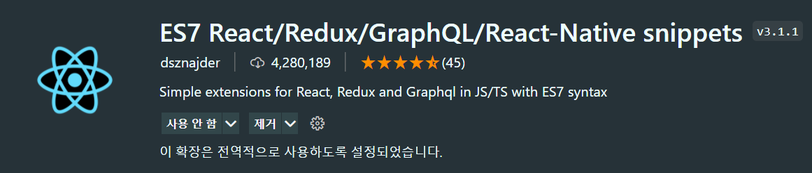

# 0. 필수 설치 프로그램 및 단축키

# 1. VSC Extension

1. ES7 React
    
    
    
2. vscode-styled-components
    
    
    
3. auto Import
    
    [Auto Import - ES6, TS, JSX, TSX - Visual Studio Marketplace](https://marketplace.visualstudio.com/items?itemName=NuclleaR.vscode-extension-auto-import)
    
4. Live Server
    
    
    

---

# 2. 크롬 웹 스토어

[React Developer Tools](https://chrome.google.com/webstore/detail/react-developer-tools/fmkadmapgofadopljbjfkapdkoienihi?hl=ko)

[Redux DevTools](https://chrome.google.com/webstore/detail/redux-devtools/lmhkpmbekcpmknklioeibfkpmmfibljd?hl=ko)

---

# 3. 단축키

- rfc : 위 `ES7 React` extension을 설치하였을 경우 함수 컴포넌트
- rcc : 위 `ES7 React` extension을 설치하였을 경우 클래스 컴포넌트

[vscode-react-javascript-snippets/Snippets.md at 185bb91a0b692c54136663464e8225872c434637 · dsznajder/vscode-react-javascript-snippets](https://github.com/dsznajder/vscode-react-javascript-snippets/blob/HEAD/docs/Snippets.md)

- Ctrl + e : 파일 찾아서 이동할 수 있습니다.
- 컴포넌트 위에서 Ctrl(Command) + Click : 바로 이동합니다.