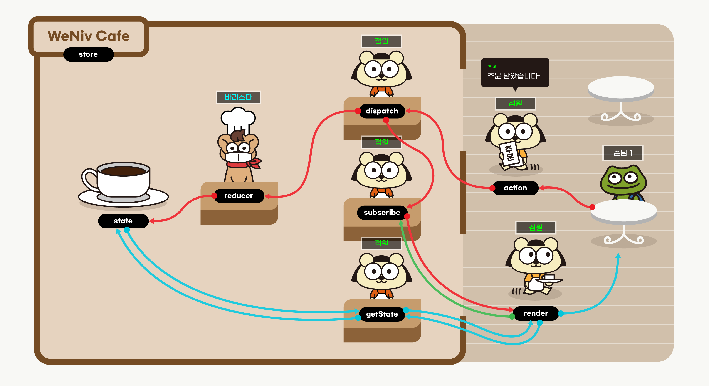

# 1. Redux란?

<aside>
💡

Redux는 25년 6월 개정판이 있습니다. 이 챕터 밖으로 나가셔서 하단 챕터를 참고해주세요. 이 챕터는 제대로 작동하지 않을 수 있습니다. 백업을 위해 남겨둡니다.

</aside>

<aside>
💡 해당 챕터는 리덕스의 기본기를 익히기 위한 목적으로 만들어졌습니다. 프로젝트 규모에 따라 리덕스의 깊은 기능까지 사용하게 될 때에는 공식 문서를 확인해주세요.

</aside>

# 1. Redux란?

공식 홈페이지에서 설명하고 있는 리덕스의 정의를 한 번 보도록 합시다. 

[Redux 시작하기 | Redux](https://ko.redux.js.org/introduction/getting-started/)

리덕스는 리액트만을 위한 라이브러리는 아닙니다. React 뿐만 아니라 Vue와도 잘 결합되며, 또한 순수 JS와도 결합이 됩니다. 설치없이 실행할 수 있는 **생활코딩**의 **간단한 예제**를 통해 Redux의 속성을 알아봅시다.

<aside>
💡 Redux, Recoil, MobX, SWR, 와 같이 다른 상태관리 라이브러리도 많습니다. 기본 내장된 useContext도 좋구요. 좋은 아티클을 소개해드립니다.

[[React] 상태관리 라이브러리 어떤걸 써야할까?](https://dori-coding.tistory.com/entry/React-%EC%83%81%ED%83%9C%EA%B4%80%EB%A6%AC-%EB%9D%BC%EC%9D%B4%EB%B8%8C%EB%9F%AC%EB%A6%AC-%EC%96%B4%EB%96%A4%EA%B1%B8-%EC%8D%A8%EC%95%BC%ED%95%A0%EA%B9%8C)

[Recoil - 또 다른 React 상태 관리 라이브러리?](https://ui.toast.com/weekly-pick/ko_20200616)

[jotai vs mobx vs recoil vs redux vs zustand | npm trends](https://npmtrends.com/jotai-vs-mobx-vs-recoil-vs-redux-vs-zustand)

</aside>

## 1.2 바닐라JS에서 Redux 살펴보기

<aside>
💡 생활코딩은 CCL 라이선스 BY를 따르고 있습니다. 생활코딩과의 별도 금전관계가 없으며 자료의 출처가 생활코딩임을 명시합니다.

</aside>

[생활코딩.zip](%EC%83%9D%ED%99%9C%EC%BD%94%EB%94%A9.zip)

- 관련 영상
    
    [Redux](https://opentutorials.org/module/4078)
    

아래 부분은 최신 문법으로 수정하겠습니다.

```jsx
if (action.type === 'CHANGE_COLOR') {
    //복제해야 합니다. 그냥 {color:'red'} 이런 식으로 리턴해줘도 되긴 하는데 리덕스의 고급 기능을 쓰지 못합니다.
    newState = { ...state, color: action.color };

}

return newState;
```

우리가 앞에서 배운 리액트에서 클릭 이벤트가 발생했을 때, 해당 값들은 Hook을 사용해서 값의 상태를 바꿔준 후 화면에 재렌더링하여서 값들을 보여주었습니다. 즉, `useState`를 사용하여 리액트에게 값의 변경을 알리면 리액트가 UI를 업데이트 하였습니다.

리덕스도 `useState`와 마찬가지로 변하는 값들을 관리해주는 관리 시스템입니다. 차이는 useState가 컴포넌트 단위로 상태를 관리했다면, 리덕스는 전역으로 데이터 상태를 관리합니다. 데이터들의 값이 바뀌었을 때 그 값들을 사용하는 모든 컴포넌트들에게 변경된 값을 전달해주고 그 값들을 다시 화면에 보여줍니다.

아래 내용을 살펴보기 전에 리덕스 데브툴스를 설치해 주세요. 그리고 생활코딩의 코드를 VSC의 live Server로 켜놓고 해당 툴을 실행해 보세요. (상태를 다운로드 받아 다시 import하면 그 상태 **그대로를 재생할 수 있습니다**.)

[Redux DevTools](https://chrome.google.com/webstore/detail/redux-devtools/lmhkpmbekcpmknklioeibfkpmmfibljd?hl=ko)


개발자 도구를 열어보면 요소, 콘솔, 소스 메뉴 옆으로 `>>`가 보이실 것입니다. 누르시면 Redux라는 메뉴를 보실 수 있습니다.

1. 클릭한 이벤트를 표시합니다. 이를 통해 어떤 이벤트가 발생되었는지 디버깅이 가능합니다. 또한 이 이벤트를 jump나 skip할 수 있어요.
2. 동영상 보듯이 play가 가능합니다. 이를 통해 어떠한 이벤트가 순차적으로 발생되었는지 확인할 수 있습니다.
3. 이벤트들을 밖으로 내보내거나 가져올 수 있습니다.

## 1.3 Redux Flow

우선 앞에서 배운 React와 Redux의 개념을 한 번 정리하고 가도록 하겠습니다.

- React는 UI 컴포넌트를 사용자 정의 요소로 표현하기 위한 JS 라이브러리.
- Redux는 데이터를 단순하고, 엄격하게 관리함으로서 앱을 예측 가능하게 만들기 위한 JS 라이브러리.
- 공통점 : 복잡한 프로젝트에서 복잡도를 낮춰줌

### 1.3.1 Redux의 기본 흐름

1. 하나의 중앙 데이터 store를 갖습니다. (이때 데이터는 state(상태)를 말합니다.)
2. 상태값을 변경해야할 때 데이터들의 state 값을 수정해줄 reducer 함수를 만듭니다. 
3. dispatch를 사용하여 reducer에게 state 값을 수정하라고 action 값과 함께 요청합니다.
4. reducer가 state값을 수정하면, subscribe를 사용하여 수정된 부분을 UI에 업로드합니다.


### 1.3.2 비유를 통한 예시

어렵죠? 그럼 아래와 같이 비유를 해보도록 하겠습니다.



다시 한 번 생활 코딩 예제로 돌아가 코드를 이해해보도록 하겠습니다.

- **store** 만들기 : 카페에 바리스타(reducer)가 없으면 안 됩니다. 스토어에는 저장하고 싶은 사용자의 상태를 저장합니다.  `createStore`함수를 사용하여 만들 수 있으며, 한 개의 프로젝트 당 하나의 store만 가질 수 있습니다.
    
    ```jsx
    var store = Redux.createStore(reducer);
    ```
    
    어떤 컴포넌트에서든지 변화가 일어날 데이터(상태값)는 모두 하나의 스토어에 넣습니다. 데이터를 한 곳에 모아놓기 때문에 에러가 발생했을 때 각각의 컴포넌트에 가서 값을 확인할 필요없이 데이터가 저장되어 있는 store에 가서 확인하면 됩니다. 스토어만 관리하면 되는 것이죠.
    
- **reducer** 만들기(바리스타) : 바리스타를 통하지 않고 고객이(프로그래머가) 직접 커피를(데이터) 만들(조작할) 수 없습니다. 데이터를 보다 안전하게 관리하기 위해서입니다.
    
    ```jsx
    function reducer(state, action) {
        // 커피 제조
    }
    ```
    
    state는 reducer를 통해서만 값을 처리할 수 있습니다. reducer는 전달된 액션(action)과 이전 state값을 가지고 어떻게 값을 처리해줘야할지 결정합니다. 실제 값의 변경이 일어나서 reducer가 호출되면 액션(action)에 따라서 값이 바뀌게 되고 새로운 state값을 반환합니다.
    
    예를 들어 아래의 코드에서는 “ADD”라는 `action.type`이 reducer에게 전달되었을 때, ADD에 해당하는 값을 수정한 뒤 반환합니다.
    
    만약 액션이 “ADD”와 “DELETE”가 아니라면 기존 상태 값을 반환합니다.
    
    ```jsx
    const reducer = (state = 0, action) => {
      switch (action.type) {
        case "ADD":
          return state + 1;
        case "DELETE":
          return state - 1;
        default:
          return state;
      }
    };
    ```
    
    reducer의 첫번째 매개변수인 state는 처음 호출될 때, `undefined`가 됩니다. 그래서 초기값을 지정해줘야합니다. 
    
- **render** 만들기(서빙 점원) : 실제 화면에 뿌려주는 역할을 합니다. 이때 서빙 점원은 `var state = store.getState();`를 통해 데이터를 받아야 합니다.
    
    ```jsx
    function red() {
        var state = store.getState();
        // render(innerHTML로 구현)
    }
    function blue() {
        var state = store.getState();
        // render(innerHTML로 구현)
    }
    function green() {
        var state = store.getState();
        // render(innerHTML로 구현)
    }
    ```
    
- **subscribe** : 새로운 원두로 커피가 교체되면 해당하는 커피를 구독하는 모든 컴포넌트의 커피가 교체됩니다. 즉, 새로운 데이터가 생성될 때마다 화면을 갱신하는 것입니다.
    
    ```jsx
    function red() { ... 중략 ... }
    store.subscribe(red); // 이 red는 구독한 함수, 값 X
    
    function blue() { ... 중략 ... }
    store.subscribe(blue);
    
    function green() { ... 중략 ... }
    store.subscribe(green);
    ```
    
    `subscribe` 함수는 액션에 의해 상태가 업데이트 될 때마다 실행됩니다. 
    
- **action과 dispatch** : 주문서로(action) 점원에게 주문을(dispatch) 하면 바리스타(reducer)에게 주문서를 넘기는 역할을 합니다.
    
    ```jsx
    function red() {
        // store.dispatch({type:'CHANGE_COLOR', color:'red'});
    }
    ```
    
    액션 객체는 type 필드를 반드시 가지고 있어야 합니다. reducer 함수가 이 type 필드값과 이전 state값을 참고해서 새로운 state를 만들기 때문입니다. 
    
    ```jsx
    // Example 1
    { 
        type: "ADD",
    		id : 1,	
    }
    
    // Example 2
    { 
        type : "ADD",
    	  data : {
    		    id : 1,
    		    text : 'Have a lunch'
    	}
    }
    ```
    
    이렇게 매번 객체를 전달해주는 것은 여간 번거로운 일이 아닐 것입니다. 그래서 객체로 만들어주는 액션 생성 함수를 만들어 사용합니다. 이는 실수를 줄여 보다 견고한 코드를 작성할 수 있게 만듭니다.
    
    ```jsx
    const addNumber = () => {
      return { type: "ADD" };
    };
    ```
    
    디스패치는 스토어의 내장 함수 중 하나로 `dispatch`를 통해 reducer 함수를 동작시킵니다. reducer 함수에게 state값과 action을 넘겨주려면 `dispatch`를 사용하여 넘겨주면 됩니다. 
    
    파라미터로는 액션 객체를 넣어줍니다. 이때 액션 객체를 직접 선언하는 대신 기존에 만든 액션 생성 함수(액션 객체를 반환하는 함수)를 넣어서 실행시켜도 됩니다.
    
    ```jsx
    store.dispatch(addNumber); // store.dispatch({ type: "ADD" })
    ```
    
- **(getState)** 커피(데이터)를 가져오는 점원!
    
    `getState`를 사용하면 store안에 있는 현재의 state값을 가져올 수 있습니다. `subscribe` 함수와 함께 사용하면 업데이트된 state값을 확인할 수 있습니다.(`subscribe`는 상태가 업데이트 될 때 실행됩니다.)
    
    ```jsx
    store.getState();
    ```
    
- (action → dispatch → reducer → state변경 → subscribe → render → getState → state) : 비유로는 설명이 어려워 해당 프로세스는 code의 flow대로 설명하도록 하겠습니다.
    1. dispatch가 일어납니다.
    2. subscribe으로 해당 action이 들어옵니다.
    3. state를 수정합니다.
    4. subscribe을 통하여 값이 subscribe에 등록된 모든 요소에 state가 수정되었음을 전파합니다.
    5. render에서 getState를 통해 값을 새로 받아옵니다.
    6. 다시 render합니다.

<aside>
💡 **replaceReducer()**

리듀서를 변경할 때 사용되며 잘 사용하지 않는 함수입니다. 하나의 스토어에 반드시 하나의 리듀서만 있어야 하는것은 아니며, 리듀서를 ‘변경할 수도 있다.’ 정도로만 캐치하고 넘어가 주시기 바랍니다. 

</aside>

# 2. 데이터는 어떻게 변경될까요?

React에서 상태 값을 바꿀 때는 `useState`가 제공하는 `setState`를 사용하였습니다. 하지만 앞으로 사용할 redux에서는 state 자체에 접근하는 것도 직접 수정하는 것도 불가능합니다. 대신 `Reducer` 함수에게 수정을 요청합니다.


위니브

```jsx
const reducer = (state = 0, action) => {
  switch (action.type) { // action.type이 "PLUS"라면 state 값을 1 더할 것입니다.
    case "PLUS":
      return state + 1;
    case "MINUS":        // action.type이 "MINUS"라면 state 값을 1 뺼 것입니다.
      return state - 1;
    default:
      return state; // 기존 state 반환.
      // action.type이 "PLUS, MINUS" 모두 아니라면 state 값의 변화는 없습니다.
  }
};
```

# 3. Redux를 사용하는 이유

상태 값을 전역으로 관리해주는 `useContext`와의 차이점이 무엇일까요? `useContext`도 불필요한 props 전달을 막고 전역으로 값들을 관리해주는데 말이죠.

좋은 아티클이 있어 공유합니다. 아래 내용을 참고해 주세요.

[Context API vs Redux](https://olaf-go.medium.com/context-api-vs-redux-e8a53df99b8)

React useContext는 상태를 관리하지 않습니다. 상태는 Context의 값을 꺼내서 사용하는 useState가 관리하죠. 또한 useContext의 목적은 React의 prop-drilling을 피하는 것입니다. 하지만 프로젝트가 클수록 관리해야 할 값들은 많아지고 Provider를 더 많이 사용하게 되면서 provider안에 provider로 깊은 중첩 관계가 될 수 있습니다. 반면에 리덕스는 데이터를 저장함과 동시에 상태를 관리하며, 단일한 저장소를 사용하기 때문에 여러개의 store가 중첩되는 경우도 없습니다.

```jsx
<AuthContextProvider>
		<UIContextProvider>
.
.
.
				<UserForm/>
.
.
.
		</UIContextProvider>
</AuthContextProvider>
```

그리고 Redux는 React와는 다른 라이브러리입니다. Vue에서도 사용할 수 있고 순수한 JS에서도 사용할 수 있습니다. 어떠한 프레임워크 환경에서 개발하든 JS를 사용하는 프로젝트라면 **거대한** **규모의 프로젝트 상태 관리를** 보다 손쉽게 관리하도록 도와줍니다**.**

아래 영상에서 상태 관리가 복잡해질 경우 얼마나 많은 복잡도가 향상되는지 잘 설명하고 있습니다.

[Redux - 3. Redux가 좋은 가장 중요한 이유](https://youtu.be/ijdFixuK1nI?list=PLuHgQVnccGMB-iGMgONoRPArZfjRuRNVc)

변수의 수가 컨트롤 가능한 정도의 복잡하지 않은 프로젝트에서는 React에 내장되어 있는 Context를 사용하는 것이 좋을 수 있습니다. 프로젝트에서의 리덕스 **교육 비용과 효용을 잘 저울질할 필요**가 있습니다.

또한, Context에서는 가지고 있는 state가 하나만 변경되어도 Context의 값을 가지고 있는 모든 컴포넌트가 렌더링이 되어버립니다. 

예를 들어, 아래와 같은 컨텍스트와 컴포넌트들이 있다고 가정해 봅시다.

```
context = {a:1, b:2, c:3}

A 컴포넌트 : context에서 b와 c 사용
B 컴포넌트 : context에서 a 사용
```

여기서 a를 사용하고 있는 B 컴포넌트에서 a를 변경하면, A 컴포넌트는 b와 c만 사용하고 있음에도 리렌더링이 되어버립니다. 이런 상황처럼 컨텍스트를 사용하면 바뀔 필요가 전혀 없는 컴포넌트에서 불필요한 렌더링이 발생하게 됩니다.

만약 프로젝트가 커지면 더욱 비효율적이게 되겠죠? 물론 이런 문제를 해결하는 방법은 있지만(ex: 컨텍스트를 여러개 만들어 데이터를 잘게 쪼갠다.) 매우 불편합니다.

리덕스는 이러한 문제를 막아줍니다. a가 변경되면 a를 사용하는 컴포넌트만 리렌더링을 하게 최적화를 시켜줍니다. 이런 점이 관리를 더욱 편하게 해줍니다. 이렇게 전역 state값을 사용함에 있어서 Context보다 최적화가 잘 되어 있고, 상태관리도 해주는 등의 편의성 때문에 redux를 사용합니다.

# 4. 바닐라JS에서 직접 만들어보기

## 4.1 Redux 설치하기

환경에 따라 설치한 후 실습해보시길 바랍니다.

```jsx
<script src="https://cdnjs.cloudflare.com/ajax/libs/redux/4.2.0/redux.js"></script>
```

## 4.2 요구사항

google font 사이트와 같은 사이트를 만들 것입니다. 여기서 sentence에 text를 입력하면 모든 font box에 반영이 됩니다. 이 기능을 구현해보도록 하겠습니다.

[Google Fonts](https://fonts.google.com/)


최종 화면은 아래와 같습니다. 

- Click Me : 입력한 텍스트 반영
- Rounded, Circle, Rect : 모든 박스에 각각 border-radius 10px, 15px, 0px 반영
- Red, Green, Blue : 모든 박스에 Border color 변경


## 4.3 정답코드

- CDN으로 작성한 google font clone 코드 (꼭 다 푸신 다음 확인하세요.)
    
    ```jsx
    <!DOCTYPE html>
    <html>
    
    <head>
        <script src="https://cdnjs.cloudflare.com/ajax/libs/redux/4.0.1/redux.js"></script>
        <link rel="preconnect" href="https://fonts.googleapis.com">
        <link rel="preconnect" href="https://fonts.gstatic.com" crossorigin>
        <link
            href="https://fonts.googleapis.com/css2?family=Anek+Malayalam:wght@300&family=Fascinate&family=Kdam+Thmor+Pro&family=Noto+Sans+KR:wght@300&family=Open+Sans&family=Roboto:wght@300&display=swap"
            rel="stylesheet">
        <style>
            .container {
                border: 5px solid black;
                padding: 10px;
                display: grid;
                grid-template-columns: repeat(3, 1fr);
                gap: 10px;
            }
    
            .item {
                border: 5px solid #f6866a;
                height: 100px;
                padding: 20px;
                font-size: 32px;
            }
    
            .item:nth-child(1) {
                font-family: 'Anek Malayalam', sans-serif;
            }
    
            .item:nth-child(2) {
                font-family: 'Fascinate', cursive;
            }
    
            .item:nth-child(3) {
                font-family: 'Kdam Thmor Pro', sans-serif;
            }
    
            .item:nth-child(4) {
                font-family: 'Noto Sans KR', sans-serif;
            }
    
            .item:nth-child(5) {
                font-family: 'Open Sans', sans-serif;
            }
    
            .item:nth-child(6) {
                font-family: 'Roboto', sans-serif;
            }
        </style>
    </head>
    
    <body>
        <input type="text" id="inputText">
        <input type="button" value="눌러버렷!" onclick="
            const value = document.getElementById('inputText').value
            store.dispatch({type:'TEXT', text:value})
        " />
        <input type="button" value="Rounded!" onclick="
            store.dispatch({type:'STYLE_BORDER', borderRadius:'10px'})
        " />
        <input type="button" value="Circle!" onclick="
            store.dispatch({type:'STYLE_BORDER', borderRadius:'20px'})
        " />
        <input type="button" value="Rect!" onclick="
            store.dispatch({type:'STYLE_BORDER', borderRadius:'0px'})
        " />
        <input type="button" value="Red!" onclick="
            store.dispatch({type:'STYLE_BORDER_COLOR', border:'5px solid red'})
        " />
        <input type="button" value="Green!" onclick="
            store.dispatch({type:'STYLE_BORDER_COLOR', border:'5px solid green'})
        " />
        <input type="button" value="Blue!" onclick="
            store.dispatch({type:'STYLE_BORDER_COLOR', border:'5px solid blue'})
        " />
        <br>
        <br>
        <div class="container">
            <div id="item1" class="item"></div>
            <div id="item2" class="item"></div>
            <div id="item3" class="item"></div>
            <div id="item4" class="item"></div>
            <div id="item5" class="item"></div>
            <div id="item6" class="item"></div>
        </div>
    
        <script>
            const store = Redux.createStore(reducer)
            function reducer(state, action) {
                console.log(state, action)
                if (state === undefined) {
                    return {
                        text: 'hello',
                        color: 'black',
                        border: '5px solid #f6866a',
                        borderRadius: '0px'
                    }
                } else if (action.type === 'TEXT') {
                    return {
                        ...state,
                        text: action.text
                    }
                } else if (action.type === 'STYLE_BORDER') {
                    return {
                        ...state,
                        borderRadius: action.borderRadius
                    }
                } else if (action.type === 'STYLE_BORDER_COLOR') {
                    return {
                        ...state,
                        border: action.border
                    }
                }
            }
            function item1() {
                const state = store.getState()
                const $item = document.querySelector('#item1')
                $item.innerText = `${state.text}`
                $item.style.borderRadius = `${state.borderRadius}`
                $item.style.border = `${state.border}`
            }
            store.subscribe(item1)
            item1()
    
            function item2() {
                const state = store.getState()
                const $item = document.querySelector('#item2')
                $item.innerText = `${state.text}`
                $item.style.borderRadius = `${state.borderRadius}`
            }
            store.subscribe(item2)
            item2()
    
            function item3() {
                const state = store.getState()
                const $item = document.querySelector('#item3')
                $item.innerText = `${state.text}`
                $item.style.borderRadius = `${state.borderRadius}`
            }
            store.subscribe(item3)
            item3()
    
            function item4() {
                const state = store.getState()
                const $item = document.querySelector('#item4')
                $item.innerText = `${state.text}`
                $item.style.borderRadius = `${state.borderRadius}`
            }
            store.subscribe(item4)
            item4()
    
            function item5() {
                const state = store.getState()
                const $item = document.querySelector('#item5')
                $item.innerText = `${state.text}`
                $item.style.borderRadius = `${state.borderRadius}`
            }
            store.subscribe(item5)
            item5()
    
            function item6() {
                const state = store.getState()
                const $item = document.querySelector('#item6')
                $item.innerText = `${state.text}`
                $item.style.borderRadius = `${state.borderRadius}`
            }
            store.subscribe(item6)
            item6()
        </script>
    </body>
    
    </html>
    ```