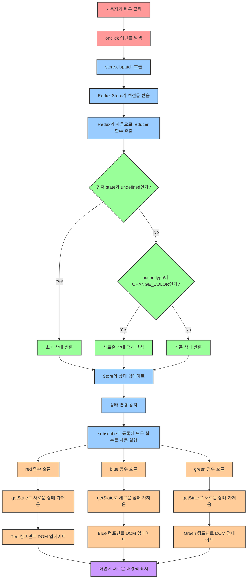
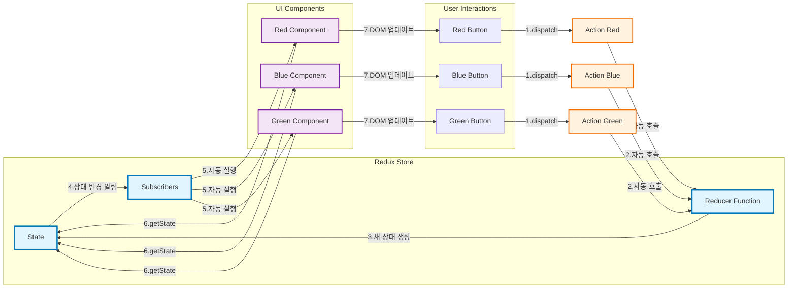

# 1. 아직도 Redux인가?

이 강의를 출시한지도 2년이 흘렀습니다. 그동안 ‘상태관리 툴’은 많은 변화가 있었어요.

# 1. 상태관리란?

상태 관리는 state와 같은 상태를 관리하는 방법입니다. 전역으로 관리하는 방법이 있고, 컴포넌트 단위로도 관리하는 방법이 있습니다. Redux는 전역으로 관리하는 툴입니다.

# 2. 아직도 Redux인가?


25년 6월 기준으로도 아직 1위를 지키고 있지만 이제 곧 Zustand에 순위를 내줄 것으로 보입니다. 다만 그렇다 하더라도, 아직도 많은 채용공고에는 React와 함께 Redux가 올라온 상태입니다.

# 3. Redux란?

공식 홈페이지에서 설명하고 있는 리덕스의 정의를 한 번 보도록 합시다.  

[Redux - A JS library for predictable and maintainable global state management | Redux](https://redux.js.org/)

리덕스는 리액트만을 위한 라이브러리는 아닙니다. React 뿐만 아니라 Vue와도 잘 결합되며, 또한 순수 JS와도 결합이 됩니다. 설치없이 실행할 수 있는 **생활코딩**의 **간단한 예제**를 통해 Redux의 속성을 알아봅시다.

## 3.1 바닐라와 함께 Redux 살펴보기

<aside>
💡 생활코딩은 CCL 라이선스 BY를 따르고 있습니다. 자료의 출처가 생활코딩임을 명시합니다. 자료가 이전 자료여서 Claude 를 통해 현대 버전으로 수정하였습니다.

</aside>

- 관련 영상
    
    [Redux](https://opentutorials.org/module/4078)
    
- 백업 코드
    
    [생활코딩.zip](%EC%83%9D%ED%99%9C%EC%BD%94%EB%94%A9.zip)
    

아래 코드는 리덕스를 사용하지 않은 코드입니다.

```html
<html>
<head></head>
<body>
    <style>
        .container {
            border: 5px solid black;
            padding: 10px;
        }
    </style>
    <div id="red"></div>
    <div id="green"></div>
    <div id="blue"></div>

    <script>
        function red() {
            document.querySelector('#red').innerHTML = `
                <div class="container" id="component_red">
                    <h1>red</h1>
                    <input type="button" value="fire" onclick="
                    document.querySelector('#component_red').style.backgroundColor = 'red';
                    document.querySelector('#component_green').style.backgroundColor = 'red';
                    document.querySelector('#component_blue').style.backgroundColor = 'red';
                    ">
                </div>
            `;
        }
        red();
        function green() {
            document.querySelector('#green').innerHTML = `
                <div class="container" id="component_green">
                    <h1>green</h1>
                    <input type="button" value="fire" onclick="
                    document.querySelector('#component_red').style.backgroundColor = 'green';
                    document.querySelector('#component_green').style.backgroundColor = 'green';
                    document.querySelector('#component_blue').style.backgroundColor = 'green';
                    ">
                </div>
            `;
        }
        green();
        function blue() {
            document.querySelector('#blue').innerHTML = `
                <div class="container" id="component_blue">
                    <h1>blue</h1>
                    <input type="button" value="fire" onclick="
                    document.querySelector('#component_red').style.backgroundColor = 'blue';
                    document.querySelector('#component_green').style.backgroundColor = 'blue';
                    document.querySelector('#component_blue').style.backgroundColor = 'blue';
                    ">
                </div>
            `;
        }
        blue();
    </script>
</body>
</html>
```

아래 코드는 리덕스를 사용한 코드입니다. 설치 없이 사용할 수 있도록 CDN을 사용했습니다. 주석 제거 버전입니다.

```jsx
<!DOCTYPE html>
<html lang="ko">
<head>
    <meta charset="UTF-8">
    <meta http-equiv="X-UA-Compatible" content="IE=edge">
    <meta name="viewport" content="width=device-width, initial-scale=1.0">
    <title>리덕스를 사용해서 상태 관리하기기</title>
    <script src="https://cdnjs.cloudflare.com/ajax/libs/redux/4.0.1/redux.js"></script>
    <style>
        .container {
            border: 5px solid black;
            padding: 10px;
        }
    </style>
</head>
<body>
    <div id="red-component"></div>
    <div id="green-component"></div>
    <div id="blue-component"></div>
    <div id="test-component"></div>
    <script>
        // 바리스타(상태, 주문서)
        const reducer = (state, action) => {
            // 초기 상태(state)를 정의
            if (state === undefined){
                return {
                    color: 'yellow'
                }
            }
            // 주문서(action)에 따라 상태(state)를 변경
            switch (action.type){
                case 'CHANGE_COLOR':
                    return {
                        ...state,
                        color: action.color
                    }
                default:
                    return state;
            }
        }

        // 커피숖
        const store = Redux.createStore(
            reducer,
            // Redux DevTools Extension을 사용하기 위한 설정
            window.__REDUX_DEVTOOLS_EXTENSION__ && window.__REDUX_DEVTOOLS_EXTENSION__()
        );

        // 주문을 받는 점원(주문서를 생성하는 액션 크리에이터 함수수)
        const changeColorAction = (color) => {
            // 주문서(action)를 생성
            return {
                type: 'CHANGE_COLOR',
                color: color,
                timestamp: new Date().toISOString()
            }
        }

        const renderRedComponent = () => {
            const state = store.getState()
            document.getElementById('red-component').innerHTML = `
                <div class="container" id="component_red" style="background-color: ${state.color}">
                    <h1>Red Component</h1>
                    <input type="button" value="Red!" onclick="
                        handleColorChange('red');
                    ">
                </div>
            `
        }
        const renderGreenComponent = () => {
            const state = store.getState()
            document.getElementById('green-component').innerHTML = `
                <div class="container" id="component_green" style="background-color: ${state.color}">
                    <h1>Green Component</h1>
                    <input type="button" value="Green!" onclick="
                        handleColorChange('green');
                    ">
                </div>
            `
        }
        const renderBlueComponent = () => {
            const state = store.getState()
            document.getElementById('blue-component').innerHTML = `
                <div class="container" id="component_blue" style="background-color: ${state.color}">
                    <h1>Blue Component</h1>
                    <input type="button" value="blue!" onclick="
                        handleColorChange('blue');
                    ">
                </div>
            `
        }

        const renderTestComponent = () => {
            const state = store.getState()
            document.getElementById('test-component').innerHTML = `
                <div class="container" id="component_test" style="background-color: ${state.color}">
                    <h1>Test Component</h1>
                    <input type="button" value="Test!" onclick="
                        handleColorChange('yellow');
                    ">
                </div>
            `
        }

        const handleColorChange = (color) => {
            // 주문서를 생성하고 커피숖에 전달
            // store에 dispatch를 하게 되면 reducer가 호출됩니다.
            // reducer는 현재 상태(state)와 주문서(action)를 받아 새로운 상태를 반환합니다.
            store.dispatch(changeColorAction(color))
        }

        // 진동벨 받는 사람(고객)
        store.subscribe(renderRedComponent)
        store.subscribe(renderGreenComponent)
        store.subscribe(renderBlueComponent)

        // 초기 렌더링
        renderRedComponent()
        renderGreenComponent()
        renderBlueComponent()
        renderTestComponent() // 재렌더링 안되는 컴포넌트

    </script>
</body>
</html>
```

AI통해 주석을 넣은 버전입니다.

```html
<!DOCTYPE html>
<html lang="ko">
<head>
    <meta charset="UTF-8">
    <meta name="viewport" content="width=device-width, initial-scale=1.0">
    <title>Modern Redux Color Changer</title>
    <script src="https://cdnjs.cloudflare.com/ajax/libs/redux/4.0.1/redux.js"></script>
    <style>
        .container {
            border: 5px solid black;
            padding: 10px;
        }
    </style>
</head>
<body>
    <div id="red-component"></div>
    <div id="blue-component"></div>
    <div id="green-component"></div>

    <script>
        /**
         * =====================================================
         * REDUX CORE: REDUCER 함수
         * =====================================================
         * Redux의 핵심 - 순수 함수로 상태 변화를 처리
         * 
         * 🔥 핵심 원칙:
         * 1. 순수 함수: 같은 입력에 대해 항상 같은 출력
         * 2. 불변성: 기존 state를 직접 수정하지 않고 새로운 객체 반환
         * 3. 부수 효과 없음: API 호출, DOM 조작 등 금지
         * 
         * @param {Object} state - 현재 애플리케이션 상태
         * @param {Object} action - 상태 변경 명령 객체 (type 필수)
         * @returns {Object} 새로운 상태 객체
         */
        const reducer = (state, action) => {
            console.log('🔄 Reducer 호출:', { 
                currentState: state, 
                action: action,
                timestamp: new Date().toLocaleTimeString()
            });

            // 초기 상태 설정
            // Redux store 생성 시 자동으로 호출되며, 이때 state는 undefined
            if (state === undefined) {
                const initialState = { color: 'yellow' };
                console.log('🌟 초기 상태 설정:', initialState);
                return initialState;
            }

            // Action 타입에 따른 상태 변경 처리
            switch (action.type) {
                case 'CHANGE_COLOR':
                    console.log('🎨 색상 변경:', `${state.color} → ${action.color}`);
                    
                    // 불변성을 위해 spread operator 사용 (ES6+)
                    // Object.assign 대신 더 현대적인 방식
                    const newState = {
                        ...state,  // 기존 상태의 모든 속성 복사
                        color: action.color  // color 속성만 새 값으로 덮어쓰기
                    };
                    
                    console.log('✅ 새로운 상태 생성:', newState);
                    return newState;

                default:
                    // 알 수 없는 action type인 경우 기존 상태 그대로 반환
                    console.log('⚠️ 알 수 없는 액션 타입:', action.type);
                    return state;
            }
        };

        /**
         * =====================================================
         * REDUX STORE 생성 및 설정
         * =====================================================
         * Redux store: 애플리케이션의 상태를 관리하는 중앙 저장소
         */
        const store = Redux.createStore(
            reducer,
            // Redux DevTools Extension 연동 (브라우저 확장 프로그램)
            // 개발 중에만 사용, 프로덕션에서는 제거 권장
            window.__REDUX_DEVTOOLS_EXTENSION__ && window.__REDUX_DEVTOOLS_EXTENSION__()
        );

        console.log('🏪 Redux Store 생성 완료');
        console.log('📊 초기 상태:', store.getState());

        /**
         * =====================================================
         * UTILITY FUNCTIONS
         * =====================================================
         */

        /**
         * 액션 생성자 함수 (Action Creator)
         * 액션 객체 생성을 위한 팩토리 함수
         * @param {string} color - 변경할 색상
         * @returns {Object} Redux 액션 객체
         */
        const changeColorAction = (color) => ({
            type: 'CHANGE_COLOR',
            color: color,
            timestamp: Date.now()  // 추가 메타데이터
        });

        /**
         * =====================================================
         * COMPONENT FUNCTIONS (View Layer)
         * =====================================================
         * 각 컴포넌트는 자신만의 렌더링 로직을 가짐
         * Redux 상태가 변경될 때마다 자동으로 리렌더링
         */

        /**
         * Red 컴포넌트 렌더링 함수
         * store.subscribe()에 의해 상태 변경 시 자동 호출
         */
        const renderRedComponent = () => {
            console.log('🔴 Red 컴포넌트 렌더링 시작');
            
            // 현재 상태를 store에서 가져오기
            const currentState = store.getState();
            
            // 대상 DOM 요소 찾기
            const targetElement = document.querySelector('#red-component');
            
            // HTML 템플릿 리터럴을 사용한 동적 렌더링
            targetElement.innerHTML = `
                <div class="container" style="background-color: ${currentState.color}">
                    <h1>red</h1>
                    <input type="button" value="fire" onclick="handleColorChange('red')">
                </div>
            `;
            
            console.log('✅ Red 컴포넌트 렌더링 완료');
        };

        /**
         * Blue 컴포넌트 렌더링 함수
         */
        const renderBlueComponent = () => {
            console.log('🔵 Blue 컴포넌트 렌더링 시작');
            
            const currentState = store.getState();
            const targetElement = document.querySelector('#blue-component');
            
            targetElement.innerHTML = `
                <div class="container" style="background-color: ${currentState.color}">
                    <h1>blue</h1>
                    <input type="button" value="fire" onclick="handleColorChange('blue')">
                </div>
            `;
            
            console.log('✅ Blue 컴포넌트 렌더링 완료');
        };

        /**
         * Green 컴포넌트 렌더링 함수
         */
        const renderGreenComponent = () => {
            console.log('🟢 Green 컴포넌트 렌더링 시작');
            
            const currentState = store.getState();
            const targetElement = document.querySelector('#green-component');
            
            targetElement.innerHTML = `
                <div class="container" style="background-color: ${currentState.color}">
                    <h1>green</h1>
                    <input type="button" value="fire" onclick="handleColorChange('green')">
                </div>
            `;
            
            console.log('✅ Green 컴포넌트 렌더링 완료');
        };

        /**
         * =====================================================
         * EVENT HANDLERS
         * =====================================================
         */

        /**
         * 색상 변경 이벤트 핸들러
         * 버튼 클릭 시 호출되어 Redux 액션을 디스패치
         * @param {string} color - 변경할 색상
         */
        const handleColorChange = (color) => {
            console.log(`🎯 색상 변경 요청: ${color}`);
            
            // 액션 생성자를 사용하여 액션 객체 생성
            const action = changeColorAction(color);
            
            // Redux store에 액션 디스패치
            // 이로 인해 reducer가 호출되고, 상태가 변경되며, 구독자들이 실행됨
            store.dispatch(action);
            
            console.log('📤 액션 디스패치 완료:', action);
        };

        /**
         * =====================================================
         * SUBSCRIPTION & INITIALIZATION
         * =====================================================
         * Redux store 구독 설정 및 초기 렌더링
         */

        // 상태 변경 감지를 위한 구독자 등록
        // store.subscribe()는 상태가 변경될 때마다 등록된 함수를 자동 실행
        console.log('👂 컴포넌트 구독자 등록 중...');

        store.subscribe(renderRedComponent);
        store.subscribe(renderBlueComponent);
        store.subscribe(renderGreenComponent);

        console.log('✅ 모든 구독자 등록 완료');

        /**
         * =====================================================
         * INITIAL RENDER
         * =====================================================
         * 애플리케이션 시작 시 초기 렌더링 수행
         */
        console.log('🚀 초기 렌더링 시작...');

        // 각 컴포넌트 초기 렌더링
        renderRedComponent();
        renderBlueComponent();
        renderGreenComponent();

        console.log('🎉 애플리케이션 초기화 완료!');

        /**
         * =====================================================
         * REDUX 동작 흐름 정리
         * =====================================================
         * 
         * 1️⃣ 사용자 인터랙션
         *    - 사용자가 버튼 클릭
         *    - handleColorChange() 함수 실행
         * 
         * 2️⃣ 액션 생성 및 디스패치
         *    - changeColorAction()으로 액션 객체 생성
         *    - store.dispatch()로 Redux store에 액션 전달
         * 
         * 3️⃣ Reducer 실행
         *    - Redux가 자동으로 reducer 함수 호출
         *    - 현재 상태(state)와 액션(action)을 매개변수로 전달
         * 
         * 4️⃣ 상태 업데이트
         *    - reducer가 새로운 상태 객체 반환
         *    - Redux가 상태 변경을 감지
         * 
         * 5️⃣ 구독자 실행
         *    - store.subscribe()로 등록된 모든 함수들이 자동 실행
         *    - 각 컴포넌트 렌더링 함수가 순차적으로 호출
         * 
         * 6️⃣ UI 업데이트
         *    - store.getState()로 새로운 상태 조회
         *    - DOM 요소들이 새로운 상태에 맞게 업데이트
         * 
         * 🔄 이 과정이 매번 반복되어 상태와 UI의 동기화 유지
         */

        // 전역 함수로 등록 (onclick 핸들러에서 사용하기 위함)
        window.handleColorChange = handleColorChange;
    </script>
</body>
</html>
```

우리가 앞에서 배운 리액트에서 클릭 이벤트가 발생했을 때, 해당 값들은 Hook을 사용해서 값의 상태를 바꿔준 후 화면에 재렌더링하여서 값들을 보여주었습니다. 즉, `useState`를 사용하여 리액트에게 값의 변경을 알리면 리액트가 UI를 업데이트 하였습니다.

리덕스도 `useState`와 마찬가지로 변하는 값들을 관리해주는 관리 시스템입니다. 차이는 `useState`가 컴포넌트 단위로 상태를 관리했다면, 리덕스는 전역으로 데이터 상태를 관리합니다. 데이터들의 값이 바뀌었을 때 그 값들을 사용하는 모든 컴포넌트들에게 변경된 값을 전달해주고 그 값들을 다시 화면에 보여줍니다.

아래 내용을 살펴보기 전에 리덕스 데브툴스를 설치해 주세요. 그리고 생활코딩의 코드를 VSC의 live Server로 켜놓고 해당 툴을 실행해 보세요. (상태를 다운로드 받아 다시 import하면 그 상태 **그대로를 재생할 수 있습니다**.)

[Redux DevTools](https://chrome.google.com/webstore/detail/redux-devtools/lmhkpmbekcpmknklioeibfkpmmfibljd?hl=ko)


개발자 도구를 열어보면 요소, 콘솔, 소스 메뉴 옆으로 `>>`가 보이실 것입니다. 누르시면 Redux라는 메뉴를 보실 수 있습니다.

1. 클릭한 이벤트를 표시합니다. 이를 통해 어떤 이벤트가 발생되었는지 디버깅이 가능합니다. 또한 이 이벤트를 jump나 skip할 수 있어요.
2. 동영상 보듯이 play가 가능합니다. 이를 통해 어떠한 이벤트가 순차적으로 발생되었는지 확인할 수 있습니다.
3. 이벤트들을 밖으로 내보내거나 가져올 수 있습니다.

## 3.2 Redux Flow

우선 앞에서 배운 React와 Redux의 개념을 한 번 정리하고 가도록 하겠습니다.

- React는 UI 컴포넌트를 사용자 정의 요소로 표현하기 위한 JS 라이브러리.
- Redux는 데이터를 단순하고, 엄격하게 관리함으로서 앱을 예측 가능하게 만들기 위한 JS 라이브러리.
- 공통점 : 복잡한 프로젝트에서 복잡도를 낮춰줌

### 3.2.1 Redux의 흐름

프롬프트는 아래와 같습니다.

```jsx
아래 코드를 보고 Redux 흐름을 mermaid로 그려줘!

... 코드 ...
```

해당 코드는 코드로 복사해서 live mermaid에서 확대해서 보는 것을 권합니다.

[Online FlowChart & Diagrams Editor - Mermaid Live Editor](https://mermaid.live/edit)

- 현재 예제에서의 흐름



- Redux 내부 상태에서 호출 흐름



### 3.2.2 비유를 통한 예시

어렵죠? 그럼 아래와 같이 비유를 해보도록 하겠습니다.

- 손님: 프로그래머와 유저
- 점원: Redux에 기본 메서드들


- **store** 만들기 : 카페에 바리스타(reducer)가 없으면 안 됩니다. 스토어에는 저장하고 싶은 사용자의 상태를 저장합니다.  `createStore`함수를 사용하여 만들 수 있으며, 한 개의 프로젝트 당 하나의 store만 가질 수 있습니다.
    
    ```jsx
    const store = Redux.createStore(reducer);
    ```
    
    어떤 컴포넌트에서든지 변화가 일어날 데이터(상태값)는 모두 하나의 스토어에 넣습니다. 데이터를 한 곳에 모아놓기 때문에 에러가 발생했을 때 각각의 컴포넌트에 가서 값을 확인할 필요없이 데이터가 저장되어 있는 store에 가서 확인하면 됩니다. 스토어만 관리하면 되는 것이죠.
    
- **reducer** 만들기 : 바리스타를 통하지 않고 고객이(프로그래머가) 직접 커피를(데이터) 만들(조작할) 수 없습니다. 데이터를 보다 안전하게 관리하기 위해서입니다.
    
    ```jsx
    function reducer(state, action) {
        // 커피 제조
    }
    ```
    
    state는 reducer를 통해서만 값을 처리할 수 있습니다. reducer는 전달된 액션(action)과 이전 state값을 가지고 어떻게 값을 처리해줘야할지 결정합니다. 실제 값의 변경이 일어나서 reducer가 호출되면 액션(action)에 따라서 값이 바뀌게 되고 새로운 state값을 반환합니다.
    
    예를 들어 아래의 코드에서는 “ADD”라는 `action.type`이 reducer에게 전달되었을 때, ADD에 해당하는 값을 수정한 뒤 반환합니다.
    
    만약 액션이 “ADD”와 “DELETE”가 아니라면 기존 상태 값을 반환합니다.
    
    ```jsx
    const reducer = (state = 0, action) => {
      switch (action.type) {
        case "ADD":
          return state + 1;
        case "DELETE":
          return state - 1;
        default:
          return state;
      }
    };
    ```
    
    reducer의 첫번째 매개변수인 state는 처음 호출될 때, `undefined`가 됩니다. 그래서 초기값을 지정해줘야합니다. 
    
- **render** 만들기(서빙 점원) : 실제 화면에 뿌려주는 역할을 합니다. 이때 서빙 점원은 `var state = store.getState();`를 통해 데이터를 받아야 합니다.
    
    ```jsx
    function red() {
        var state = store.getState();
        // render(innerHTML로 구현)
    }
    function blue() {
        var state = store.getState();
        // render(innerHTML로 구현)
    }
    function green() {
        var state = store.getState();
        // render(innerHTML로 구현)
    }
    ```
    
- **subscribe** : 굳이 비유를 하자면, 진동벨입니다. 주문이 완료되면 진동벨이 울리고 점원을 통해 구독했던 모든 컴포넌트의 state값이 교체됩니다. 즉, 새로운 데이터가 생성될 때마다 화면을 갱신하는 것입니다.
    
    ```jsx
    function red() { ... 중략 ... }
    store.subscribe(red); // 이 red는 구독한 함수, 값 X
    
    function blue() { ... 중략 ... }
    store.subscribe(blue);
    
    function green() { ... 중략 ... }
    store.subscribe(green);
    ```
    
    `subscribe` 함수는 액션에 의해 상태가 업데이트 될 때마다 실행됩니다. 
    
- **action과 dispatch** : 주문서로(action) 점원에게 주문을(dispatch) 하면 바리스타(reducer)에게 주문서를 넘기는 역할을 합니다.
    
    ```jsx
    function red() {
        // store.dispatch({type:'CHANGE_COLOR', color:'red'});
    }
    ```
    
    액션 객체는 type 필드를 반드시 가지고 있어야 합니다. reducer 함수가 이 type 필드값과 이전 state값을 참고해서 새로운 state를 만들기 때문입니다. 
    
    ```jsx
    // Example 1
    { 
        type: "ADD",
    		id : 1,	
    }
    
    // Example 2
    { 
        type : "ADD",
    	  data : {
    		    id : 1,
    		    text : 'Have a lunch'
    	}
    }
    ```
    
    이렇게 매번 객체를 전달해주는 것은 여간 번거로운 일이 아닐 것입니다. 그래서 객체로 만들어주는 액션 생성 함수를 만들어 사용합니다. 이는 실수를 줄여 보다 견고한 코드를 작성할 수 있게 만듭니다.
    
    ```jsx
    const addNumber = () => {
      return { type: "ADD" };
    };
    ```
    
    디스패치는 스토어의 내장 함수 중 하나로 `dispatch`를 통해 reducer 함수를 동작시킵니다. reducer 함수에게 state값과 action을 넘겨주려면 `dispatch`를 사용하여 넘겨주면 됩니다. 
    
    파라미터로는 액션 객체를 넣어줍니다. 이때 액션 객체를 직접 선언하는 대신 기존에 만든 액션 생성 함수(액션 객체를 반환하는 함수)를 넣어서 실행시켜도 됩니다.
    
    ```jsx
    store.dispatch(addNumber); // store.dispatch({ type: "ADD" })
    ```
    
- **(getState)** 커피(데이터)를 가져오는 점원!
    
    `getState`를 사용하면 store안에 있는 현재의 state값을 가져올 수 있습니다. `subscribe` 함수와 함께 사용하면 업데이트된 state값을 확인할 수 있습니다.(`subscribe`는 상태가 업데이트 될 때 실행됩니다.)
    
    ```jsx
    store.getState();
    ```
    
- (action → dispatch → reducer → state변경 → subscribe → render → getState → state) : 비유로는 설명이 어려워 해당 프로세스는 code의 flow대로 설명하도록 하겠습니다.
    1. dispatch가 일어납니다.
    2. subscribe으로 해당 action이 들어옵니다.
    3. state를 수정합니다.
    4. subscribe을 통하여 값이 subscribe에 등록된 모든 요소에 state가 수정되었음을 전파합니다.
    5. render에서 getState를 통해 값을 새로 받아옵니다.
    6. 다시 render합니다.

<aside>
💡 **replaceReducer()**

리듀서를 변경할 때 사용되며 잘 사용하지 않는 함수입니다. 하나의 스토어에 반드시 하나의 리듀서만 있어야 하는것은 아니며, 리듀서를 ‘변경할 수도 있다.’ 정도로만 캐치하고 넘어가 주시기 바랍니다. 

</aside>

# 2. 데이터는 어떻게 변경될까요?

React에서 상태 값을 바꿀 때는 `useState`가 제공하는 `setState`를 사용하였습니다. 하지만 앞으로 사용할 redux에서는 state 자체에 접근하는 것도 직접 수정하는 것도 불가능합니다. 대신 `Reducer` 함수에게 수정을 요청합니다.


위니브

```jsx
const reducer = (state = 0, action) => {
  switch (action.type) { // action.type이 "PLUS"라면 state 값을 1 더할 것입니다.
    case "PLUS":
      return state + 1;
    case "MINUS":        // action.type이 "MINUS"라면 state 값을 1 뺼 것입니다.
      return state - 1;
    default:
      return state; // 기존 state 반환.
      // action.type이 "PLUS, MINUS" 모두 아니라면 state 값의 변화는 없습니다.
  }
};
```

# 3. Redux를 사용하는 이유

상태 값을 전역으로 관리해주는 `useContext`와의 차이점이 무엇일까요? `useContext`도 불필요한 props 전달을 막고 전역으로 값들을 관리해주는데 말이죠.

좋은 아티클이 있어 공유합니다. 아래 내용을 참고해 주세요.

[Context API vs Redux](https://olaf-go.medium.com/context-api-vs-redux-e8a53df99b8)

React useContext는 상태를 관리하지 않습니다. 상태는 Context의 값을 꺼내서 사용하는 useState가 관리하죠. 또한 useContext의 목적은 React의 prop-drilling을 피하는 것입니다. 하지만 프로젝트가 클수록 관리해야 할 값들은 많아지고 Provider를 더 많이 사용하게 되면서 provider안에 provider로 깊은 중첩 관계가 될 수 있습니다. 반면에 리덕스는 데이터를 저장함과 동시에 상태를 관리하며, 단일한 저장소를 사용하기 때문에 여러개의 store가 중첩되는 경우도 없습니다.

```jsx
<AuthContextProvider>
		<UIContextProvider>
.
.
.
				<UserForm/>
.
.
.
		</UIContextProvider>
</AuthContextProvider>
```

그리고 Redux는 React와는 다른 라이브러리입니다. Vue에서도 사용할 수 있고 순수한 JS에서도 사용할 수 있습니다. 어떠한 프레임워크 환경에서 개발하든 JS를 사용하는 프로젝트라면 **거대한** **규모의 프로젝트 상태 관리를** 보다 손쉽게 관리하도록 도와줍니다**.**

아래 영상에서 상태 관리가 복잡해질 경우 얼마나 많은 복잡도가 향상되는지 잘 설명하고 있습니다.

[Redux - 3. Redux가 좋은 가장 중요한 이유](https://youtu.be/ijdFixuK1nI?list=PLuHgQVnccGMB-iGMgONoRPArZfjRuRNVc)

변수의 수가 컨트롤 가능한 정도의 복잡하지 않은 프로젝트에서는 React에 내장되어 있는 Context를 사용하는 것이 좋을 수 있습니다. 프로젝트에서의 리덕스 **교육 비용과 효용을 잘 저울질할 필요**가 있습니다.

또한, Context에서는 가지고 있는 state가 하나만 변경되어도 Context의 값을 가지고 있는 모든 컴포넌트가 렌더링이 되어버립니다. 

예를 들어, 아래와 같은 컨텍스트와 컴포넌트들이 있다고 가정해 봅시다.

```
context = {a:1, b:2, c:3}

A 컴포넌트 : context에서 b와 c 사용
B 컴포넌트 : context에서 a 사용
```

여기서 a를 사용하고 있는 B 컴포넌트에서 a를 변경하면, A 컴포넌트는 b와 c만 사용하고 있음에도 리렌더링이 되어버립니다. 이런 상황처럼 컨텍스트를 사용하면 바뀔 필요가 전혀 없는 컴포넌트에서 불필요한 렌더링이 발생하게 됩니다.

만약 프로젝트가 커지면 더욱 비효율적이게 되겠죠? 물론 이런 문제를 해결하는 방법은 있지만(ex: 컨텍스트를 여러개 만들어 데이터를 잘게 쪼갠다.) 매우 불편합니다.

리덕스는 이러한 문제를 막아줍니다. a가 변경되면 a를 사용하는 컴포넌트만 리렌더링을 하게 최적화를 시켜줍니다. 이런 점이 관리를 더욱 편하게 해줍니다. 이렇게 전역 state값을 사용함에 있어서 Context보다 최적화가 잘 되어 있고, 상태관리도 해주는 등의 편의성 때문에 redux를 사용합니다.

# 4. 바닐라JS에서 직접 만들어보기

## 4.1 Redux 설치하기

환경에 따라 설치한 후 실습해보시길 바랍니다.

```jsx
<script src="https://cdnjs.cloudflare.com/ajax/libs/redux/4.2.0/redux.js"></script>
```

## 4.2 요구사항

google font 사이트와 같은 사이트를 만들 것입니다. 여기서 sentence에 text를 입력하면 모든 font box에 반영이 됩니다. 이 기능을 구현해보도록 하겠습니다.

[Google Fonts](https://fonts.google.com/)


최종 화면은 아래와 같습니다. 

- Click Me : 입력한 텍스트 반영
- Rounded, Circle, Rect : 모든 박스에 각각 border-radius 10px, 15px, 0px 반영
- Red, Green, Blue : 모든 박스에 Border color 변경


## 4.3 정답코드

- CDN으로 작성한 google font clone 코드 (꼭 다 푸신 다음 확인하세요.)
    
    ```jsx
    <!DOCTYPE html>
    <html>
    
    <head>
        <script src="https://cdnjs.cloudflare.com/ajax/libs/redux/4.0.1/redux.js"></script>
        <link rel="preconnect" href="https://fonts.googleapis.com">
        <link rel="preconnect" href="https://fonts.gstatic.com" crossorigin>
        <link
            href="https://fonts.googleapis.com/css2?family=Anek+Malayalam:wght@300&family=Fascinate&family=Kdam+Thmor+Pro&family=Noto+Sans+KR:wght@300&family=Open+Sans&family=Roboto:wght@300&display=swap"
            rel="stylesheet">
        <style>
            .container {
                border: 5px solid black;
                padding: 10px;
                display: grid;
                grid-template-columns: repeat(3, 1fr);
                gap: 10px;
            }
    
            .item {
                border: 5px solid #f6866a;
                height: 100px;
                padding: 20px;
                font-size: 32px;
            }
    
            .item:nth-child(1) {
                font-family: 'Anek Malayalam', sans-serif;
            }
    
            .item:nth-child(2) {
                font-family: 'Fascinate', cursive;
            }
    
            .item:nth-child(3) {
                font-family: 'Kdam Thmor Pro', sans-serif;
            }
    
            .item:nth-child(4) {
                font-family: 'Noto Sans KR', sans-serif;
            }
    
            .item:nth-child(5) {
                font-family: 'Open Sans', sans-serif;
            }
    
            .item:nth-child(6) {
                font-family: 'Roboto', sans-serif;
            }
        </style>
    </head>
    
    <body>
        <input type="text" id="inputText">
        <input type="button" value="눌러버렷!" onclick="
            const value = document.getElementById('inputText').value
            store.dispatch({type:'TEXT', text:value})
        " />
        <input type="button" value="Rounded!" onclick="
            store.dispatch({type:'STYLE_BORDER', borderRadius:'10px'})
        " />
        <input type="button" value="Circle!" onclick="
            store.dispatch({type:'STYLE_BORDER', borderRadius:'20px'})
        " />
        <input type="button" value="Rect!" onclick="
            store.dispatch({type:'STYLE_BORDER', borderRadius:'0px'})
        " />
        <input type="button" value="Red!" onclick="
            store.dispatch({type:'STYLE_BORDER_COLOR', border:'5px solid red'})
        " />
        <input type="button" value="Green!" onclick="
            store.dispatch({type:'STYLE_BORDER_COLOR', border:'5px solid green'})
        " />
        <input type="button" value="Blue!" onclick="
            store.dispatch({type:'STYLE_BORDER_COLOR', border:'5px solid blue'})
        " />
        <br>
        <br>
        <div class="container">
            <div id="item1" class="item"></div>
            <div id="item2" class="item"></div>
            <div id="item3" class="item"></div>
            <div id="item4" class="item"></div>
            <div id="item5" class="item"></div>
            <div id="item6" class="item"></div>
        </div>
    
        <script>
            const store = Redux.createStore(reducer)
            function reducer(state, action) {
                console.log(state, action)
                if (state === undefined) {
                    return {
                        text: 'hello',
                        color: 'black',
                        border: '5px solid #f6866a',
                        borderRadius: '0px'
                    }
                } else if (action.type === 'TEXT') {
                    return {
                        ...state,
                        text: action.text
                    }
                } else if (action.type === 'STYLE_BORDER') {
                    return {
                        ...state,
                        borderRadius: action.borderRadius
                    }
                } else if (action.type === 'STYLE_BORDER_COLOR') {
                    return {
                        ...state,
                        border: action.border
                    }
                }
            }
            function item1() {
                const state = store.getState()
                const $item = document.querySelector('#item1')
                $item.innerText = `${state.text}`
                $item.style.borderRadius = `${state.borderRadius}`
                $item.style.border = `${state.border}`
            }
            store.subscribe(item1)
            item1()
    
            function item2() {
                const state = store.getState()
                const $item = document.querySelector('#item2')
                $item.innerText = `${state.text}`
                $item.style.borderRadius = `${state.borderRadius}`
            }
            store.subscribe(item2)
            item2()
    
            function item3() {
                const state = store.getState()
                const $item = document.querySelector('#item3')
                $item.innerText = `${state.text}`
                $item.style.borderRadius = `${state.borderRadius}`
            }
            store.subscribe(item3)
            item3()
    
            function item4() {
                const state = store.getState()
                const $item = document.querySelector('#item4')
                $item.innerText = `${state.text}`
                $item.style.borderRadius = `${state.borderRadius}`
            }
            store.subscribe(item4)
            item4()
    
            function item5() {
                const state = store.getState()
                const $item = document.querySelector('#item5')
                $item.innerText = `${state.text}`
                $item.style.borderRadius = `${state.borderRadius}`
            }
            store.subscribe(item5)
            item5()
    
            function item6() {
                const state = store.getState()
                const $item = document.querySelector('#item6')
                $item.innerText = `${state.text}`
                $item.style.borderRadius = `${state.borderRadius}`
            }
            store.subscribe(item6)
            item6()
        </script>
    </body>
    
    </html>
    ```
    

## 4.4 추가 문제

Airbnb와 비슷한 서비스를 만들어보도록 하겠습니다. 오른쪽에 있는 지도는 구현할 필요가 없고, 위 Google fonts 서비스를 참고하여 ‘무료 주차 공간, 대형 욕조, 바베큐 그릴, 게스트용 별채, 수영장, 주방, TV’에 따라 각 방들의 테두리가 변하게, 또는 나타나게 해주세요.

일반 JavaScript의 filter를 사용한 것과 어떤 차이가 있는지도 비교해보세요.

1. 가능하면 위 Google Fonts 정답을 보면서 직접 짜보려 해보세요.
2. 어려우시면 LLM에게 힌트 정도를 구해보세요.
3. 그래도 못풀겠다면 LLM에게 문제 전체를 Google Fonts 코드와 함께 올리고, 정답을 받은 다음, 꼭 손으로 써보세요.


- 정답 코드
    
    ```jsx
    <!DOCTYPE html>
    <html>
    
    <head>
        <script src="https://cdnjs.cloudflare.com/ajax/libs/redux/4.0.1/redux.js"></script>
        <style>
            body { 
                font-family: Arial, sans-serif; 
                padding: 20px; 
            }
            
            .filter-btn { 
                padding: 8px 16px; 
                margin: 5px; 
                border: 2px solid #ddd; 
                background: white; 
                cursor: pointer; 
            }
            
            .filter-btn.active { 
                background: #ff5a5f; 
                color: white; 
            }
            
            .listing { 
                border: 3px solid #ddd; 
                padding: 15px; 
                margin: 10px 0; 
            }
            
            .listing.hidden { 
                display: none; 
            }
            
            .amenity { 
                display: inline-block; 
                background: #f0f0f0; 
                padding: 2px 6px; 
                margin: 2px; 
                font-size: 12px; 
            }
            
            .amenity.highlight { 
                background: #ff5a5f; 
                color: white; 
            }
        </style>
    </head>
    
    <body>
        <h1>Redux Airbnb 필터링</h1>
        
        <div>
            <h3>편의시설 필터:</h3>
            <button class="filter-btn" onclick="toggleFilter('무료 주차 공간')">무료 주차 공간</button>
            <button class="filter-btn" onclick="toggleFilter('대형 욕조')">대형 욕조</button>
            <button class="filter-btn" onclick="toggleFilter('바베큐 그릴')">바베큐 그릴</button>
            <button class="filter-btn" onclick="toggleFilter('게스트용 별채')">게스트용 별채</button>
            <button class="filter-btn" onclick="toggleFilter('수영장')">수영장</button>
            <button class="filter-btn" onclick="toggleFilter('주방')">주방</button>
            <button class="filter-btn" onclick="toggleFilter('TV')">TV</button>
        </div>
    
        <div id="resultsInfo"></div>
    
        <div id="listingsContainer">
            <!-- 숙소 목록이 여기에 렌더링 -->
        </div>
    
        <script>
            // 샘플 데이터
            const listings = [
                { id: 1, title: "도심 아파트", location: "강남구", price: "85,000원", amenities: ["무료 주차 공간", "주방", "TV"] },
                { id: 2, title: "럭셔리 펜트하우스", location: "한남동", price: "250,000원", amenities: ["대형 욕조", "수영장", "게스트용 별채", "주방", "TV"] },
                { id: 3, title: "바다뷰 펜션", location: "해운대", price: "120,000원", amenities: ["바베큐 그릴", "주방", "무료 주차 공간"] },
                { id: 4, title: "산속 별장", location: "평창", price: "95,000원", amenities: ["바베큐 그릴", "게스트용 별채", "무료 주차 공간", "TV"] },
                { id: 5, title: "모던 스튜디오", location: "홍대", price: "65,000원", amenities: ["주방", "TV"] },
                { id: 6, title: "리조트 빌라", location: "제주도", price: "180,000원", amenities: ["수영장", "대형 욕조", "바베큐 그릴", "무료 주차 공간", "주방", "TV"] }
            ];
    
            // Redux 스토어 생성
            const store = Redux.createStore(reducer);
    
            function reducer(state, action) {
                console.log('Redux Action:', action); // Redux 액션 로깅
                
                if (state === undefined) {
                    return {
                        listings: listings,
                        activeFilters: [],
                        filteredListings: listings
                    };
                }
    
                if (action.type === 'TOGGLE_FILTER') {
                    const newFilters = state.activeFilters.includes(action.filter)
                        ? state.activeFilters.filter(f => f !== action.filter)
                        : [...state.activeFilters, action.filter];
                    
                    const filteredListings = newFilters.length === 0 
                        ? state.listings
                        : state.listings.filter(listing => 
                            newFilters.every(filter => listing.amenities.includes(filter))
                        );
    
                    return {
                        ...state,
                        activeFilters: newFilters,
                        filteredListings: filteredListings
                    };
                }
    
                return state;
            }
    
            // 액션 디스패치
            function toggleFilter(filter) {
                store.dispatch({ type: 'TOGGLE_FILTER', filter: filter });
            }
    
            // UI 업데이트 함수들
            function updateUI() {
                const state = store.getState();
                console.log('Current State:', state); // 현재 상태 로깅
                
                // 필터 버튼 업데이트
                document.querySelectorAll('.filter-btn').forEach(btn => {
                    const filterText = btn.textContent.trim();
                    btn.classList.toggle('active', state.activeFilters.includes(filterText));
                });
    
                // 결과 정보 업데이트
                const resultsInfo = document.getElementById('resultsInfo');
                resultsInfo.innerHTML = `<p><strong>활성 필터:</strong> ${state.activeFilters.join(', ') || '없음'} | <strong>결과:</strong> ${state.filteredListings.length}개 숙소</p>`;
    
                // 숙소 목록 업데이트
                const container = document.getElementById('listingsContainer');
                container.innerHTML = state.filteredListings.map(listing => `
                    <div class="listing">
                        <h4>${listing.title} - ${listing.location}</h4>
                        <p>가격: ${listing.price}</p>
                        <p>편의시설: 
                            ${listing.amenities.map(amenity => 
                                `<span class="amenity ${state.activeFilters.includes(amenity) ? 'highlight' : ''}">${amenity}</span>`
                            ).join(' ')}
                        </p>
                    </div>
                `).join('');
            }
    
            // 스토어 구독 - 상태가 변경될 때마다 UI 업데이트
            store.subscribe(updateUI);
    
            // 초기 렌더링
            updateUI();
            /*
            Claude에게 지금 프로젝트가 오버엔지니어링이 아니냐고 물어봤을 때 답변입니다.
    
            ## 🤔 현재 프로젝트에서는 Redux가 과한 이유
    
            **일반 Filter 방식:**
            ```javascript
            let activeFilters = [];
            function toggleFilter(filter) {
                if (activeFilters.includes(filter)) {
                    activeFilters = activeFilters.filter(f => f !== filter);
                } else {
                    activeFilters.push(filter);
                }
                updateUI();
            }
            ```
            - 코드 10줄로 끝
            - 이해하기 쉬움
            - 성능도 충분
    
            **Redux 방식:**
            - 코드 50줄 이상
            - 개념 학습 필요 (store, reducer, action, dispatch)
            - 설정이 복잡
    
            ## 🚀 Redux가 진짜 필요한 상황들
    
            ### 1. **복잡한 상태 공유**
            ```javascript
            // 여러 컴포넌트에서 같은 데이터를 사용할 때
            - Header: 로그인 상태, 장바구니 개수
            - Sidebar: 사용자 정보
            - Main: 상품 목록
            - Footer: 알림 개수
            ```
    
            ### 2. **상태 변화의 복잡성**
            ```javascript
            // 하나의 액션이 여러 상태를 동시에 변경
            - "상품 구매" 버튼 클릭 시:
            * 재고 수량 감소
            * 장바구니에서 제거
            * 주문 내역에 추가
            * 포인트 적립
            * 알림 생성
            ```
    
            ### 3. **디버깅이 중요한 경우**
            ```javascript
            // 버그 발생 시 "어떤 순서로 상태가 변했는지" 추적 필요
            - 은행 앱: 잔액 변화 추적
            - 게임: 점수/레벨 변화 추적
            - 전자상거래: 주문 과정 추적
            ```
    
            ### 4. **실제 Airbnb 같은 서비스라면?**
            ```javascript
            // 실제로는 이런 복잡한 상태들이 있음:
            {
            user: { id, name, preferences },
            filters: { amenities, price, location, dates },
            listings: { data, loading, error },
            booking: { selectedDates, guestCount, totalPrice },
            map: { center, zoom, markers },
            reviews: { data, rating },
            payments: { methods, processing }
            }
            ```
    
            ## 🎯 예측 가능한 상태 변화가 중요한 이유
    
            ### 버그 발생 시나리오:
            ```javascript
            // 일반 방식 - 어디서 상태가 변했는지 모름
            function someFunction() {
                activeFilters.push("수영장");
                // ... 100줄 후
                activeFilters = []; // 누가 언제 이걸 했지?
            }
    
            // Redux 방식 - 모든 변화가 기록됨
            // Action Log:
            // 1. { type: 'ADD_FILTER', filter: '수영장' }
            // 2. { type: 'CLEAR_FILTERS' }
            ```
    
            ## 💡 결론: 언제 Redux를 써야 할까?
    
            **❌ Redux 필요 없는 경우:**
            - 단순한 필터링, 검색
            - 컴포넌트 1-2개
            - 상태가 간단함
            - 개인 프로젝트나 프로토타입
    
            **✅ Redux 고려해야 하는 경우:**
            - 컴포넌트 5개 이상에서 같은 상태 공유
            - 복잡한 비즈니스 로직
            - 팀 프로젝트 (상태 변화 규칙 통일)
            - 사용자 액션 추적이 중요한 앱
    
            **현재 프로젝트는 학습용이라 Redux를 쓰지만, 실제로는 일반 filter가 더 적합합니다!** Redux는 "복잡한 상태 관리가 필요할 때의 해결책"이지, "모든 상황의 정답"은 아니에요.
            */
        </script>
    </body>
    
    </html>
    ```