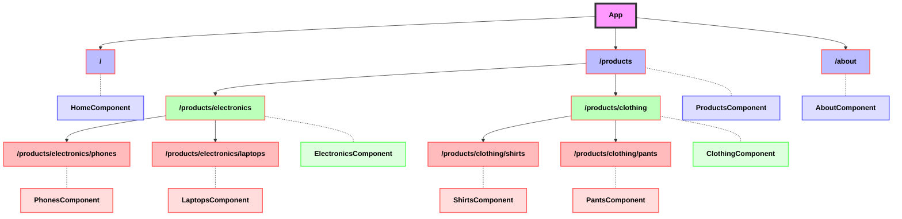

# 13. React Router

<aside>
💡 v6은 2021년 11월에 나왔습니다. 바뀐 부분은 하단에 명시되어 있으며 해당 강의자료는 v6로 진행됩니다. 기존에 있었던 React Router v4/5 docs 기준 강의자료를 가장 하단에 **백업 페이지**로 남겨두었으니 참고 바랍니다.

22년 11월 기준 6.4.3 Version
24년 11월 기준으로 7 버전이 안정화되었습니다.

</aside>

V6 : [https://reactrouter.com/en/main](https://reactrouter.com/en/main)

V5 : [https://v5.reactrouter.com/](https://v5.reactrouter.com/web/guides/quick-start)

# 1. 설치하기

먼저 라우트 설정을 위해 react-router-dom 을 설치해 주겠습니다.

```bash
npm install react-router-dom
```

<aside>
🧐 혹시 에러가 발생하나요?

설치를 할 때 Window에서 `[eslint] Plugin "react" was conflicted`애러를 만나실 수 있습니다. 이는 플러그인 충돌로 나오는 문제이며 이를 해결하기 위해 Git Bash 터미널 창을 하나 더 여셔서 작업하시는 것을 권해드립니다. 아래 작업으로 문제를 해결할 수 있으나 굳이 다운그래이드를 하시는 것을 권하지 않습니다.

```
<추천하지 않는 해결법>
1. (작동시에만 문제 없도록, 빌드되도 문제 안생깁니다.) package.json 파일을 열고, Ctrl + S 로 저장해주기
2. eslint-config-react-app 버전을 6으로 다운그래이드
	- 현재 버전 삭제 : npm remove eslint-config-react-app
	- 다운그래이드 설치 : npm install eslint-config-react-app@6
```

</aside>

# 2. BrowserRouter, Routes, Route

우선 간단한 실습을 통해 BrowserRouter, Routes, Route가 어떤 역할을 하는지 설명해드리도록 하겠습니다.

```jsx
import { BrowserRouter, Routes, Route } from "react-router-dom";

function App() {
  return (
    <BrowserRouter>
      {/* 라우트를 감싸줍니다. */}
      <Routes>
        <Route path="/" element={<Index />}/>
        <Route path="/one" element={<One />}/>
        <Route path="/two" element={<Two />}/>
        <Route path="/three" element={<Three />}/>
      </Routes>
    </BrowserRouter>
  );
}

function Index(){
  return <h1>hello world0</h1>
}

function One(){
  return <h1>hello world1</h1>
}

function Two(){
  return <h1>hello world2</h1>
}

function Three(){
  return <h1>hello world3</h1>
}

export default App;
```

위 코드에서 우리는 세 가지 컴포넌트를 불러옵니다. 

1. BrowserRouter 컴포넌트 :  UI와 URL을 연결합니다. 마치 MPA과 같이 URL을 사용할 수 있게합니다.
2. Routes 컴포넌트 : URL이 변경되면  `<Routes>` 는 모든 자식 `<Route>`
를 살펴보고 가장 알맞는 것을 매칭합니다.
3. Route 컴포넌트 : 현재 URL과 매칭된 UI를 렌더링 하는 역할을 합니다.

<aside>
💡 **<BrowserRouter vs HashRouter>**

둘 모두 리엑트가 URL주소에 따라 구성 요소를 매칭하여 렌더링 하기 위한 방법들로 아래와 같은 차이를 볼 수 있습니다.

BrowserRouter는 페이지를 라우팅할 때 실제로 해당 URL에 html 파일이 존재하는것은 아니지만 URL을 통해 마치 서버의 폴더를 이동하는것 처럼 보여줍니다. www.myApp.com/pages/home/index.html

이는 SPA임에도 불구하고 마치 MPA처럼 보여지기 때문에 검색엔진에서 로봇으로 웹사이트를 탐색할 때 크롤링이 가능합니다.

또한 JS의 History API ([https://developer.mozilla.org/en-US/docs/Web/API/History_API](https://developer.mozilla.org/en-US/docs/Web/API/History_API))를 사용하기 때문에 **BrowserRouter 는 IE 9이하는 지원하지 않습니다.**

HashRouter 는 URL주소에 #값을 넣어 표시합니다. 주소상의 #은 fragment identifier 라 불리며 컨텐츠 안에서의 특정한 위치를 나타냅니다. (대표적으로 내부링크를 예로 들 수 있습니다.) 이는 서버의 폴더구조를 이동하는것 과는 전혀 다른 모습이기 때문에 로봇을 통한 크롤링이 불가능해지고 결국 SEO에 악영향을 미칩니다.

하지만 HashRouter는 레거시 브라우저에서도 작동이 가능합니다.

</aside>

<aside>
💡 V6에서는 exact 키워드가 빠졌습니다. Routes키워드가 나오고 Swich키워드는 없어졌습니다. 참고 바랍니다.
Switch : ([https://v5.reactrouter.com/web/api/Switch](https://v5.reactrouter.com/web/api/Switch))   
Routes : ([https://reactrouter.com/docs/en/v6/components/routes](https://reactrouter.com/docs/en/v6/components/routes))

</aside>

### 2.1 **Component props 전달하기**

One 컴포넌트에 props를 전달해봅시다. 

```jsx
import { BrowserRouter, Routes, Route } from "react-router-dom";

function App() {
  return (
    <BrowserRouter>
      {/* 라우트를 감싸줍니다. */}
      <Routes>
        <Route path="/" element={<Index />}/>
        <Route path="/one" element={<One name='licat' />}/>
        <Route path="/two" element={<Two />}/>
        <Route path="/three" element={<Three />}/>
      </Routes>
    </BrowserRouter>
  );
}

function Index(){
  return <h1>hello world0</h1>
}

function One({name}){
  return <h1>{name} world1</h1>
}

function Two(){
  return <h1>hello world2</h1>
}

function Three(){
  return <h1>hello world3</h1>
}

export default App;
```

이전 버전에서 props를 전달하는 방법을 한 번 보도록 하겠습니다. 어떠신가요? 확실히 보기 편해졌죠?

```jsx
<Route path="/hello" exact render={() => <Hello name="개리" />} />
```

## 2.2 Link

**`Link`**는 React Router에서 제공하는 컴포넌트 중 하나로, 클릭하면 애플리케이션 내에서 새로운 경로로 이동하는 링크를 생성하는 컴포넌트입니다.

<aside>
💡 link는 주소만 바꿀 뿐, 페이지를 새로 불러오진 않습니다.

</aside>

```jsx
<Link to="/about">home</Link>
```

```jsx
import { BrowserRouter, Routes, Route, Link } from "react-router-dom";

function App() {
  return (
    <BrowserRouter>
      <Link to="/"> home </Link>
      <Link to="/one"> one </Link>
      <Link to="/two"> two </Link>
      <Link to="/three"> three </Link>
      {/* 라우트를 감싸줍니다. */}
      <Routes>
        <Route path="/" element={<Index />}/>
        <Route path="/one" element={<One name='licat' />}/>
        <Route path="/two" element={<Two />}/>
        <Route path="/three" element={<Three />}/>
      </Routes>
    </BrowserRouter>
  );
}

function Index(){
  return <h1>hello world0</h1>
}

function One({name}){
  return <h1>{name} world1</h1>
}

function Two(){
  return <h1>hello world2</h1>
}

function Three(){
  return <h1>hello world3</h1>
}

export default App;
```

to 속성에는 접근할 경로가 들어갑니다. 문자열이나 객체의 형태로 경로를 넣어줄 수 있습니다.

문자열의 경우 html 태그의 `<a>` 의 속성 `href` 에 넣어주는 값처럼 절대 경로 또는 상대 경로를 문자열의 형태로 작성해주면 됩니다. 

객체로 넣어줄 경우 pathname, search, hash, state 프로퍼티의 값들을 넣어서 객체 형태로 작성합니다.

- **`pathname`**: 이동할 경로를 나타내는 문자열입니다. 예를 들어, **`to="/about"`** 과 같이 사용할 수 있습니다.
- **`search`**: 쿼리스트링을 나타내는 문자열입니다. **`to={{ pathname: '/about', search: '?sort=name' }}`** 와 같이 객체 형태로 전달할 수 있습니다. 이 경우 쿼리스트링 **`?sort=name`** 이 포함된 **`/about`** 경로로 이동합니다.
- **`state`**: 이동할 경로와 함께 전달할 상태 정보입니다. **`to={{ pathname: '/about', state: { fromDashboard: true } }}`** 와 같이 객체 형태로 전달할 수 있습니다. 이 경우 **`/about`** 경로로 이동하면서 **`fromDashboard: true`** 라는 상태 정보를 함께 전달합니다.
- **`hash`**: URL의 해시를 나타내는 문자열입니다. **`to={{ pathname: '/about', hash: '#contact' }}`** 와 같이 객체 형태로 전달할 수 있습니다. 이 경우 **`/about#contact`** 경로로 이동합니다.

```jsx
// Link 작성하는 방법

// 문자열
<Link to="/courses?sort=name&sorting=asc" />

// 객체
<Link
  to={{
    pathname: "/courses",
    search: "?sort=name&sorting=asc",
    hash: "#the-hash"
  }}
  state={{ fromDashboard: true }}
/>
```

search 속성과 state 속성은 모두 정보를 전달하는 데 사용되지만, 그 방식과 용도에 중요한 차이가 있습니다. 이 두 속성을 비교해보겠습니다:

1. 가시성:
    - search: URL에 직접 표시됩니다. (?key=value 형태)
    - state: URL에 표시되지 않습니다. (내부적으로 관리됨)
2. 데이터 크기:
    - search: URL 길이 제한으로 인해 작은 양의 데이터만 전달 가능합니다.
    - state: 비교적 큰 객체도 전달할 수 있습니다.
3. 보안:
    - search: URL에 노출되므로 민감한 정보를 포함해서는 안 됩니다.
    - state: URL에 노출되지 않아 상대적으로 더 안전합니다.
4. SEO:
    - search: 검색 엔진이 인식할 수 있어 SEO에 영향을 줄 수 있습니다.
    - state: 검색 엔진에 의해 인식되지 않습니다.
5. 사용 사례:
    - search: 필터링, 정렬, 페이지네이션 등 페이지 상태를 표현할 때 주로 사용합니다.
    - state: 페이지 간 전환 시 복잡한 객체나 일시적인 데이터를 전달할 때 사용합니다.

search 와 state를 실제 사용하는 코드 예시

```jsx
// search 속성 사용
<Link to={{ pathname: '/products', search: '?category=electronics&sort=price' }}>
  전자제품 (가격순)
</Link>

// state 속성 사용
<Link
  to={{
    pathname: "/courses",
    search: "?sort=name&sorting=asc",
    hash: "#the-hash"
  }}
  state={{ productId: 123, fromPage: 'list', lastScrollPosition: 1500 }}
>
  제품 상세 보기
</Link>
```

search 를 통해 전달된 값을 사용할 때

```jsx
import { useLocation } from 'react-router-dom';

function ProductList() {
  const location = useLocation();
  const searchParams = new URLSearchParams(location.search);
  const category = searchParams.get('category');
  const sort = searchParams.get('sort');
  // ...
}
```

state를 통해 전달된 값을 사용할 때

```jsx
import { useLocation } from 'react-router-dom';

function ProductDetails() {
  const location = useLocation();
  const { productId, fromPage, lastScrollPosition } = location.state || {};
  // ...
}
```

hash속성은 보통 해쉬링크를 사용하고자 할때 적용합니다. 다만 react-router-hash-link 이라는 별도의 패키지를 설치해야합니다.

```bash
npm install react-router-hash-link
```

파일 상단에 아래와 같이 import 합니다. 기존의 Link 를 대체하여 사용하도록 합니다.

```jsx
import { HashLink as Link } from 'react-router-hash-link';
```

**a 태그를 쓰지않고 link를 사용하는 이유가 뭘까요?**

a 태그는 클릭했을 경우, href에 설정해준 경로 이동과 동시에 페이지를 새로 불러오기 때문에 페이지가 새로고침이 됩니다. 

react-router-dom이 제공하는 Link의 경우 `HTML5 History API`를 사용해서 브라우저의 주소를 바꿔주는 것이기 때문에 페이지를 불러오지 않고 dom만 조작해서 페이지를 보여줍니다.

[History API - Web APIs | MDN](https://developer.mozilla.org/en-US/docs/Web/API/History_API)

## 2.3 파라미터 설정

**`/:id`**는 동적 라우팅을 위해 사용되는 URL 패턴입니다. 

**`useLocation`** 훅은 현재 애플리케이션의 경로(location) 정보를 가져오는 데 사용됩니다. 이 훅을 사용하면 현재 URL의 경로, 쿼리 파라미터, 해시 등을 포함하는 객체를 반환하여 관련된 정보를 파악할 수 있게 됩니다.

이 두 가지 정보를 결합하여 같은 컴포넌트를 불러와도 다른 모습으로 변경하는것이 가능합니다. 마치 컴포넌트에 props 를 전달하여 변화를 주는것과 같다고 보시면 됩니다.

```jsx
import { BrowserRouter, Routes, Route, Link, useLocation } from "react-router-dom";

function App() {
  return (
    <BrowserRouter>
      <Link to="/"> home </Link>
      <Link to="/one"> one </Link>
      <Link to="/two"> two </Link>
      <Link to="/three"> three </Link>
			<Link to="/blog/1"> four_1 </Link>
      <Link to="/blog/2"> four_2 </Link>
      <Link to="/blog/3"> four_3 </Link>
      {/* 라우트를 감싸줍니다. */}
      <Routes>
        <Route path="/" element={<Index />}/>
        <Route path="/one" element={<One name='licat' />}/>
        <Route path="/two" element={<Two />}/>
        <Route path="/three" element={<Three />}/>
        <Route path="/blog/:id" element={<Blog />}/>
      </Routes>
    </BrowserRouter>
  );
}

function Index(){
  return <h1>hello world0</h1>
}

function One({name}){
  return <h1>{name} world1</h1>
}

function Two(){
  return <h1>hello world2</h1>
}

function Three(){
  return <h1>hello world3</h1>
}

function Blog(){
	const location = useLocation();
  console.log(location)
  return <h1>hello Blog</h1>
}

export default App;
```

<aside>
💡 아래와 같이 파라미터만 잘라내주는 훅을 사용하셔도 됩니다. 모든 훅은 아래 공식홈페이지에서 확인해주세요.

[React Router API Reference](https://api.reactrouter.com/v7/index.html)

```
// 파라미터 사용 예1
const location = useLocation();
const path = location.pathname.split('/')[2]

// 파라미터 사용 예2
import { BrowserRouter, Routes, Route, useParams } from "react-router-dom";
const { id } = useParams();
```

</aside>

## 2.4 중첩된 Router

중첩된 URL 구조를 아래와 같이 구현할 수 있습니다. 아래 URL 주소로 접속할 수 있습니다.

```jsx
localhost:3000/three/
localhost:3000/three/hojunone
localhost:3000/three/hojuntwo
```

```jsx
import { BrowserRouter, Routes, Route, Link, useLocation, Outlet } from "react-router-dom";

function App() {
  return (
    <BrowserRouter>
      <Link to="/"> home </Link>
      <Link to="/one"> one </Link>
      <Link to="/two"> two </Link>
      <Link to="/three"> three </Link>
      {/* 라우트를 감싸줍니다. */}
      <Routes>
        <Route path="/" element={<Index />}/>
        <Route path="/one" element={<One name='licat' />}/>
        <Route path="/two" element={<Two />}/>
        <Route path="/three" element={<HojunCont />}>
          <Route index element={<HojunIndex />} />
          <Route path="hojunone" element={<HojunOne />} />
          <Route path="hojuntwo" element={<HojunTwo />} />
        </Route>
        <Route path="/blog/:id" element={<Blog />}/>
      </Routes>
    </BrowserRouter>
  );
}

function Index(){
  return <h1>hello world0</h1>
}

function One({name}){
  return <h1>{name} world1</h1>
}

function Two(){
  return <h1>hello world2</h1>
}

function Three(){
  return <h1>hello world3</h1>
}

function Blog(){
	const location = useLocation();
  console.log(location)
  return <h1>hello Blog</h1>
}

function HojunCont() {
  return (
    <>
      <h1>hello Hojun container</h1>
      <div>
        <Outlet />
      </div>
    </>
  )
}

function HojunIndex() {
  return <h2>hello Hojun index</h2>
}

function HojunOne() {
  return <h2>hello Hojun 1</h2>
}

function HojunTwo() {
  return <h2>hello Hojun 2</h2>
}

export default App;
```

중첩된 라우트는 부모 라우트와 자식 라우트로 나뉘며,`<Outlet />` 컴포넌트를 통해 부모 라우트 내에서 자식 라우트의 컴포넌트가 렌더링될 위치를 지정합니다.

`index` 속성은 `/three` 경로에 정확히 일치할 때 default로 렌더링될 컴포넌트를 지정합니다. 

결론적으로 React Router를 이용하는 이유는, 조건을 통한 컴포넌트의 랜더링을 URL 주소의 데이터를 통해 대체하는데 있습니다. 

React Router를 사용하는 주요 이유.

1. URL 기반 렌더링:
URL 주소를 기반으로 컴포넌트를 렌더링함으로써, 복잡한 조건문 없이도 애플리케이션의 다양한 "페이지"나 상태를 표현할 수 있습니다.
2. 딥 링킹 지원:
애플리케이션의 특정 상태나 "페이지"에 직접 링크할 수 있게 해줍니다. 이는 웹 애플리케이션을 더 공유하기 쉽고 검색 엔진에 친화적으로 만듭니다.
3. 중첩 라우팅:
복잡한 UI 구조를 URL 구조와 일치시켜 표현할 수 있습니다.



# 3. Quiz - Route 사용하여 페이지 경로 만들기

- **Home Page :** /
- **Product Detail Page** : /products/:id
    - ex) /products/1 , /products/2, /products/3, /products/4
- **Product Detail Notice Page :** /products/:id/notice
    - ex) /products/1/notice , /products/2/notice…
- **Cart Page :** /cart
- **Coupon Page :** /users/coupon
- **Question Page :** /users/question
- **Notice Page :** /users/notice
- **User Page :** /users

# 4. (참고) ReactRouter V6가 되면서 달라진 문법들

- 공식 문서

[React Router](https://reactrouter.com/docs/en/v6/upgrading/v5)

- 업데이트(버전 명시 안해주시면 버전 Up 됩니다.)

```bash
npm install react-router-dom
```

## 4.1. Routes

[**Switch**](13%20React%20Router%20b18e361124bf41cba3a230c7793eb3f8.md)는 사라지고 Routes가 Switch를 대체합니다. 

**기존 코드**

```jsx
<Switch>
  <Route path="/" exact component={Home} />
  <Route path="/time" component={Time} />
</Switch>
```

**v6코드**

```jsx
<Routes>
  <Route path="/" component={Home} />
  <Route path="/time" component={Time} />
</Routes>
```

## 4.2. exact가 사라지다

V6부터는 exact가 기본으로 Route에 되어있어서 더 이상 exact props를 작성하지 않아도 정확한 경로로 이동이 가능합니다.

**기존 코드**

```jsx
<Route path="/" exact component={Home} />
<Route path="/time" exact component={Time} />
```

**v6코드**

```jsx
<Route path="/" component={Home} />
<Route path="/time" component={Time} />
```

## 4.3. element

Route에 컴포넌트를 전달할 때 children이나 component를 사용하였지만, v6부터는 element를 사용하여 컴포넌트를 전달해야 합니다. 

Route와 연결된 컴포넌트에게 필요한 props를 전달할 때도 기존 코드와 같이 전달하지 않고 기존 JSX문법을 사용해서 전달해주면 됩니다.

**기존코드**

```jsx
<Route path="/" exact component={Home} />
<Route path="/hello" render={() => <Hello name="개리" />} />
<Route path="/time" component={Time} />
<Route path="/resume">
  <Resume
    hello="Hello"
    name="개리"
    hobby="게임"
    food="고기"
    color="blue"
  />
</Route>
```

**v6코드**

```jsx
<Route path="/" element={<Home />} />
<Route path="/hello" element={<Hello name="개리" />} />
<Route path="/time" element={<Time />} />
<Route
  path="/resume"
  element={
    <Resume
      hello="Hello"
      name="개리"
      hobby="게임"
      food="고기"
      color="blue"
    />
  }
></Route>
```

## 4.4. Route의 부모로 Routes

기존에 v5에서는 swtch로 Route를 감싸는 것은 선택 사항이었다면 v6에서 switch의 대체 역할인 Routes는 반드시 Route를 감싸야하며 Route는 Routes의 직속 자식이어야 합니다.

**기존코드**

```jsx
<Route path="/" exact component={Home} />
<Route path="/hello" exact render={() => <Hello name="개리" />} />
<Route path="/time" exact component={Time} />
```

**v6코드**

```jsx
<Routes>
	<Route path="/" element={<Home />} />
  <Route path="/hello" element={<Hello name="개리" />} />
  <Route path="/time" element={<Time />} />
</Routes>
```

## 4.5. 중첩된 라우터

**v6코드** 

**방법1.**  /resume/ 다음에 더 상세 경로를 지정할 때 아래와 같이 Route안에 Route 형태로 작성하면 됩니다.

element로 전달되는 컴포넌트에는 리액트 라우터에서 제공하는 `<Outlet/>` 컴포넌트를 `return`해주어야 합니다.

```jsx
import React from "react";
import {
  BrowserRouter,
  Route,
  Routes,
  Link,
  useParams,
  Outlet,
} from "react-router-dom";
import Resume from "./Components/Resume";

const ResumeId = () => {
  return (
    <>
      <Outlet />
    </>
  );
};

function App() {
  return (
    <BrowserRouter>
      <Routes>
        <Route path="resume/*" element={<ResumeId />}>
          <Route
            path=""
            element={
              <Resume
                hello="Hello"
                name="개리"
                hobby="게임"
                food="고기"
                color="blue"
              />
            }
          ></Route>
      </Route>
    </Routes>
  </BrowserRouter>
  );
}

export default App;
```

**방법2.** 직접 기재합니다.

```jsx
const ResumePage = () => {
  return (
    <div>
      <Routes>
        <Route path=":id" element={<ResumeId />}></Route>
        <Route
          path="/"
          element={
            <Resume
              hello="Hello"
              name="개리"
              hobby="게임"
              food="고기"
              color="blue"
            />
          }
        ></Route>
      </Routes>
    </div>
  );
};

const ResumeId = () => {
  const a = useParams();
  return (
    <>
      <div>{a.id}</div>
    </>
  );
};

function App() {
  return (
    <BrowserRouter>
      <Link to="" style={{ margin: "0 5px" }}>
        홈
      </Link>
      <Link to="/time" style={{ margin: "0 5px" }}>
        현재시간
      </Link>
      <Link to="/hello" style={{ margin: "0 5px" }}>
        안녕
      </Link>
      <Link to="/Resume" style={{ margin: "0 5px" }}>
        소개
      </Link>

     const ResumeId = () => {
  const a = useParams();
  return (
    <>
      <div>{a.id}</div>
    </>
  );
};
    </BrowserRouter>
  );
}
```

# 5. (참고) 기존 V4, V5 강의자료 백업

현업에서 만나는 코드는 이전코드일 수 있습니다. 따라서 기존에 작성해두었던 V4와 V5 강의자료를 아래 페이지에 백업하오니 필요하신 분은 참고바랍니다.

[기존 V4, V5 강의자료 백업](%E1%84%80%E1%85%B5%E1%84%8C%E1%85%A9%E1%86%AB%20V4,%20V5%20%E1%84%80%E1%85%A1%E1%86%BC%E1%84%8B%E1%85%B4%E1%84%8C%E1%85%A1%E1%84%85%E1%85%AD%20%E1%84%87%E1%85%A2%E1%86%A8%E1%84%8B%E1%85%A5%E1%86%B8%201c20816467524e09a5bee7cd3aa275e2.md)

# 6. (참고) WHATWG URL's origin property

[WHATWG URL's origin property](WHATWG%20URL's%20origin%20property%20852081643e2c490d8ad0984e16b0a590.md)

# 7. 추가 연습문제(다양한 문법 사용)

```jsx
import { BrowserRouter, Routes, Route, Link, useLocation, useParams, Outlet } from "react-router-dom";

/*
// 최종 목표
https://www.studyin.co.kr/
https://www.studyin.co.kr/login
https://www.studyin.co.kr/study/6
https://www.studyin.co.kr/study/6/chat
https://www.studyin.co.kr/study/6/memo
https://www.studyin.co.kr/notice
https://www.studyin.co.kr/notice/recruit
https://www.studyin.co.kr/notice/business

// step 1
https://www.studyin.co.kr/
https://www.studyin.co.kr/login
https://www.studyin.co.kr/study
https://www.studyin.co.kr/notice

// step 2
https://www.studyin.co.kr/study/6 를 들어갔을 때에
<p>6번 게시물에 오신것을 환영합니다. 여기서 fetch를 통해 백엔드로부터 6번 게시물을 요청하셔야 합니다.</p>

// step 2
https://www.studyin.co.kr/study/6/chat
https://www.studyin.co.kr/study/6/memo 를 들어갔을 때에 각각

<p>6번 게시물에 오신것을 환영합니다. 여기는 6번 게시물의 채팅방입니다.</p>
<p>6번 게시물에 오신것을 환영합니다. 여기는 6번 게시물의 메모방입니다.</p>
*/

function Index(){
  return <div>index</div>
}

function Login(){
  return <div>login</div>
}

function Study(){
  return <div>study</div>
}

function StudyDetail(props){
  // 이전 버전에서는 props로 처리했습니다.
  // console.log(props)
  
  const location = useLocation()
  // const params = useParams()
  const { num } = useParams()

  console.log(location)
  // console.log(params)
  console.log(num)

  // 예를 든겁니다.
  // fetch(`www.test.abc/${num}`)이런식으로 데이터를 가지고 와서 아래에다가 데이터를 뿌려주면 blog 형식이 완성되는 것입니다.

  return <div>{num}번 게시물에 오신것을 환영합니다. 여기서 fetch를 통해 백엔드로부터 {num}번 게시물을 요청하셔야 합니다.</div>
}

// function Test(){
//   const location = useLocation()
//   const { test } = useParams()
  
//   console.log(location)
//   console.log(test)

//   return <div>hello</div>
// }

function Chat(){

  const location = useLocation()
  const params = useParams()
  console.log(location)
  console.log(params)

  const 채팅방번호 = location.pathname.split('/')[2]

  // 제가 자주 하는 방식, 권하진 않습니다. 왜 이렇게 사용하냐면 url의 주소의 깊이가 깊어졌을 때 www/블라.com/a/b/c/d/e 이렇게 되었을 때 앞이 있는 값이 필요한 경우가 종종 있습니다.

  return <p>{채팅방번호}번 게시물에 오신것을 환영합니다. 여기는 {채팅방번호}번 게시물의 채팅방입니다. 여러분이 fetch를 통해 백엔드에서 채팅 정보를 받아와야 합니다.</p>
}

function Memo(){

  const location = useLocation()
  const { num } = useParams()
  console.log(location)

  // 깔끔한 방식
  return <p>{num}번 게시물에 오신것을 환영합니다. 여기는 {num}번 게시물의 메모방입니다. 여러분이 fetch를 통해 백엔드에서 메모 정보를 받아와야 합니다.</p>
}

function Notice(){
  return <div>notice</div>
} 

function App() {
  return (
    <BrowserRouter>
      <Routes>
        <Route path="/" element={<Index />}/>
        <Route path="/login" element={<Login />}/>
        <Route path="/study" element={<Study />}/>
        <Route path="/study/:num" element={<StudyDetail />}/>
        {/* <Route path="/study/:num/:test" element={<Test />}/> */}
        {/* <Route path="/study/:num/chat" element={<Chat />}/>
        <Route path="/study/:num/memo" element={<Memo />}/> */}
        <Route path="/study/:num/*" element={<Outlet />}>
          <Route path="chat" element={<Chat />}/>
          <Route path="memo" element={<Memo />}/>
        </Route>
        <Route path="/notice" element={<Notice />}/>
      </Routes>
    </BrowserRouter>
  );
}

export default App;
```

```jsx
// npm i react-router-dom
import { useEffect, useState } from "react";
import { BrowserRouter, Routes, Route, Link, useParams } from "react-router-dom";

const Index = () => <h1>나 index야!</h1>
const One = () => <h1>나 One야!</h1>
const Two = () => <h1>나 Two야!</h1>
const Three = () => <h1>나 Three야!</h1>
const BlogDetail = () => {
  const { id } = useParams()
  const [items, setItems] = useState([])

  useEffect(()=>{
    const getData = async () => {
      const res = await fetch(`http://test.api.weniv.co.kr/mall/${id}`)
      const result = await res.json()
      setItems(result)
    }
    getData()
  }, [items])

  return (
    <div>
      <h1>나 BloeDetails야!</h1>
      <p>{id} 블로그 내용</p>
      <p>{items.productName}</p>
    </div>
  )
}

function App() {
  return (
    <BrowserRouter>
      <Link to="/"> home </Link><br />
      <Link to="/one"> one </Link><br />
      <Link to="/two"> two </Link><br />
      <Link to="/three"> three </Link><br />
      <Link to="/blog/1"> 1번 게시물 </Link><br />
      <Link to="/blog/2"> 2번 게시물 </Link><br />
      <Link to="/blog/3"> 3번 게시물 </Link><br />
      <Link to="/blog/4"> 4번 게시물 </Link><br />
      {/* 라우트를 감싸줍니다. */}
      <Routes>
        <Route path="/" element={<Index />}/>
        <Route path="/one" element={<One name='licat' />}/>
        <Route path="/two" element={<Two />}/>
        <Route path="/three" element={<Three />}/>
        <Route path="/blog/:id" element={<BlogDetail />}/>
      </Routes>
    </BrowserRouter>
  );
}

export default App;
```