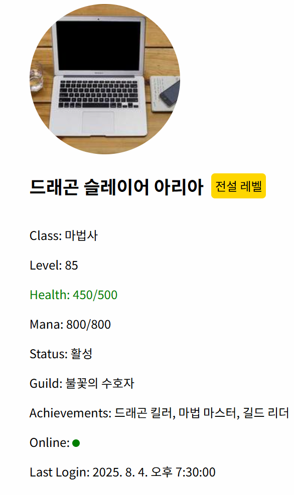

# 5. Fragments

# 1. 시멘틱한 마크업을 방해하는 최상위 요소들

컴포넌트가 여러 엘리먼트를 동시에 return 해야 할 경우 에러가 발생합니다. jsx 컴포넌트는 최상위 부모요소를 가져야 하기 때문에 보통 div 태그로 다른 태그들을 감싸주었습니다. 하지만 이렇게 코드를 작성하면 여러 개의 엘리먼트들을 감싸주기 위해서 의미 없는 div 태그를 자주 사용하게 됩니다.

```jsx
function App() {
  return (
		<div>
			<h1>안녕, 라이캣 1호!</h1>
			<h2>안녕, 라이캣 2호!</h2>
		</div>
  );
}
```

이렇게 의미 없는 태그들을 사용하는 것은 자연스럽게 시맨틱한 마크업 작성을 방해하게 됩니다.

```jsx
import React, { Fragment } from 'react';

function ListItem({ item }) {
  return (
    <div>
      <dt>{item.term}</dt>
      <dd>{item.description}</dd>
    </div>
  );
}

function Glossary(props) {
  return (
    <dl>
      {props.items.map(item => (
        <ListItem item={item} key={item.id} />
      ))}
    </dl>
  );
}
```

# 2. Fragments

`Fragements` 를 사용하면 `<div>` 와 같은 별도의 노드를 추가하지 않고 여러 개의 자식을 감싸줄 수 있습니다. 

```jsx
render() {
  return (
    <React.Fragment>
      <ChildA />
      <ChildB />
      <ChildC />
    </React.Fragment>
  );
}
```

우선 코드 상단에  import를 통해 모듈을 추가해 주세요.

```jsx
import React from 'react';
```

모듈을 추가했다면 아래와 같이 Fragment를 사용하여 작성해 봅시다! 

```jsx
function App() {
  return (
		<React.Fragment>
			<h1>안녕, 라이캣 1호!</h1>
			<h1>안녕, 라이캣 2호!</h1>
		</React.Fragment>
  );
}
```

`Fragment` 라는 키워드 대신 `<> </>` 를 사용할 수도 있습니다. 이때는 fragment를 사용하기 위해 React모듈을 따로 추가할 필요가 없습니다.

```jsx
function App() {
  return (
		<>
			<h1>안녕, 라이캣 1호!</h1>
			<h1>안녕, 라이캣 2호!</h1>
		</>
  );
}
```

마치 바닐라 JS 에서 `createElement` 메소드로 여러개의 요소를 한번에 생성할 때, 생성한 요소들을 붙일 수 있는 `documentFragment` 메소드를 사용하는것과 비슷하다고 볼 수 있습니다.

# 3. Fragments 와 속성(props)

React Fragment는 React 엘리먼트이기 때문에, 일반적인 React 엘리먼트와 마찬가지로 props를 전달할 수 있습니다. 아래 코드의 결과를 확인해보시길 바랍니다.

```jsx
import React from 'react';
import './FragmentTest.css';

function MyComponent() {
  return (
    <React.Fragment className="my-fragment">
      <h1>리엑트프레그먼트</h1>
      <p>테스트입니다!</p>
    </React.Fragment>
  );
}

export default MyComponent;
```

```css
.my-fragment {
    color: blue;
    border: 1px solid black;
}
```

React Fragments 요소는 화면에 랜더링 되지 않기 때문에 스타일과 관련된 속성을 사용하는것은 무의미하며 보통 리스트 아이템의 key 값을 설정할 때 많이 사용합니다. 

단축 문법으로 사용할때는 props를 사용할 수 없습니다. 

**실습 퀴즈!**

아래와 같은 데이터를 이용해 `<dl>` 요소를 컴포넌트화 하여 화면에 랜더링 해보세요. 

```jsx
const items = [
    { id: 1, name: 'Apple', desc: '빨간건 사과' },
    { id: 2, name: 'Banana', desc: '바나나는 길어' },
    { id: 3, name: 'Cherry', desc: '체리는 비싸' }
];
```

**실습 퀴즈! 난이도 2!**

<aside>
💡

시간이 남으면 진행합니다.

</aside>

```jsx
const items = [
    {
        id: 1,
        name: "드래곤 슬레이어 아리아",
        class: "마법사",
        level: 85,
        health: { current: 450, max: 500 },
        mana: { current: 800, max: 800 },
        skills: ["파이어볼", "아이스 스톰", "텔레포트", "치유의 빛"],
        equipment: {
            weapon: "고대의 지팡이",
            armor: "마법사 로브",
            accessory: "지혜의 반지"
        },
        status: "활성",
        guild: "불꽃의 수호자",
        achievements: ["드래곤 킬러", "마법 마스터", "길드 리더"],
        isOnline: true,
        lastLogin: "2025-08-04T10:30:00Z"
    },
    {
        id: 2,
        name: "강철심장 가렌",
        class: "전사",
        level: 72,
        health: { current: 280, max: 900 },
        mana: { current: 150, max: 200 },
        skills: ["강타", "방어 태세", "돌진"],
        equipment: {
            weapon: "신화급 대검",
            armor: "플레이트 아머",
            accessory: null
        },
        status: "부상",
        guild: null,
        achievements: ["백전백승", "탱커의 자존심"],
        isOnline: false,
        lastLogin: "2025-08-03T18:45:00Z"
    },
    {
        id: 3,
        name: "바람의 춤꾼 루나",
        class: "궁수",
        level: 45,
        health: { current: 350, max: 350 },
        mana: { current: 0, max: 400 },
        skills: ["연속 사격", "독화살", "은신", "치유의 바람", "폭풍 화살"],
        equipment: {
            weapon: "엘븐 활",
            armor: "가죽 갑옷",
            accessory: "민첩의 목걸이"
        },
        status: "휴식",
        guild: "달빛 사냥꾼",
        achievements: ["명사수"],
        isOnline: true,
        lastLogin: "2025-08-04T09:15:00Z"
    }
];
```



- 레벨에 따른 등급 분류
    - 전설(60이상)
        - 황금색
    - 영웅(50이상)
        - 노란색
    - 고급(40이상)
        - 녹색
    - 일반(40미만)
        - 회색
- 체력/마나 비율에 따라
    - 50% 이상이면 녹색
    - 미만이면 빨간색
- 온라인/오프라인, 길드 유무, 장비 착용 여부 등을 자유롭게 표시해주세요.
- 자주 하시는 게임이 있다면 게임 데이터를 바꾸셔도 좋습니다.
- 코드
    
    ```css
    .card-container {
      display: flex;
      justify-content: center;
      gap: 20px;
    }
    
    .card img {
      width: 200px;
      height: 200px;
      border-radius: 50%;
    }
    
    .name {
      display: flex;
      flex-direction: row;
      align-items: center;
      gap: 10px;
    }
    
    .healthy {
      color: green;
    }
    
    .moderate {
      color: orange;
    }
    
    .critical {
      color: red;
    }
    
    span.online {
      display: inline-block;
      width: 10px;
      height: 10px;
      border-radius: 50%;
      background-color: green;
    }
    span.offline {
      display: inline-block;
      width: 10px;
      height: 10px;
      border-radius: 50%;
      background-color: red;
    }
    
    .legend-level .level{
      display:inline-block;
      border-radius: 5px;
      padding: 5px;
      background-color: gold;
    }
    
    .high-level .level{
      display:inline-block;
      border-radius: 5px;
      padding: 5px;
      background-color: silver;
    }
    
    .low-level .level{
      display:inline-block;
      border-radius: 5px;
      padding: 5px;
      background-color: gray;
    }
    ```
    
    ```jsx
    import items from './data';
    import './App.css';
    
    function Name({ name, level }) {
      let levelClass = '';
      if (level >= 60) {
        levelClass = 'legend-level';
      } else if (level >= 50) {
        levelClass = 'high-level';
      } else {
        levelClass = 'low-level';
      }
    
      return (
        <div className={`name ${levelClass}`}>
          <h2>{name}</h2>
          {/* 등급에 따른 스타일 적용 */}
          <p className="level">{levelClass.split('-')[0]}</p>
        </div>
      );
    }
    
    function Health({ health, healthmax }) {
      const healthPercentage = (health / healthmax) * 100;
      let healthClass = '';
      if (healthPercentage >= 75) {
        healthClass = 'healthy';
      } else if (healthPercentage >= 50) {
        healthClass = 'moderate';
      } else {
        healthClass = 'critical';
      } 
      return (
        <div className={`health ${healthClass}`}>
          <p>Health: {health}/{healthmax}</p>
        </div>
      );
    }
    
    function Card({ item }) {
      return (
        <div className="card">
          
          <Name name={item.name} level={item.level} />
          <p>Class: {item.class}</p>
          <p>Level: {item.level}</p>
          <Health health={item.health.current} healthmax={item.health.max} />
          <p>Mana: {item.mana.current}/{item.mana.max}</p>
          <p>Status: {item.status}</p>
          <p>Guild: {item.guild || "None"}</p>
          <p>Achievements: {item.achievements.join(", ")}</p>
          {/* 온라인이면 초록색 동그라미, 오프라인이면 빨간색 동그라미 */}
          <p>Online: {item.isOnline ? <span className="online-indicator online"></span> : <span className="online-indicator offline"></span>}</p>
    
          {/* <p>Online: {item.isOnline ? "Yes" : "No"}</p> */}
          <p>Last Login: {new Date(item.lastLogin).toLocaleString()}</p>
        </div>
      );
    }
    
    function App() {
      // console.log("Items loaded:", items);
      return (
        <div className="card-container">
          {items.map(item => (
            <Card key={item.id} item={item} />
          ))}
        </div>
      );
    }
    
    export default App;
    ```